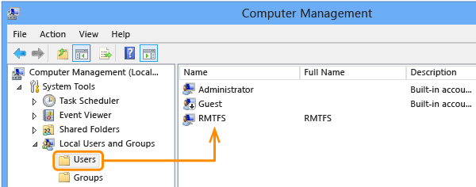
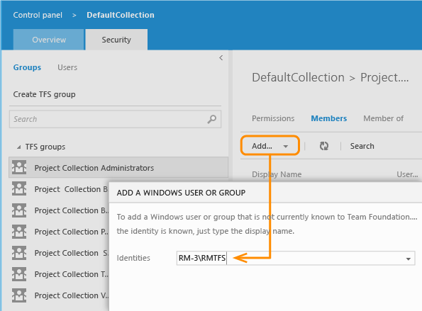
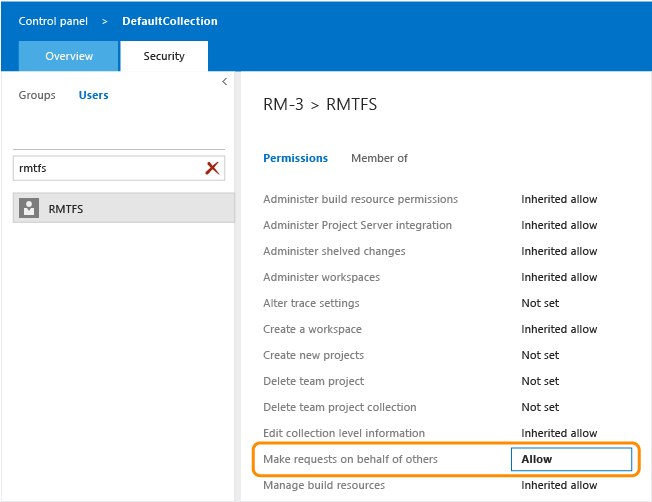
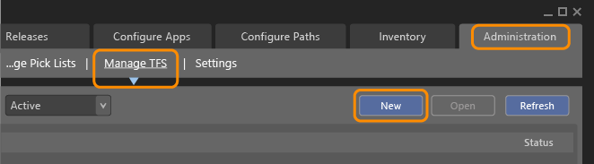
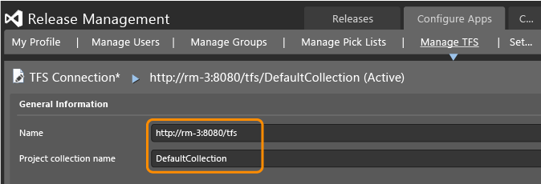
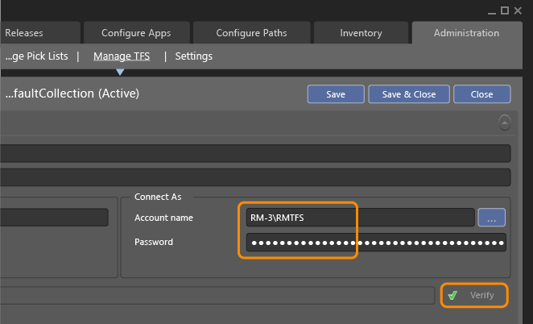

# Connect Release Management to TFS

[!INCLUDE [previous-version-header](../../_shared/previous-version-header.md)]

These are the steps for connecting TFS to Release Management and adding an 
SMTP server. These are optional procedures. See 
**[system requirements](system-requirements.md)** 
for details of compatible versions of TFS. If you want to connect TFS, you 
will need a user account to act as an intermediary between TFS and Release
 Management. We show an account being created for this purpose, but you can 
use an account that already exists in TFS as long as it has the appropriate 
permissions.

## Connect Release Management to TFS
 
1. Ensure that you are a member of the **Release Manager** role in Release 
   Management. In addition, to manage permissions in TFS, you must be a member 
   of the **Project Collection Administrators** group. To add a user account, 
   you must be a member of the Windows **Administrators** group (local user) 
   or the **Domain Administrators** group (domain account).

    > [!TIP]
    > _Do you need to add team mates to the **Release Manager** role 
    > in Release Management? See [Add users to Release Management](../add-users-and-groups.md)._

1. Either designate an existing account or create a user account in TFS 
   to act as intermediary account for Release Management. This can be a local 
   or domain account. It doesn't need any special Windows or Domain permissions.
   We're creating a local Windows account named RMTFS here.

   

    > [!NOTE]
    > _If you're planning to use an account that already exists in 
    > TFS, you can skip this step. If you have TFS deployed on more than one 
    > server, you'll want to use a domain account._

1. In TFS, make the account a member of the **Project Collection 
   Administrators** group. For more details, see
   [Set administrator permissions for project collections](../../../../../organizations/security/set-project-collection-level-permissions.md),
   though you can ignore the procedures for SharePoint and Reporting Services.
   Release Management doesn't require access to these features.

   

1. In TFS, select the account and set the **Make requests on behalf of 
   others** permission to **Allow**.

   

1. In Release Management client, choose **Administration**, **Manage TFS**
   and then **New**.

   

1. Add the URL and project collection for TFS.

   

1. Enter the name and password of the account that you permissioned in step 2
   and then **Verify** the password for the account.

   

1. After you save these settings, Release Management is connected to this 
   TFS project collection. You're ready to manage releases with TFS and 
   Release Management.

## Set up an SMTP server
 
1. Ensure that you are a member of the **Release Manager** role in Release 
   Management. This is required to connect an SMTP server to Release Management.

    > [!TIP]
    > _Do you need to add team mates to the **Release Manager** role 
   in Release Management? See [Add users to Release Management](../add-users-and-groups.md)._

1. In Release Management client, choose **Administration** and then **Settings**.

1. In the SMTP Server Configuration box, enter the **Server Name**, **Port**,
   **User Name** and **User Password** for your SMTP server.

1. Choose **Save**.

## Related topics

* [Overview of Release Management](../release-management-overview.md)
* [System requirements for Release Management](system-requirements.md)
* [Install Release Management](../install-release-management.md)
* [Install Release Management server and client](install-server-and-client.md)
* [Install deployment agents](install-deployment-agent.md)
* [Manage users, groups, and permissions](../add-users-and-groups.md)
* [Manage your release](../manage-your-release.md) 
  
[!INCLUDE [wpfver-back-to-index-shared](../../_shared/wpfver-back-to-index-shared.md)]
 
[!INCLUDE [wpfver-support-shared](../../_shared/wpfver-support-shared.md)]
