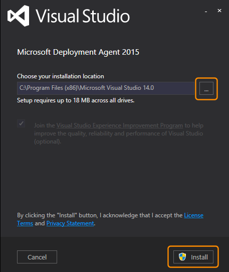
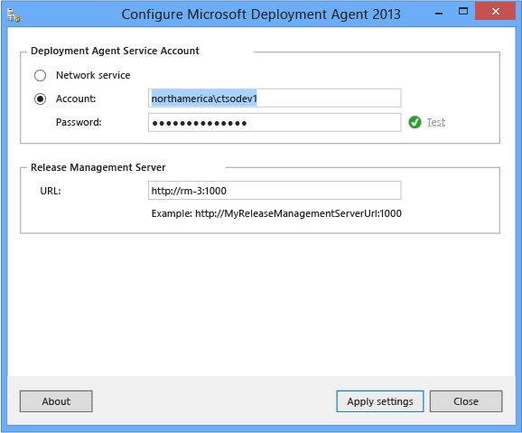
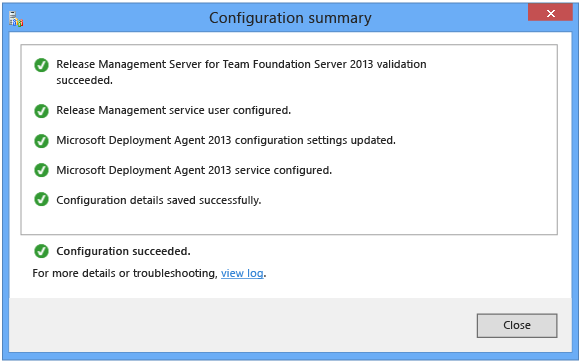

# Install deployment agents and set an environment

[!INCLUDE [previous-version-header](../../_shared/previous-version-header.md)]

You can install deployment agents to each of the machines that are required to 
deploy your app with Release Management. Or you can use Windows PowerShell,
 Windows PowerShell Desired State Configuration (DSC), or Chef to deploy your 
app to machines without installing a deployment agent. To learn about how to 
do this, go **[here](../release-without-agents.md)**.

If you decide to use deployment agents, make sure that the identity you use 
for these has sufficient permissions to do whatever tasks are required for 
the release. The service account you use for the deployment agents is 
automatically added to Release Management.

***Tip:*** _As good practice, do not install the deployment agent on the 
same machine as the Release Management server. If you do install the two on 
the same machine and you need to upgrade, uninstall the server before you 
uninstall the deployment agent._ 
 
## Install and configure the Microsoft deployment agent

1. Before you install the agent, confirm that you are a 
   member of the Windows **Administrators** security group on the computer 
   where you will install the agent. You must also be a member of the 
   **Release Manager** role in Release Management.

   ***Tip:*** _Do you need to add team mates to the **Release Manager** role 
   in Release Management? See [Add users to Release Management](../add-users-and-groups.md)._

1. If you have not already downloaded the deployment agent, 
   **[do this now](https://visualstudio.microsoft.com/downloads/download-visual-studio-vs)**.

   _Note that this is a 90-day trial version of Release Management. For 
   information about obtaining a non-trial version, see 
   [How to buy Release Management](http://visualstudio.microsoft.com/products/how-to-buy-release-management-vs)
   or 
   [Release Management Licensing](http://visualstudio.microsoft.com/release-mgmt-licensing-vs).
   If you are an MSDN subscriber, you can download a non-trial version from the 
   [MSDN Subscriber website](https://msdn.microsoft.com/subscriptions/downloads/)._ 
 
1. Launch **rm_Deployment.exe**. If you want to install to a specific location 
   in the file system, choose the browse button (...) next to the default 
   install location. Then choose **Install**.
   
   

1. Restart your computer, if prompted, and then choose **Launch**.

   ***Tip:*** _If you join the Visual Studio Experience Improvement Program, 
   you can **[opt out](../manage-your-release.md#optout)** at any time._ 

1. Specify the account to run the Microsoft Deployment Agent Windows 
   service and the URL of the Release Management Server. If you use a user 
   account, choose **Test** to verify the password. The deployment agent uses 
   this identity to configure this machine for your release. Make sure the 
   identity you use here has enough permission to do whatever tasks are 
   required. For example, if you need to install your application on this 
   machine as part of your release, add this identity to the local Windows 
   **Administrators** security group. If this identity will need to access 
   builds on the network, make sure it has access to the network drop location.

   ***Important:*** _If you specify an alternative account as the identity for 
   the agent, this must be in the form **domain\user**. Do not use the format 
   **user@domain**._

   
 
1. Choose **Apply settings**.

   

1. After the success message appears, close the configuration summary. Repeat
   these steps as required on every computer in the environment.

## Related topics

* [Overview of Release Management](../release-management-overview.md)
* [System requirements for Release Management](system-requirements.md)
* [Install Release Management](../install-release-management.md)
* [Install Release Management server and client](install-server-and-client.md)
* [Connect Release Management to TFS](connect-to-tfs.md)
* [Manage users, groups, and permissions](../add-users-and-groups.md)
* [Manage your release](../manage-your-release.md) 
  
[!INCLUDE [wpfver-back-to-index-shared](../../_shared/wpfver-back-to-index-shared.md)]
 
[!INCLUDE [wpfver-support-shared](../../_shared/wpfver-support-shared.md)]
