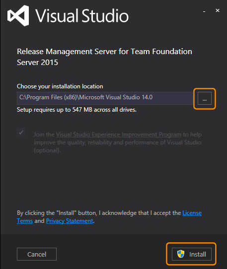
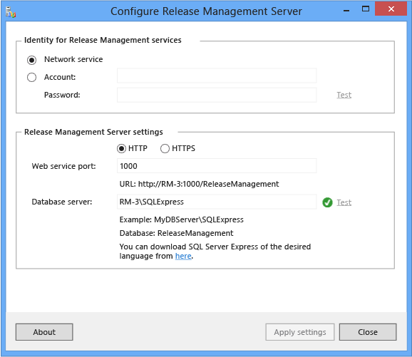
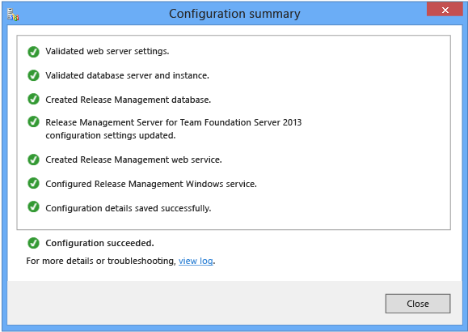
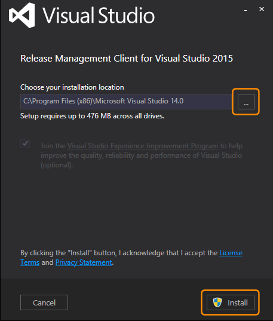
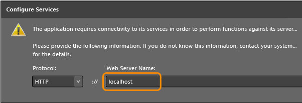

# Install Release Management server and client 

[!INCLUDE [previous-version-header](../../_shared/previous-version-header.md)]

These are the instructions for installing the Release Management 
**[server](#installserver)** and the **[client](#installclient)**.
Each tool has its own permission requirements. For the server, 
you'll need access to a SQL Server instance to complete the install. You can 
use the same SQL Server instance that you use for TFS or you can 
**[download SQL Server Express](https://www.microsoft.com/download/details.aspx?id=42299)**.

If you are upgrading to the latest version of Release Management, first 
uninstall the previous update of the Release Management server and client.
No data will be lost when you uninstall because the SQL Server instance is 
not removed. Then install the latest server and client. When you configure 
the latest update for your Release Management server, use the same SQL Server 
instance that you used before for the database server.

***Tip:*** _If you installed TFS Express or basic, you have an instance of 
SQL Server Express available to you. If you installed TFS, you already have 
the necessary permissions on the SQL Server. If you don't know if you're 
using SQL Express, look at the **Application Tier** node in the TFS 
administration console. Scroll down to **Data Tier Summary** and look for 
**SQLServerExpress** to confirm._

## Install the Release Management server
 
1. Before you install Release Management Server, confirm that you are a 
   member of the Windows **Administrators** security group on the computer 
   where you will install the Release Management server and a member of 
   **sysadmin** server role in SQL Server.

1. If you have not already downloaded the Release Management server, 
   **[do this now](https://visualstudio.microsoft.com/downloads/download-visual-studio-vs)**.

   _Note that this is a 90-day trial version of Release Management. For 
   information about obtaining a non-trial version, see 
   [How to buy Release Management](http://visualstudio.microsoft.com/products/how-to-buy-release-management-vs)
   or 
   [Release Management Licensing](http://visualstudio.microsoft.com/release-mgmt-licensing-vs).
   If you are an MSDN subscriber, you can download a non-trial version from the 
   [MSDN Subscriber website](https://msdn.microsoft.com/subscriptions/downloads/)._ 
 
1. Launch **rm_Server.exe**. If you want to install to a specific location 
   in the file system, choose the browse button (...) next to the default 
   install location. Then choose **Install**.
   
   

1. Restart your computer, if prompted, and then choose **Launch**.

   ***Tip:*** _If you join the Visual Studio Experience Improvement Program, 
   you can **[opt out](../manage-your-release.md#optout)** at any time._ 

1. Specify the SQL Server instance to host the Release Management Server 
   database and then choose **Test** to verify connectivity. Accept the default 
   values for the service account and web port (Network Service and port 1000) 
   or specify alternates. For more information, see 
   [Ports required for installation of Team Foundation Server](/azure/devops/server/architecture/required-ports)
   and
   [Accounts required for installation of Team Foundation Server](/azure/devops/server/requirements#accounts).
   Release Management server uses the identity set here for its Application 
   Pools in IIS and the Release Management Monitor Windows service.

   ***Important:*** _If you specify an alternative account as the identity for 
   the service, this must be in the form **domain\user**. Do not use the format 
   **user@domain**._
 
   

1. Choose **Apply settings**.

   

1. After the success message appears, close the configuration summary and 
   the server console and then install the Release Management client (as 
   described next). Most configuration and administration tasks take place in 
   the client.

## Install the Release Management client
 
1. Before you install Release Management Server, confirm that you are a 
   member of the Windows **Administrators** security group on the computer 
   where you will install the Release Management client.

1. If you have not already downloaded the Release Management client, 
   **[do this now](https://visualstudio.microsoft.com/downloads/download-visual-studio-vs)**.

   _Note that this is a 90-day trial version of Release Management. For 
   information about obtaining a non-trial version, see 
   [How to buy Release Management](http://visualstudio.microsoft.com/products/how-to-buy-release-management-vs)
   or 
   [Release Management Licensing](http://visualstudio.microsoft.com/release-mgmt-licensing-vs).
   If you are an MSDN subscriber, you can download a non-trial version from the 
   [MSDN Subscriber website](https://msdn.microsoft.com/subscriptions/downloads/)._ 
 
1. Launch **rm_Client.exe**. If you want to install to a specific location 
   in the file system, choose the browse button (...) next to the default 
   install location. Then choose **Install**.
   
   

1. Restart your computer, if prompted, and then choose **Launch**.

   ***Tip:*** _If you join the Visual Studio Experience Improvement Program, 
   you can **[opt out](../manage-your-release.md#optout)** at any time._ 

1. Enter the name of the Release Management server. If you're installing the 
   client on the same computer that is running Release Management server, you 
   can use **localhost** to connect to the server.

   

   ***Tip:*** _If you changed any of the default options in your Release 
   Management server setup, you can change the protocol or port number here so 
   that you can connect to the server._

## Related topics

* [Overview of Release Management](../release-management-overview.md)
* [System requirements for Release Management](system-requirements.md)
* [Install Release Management](../install-release-management.md)
* [Install deployment agents](install-deployment-agent.md)
* [Connect Release Management to TFS](connect-to-tfs.md)
* [Manage users, groups, and permissions](../add-users-and-groups.md)
* [Manage your release](../manage-your-release.md) 
 
[!INCLUDE [wpfver-back-to-index-shared](../../_shared/wpfver-back-to-index-shared.md)]
 
[!INCLUDE [wpfver-support-shared](../../_shared/wpfver-support-shared.md)]
