# Manage your release

[!INCLUDE [previous-version-header](../_shared/previous-version-header.md)]

Improve the process of managing the release of your app. Deploy your app to a specific 
environment for each separate stage.
Manage the steps in the process with approvals for each step.

## Before you start

* **How many stages do you need?** You might need only test and production.
  But if you need a different environment for a pre-production stage that needs testing, 
  consider adding a pre-production stage.
  And if it's important to track who approves that the dev work is ready to test, you might 
  want to add a dev stage, too.
* **Who needs to approve each stage?** You can have multiple approvers for each stage.
  You must add each approver as a user and assign them permissions.
* **What environments do you need for each of these stages to deploy your app?** 
  How many servers do you need for each environment to host your app? 
  Do you need multiple web servers? Do you need a database server?
* **Do you want to use PowerShell, DSC or Chef to deploy your app?** Do you already 
  have scripts that you can use? Do you want to use Windows Azure for your servers in your environment? 
  Or, do you want to use deployment agents?
* **What are the necessary steps to set up each server?** Do you need to configure 
  the web app each time? Do you need to stop and start services? 
  Do you need to run a script from the command line? Think through all of these steps.
  You'll add actions that perform these steps.
* **Are a set of these actions common to servers?** If so, you can set up these actions 
  once for each of these servers.
* **Have you set up a build definition for your app using Team Build?** Go 
  **[here](../../../overview.md)** to learn how.
* **Do you want to use an on-premises server or the cloud to manage your releases?** 
  You can maintain your own Release Management server on-premises, 
  or you can skip buying and maintaining a server and use Release Management as a service 
  on Azure Pipelines instead.

## Set up and start a release

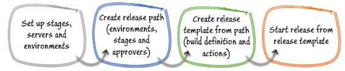 

### Set up Release Management

You have the following options for managing your releases:

* **Using Release Management as a service on Azure Pipelines**: 
  You need an organization in Azure DevOps.
  You cannot use Chef and you can deploy only to vNext environments based on Azure IaaS services
* **Using an on-premises server**: You need to install Release Management Server; 
  do that **[here](install-release-management/install-server-and-client.md#installserver)**.

In both options, you'll use the Release Management Client to set up and run your releases.
You can install the client 
**[here](install-release-management/install-server-and-client.md#installclient)**.
If you manage your releases with an on-premises server, install the client on the machine 
that runs Release Management Server, too.

***Important:*** _This is a 90-day trial version of Release Management. For information about obtaining 
a non-trial version, see 
[How to buy Release Management](http://visualstudio.microsoft.com/products/how-to-buy-release-management-vs)
or 
[Release Management Licensing](http://visualstudio.microsoft.com/release-mgmt-licensing-vs).
If you are an MSDN subscriber, you can download a non-trial version from the 
[MSDN Subscriber website](https://msdn.microsoft.com/subscriptions/downloads/)._

### Connect to Release Management

Start the Release Management Client and connect to your Release Management URL, either a 
Azure Pipelines URL or an on-premises server URL.
If you are not prompted automatically, go to **Administration**, **Settings**.

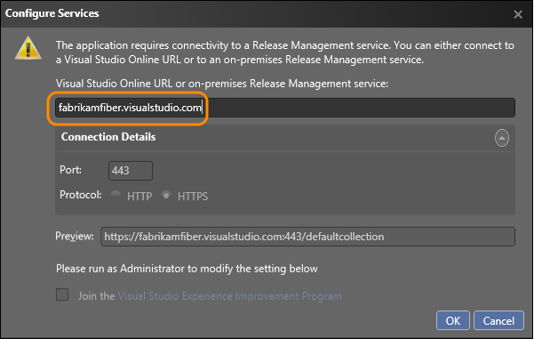 

View the guide and checklist that is provided to help you to set up your release pipeline.
First **[add users, set up groups, and control access](add-users-and-groups.md)**.  

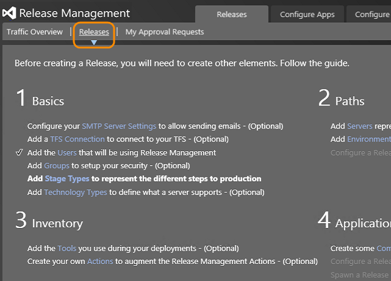 

The following steps guide you through the essential parts of the release pipeline.

### Set up stages

From the **Administration** tab, add a stage type for each step you need in the release pipeline of your app.

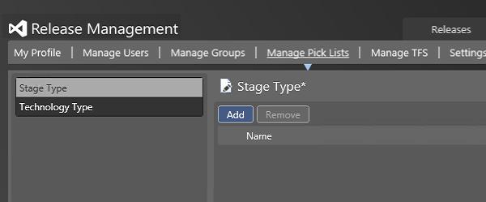 

View the stage types that you have added.

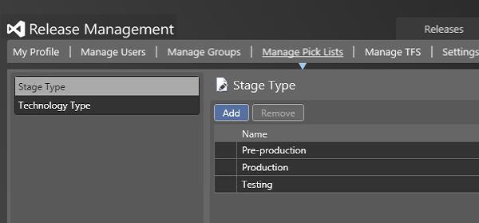

### Set up servers and environments

You need to register the servers where your app will be deployed, and then set up environments 
that contain these servers.

With Visual Studio 2015, you can use 
[Windows PowerShell](https://msdn.microsoft.com/library/dd835506%28v=vs.85%29.aspx), 
Windows PowerShell Desired State Configuration 
([DSC](https://technet.microsoft.com/library/dn249912.aspx)), 
or [Chef](http://www.getchef.com/) to deploy to a server without a deployment agent.
If you already deploy using any of these tools, 
you can use the same scripts with Release Management. Or, you can use deployment agents 
to deploy to a server.
So that you can tell which type of environment you create, environments of servers with 
deployment agents are called agent-based environments, 
and environments of servers without deployment agents are called vNext environments.
Differences in how the Release Management Client is used, 
based on environment type, are called out in these instructions.

An environment can contain multiple servers. Each environment will be assigned to a stage later.

Use tags to make it easier to set up your servers when you deploy to a stage. Perform 
deployment actions based on tags and not server names.
[Explain more](manage-your-release.md#ServerTags).

You have the following options for setting up environments:

* [Set up environments without deployment agents](release-without-agents.md#SetupEnv) 
* [Set up environments with deployment agents](release-with-agents.md#SetupEnv)

### Create a release template

You need to create a release template based on the environment and approvers of each 
stage where your app will be deployed. The release template also contains the deployment 
actions needed to deploy your app.

You have the following options for creating release templates:

* [Create a release template for environments without deployment agents](release-without-agents.md#CreateReleaseTemplate)
* [Create a release template for environments with deployment agents](release-with-agents.md#CreateReleaseTemplate)

### Start a release 

Start a new release.

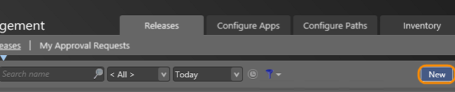

Name the release and choose the release template that you want to use.

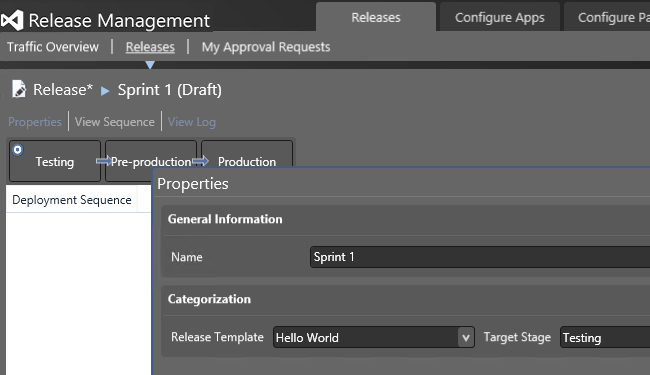

The release pipeline begins.

You can also start a release automatically from a build. Go 
**[here](trigger-a-release.md)** to find out how.

## Approve steps in a stage

You can find any requests that are awaiting your approval.

When you are ready, approve the action for the stage. The release then continues to the 
next step or the next stage.

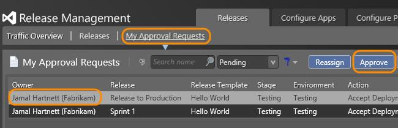

Manual steps must be approved before automated steps in a stage can continue.

If you're managing your releases with an on-premises Release Management server, you can also 
use the Release Management web browser client to find requests and approve actions for each stage.
To access this client, use the following URL: 

`http://<your-team-foundation-server-name>:1000/ReleaseManagement`

## Q & A

### Q: Can I deploy components of my multi-tiered app separately?

**A**: Yes, you can create components with separate deployment information.

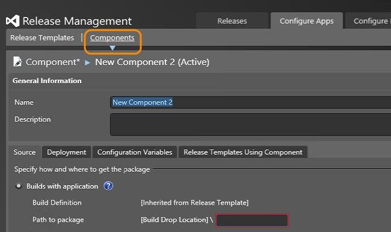

Add the component to the release template. Now you can add this component to any stage that needs it.

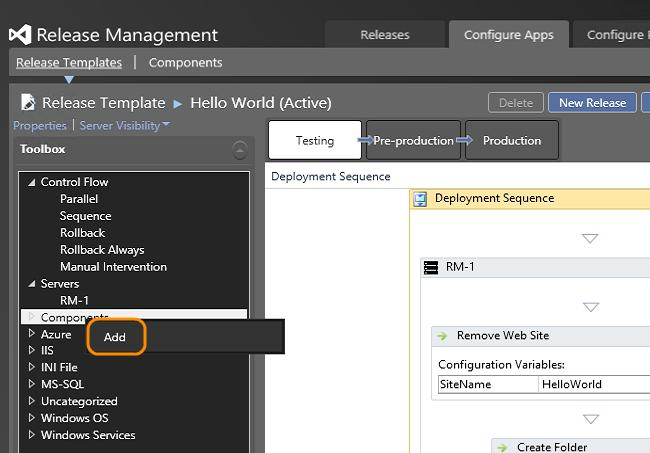

### Q: What release actions can I add to the deployment sequence?

**A**: More details on actions are **[here](release-actions.md)**.

### Q: How do I copy a deployment sequence of one stage to another?

**A**: Use the shortcut menu of a sequence to copy it. Select the sequence where you want to 
paste it, and use its shortcut menu to **Paste Deployment Sequence**.  

### Q: How can tags for servers help me set up my environments for each stage?

**A**: Simply add tags for servers that require the same set of deployment actions for setup.
For example, if you have multiple web servers in your environment then you can tag them all with **WebServer**.
If only some of the web servers need a specific service configured on that machine then you can 
add a tag **ServiceX** for that.

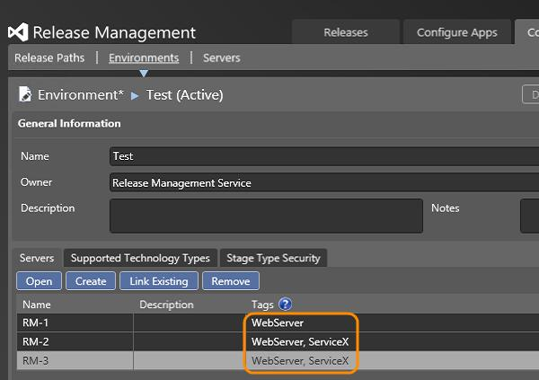

Next set up the actions for each tag. After you drag the tag to the deployment sequence, drag 
each required action into the tag and configure the action.
When a stage is deployed, these actions are performed on any server with this tag. So you only 
have to create the set of actions once for multiple servers.

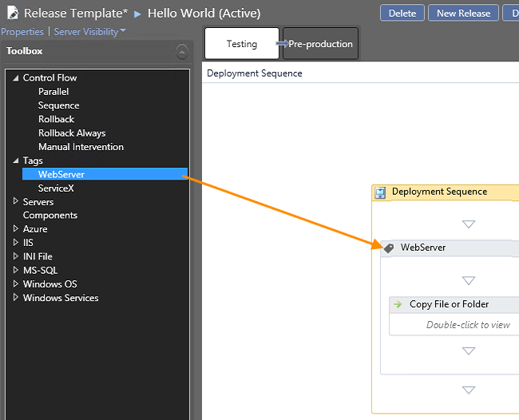

You can create multiple sets of actions for each tag if you need to add another action for a 
specific server between these sets.

You can **[copy the actions](#CopySequence)** for a tag between stages and release templates.
When you copy a sequence for a tag, 
you can remap these tag sequences to a different tag if you want.

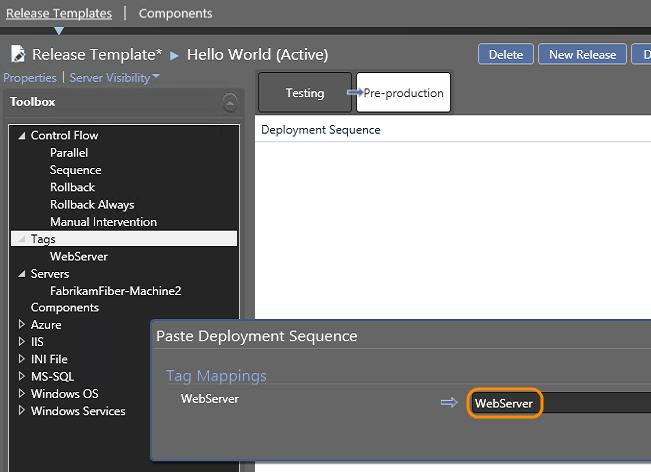

### Q: Can I find out which user stories were completed or bugs fixed in a specific release?

**A**: If you are using TFVC for your version control system and a 
**[vNext release path](release-without-agents.md)**, 
you can use the change summary to see these work items that were completed since the previous release.
It makes it easier to know what to test and what to put in your release notes. More details are 
**[here](http://blogs.msdn.com/b/visualstudioalm/archive/2014/08/05/work-items-tracking-using-release-management.aspx)**.

You can also view the change summary using the Release Management web browser client.
To access this client, use the following URL:
 
`http://<your-team-foundation-server-name>:1000/ReleaseManagement`

### Q: Are there any system settings that I can change?

**A**: Yes. You can edit settings based on your system requirements.

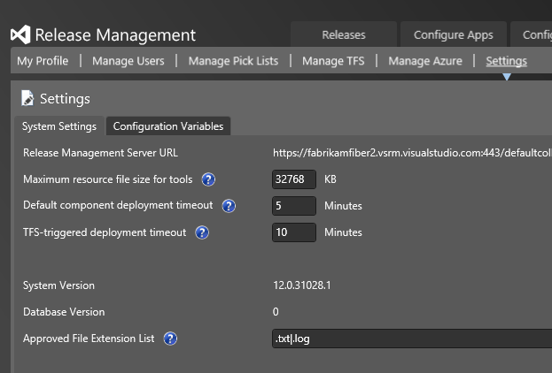

### Q: Can I opt out of the Visual Studio Experience Improvement Program for Release Management?

**A**: Yes. To be able to opt out, you must start the Release Management Server, 
Microsoft Deployment Agent or Release Management client using the Run as administrator option.

**Using the Release Management Server or the Microsoft Deployment Agent**: 
From the configuration screen, choose **About** and then uncheck **Join the Visual Studio Experience 
Improvement Program**.

**Using the Release Management Client**: From Administration, choose the **Settings** tab and from 
the **Configure Services** dialog box opt out of the program.

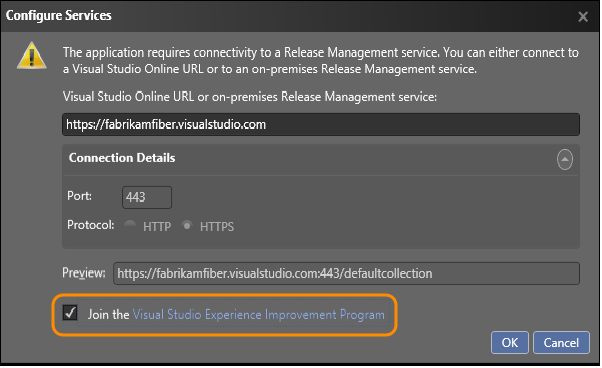

### Q: Are there any limitations to using Release Management in the cloud?

**A**: Yes. With Release Management in the cloud, you cannot use Chef and you can deploy 
only to vNext environments based on Azure IaaS services.

### Q: Are there any hands-on labs to help me get started with Release Management?

**A**: Yes. Go  **[here](http://blogs.msdn.com/b/briankel/archive/2013/08/02/visual-studio-2013-application-lifecycle-management-virtual-machine-and-hands-on-labs-demo-scripts.aspx)** 
for hands-on labs to try Release Management and other devops products.

### Q: Is there a more detailed user guide?

**A**: Yes, you can **[download this pdf file](http://go.microsoft.com/fwlink/?LinkId=398104)**.

## Related topics

* [Overview of Release Management](release-management-overview.md)
* [Install Release Management](install-release-management.md)
* [Release without deployment agents](release-without-agents.md)
* [Release with deployment agents](release-with-agents.md)
* [Trigger a release from a build](trigger-a-release.md)
* [Deploy continuously to Azure](deploy-continuously-to-azure.md)
 
[!INCLUDE [wpfver-back-to-index-shared](../_shared/wpfver-back-to-index-shared.md)]
 
[!INCLUDE [wpfver-support-shared](../_shared/wpfver-support-shared.md)]
