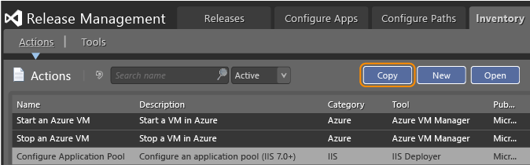
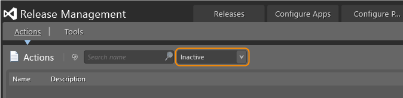

# Release actions to deploy an app

[!INCLUDE [previous-version-header](../_shared/previous-version-header.md)]

You add release actions to define the deployment sequence for each stage 
of your release. Each action uses a specific tool to run a command with 
a set of arguments.

If you haven't created your release path yet, go 
**[here](manage-your-release.md)** to do that.

Drag a release action from the toolbox to add it to your deployment 
sequence. Use any of the predefined release actions listed in the 
toolbox, or create your own **[custom release actions](#custom)**.

After adding a release action to the sequence, you can edit the 
configuration variables as necessary. For details about predefined 
release actions and their configuration variables go 
**[here](#actions_variables)**. Find out about the tools used by release 
actions **[here](release-actions/release-action-tools.md)**.

## Add a custom release action
 
Add a new release action and choose the tool that you want this action 
to use. Or, you can copy an existing action and use that as a basis to 
create a custom release action. You can't edit an existing release action.

1. From the Release Management client, open the **Inventory** page.
   (If the page doesn't appear, then request the **Can Manage Inventory**
   permission.)

1. Copy the action you want to edit, or add a new action.

   

1. Select the tool that you want to use based on your requirements for 
   the action. Choose **New** to add your own custom tool if the 
   **[predefined tools](release-actions/release-action-tools.md)** 
   cannot do what you need for that step in your deployment sequence.

1. In the **Execution section**, enter any required arguments with 
   their tokens in the necessary format. You must add the prefix and 
   suffix consisting of two underscores (**\_\_**) to each parameter.
   Whenever you delete or add arguments with their tokens, they appear 
   in the **Parameters** list. For example, add the following arguments 
   with tokens:

   `-servername __servername__ -switch __onoff__` 

   Now **servername** and **onoff** are displayed in the list of parameters.

### To deactivate a release action

If there are some actions that you don't want your team to use, deactivate 
them. Open the action from the **Inventory** page and choose the 
**Deactivate** button.

### To reactivate a release action

Open the **Inactive** list, open the action, and choose **Activate**.

## Q & A

### Q: What permissions do I need to edit release actions?

**A**:To edit or add release actions, users must have the **Can Manage 
Inventory** permission. If the permission is not enabled, the **Inventory**
page does not display.

When the **No Tool** option is selected, the **Command** and **Arguments**
fields are not editable unless you have the **Can Use Custom Tool in Actions
and Components** permission. In **Configure Apps**, **Components**, when a 
user does not have the **Can Use Custom Tool in Actions and Components**
permission, the **Command** and **Arguments** fields will not be editable 
when the option **No Tool** is selected.

## Actions and Configuration Variables for Release Actions

* [Manage application pools and websites](#iis)
* [Create or modify .ini files](#ini)
* [Manage SQL Server databases](#sql)
* [Set up your servers](#winos)
* [Manage Windows services](#winsvc)
 

### Manage application pools and websites
 
These actions use the predefined **IIS Deployer** tool to manage application 
pools, websites, web applications, and virtual directories. These actions 
are supported under IIS 7.0, 7.5, 8.0 and 8.5. For details about this tool, 
go **[here](release-actions/release-action-tools.md)**.

| **Action** | **Usage and deployment failure conditions** |
|------------|---------------------------------------------|
| Create Application Pool, Configure Application Pool, Recycle Application Pool, Remove Application Pool, Start Application Pool, Stop Application Pool | **Create Application Pool**: this action creates a new application pool under IIS. For IIS 7.0, 7.5, 8.0 and 8.5 If the application pool already exists, it will be reconfigured to match the defined configuration variable values (undefined configuration variables will not affect the actual configuration of the application pool).  Under IIS versions prior to 7.0, if the application pool already exists, the deployment will fail.  **Configure Application Pool**, **Recycle Application Pool**, **Start Application Pool**, or **Stop Application Pool**: these actions will reconfigure, recycle, start, or stop an application pool. The deployment fails if the application pool doesn't exist. |
| Create Web Site, Configure Web Site, Remove Web Site, Start Web Site, Stop Web Site | **Create Web Site**: creates a new website under IIS. For IIS 7.0, 7.5, 8.0 and 8.5. If the website already exists, it will be reconfigured to match the defined configuration variable values (undefined configuration variables will not affect the actual configuration of the website).  Under IIS versions prior to 7.0, if the application pool already exists, the deployment will fail.  **Configure Web Site**, **Restart Web Site**, **Start Web Site**, **Stop Web Site**: these actions will reconfigure, restart, start, or stop a website. The deployment fails if the website doesn't exist. |
| Create Web Application, Configure Web Application, Remove Web Application | **Create Web Application**: creates a new Web application under IIS. For IIS 7.0, 7.5, 8.0 and 8.5. If the Web application already exists, it will be reconfigured to match the defined configuration variable values (undefined configuration variables will not affect the actual configuration of the Web application).  Under IIS versions prior to 7.0, if the application pool already exists, the deployment will fail.  **Configure Web Application** will reconfigure a Web application. The deployment fails if the Web application doesn't exist. |
| Create Virtual Directory, Configure Virtual Directory, Remove Virtual Directory | **Create Virtual Directory**: creates a virtual directory under IIS. For IIS 7.0, 7.5, 8.0 and 8.5. If the virtual directory already exists, it will be reconfigured to match the defined configuration variable values (undefined configuration variables will not affect the actual configuration of the virtual directory).  **Configure Virtual Directory** will reconfigure a virtual directory. The deployment fails if the virtual directory doesn't exist. |

#### Configuration variables

| **Parameter** | **Required** | **Description** |
|---------------|--------------|-----------------|
| AppPoolName | Yes (Application pool actions), No (website actions) | Yes: the name of the application pool to configure, create, recycle, remove, start or stop (App pool action). No: the name of the application pool to use for a new or modified website (Website action) |
| DotNetVersion | No | The .NET Framework version to use for the application pool. This parameter is allowed only for IIS 7.5 8.0 and 8.5. The allowed values are: v1.0, v1.1, v2.0, or v4.0. |
| IdentityUserDomain | No | Domain of the user to use as the identity of the application pool. If not defined and the "IdentityUserName" is defined, the user will be considered as a local user (that is, .\localuser). |
| IdentityUserName | No | User name to use as the identity of the application pool. If not defined, IdentityUserDomain and IdentityUserPassword parameters are ignored and the default value of IIS is used (that is, ApplicationPoolIdentity). |
| IdentityUserPassword | No | The password of the user to use as the identity of the application pool. |
| Is32BitsAllowed | No | Flag to allow or disallow 32-bit applications to run in the application pool. Allowed values are 1 or True: allow 32-bit applications, 0 or False: do not allow 32-bit applications. |
| IsAutoStart | No | Flag that indicates if the application pool or website should start automatically when Windows starts. Allowed values are 1 or True: automatically start the application pool or website when Windows starts. 0 or False: do not automatically start the application pool or website when Windows starts. |
| IsPreloadEnabled | No | Flag that indicates if the preload functionality is enabled for a website or Web application. Allowed values are 1 or True: enable preload, 0 or False: disable preload. |
| PhysicalPath | Yes (create action), No (all other virtual directory, website, and Web application actions) | The complete physical path of the virtual directory, website, or Web application. |
| PipeLineMode | No | The managed pipeline mode to use in the application pool. Allowed values are **Classic** and **Integrated**.  |
| PortNumber | Yes (create action only) | The port number to use for a new or modified website. |
| ProcessIdleTimeOut | No | The number of minutes a process can be idle in the application pool. |
| RecycleAfterMinutes | No | A fixed number of minutes after which the application pool is recycled. |
| RecycleFixedTime | No | A fixed time at which the application pool is recycled. The required format is HH:MM, for example, 23:58 or 01:23. |
| RecycleKbMemory | No | The maximum number of kilobytes of memory to use before recycling the application pool. |
| SiteName | Yes (Website action), No (Virtual directory action) | Yes: the name of the website to create, configure, remove, start, or stop (Website action). No: the name of the website under which the virtual directory resides. If not defined, the default website is used (Virtual directory action) |
| StartMode | No | The start mode to use for the application pool. Allowed values are **OnDemand** and **AlwaysRunning**. |
| VirtualDirectoryName | Yes | The name of the virtual directory to create, configure, or remove. |
| WebApplicationName | No | The name of the Web application under which the virtual directory resides. If not defined, the Root Web application of the website is used. |
| WebAppName | Yes | The name of the Web application to configure, create, or remove. |
| WebSiteName | Yes (Website action), No (Web application action) | Yes: the name of the website to configure, create, remove, start, or stop (Website action). No: The name of the website under which the Web application resides. If not defined, the default website is used (Web application action) |

### Create or modify .ini files

These .ini file actions use the **INI File Manager** tool to add, modify, or 
remove sections and keys from the file. For details about this tool, go 
**[here](release-actions/release-action-tools.md)**.

| **Action** | **Usage and deployment failure conditions** |
|------------|---------------------------------------------|
| Create Key | Creates a new key with a value in a specific section of an .ini file. If the specified file doesn't exist, the action creates it. If the specified section doesn't exist, the action creates it. If the key already exists in the specified section, the action replaces its value. |
| Modify Key | Modifies an existing key with a new value in a specific section of an .ini file. If the specified file doesn't exist, the action creates it. If the specified section doesn't exist, the action creates it. If the key already exists in the specified section, the action adds its. |
| Modify Value | Modifies the value of an existing key in a specific section of an .ini file. If the specified file doesn't exist, the action creates it. If the specified section doesn't exist, the action creates it. If the key doesn't exist in the specified section, the action adds its. |
| Remove Key | Removes a key and its values from a specific section of an .ini file. If the specified file doesn't exist, the action fails. If the specified section or key doesn't exist, the action still succeeds. If you specify to remove all keys from a section, the action also removes the section. |
| Modify Section | Changes the name of a section within an .ini file. If the specified file doesn't exist, the action creates it. If the specified section doesn't exist, the action still succeeds. |
| Remove Section | Removes a section and all its keys and values within an .ini file. If the specified file doesn't exist, the action fails. If the specified section doesn't exist, the action still succeeds. |

#### Configuration variables

| **Parameter** | **Required** | **Description** |
|---------------|--------------|-----------------|
| INIFile | Yes | The name and path, as required, of the .ini file to modify. |
| KeyName | Yes | The name of the key to create, modify, or remove. |
| KeyValue | No | The new value to assign to a key. If not specified and the NewKeyName is specified, the system will use the actual value. If not specified and the NewKeyName is not specified, the value is emptied. |
| NewKeyName | No | The new name to assign to a key. If not specified, the key name will not be changed. |
| NewSectionName | No | The new name to assign to a section name. If not specified, the keys of the old section will be put under the root section (all keys that are at the beginning of the file before the first section is considered in the root). |
| SectionName | No | **Create or modify key action**: the section name where a key is to be added or modified - if not specified, the action updates the root section. **Note**: all keys that are at the beginning of the file before the first section are considered in the root. **Rename action** the section name to be renamed - if not specified, the keys of the old section are placed under the root section. **Remove action**: the section name to be removed - if not specified, the root section is removed. |

### Manage SQL Server databases
These actions use the **Database Deployer - Execute Script** tool to create, 
delete, back up, and restore a SQL Server database. For details about this 
tool, go **[here](release-actions/release-action-tools.md)**.

| **Action** | **Usage and deployment failure conditions** |
|------------|---------------------------------------------|
| Create SQL Database | Creates a new database. If the database already exists, the action fails. |
| Drop SQL Database | Deletes a database. If the database doesn't exist, the action fails. |
| Backup SQL Database | Backs up an existing database to a specified path. |
| Restore SQL Database | Restores a database from a specified source. |

#### Configuration variables

| **Parameter** | **Required** | **Description** |
|---------------|--------------|-----------------|
| DatabaseName | Yes | The name of the SQL Server database to create, drop, back up, or restore. |
| Path | Yes | The path and file name to use to store the database backup. For example, \\\server\\filename.bak. |
| ServerName | Yes | The name of the server where the SQL database is to be created, backed up, restored, or dropped. |
| Source | Yes | The path and file name of the database backup to use to restore the database. |

### Set up your servers
These actions can be used to set up your server machine if it runs any 
Windows operating system. You can run commands and kill processes, as well 
as manage files, folders, environment variables, and Windows registry keys 
and values. The system executes these actions using several predefined 
Release Management tools, including **Command Line Runner**, **Windows Process**, 
and **XCOPY Deployer**. For details about these tools, go
**[here](release-actions/release-action-tools.md)**.

| **Action** | **Usage and deployment failure conditions** |
|------------|---------------------------------------------|
| Run Command Line, Run Command Line as User, Kill Windows Process | Use **Run Command Line** to run a command using the deployment agent identity. Use **Run Command Line as User** to run a command with specific user credentials. |
| Copy File or Folder, Create Folder, Delete File(s) or Folder, Move File or Folder, Rename File or Folder, Modify File(s) or Folder Attributes, Modify File(s) or Folder Owner | These actions support creating, modifying, and deleting files, folders, and select attributes. When you create files or folders, any non-existent parent directory of the folder to create will be created as well. |
| Create Environment Variable, Modify Environment Variable, Delete Environment Variable | These actions support creating, modifying, and deleting environment variables. |
| Create Windows Registry Key, Delete Windows Registry Key, Modify Windows Registry Key, Create Windows Registry Value, Delete Windows Registry Value, Modify Windows Registry Value | These actions support creating, modifying, and deleting registry keys and values. The deployment sequence fails only when you try to modify a registry key that doesn't exist.  |

#### Configuration variables to run commands and kill a process

| **Parameter** | **Required** | **Description** |
|---------------|--------------|-----------------|
| Arguments | No | The arguments required to run the command line. |
| command | Yes | Fixed value ./WindowsProcess.ps1. |
| FilePath | No | Domain of the user to use as the identity of the application pool. If not defined and IdentityUserName is defined, the user will be considered as a local user (that is, .\localuser). |
| IsKillProcessTree | No | Indicates whether to kill the process tree. Allowed values are: **1** (kill process tree) and **0** or empty (do not kill process tree). |
| ProcessName | Yes | The name of the Windows process to kill. |
| UserDomain | No | The domain of the user to use to run the executable. When unspecified, .\\localuser is assigned. |
| UserName | Yes (run command action) or No (kill process action) | (Yes) the name of the user to use to run the executable or (No) the user account running the process. If not specified, the process will be killed for all users. |
| UserPassword | No | The password of the user to use to run the executable. |

#### Configuration variables to manage files and folders

| **Parameter** | **Required** | **Description** |
|---------------|--------------|-----------------|
| Archive | No | Set or reset the archive attribute for file(s) or folder. **+** (set the flag), **-** (reset the flag), any other value leaves the flag as it is. |
| DestinationFileFolder |  | The .NET Framework version to use for the application pool. This parameter is allowed only for IIS 7.5, 8.0 and 8.5. The allowed values are: v1.0, v1.1, v2.0, or v4.0. |
| DestinationName | Yes | The destination path where to copy or move files or folders. Or, the new name to be given to the file or folder being renamed. |
| FileFolderName | Yes | The source files or folder to be deleted, modified, moved, or renamed. For the delete action, you can use wildcards, for example, c:, temp, or \*.log. |
| FolderName | Yes | The folder name and path to be created. **+** (set the flag), **-** (reset the flag), any other value leaves the flag as it is. |
| Hidden | No | Set or reset the hidden attribute for files or folder. |
| OwnerDomain | No | The domain of the new owner of the files or folder. When unspecified, .\\localuser is assigned. |
| OwnerDomain | Yes | The name of the new owner of the files or folder. |
| ReadOnly |  | Set or reset the read-only attribute for files or folder. **+** (set the flag), **-** (reset the flag), any other value leaves the flag as it is. |
| SourceFileFolder | Yes | The source files or folder to be copied. You can use wildcards, for example, c:, temp, or \*.log. |
| System |  | Set or reset the system attribute for file(s) or folder.  **+** (set the flag), **-** (reset the flag), any other value leaves the flag as it is. |

#### Configuration variables for environment variable actions

| **Parameter** | **Required** | **Description** |
|---------------|--------------|-----------------|
| VariableName | Yes | The name of the variable to be created, modified, or deleted. |
| VariableValue | No | The value to give to the added or modified variable. If no value is set, the variable will be deleted. |

#### Configuration variables for Windows registry actions

| **Parameter** | **Required** | **Description** |
|---------------|--------------|-----------------|
| NewRegistryKey | Yes | The complete name of the destination registry key, for example, HKLM, Software, or NEWKEY. |
| OperatingSystemType | No | The operating system type in which to create the registry key. Allowed values are: **32** (default) creates a 32-bit registry key or **64** creates a 64-bit registry key.  |
| RegistryData | No | The data to affect to the registry value. |
| RegistryKey | Yes | The complete name of the registry key to create, modify, or delete. For example, HKLM, Software, or NEWKEY. |
| RegistryValue | Yes | The name of the registry value to be added or modified. |
| ValueType | No | The type of data of the registry value. Allowed values are: **REG\_SZ** (default): String, **REG\_QWORD\_LITTLE\_ENDIAN**: A 64-bit number in little-endian format, **REG\_QWORD**: A 64-bit number, **REG\_NONE**: No value, **REG\_MULTI\_SZ**: Multi-line string (separated by \\0), **REG\_LINK** : Symbolic link, **REG\_EXPAND\_SZ**: String with unexpanded references to environment variables, **REG\_DWORD\_BIG\_ENDIAN**: A 32-bit number in little-endian format, **REG\_DWORD\_LITTLE\_ENDIAN**: A 32-bit number in big-endian format, **REG\_DWORD**: A 32-bit number, **REG\_BINARY**: Binary data in any form. |

### Manage Windows services

These actions use the predefined Windows Service Manager tool to create, 
configure, delete, restart, start, and stop a Windows service. For details 
about this tool, go **[here](release-actions/release-action-tools.md)**.

| **Action** | **Usage and deployment failure conditions** |
|------------|---------------------------------------------|
| Configure Service, Configure Service Credentials, Create Service, Delete Service, Restart Service, StartService, Stop Service | Use **Create Service** to create a new service. The deployment sequence will fail if the service already exists. Use **Configure Service** to configure an existing service. The deployment sequence will fail if the service doesn't exist. Use **Configure Service Credentials** to configure an existing service with new credentials. The deployment sequence will fail if the service doesn't exist. In addition, the deployment sequence will fail if the specified ServiceName doesn't exist when you specify to start, stop, or restart a service. It will not fail if the service is already started or stopped. |

#### Configuration variables

| **Parameter** | **Required** | **Description** |
|---------------|--------------|-----------------|
| BinPath | No | Binary path and name of the service. |
| Description | Yes | Description of the service to create or configure. |
| DisplayName | No | Name of the service to create or configure. |
| Password | No | Password of the user name specified to start the service. |
| ServiceName | Yes | The name of the service to create, configure, delete, recycle, start, or stop. |
| StartMode | No | Start mode of the service. Allowed values are **Automatic**: (default) automatically start the service next time the computer is restarted, **Disabled**: disable the service, **Manual**: start the service manually only. |
| UserName | Yes | User name that will be used for the credentials to start the service. Use the format DOMAIN\USER, for example, NT AUTHORITY\NETWORK SERVICE. If you specify the UserName, you must also specify Password. To reset the credentials to the LocalSystem, enter LocalSystem as the user and "" as the password. |

## Related topics

* [Overview of Release Management](release-management-overview.md)
* [Install Release Management](install-release-management.md)
* [Manage your release](manage-your-release.md)
* [Release without deployment agents](release-without-agents.md)
* [Release with deployment agents](release-with-agents.md)
* [Trigger a release from a build](trigger-a-release.md)
* [Deploy continuously to Azure](deploy-continuously-to-azure.md)
 
[!INCLUDE [wpfver-back-to-index-shared](../_shared/wpfver-back-to-index-shared.md)]
 
[!INCLUDE [wpfver-support-shared](../_shared/wpfver-support-shared.md)]
