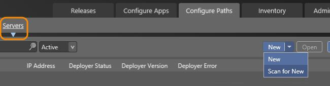
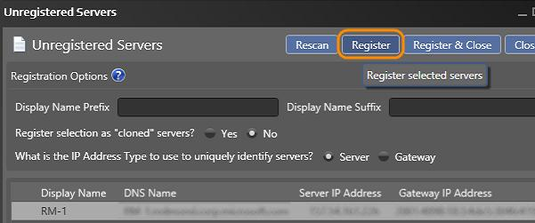
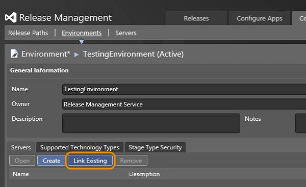
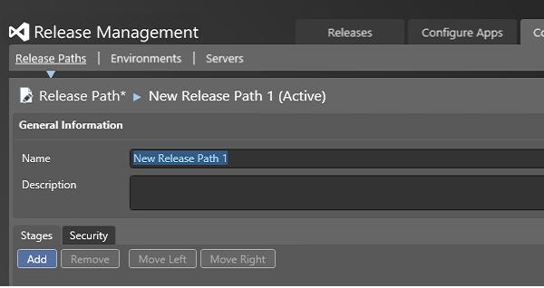
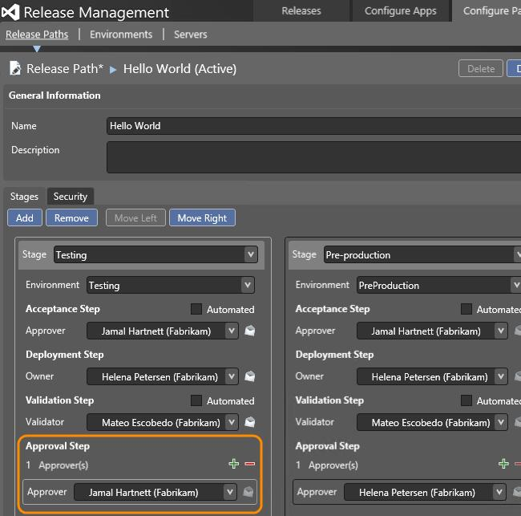
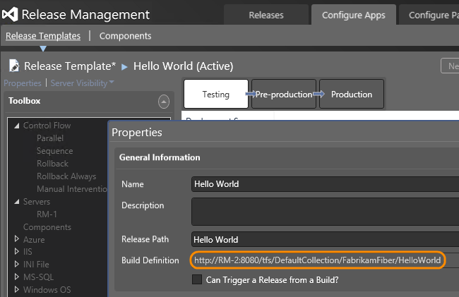
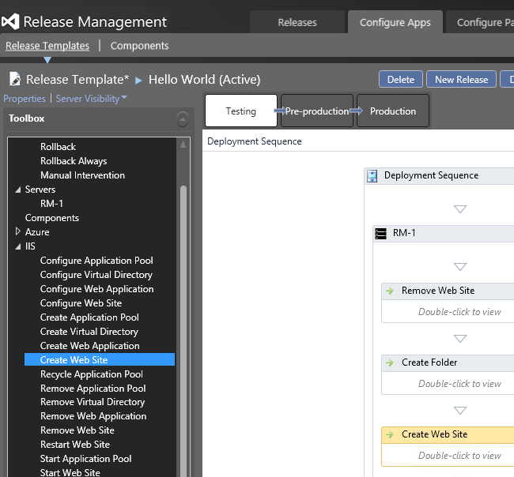
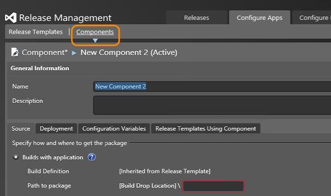
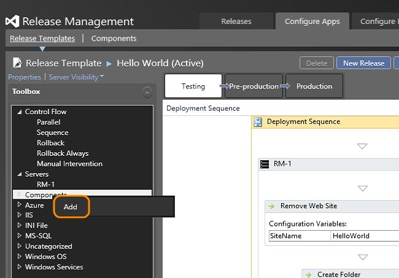
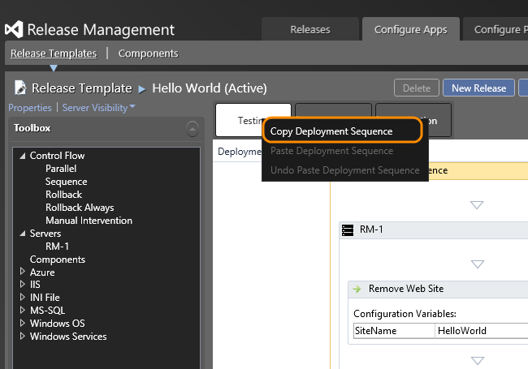

# Release your app to environments with deployment agents

[!INCLUDE [previous-version-header](../_shared/previous-version-header.md)]

If you want to use PowerShell, DSC or Chef to deploy your app, you must 
use vNext environments; go 
**[here](release-without-agents.md)** for instructions.
Otherwise if you are using deployment agents, follow these steps.

If you haven't already done so, 
**[connect to release management](manage-your-release.md#ConnectRMUrl)** 
and **[add stages](manage-your-release.md#AddStages)** 
for your release.

## Set up servers and environments

1. **[Install and configure a deployment agent](install-release-management/install-deployment-agent.md)** 
   on any machine that will be part of the environment used to deploy your app.

1. Scan for new servers that already have deployment agents installed.
   If the server you want to use is not in the list, 
   check that the service for the deployment agent (Microsoft Deployment Agent) 
   is started on that machine.

   

1. Register the servers to use for your environments. You will deploy your app to 
   the servers in an environment as part of your release pipeline.

   

1. Create environments for each of your stages. Link the servers to your environments.

   

   An environment can contain multiple servers.

## Create a release template

Check the code for your app has been added to version control.
You also need a build definition that builds your app.

1. Create a release path to represent the stages that your release must go through.

   

   Choose the environment and approvers to use for each stage of your release.
   You can add multiple final approvers for each stage if you want to.

   

1. Create a release template and use the release path that you just added.
   Link your build definition to this release template to have access to the build.
   
   

   Next you define the sequence of actions that deploys your app for each stage.
   
   

   The deployment agent must have sufficient permissions to perform 
   any of the actions in your sequence.
   For example, to remove a web site the deployment agent service must 
   run as a local administrator on that machine.

## Next steps

1.  [Start a new release](manage-your-release.md#StartRelease).
1.  [Approve steps in a stage](manage-your-release.md#ApproveSteps).

## Q&A

### Q: Can I deploy components of my multi-tiered app separately?

**A**: Yes, you can create components with separate deployment information.

Add the component to the release template. Now you can add this 
component to any stage that needs it.

### Q: What release actions can I add to the deployment sequence?

**A**: More details on actions are **[here](release-actions.md)**.

### Q: How do I copy a deployment sequence of one stage to another?

**A**: Use the shortcut menu of a sequence to copy it.
Select the sequence where you want to paste it, 
and use its shortcut menu to **Paste Deployment Sequence**.  

## Related topics

* [Overview of Release Management](release-management-overview.md)
* [Install Release Management](install-release-management.md)
* [Manage your release](manage-your-release.md)
* [Release without deployment agents](release-without-agents.md)
* [Trigger a release from a build](trigger-a-release.md)
* [Deploy continuously to Azure](deploy-continuously-to-azure.md) 
 
[!INCLUDE [wpfver-back-to-index-shared](../_shared/wpfver-back-to-index-shared.md)]
 
[!INCLUDE [wpfver-support-shared](../_shared/wpfver-support-shared.md)]
