# Release your app to environments without deployment agents

[!INCLUDE [previous-version-header](../_shared/previous-version-header.md)]

If you want to use 
[Windows PowerShell](https://msdn.microsoft.com/library/dd835506%28v=vs.85%29.aspx), 
Windows PowerShell Desired State Configuration 
([DSC](https://technet.microsoft.com/library/dn249912.aspx)), 
or [Chef](http://www.getchef.com/) to deploy your app, 
follow these steps. If you are using deployment agents, 
go **[here](release-with-agents.md)** 
for instructions.

**Why deploy my app this way?**

* If you already deploy your app with PowerShell or DSC, 
  use the same scripts with Release Management.
* You don't have to install a deployment agent on any machine 
  that you use for the environment.
* Create complex scripts to deploy using all the features of 
  PowerShell or DSC.
* If you want to deploy your app to a server machine that is 
  not running a Windows operating system, you can use Chef to do that.
  (In this version, Chef is supported if you manage your release with 
  an on-premises Release Management server, 
  but it is not supported if you manage your release with Visual 
  Studio Azure Pipelines.)

<a name="SetupEnv"></a>
## Set up your environment

Environments without deployment agents are called **vNext environments**.
You can only use these vNext environments with vNext Components, 
vNext Release Templates and vNext Release Paths to deploy without 
deployment agents.

To use Windows PowerShell or DSC, you can set up a vNext on-premises 
environment with physical or virtual machines (VMs), 
or a vNext Azure environment with Azure VMs. For Chef, you must set 
up a vNext on-premises environment.

You need Release Management for Visual Studio 2015 to deploy without 
deployment agents. See [Install Release Management](install-release-management.md).

If you haven't already done so, 
**[connect to release management](manage-your-release.md#ConnectRMUrl)** 
and **[add stages](manage-your-release.md#AddStages)** 
for your release.

* [Pre-requisites for computers](#prereq)
* [Set up Microsoft Azure environments](#SetupAzure)
* [Set up on-premises (standard) environments](#SetupOnPrem)

<a name="prereq"></a>
### Pre-requisites for computers

Based on the tool that you are using to deploy, check these prerequisites 
for any computer you plan on using in your environment.

**Windows PowerShell**

* PowerShell 4.0: Install 
  [Windows Management Framework 4.0](https://www.microsoft.com/download/details.aspx?id=40855) 
  which includes PowerShell 4.0.

**DSC**

* Windows 8.1, Windows Server 2012 R2: DSC is already installed.
* Windows Server 2012, Windows Server 2008 R2, Windows 8 and Windows 7: Install
  [Windows Management Framework 4.0](https://www.microsoft.com/download/details.aspx?id=40855) 
  which includes DSC.

**Chef**

* Target node must be bootstrapped and registered with your Chef server.
* Add an attribute to the cookbook that maps to build drop location.
* Upload cookbooks to the Chef server.
* Assign recipes to the target node.
* Set up your Release Management Server as a Chef Workstation.
  Instructions are **[here](http://learn.chef.io/)**.
* Release Management uses Knife to communicate with Chef. Run 
  the following commands to install the Windows plugin for Knife:
  - `gem install knife-windows --no-ri --no-rdoc`  
  - `gem install knife-reporting --no-ri --no-rdoc`

<a name="SetupAzure"></a>
### Set up Microsoft Azure environments

Microsoft Azure makes it easy to set up VMs to use as servers 
in your environment. Azure adds your VMs to
**[cloud services](http://azure.microsoft.com/documentation/articles/cloud-services-what-is/)**.
You'll need a Microsoft Azure account to create your VMs.
If you don't have one yet, sign up for free through [Visual Studio Dev Essentials](https://visualstudio.microsoft.com/dev-essentials/).

In Release Management, you'll create an Azure environment 
for each release stage.
You then link your environment to a cloud service 
associated with your Azure subscription.
Release Management can then access any of the VMs in this 
cloud service to use in the environment.
If you have multiple VMs associated with a cloud service, 
you can add any of these VMs as servers to your Azure 
environment in Release Management.  

1. In the Azure portal, create the VMs that you want to use in your 
   release environment. By default, each VM you create is added to its 
   own cloud service.
   If you want to use multiple VMs in an environment, they must all 
   be in the same cloud service.
   To add a VM to a specific cloud service, choose **From Gallery** when you create the VM.

   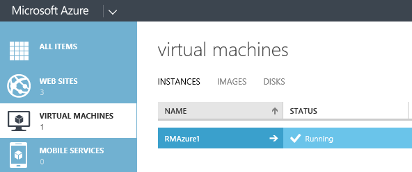 

1. For each Azure VM that runs Windows, if the prerequisites 
   listed above for PowerShell and DSC are not yet met, 
   add the Visual Studio Release Management extension to meet 
   the prerequisites.
   **[Learn how](http://blogs.msdn.com/b/visualstudioalm/archive/2014/11/10/how-to-install-rm-azure-extension-and-use-the-azure-vm-in-release-management.aspx)**.

1. Add the details for your Azure subscription to Release Management.

   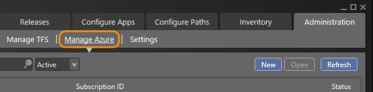

   **[Download the settings file](https://manage.windowsazure.com/publishsettings)** 
   from the Azure portal and open it with a text editor, 
   such as Notepad, to get your subscription ID and Management Certificate key.
   (After using the settings file, consider deleting or 
   securing it as it contains information that can be used by others to access your 
   Azure account.) Go 
   **[here](https://manage.windowsazure.com/#Workspaces/StorageExtension/storage)** 
   to get the name of an existing storage account 
   or add a new storage account using the Azure portal.

   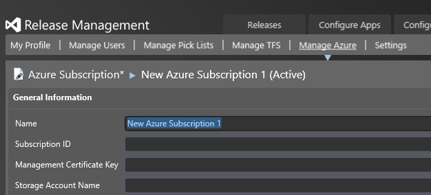

1. Create a vNext Azure environment for each stage in your release path.

   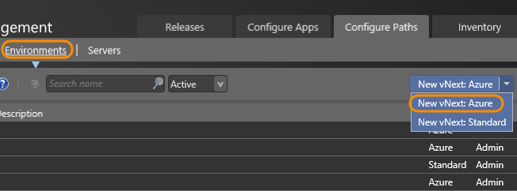

1. Link your Azure environment in Release Management to the Azure subscription 
   that you entered.

   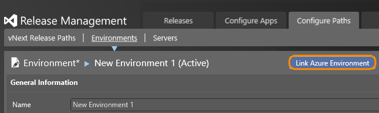

   Select the Azure subscription that you want to use with this environment.
   (Sometimes it takes a few minutes to load your subscription.) The Azure 
   cloud services for this subscription are displayed.
   Select a cloud service to link the subscription to the environment.

   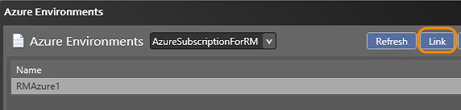

   If there are no cloud services for your Azure subscription, you cannot link 
   it to the environment. Go to the Azure portal and create a VM for this subscription.
   When you create a VM, a cloud service with the same name is created by default.
   Refresh to select this cloud service.

1. Link your Azure VMs in the cloud service as servers for the environment.

   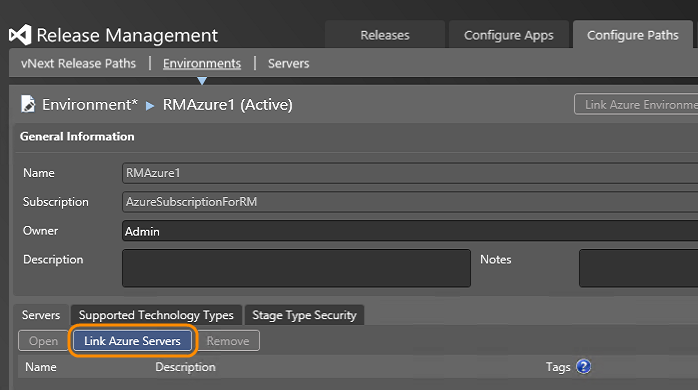

   Select the servers that you want to link.

   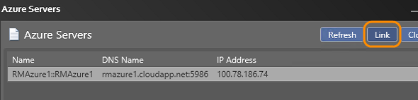

1. For each server, you can add configuration variables that can be used by 
   your deployment actions.
   For example, you can add username and password here.

   

   If you add configuration variables with the same name for actions in your 
   release template, the values in any actions will override the values that you set here.

1. View the environments that you created in the **Environments** tab. The type is shown as **Azure**.

<a name="SetupOnPrem"></a>
### Set up on-premises (standard) environments

Servers in your on-premises environment must have a fully qualified domain name.
They can be virtual or physical machines.
All these machines must be in the same domain, or in two-way trusted domains.
Use on-premises environments if you want to deploy using Chef.

1. For PowerShell or DSC deployment, enable PowerShell remoting and set up the 
   WinRM port for HTTP communication.
   Run these commands from a PowerShell session with administrator privileges on 
   all the server machines in your environment:
   - `Enable-PSRemoting -Force`  
   - `winrm quickconfig -transport:http`

   More details about how to configure Windows Remote Management can be found 
   **[here](https://msdn.microsoft.com/library/aa384372%28v=vs.85%29.aspx)**, 
   including how to set up session time-outs for a machine.
   For Chef, check that each server is set up as required in the prerequisites 
   section above.

1. Create a vNext on-premises environment for each stage.

   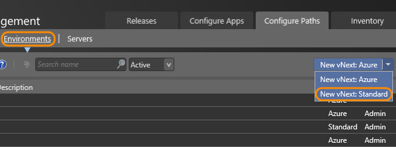

1. Open an on-premises environment to add your servers for the environment.
   You need to supply the DNS name and the WinRM port number.
   If you don't know the port number, run this command:
   
   `winrm e winrm/config/listener`

   To deploy with Chef, add your Chef node as a server. This machine can run 
   any OS supported by Chef and can be a virtual or physical machine.
   The server name and port must match the node name and port that's registered 
   with the Chef server. For Unix-based machines, use `ssh port` to find the port.
   
   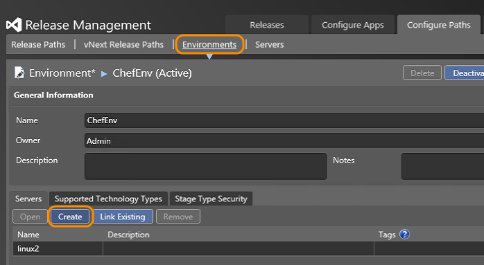

1. For each server, you can add configuration variables that can be used by your 
   deployment actions. For example, you can add username and password here.
   If you add configuration variables with the same name for actions in your 
   release template, the values in any actions will override the values that you set here.

   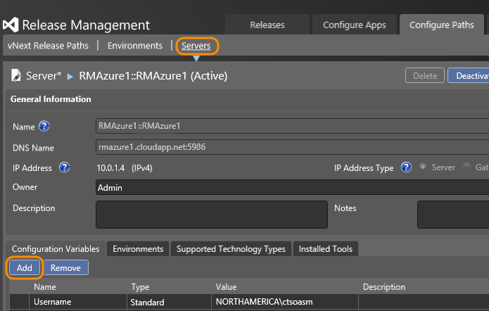

1. View the environments that you created in the **Environments** tab. The type 
   is shown as **Standard**.

<a name="CreateReleaseTemplate"></a>
## Create a release template

Check that the code for your app has been added to version control.
You also need a build definition that builds your app.

1. Create a vNext release path to represent the stages that your release must go through.

   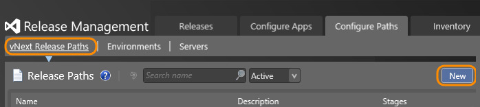

   Choose the environment and approvers to use for each stage of your release.
   You can add multiple final approvers for each stage if you want to.

   

1. Create a vNext component for each component of your app that you need to 
   deploy separately. For example, 
   you might have a component to deploy your web server and another component 
   to deploy your database.
   Choose the location of the build package for each component to use when 
   your app is deployed.

   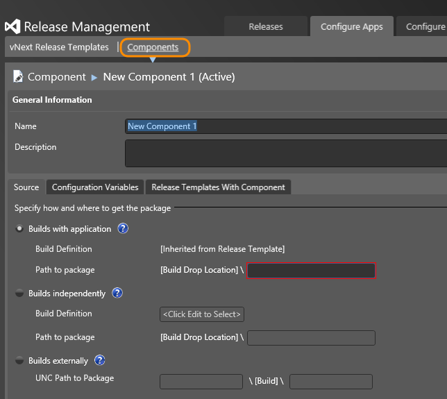

   For Chef deployments, use the **Build externally** option and supply the 
   path to the package. This can be a URL or an FTP path.
   This path will be used as the node's attribute value by the cookbooks 
   to access the package for your app.

1. Create a vNext release template and use the release path that you just added.

   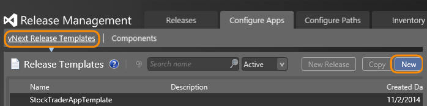

   Add all the vNext components that you created to this vNext release template.
   (Right-click **Components** in the toolbox to show the context menu.)

   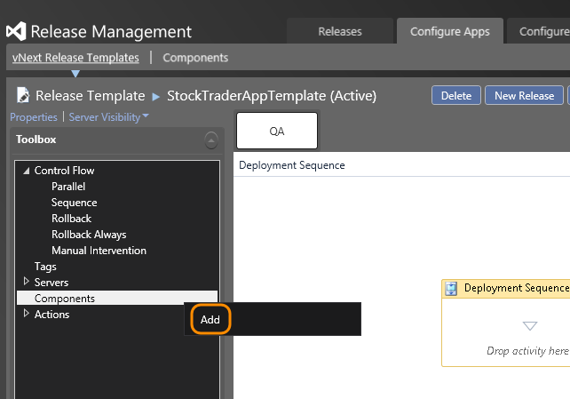

   Select the components and add them to your release template.

   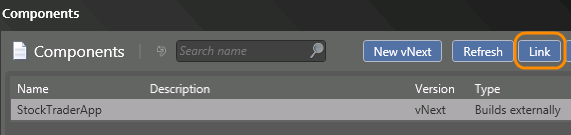

   You can now see the components in the toolbox and you can use these as 
   parameters for your deployment actions.

1. Add the deployment actions from the toolbox based on your environment type 
   and how you want to deploy your app.
   You need to do this for each stage in this vNext release path.

   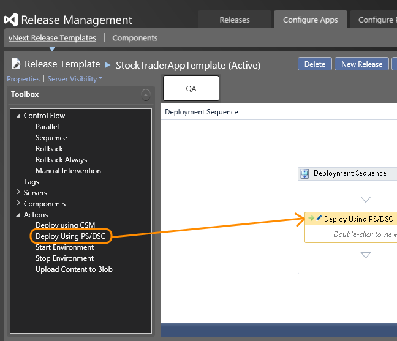

   **For on-premises environments:** Open the **Standard** section in the toolbox.

   * To deploy with Powershell or DSC, drag the **Deploy to Standard Environment** 
     action into the deployment sequence.
     Parameter details for this action are 
     **[here](#StandardActions)**.
   * To deploy with Chef, drag the **Deploy Using 
     Chef** action into the deployment sequence.
     Parameter details for this action are 
     **[here](#ChefActions)**.

   **For Windows Azure environments:** Open the **Azure** section in the toolbox.
   Drag the **Deploy to Azure Environment**, the **Start Environment**, or 
   the **Stop Environment** actions into the deployment sequence.
   Parameter details for the **Deploy to Azure Environment** action are 
   **[here](#AzureActions)**.

   Add your PowerShell or DSC script name and relative path to the action.
   A DSC script must contain a DSC configuration and a command to 
   create a .mof file for that DSC configuration.
   You should not call `Start -DscConfiguration` here. Release 
   Management will do this for you.
   You can use `$applicationPath` in your script - this is the 
   relative path you added as your component package path.

   This example shows how to use a DSC configuration script to copy 
   files with a command to generate a .mof file at the end.

   ```DSC
   configuration FileCopy
   {
     Node $AllNodes.NodeName  
     {
       File CopyDeploymentBits
       {  
         Ensure = "Present"
         Type = "Directory"
         Recurse = $true
         SourcePath = $applicationPath
         DestinationPath = $Node.DeploymentPath
       }
     }
   }

   FileCopy -ConfigurationData $ConfigData --"Verbose
   ```
   
   The parameter values `$AllNodes` and `$Node` in this example are from 
   an optional configuration file - not to be confused with the DSC configuration.
   Use configuration files if you want to use the same script but parameterize 
   the values when you deploy to a different stage.
   Here's what this configuration file looks like.

   ```Configuration
   $ConfigData = @{
   AllNodes = @(
       @{ NodeName = $env:COMPUTERNAME;
           DeploymentPath = $env:SystemDrive + "\FolderCopyTest"
        }
     )
   }
   ```
   
## Next steps

1. [Start a new release](manage-your-release.md#StartRelease).
1. [Approve steps in a stage](manage-your-release.md#ApproveSteps).

## Q & A

### Q: Are there any DSC actions that are not currently supported by Release Management?

**A**: Yes. `Set-DscLocalConfigurationManager` is not supported.

###Q: What other differences are there between using a vNext release template and the deployment agent-based release template?

**A**: Apart from not needing deployment agents, these are the other differences:

* You cannot drag components and servers into the deployment sequence editor.
  These are parameters to deployment actions only.
* The vNext components are not associated with tools.
* You cannot use custom tools, or custom actions for your deployment.
* Flow control is not supported, so if an action fails all previous actions will be rolled back.
  It is recommended to handle this in your scripts.

<a name="StandardActions"></a>
### Q: What are each of the parameters for the Deploy to Standard Environment action?

**A**: Here are the details:

* **ServerName:** On-premises machine where you want to deploy this component.

* **UserName:** Account name to connect to the server. This user must be a domain 
  user and also a member of the Administrators group on the server.

* **Password:** Password for the user account.

* **PSScriptPath:** Path and filename of PowerShell or DSC script to deploy this component.
  This path is relative to the package path for the component.

* **PSConfigurationPath:** Path and filename of PowerShell or DSC script to configure the 
  server before deployment of this component. This script is optional. It will be run before 
  the script in the PSScriptPath parameter.
  This path is relative to the package path for the component.

* **UseCredSSP:** If set to true, the scripts use the same PowerShell session as Release 
  Management when it connects remotely to the server.
  You must manually enable CredSSP. Run the following PowerShell command on the server with 
  administrator privileges.

  ```Enable-WSManCredSSP -Role Client -DelegateComputer <Server DNS Name> -Force```

  By default, this value is false.

* **UseHTTPS:** Set to true to use a secure connection. To do this, check that WinRM is 
  enabled for HTTPS on the target server. The default value is false.

* **SkipCACheck:** The Release Management Server and the deployment machine use an SSL 
  connection to communicate if UseHTTPS is set to true.
  This parameter determines if certificate verification is required to set up this connection.
  If it is true, the verification is skipped.
  If it is set to false, a certificate for the deployment machine must be installed.

<a name="AzureActions"></a>
### Q: What are each of the parameters for the Deploy to Azure Environment action?

**A**: Here are the details:

* **ServerName:** Name of the Azure virtual machine where you want to deploy this component.

* **UserName:** Account name to connect to the virtual machine. This user must be a domain 
  user and also a member of the Administrators group on the server.

* **Password:** Password for the user account.

* **PSScriptPath:** Path and filename of PowerShell or DSC script to deploy this component.
  This path is relative to the package path for the component.

* **PSConfigurationPath:** Path and filename of PowerShell or DSC script to configure the VM 
  before deployment of this component.
  This script is optional. It will be run before the script in the PSScriptPath parameter.
  This path is relative to the package path for the component.

* **UseHTTPS:** This is always set to true for the connection to the Azure VM. A secure 
  connection is always used, so you must check that WinRM is 
  enabled for HTTPS on the virtual machine.

* **SkipCACheck:** The Release Management Server and the Azure VM use an SSL connection to 
  communicate because UseHTTPS is always set to true.
  This parameter determines if certificate verification is required to set up this connection.
  If it is true, the verification is skipped.
  If it is set to false, a certificate for the deployment machine must be installed.

<a name="ChefActions"></a>
### Q: What are each of the parameters for the Deploy to Chef action?

**A**: Here are the details:

* **NodeName:** Name of the Chef Node where you want to deploy the application. This must 
  match the name of the server in the on-premises environment.

* **IsUnixNode:** Set this parameter to true if it is a UNIX based machine.

* **UserName:** Account name to connect to the node. For UNIX based systems this should be a 
  user that has sudo privileges with ssh permissions.
  For Windows based systems this should be a user with winRM permissions, or a local administrator.

* **Password:** Password for the user account.

* **ComponentName:** Name of the component to be deployed.

* **AttributeName:** Name of the Chef node attribute which is used by the cookbooks to get the 
  application package. Nested attributes are supported.
  The format of this name is: &#91;'AttributeLevel1'&#93;&#91;'AttributeLevel2'&#93;&#91;...&#93;

* **KnifeInstallationPath:** The absolute path to the knife.bat file on the Release Management Server.

* **ChefRepoPath:** The absolute path to the chef repo directory on the Release Management Server.

## Related topics

* [Overview of Release Management](release-management-overview.md)
* [Install Release Management](install-release-management.md)
* [Manage your release](manage-your-release.md)
* [Release with deployment agents](release-with-agents.md)
* [Trigger a release from a build](trigger-a-release.md)
* [Deploy continuously to Azure](deploy-continuously-to-azure.md) 
 
[!INCLUDE [wpfver-back-to-index-shared](../_shared/wpfver-back-to-index-shared.md)]
 
[!INCLUDE [wpfver-support-shared](../_shared/wpfver-support-shared.md)]
