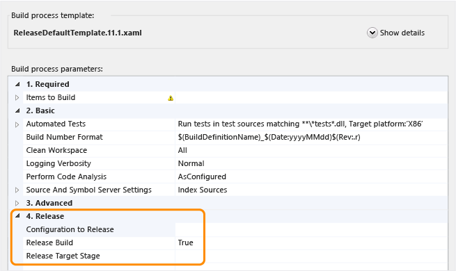
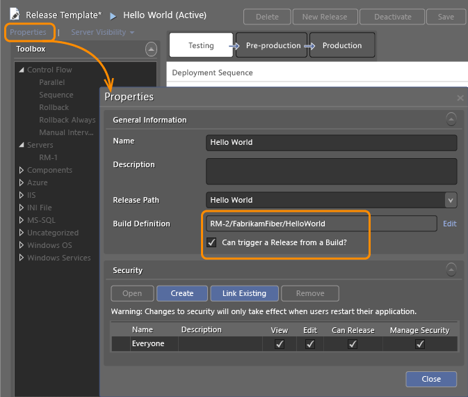
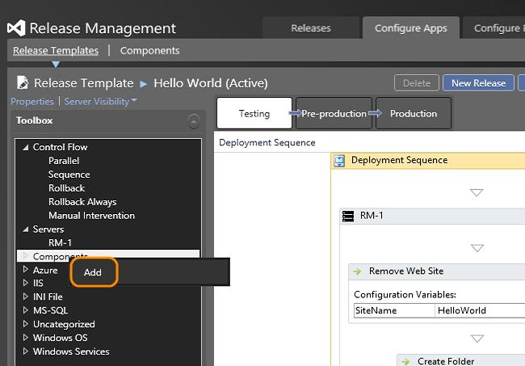
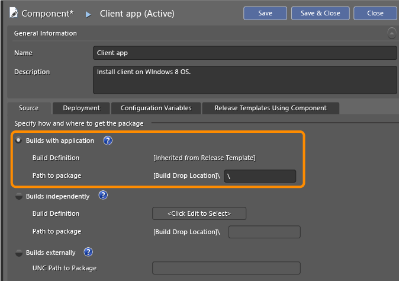
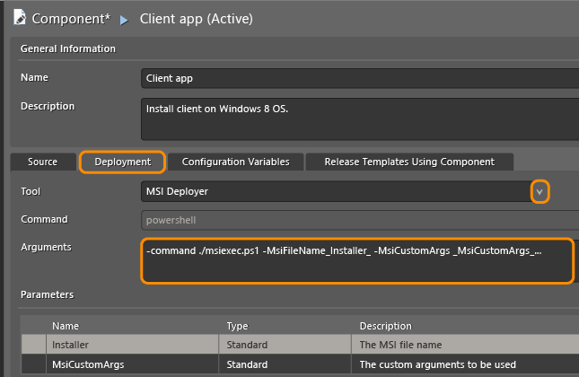
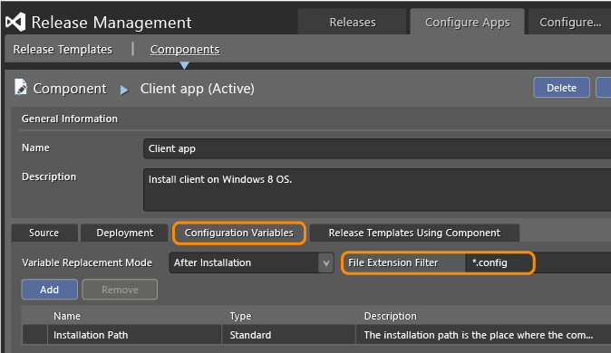

# Trigger a release from a build in Release Management

[!INCLUDE [previous-version-header](../_shared/previous-version-header.md)]

Start a release automatically when you build your app using Team Foundation 
Build (TFBuild). You can choose which stage of your release pipeline to start 
with. To trigger a release from a build, you must configure both your build 
process and your release path.

**Note**: This procedure applies only to releases that use a deployment agent 
and a Build template in TFS. For information about other release scenarios, 
see the **[Q & A](#blogposts)** at the end of this topic.

If you haven't created your release path yet, go 
**[here](manage-your-release.md)** to do that.

Also, if you haven't yet set up your build system, 
**[do that now](https://msdn.microsoft.com/library/ms252495.aspx)**.

## Configure your build pipeline
 
1. If you don't have permission to edit build definitions, 
   **[get them now](https://msdn.microsoft.com/library/ms252587%28v%3Dvs.140%29.aspx)**.

1. From Visual Studio, Team Explorer, 
   **[connect to the project](https://msdn.microsoft.com/library/ms181475%28v%3Dvs.140%29.aspx)** 
   that you want to work in (Keyboard: Ctrl + 0, C).

1. On the &nbsp;**Builds** page 
   (Keyboard: Ctrl + 0, B), create or edit a build definition.

1. On the **Process** tab of the build definition, choose the configuration 
   that you want to use for this release (for example: debug or release). Set 
   the **Release Build** to **True**. Choose the specific stage that you want
   to trigger for the release, or leave this field blank if you want to start 
   with the first stage.

   

   If the **Release** section doesn't appear:

   * [Q: I use the default template. Which build pipeline template should I use for Release Management and how do I add it to TFS?](#add_template) 

   * [Q: I use the upgrade template. Which build pipeline template should I use for Release Management?](#upgrade_template) 

   * [Q: I use a custom build pipeline template. How do I add the workflow logic to trigger a release?](#custom_build_template) 

   If you have components with configuration files that need different values 
   based on the target environment, you can 
   **[tokenize the configuration file](#token_files)**.

1. Specify any other settings that your build pipeline requires and then save 
   your build definition.

## Configure your release template
 
1. If you haven't installed the Release Management client for Visual Studio 
   on the build server, 
   **[do that now](install-release-management/install-server-and-client.md#installclient)**.

1. Configure the Release Management client to connect to the Release 
   Management server.

1. From your release template, choose the build definition that you have set 
   to trigger a build and select the check box to enable the build pipeline to 
   trigger a release.

   

   If the **Build Definition** selection doesn't appear, then you need to add 
   your TFS connection to the Release Management client. (Add the connection 
   from the **Manage TFS** tab of the **Administration** section.)

   After the release is triggered, it proceeds through the steps in the stage 
   that was selected. If you don't set the **Acceptance Step** and the 
   **Deployment Step** to **Automated** for this stage, the release will not 
   be started. You must mark these steps as automated in the release path.

## Q & A

### Q: Where can I find out about other release scenarios?
 
**A**: See these blog posts:

* [Trigger Release from build with Release Management for Visual Studio 2013 Update 3](http://blogs.msdn.com/b/visualstudioalm/archive/2014/10/10/trigger-release-from-build-with-release-management-for-visual-studio-2013-update-3.aspx) 

* [Deploy Azure Cloud Service using Release Management](http://blogs.msdn.com/b/visualstudioalm/archive/2015/02/09/deploying-azure-cloud-service-using-release-management.aspx) 

* [Announcing DevOps style deployments using Visual Studio 2015 and Azure](http://blogs.msdn.com/b/visualstudioalm/archive/2014/11/12/announcing-devops-style-deployments-using-visual-studio-2015-preview-and-azure.aspx) 

* [Using Release Management service to manage releases](http://blogs.msdn.com/b/visualstudioalm/archive/2014/11/11/using-release-management-vso-service-to-manage-releases.aspx) 

* [How to trigger deployments to Chef managed environments from Release Management 2013 with Update 3 RC](http://blogs.msdn.com/b/visualstudioalm/archive/2014/07/08/how-to-trigger-deployments-to-chef-managed-environment-from-release-management.aspx) 

### Q: I use the default template. Which build pipeline template should I use for Release Management and how do I add it to TFS?
  
**A**: If you are using the default template, all you need to do is replace it 
with the corresponding release management process template.

1. If you don't have permission to contribute files or to edit build definitions, 
   **[get them now](https://msdn.microsoft.com/library/ms252587%28v%3Dvs.140%29.aspx)**.

1. From Visual Studio, Team Explorer, 
   **[connect to the project](https://msdn.microsoft.com/library/ms181475%28v%3Dvs.140%29.aspx)** 
   you want to work in (Keyboard: Ctrl + 0, C).

1. In the folder **\Program Files (x86)\ Microsoft Visual Studio 12.0\ReleaseManagement\bin**
   locate the template that you need. Or download the template to this 
   folder from the zip file that is attached to 
   **[this blog post](http://blogs.msdn.com/b/visualstudioalm/archive/2013/12/09/how-to-modify-the-build-process-template-to-use-the-option-trigger-release-from-build.aspx)**.

   * TFS 2013 and 2015
     - **TFVC**: ReleaseTfvcTemplate.12.xaml.
     - **Git**: ReleaseGitTemplate.12.xaml
   * TFS 2012: ReleaseDefaultTemplate.11.1.xaml
   * TFS 2010: ReleaseDefaultTemplate.xaml
  
1. Add the template to version control. It is a good idea to put the template 
   in the **BuildProcessTemplates** folder of your project.
  
   * **TFVC**: Add files to the server
   * **Git**: Manage files on your dev machine

1. From the &nbsp;**Builds** page, 
   (Keyboard Ctrl + 0, B), create or edit a build definition.

1. From the **Process** tab, choose **New** to select the template to use for 
   your Build process file. (You should be able to browse to select the 
   template that you just added.)

### Q: I use a custom build pipeline template. How do I add the workflow logic to trigger a release?

**A**: Add sections to your custom build pipeline template to provide the 
workflow logic. Download the snippets file with these sections 
**[here](http://blogs.msdn.com/b/visualstudioalm/archive/2013/12/09/how-to-modify-the-build-process-template-to-use-the-option-trigger-release-from-build.aspx)**.
Use the snippets to add these arguments to your build pipeline template: 
**ConfigurationsToRelease**, **ReleaseBuild**, **ReleaseTargetStage**, 
**DropBuild**.

Save the build pipeline template. If you use Team Foundation version control, 
check it in. If you use Git, commit and push the build pipeline template.

### Q: I use the upgrade template. Which build pipeline template should I use for Release Management?

**A**: Learn what you need to do 
**[here](http://blogs.msdn.com/b/visualstudioalm/archive/2014/01/31/how-to-modify-the-upgradetemplate-xaml-to-enable-releasing-from-a-build.aspx)**.

### Q: Can I deploy components of my application to different machines?

**A**: Yes, create components through the Release Management client and add 
them to your release template. You can then add these components to your build.

When the **Components** window is displayed, double-click the component that you 
want to add. Each component that you add must be configured as 
**Builds with application** or **Builds externally**.

A backslash (**\\**) in the **Build Drop Location** indicates that the build is located at 
the root of the drop folder.

### Q: What tools can I use to deploy a component?

**A**: For each component you define, you can select the tool to use from the 
**Deployment** tab. Replace the **Arguments** with information specific to 
deploying this component. Go **[here](release-actions/release-action-tools.md)** 
to learn more about each tool.

To use a custom tool, first add the tool through the **Inventory** 
page, and then select it from the **Deployment** tab. Also make sure that 
any files referenced by your command will be available in your 
package location at the time of deployment.

### Q: Why hasn't my release started?

**A**: Here are some possible issues:

* If you configure your build to trigger a release (**Release Build=True**) 
  and you don't select the **Can Trigger a Release from a Build?** check box 
  for your release template. This actually causes the build to fail and 
  consequently the release is not started either.

* If you configure your release template to use a build definition that isn't
  set to trigger a release **Release Build=False**) or doesn't contain the 
  correct release logic.

* If a release template contains any component that is configured to build 
  independently.

* If you don't set the **Acceptance Step** and the **Deployment Step**
  to **Automated** for the stage that you selected to trigger from the release,
  the release will not start. You must set these steps to be automated for 
  this release path.

* If you haven't installed the Release Management client on the machine that 
  is running your Team Foundation Build server.

* If the time it takes for a deployment to complete exceeds 10 minutes. You 
  can change the value assigned to the **TFS-Triggered Deployment Timeout**
  from the **Administration** tab, **Settings** page.

### Q: How can I handle configuration files that need different values based on the target environment?

**A**: Use tokenized configuration files.
For each configuration file in your solution that requires different values 
in different environments, create a tokenized version of that file.

For example, if your solution contains a file labeled **web.config**, make a 
copy of that file and label it **web.config.token**. Your **web.config** file 
does not change and is used when you run the app locally. The 
**web.config.token** file contains tokens instead of actual values.

As an example, if your **web.config** file contains this line:

`<add?key="SMTPHostServer"?value="mysmtp.myserver.domain"/>`

then your **web.config.token** file will contain this line, where 
**SMTPHostServer** is the token:

`<add?key="SMTPHostServer"?value="SMTPHostServer"/>`

Keep your local files and tokenized files synchronized.

### Q: How do I define which files should be scanned to replace tokens with variables?

**A**: For each component you define, you can specify the file extension 
filter on the **Configuration Variables** tab.

                
The deployment agent you specified for the component uses pattern matching to 
scan the set of files that need tokens replaced with variables. Separate two 
or more file extensions using a semi-colon (**;**).

## Related topics

* [Overview of Release Management](release-management-overview.md)
* [Install Release Management](install-release-management.md)
* [Manage your release](manage-your-release.md)
* [Release without deployment agents](release-without-agents.md)
* [Release with deployment agents](release-with-agents.md)
* [Deploy continuously to Azure](deploy-continuously-to-azure.md) 
 
[!INCLUDE [wpfver-back-to-index-shared](../_shared/wpfver-back-to-index-shared.md)]
 
[!INCLUDE [wpfver-support-shared](../_shared/wpfver-support-shared.md)]
