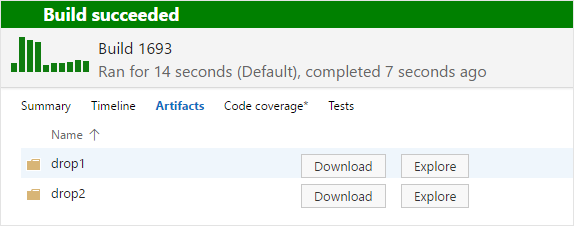
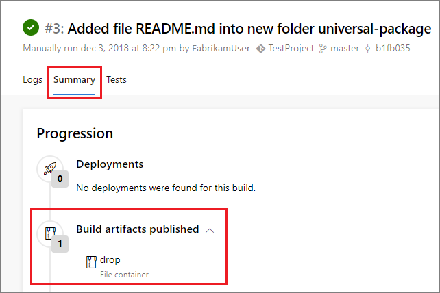
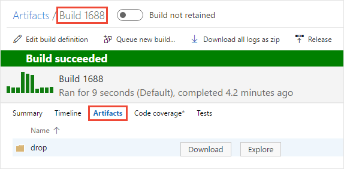

# Artifacts in Azure Pipelines

::: moniker range="<= tfs-2018"
[!INCLUDE [temp](../_shared/concept-rename-note.md)]
::: moniker-end

> [!NOTE]
> We recommend upgrading from build artifacts to [pipeline artifacts (preview)](pipeline-artifacts.md) for faster output storage speeds. 

Artifacts are the files that you want your build to produce. Artifacts can be anything that your team needs to test or deploy your app.

Azure Pipelines can pick up and use your build artifacts as part of a continuous integration/continuous deployment (CI/CD) pipeline. In this scenario, you're automatically building a web app with each commit using your CI build. Your CD release pipeline picks up the .zip (ASP.NET or Node.js) or .war (Java) web deployment file. Your changes are automatically deployed to a test environment in Azure.

You can publish your artifacts to other tasks in your pipeline. You can then add onto, build, test, or even deploy those artifacts.

## How do I publish artifacts?

Artifacts can be published at any stage of pipeline. You can use two methods for configuring what to publish as an artifact and when to publish it: alongside your code with **YAML**, or in the Azure Pipelines UI with the **classic editor**.

## Example: Publish a text file as an artifact

# [YAML](#tab/yaml)

::: moniker range=">= azure-devops-2019"
```yaml
- powershell: gci env:* | sort-object name | Format-Table -AutoSize | Out-File $env:BUILD_ARTIFACTSTAGINGDIRECTORY/environment-variables.txt

- task: PublishBuildArtifacts@1
  inputs:
    pathtoPublish: '$(Build.ArtifactStagingDirectory)'
    artifactName: drop
```
::: moniker-end

::: moniker range="< azure-devops-2019"
YAML is not supported in TFS.
::: moniker-end

# [Designer](#tab/designer)

> [!TIP]
> If you want to try this and you don't already have a Git repo with an **environment-variables.txt** file at the root, you can quickly [create one](../../repos/git/create-new-repo.md).


 **Utility: Publish Build Artifacts**

* Path to publish:

   ```
   $(Build.SourcesDirectory)/environment-variables.txt
   ```

* Artifact name:

   ```
   drop
   ```

* Artifact publish location: Azure Pipelines/TFS (**TFS 2018 RTM and older**: Artifact type: Server)

---

## Example: Publish two sets of artifacts

# [YAML](#tab/yaml)

::: moniker range=">= azure-devops-2019"
```yaml
- powershell: gci env:* | sort-object name | Format-Table -AutoSize | Out-File $env:BUILD_ARTIFACTSTAGINGDIRECTORY/environment-variables.txt

- task: PublishBuildArtifacts@1
  inputs:
    pathtoPublish: '$(Build.ArtifactStagingDirectory)'
    artifactName: drop1
- task: PublishBuildArtifacts@1
  inputs:
    pathtoPublish: '$(Build.ArtifactStagingDirectory)'
    artifactName: drop2
```

::: moniker-end

::: moniker range="< azure-devops-2019"
YAML is not supported in TFS.
::: moniker-end

# [Designer](#tab/designer)

You can create multiple artifact items. For example:

 **Utility: Publish Build Artifacts**

* Path to publish:

   ```
   $(Build.SourcesDirectory)/environment-variables.txt
   ```

* Artifact name:

   ```
   drop1
   ```

* Artifact publish location: Azure Pipelines/TFS (**TFS 2018 RTM and older**: Artifact type: Server)

 **Utility: Publish Build Artifacts**

* Path to publish:

   ```
   $(Build.SourcesDirectory)/environment-variables.txt
   ```

* Artifact name:

   ```
   drop2
   ```

* Artifact publish location: Azure Pipelines/TFS (**TFS 2018 RTM and older**: Artifact type: Server)

The completed build delivers two sets of artifacts.



> You would probably never need to drop two copies of the same files. The point of this example is to show how you can drop multiple sets of artifacts that can be independently organized, explored, downloaded, and used by your deployment pipeline.

---

## Example: Assemble C++ artifacts into one location and publish as an artifact

# [YAML](#tab/yaml)

::: moniker range=">= azure-devops-2019"
```yaml
- powershell: gci env:* | sort-object name | Format-Table -AutoSize | Out-File $env:BUILD_ARTIFACTSTAGINGDIRECTORY/environment-variables.txt

- task: CopyFiles@2
  inputs:
    sourceFolder: '$(Build.SourcesDirectory)'
    contents: '**/$(BuildConfiguration)/**/?(*.exe|*.dll|*.pdb)'
- task: PublishBuildArtifacts@1
  inputs:
    pathtoPublish: '$(Build.ArtifactStagingDirectory)'
    artifactName: drop
```

::: moniker-end

::: moniker range="< azure-devops-2019"
YAML is not supported in TFS.
::: moniker-end

# [Designer](#tab/designer)

 **Utility: Copy Files**

* Source folder:

   ```
   $(Build.SourcesDirectory)
   ```

* Contents:

   ```
   /$(BuildConfiguration)//?(*.exe|*.dll|*.pdb)
   ```

* Target folder:

   ```
   $(Build.ArtifactStagingDirectory)
   ```

 **Utility: Publish Build Artifacts**

* Path to publish:

   ```
   $(Build.ArtifactStagingDirectory)
   ```

* Artifact name:

   ```
   drop
   ```

* Artifact publish location: Azure Pipelines/TFS (**TFS 2018 RTM and older**: Artifact type: Server)

---

## How do I consume artifacts?

### Consume artifacts in Azure Pipelines

You can download artifacts to Azure Pipelines and deploy them to the target of your choice.

### Consume an artifact in the next job of your build

You can consume an artifact from your build in a subsequent step of the build. This can be useful to build or test your artifact. 

### Download to debug

You can download an artifact directly from a pipeline for use in debugging.

# [YAML](#tab/yaml)

::: moniker range=">= azure-devops-2019"
```yaml
- powershell: gci env:* | sort-object name | Format-Table -AutoSize | Out-File $env:BUILD_ARTIFACTSTAGINGDIRECTORY/environment-variables.txt

- task: DownloadBuildArtifacts@0
  inputs:
    buildType: 'current'
    downloadType: 'single'
    artifactName: 'drop'
    downloadPath: '$(System.ArtifactsDirectory)'
```

::: moniker-end

::: moniker range="< azure-devops-2019"
YAML is not supported in TFS.
::: moniker-end

# [Designer](#tab/designer)

 **Utility: Download Build Artifacts**

* Download artifacts produced by: Current build

* Download type: Specific artifact

* Artifact name:

   ```
   drop
   ```

* Destination directory:

   ```
   $(System.ArtifactsDirectory)
   ```

---

## Tips

* **Artifact publish location** argument: **Azure Pipelines/TFS** (**TFS 2018 RTM and older**: Artifact type: Server) is the best and simplest choice in most cases. This choice causes the artifacts to be stored in Azure Pipelines or TFS. But if you're using a private Windows agent, you've got the option to [drop to a UNC file share](#unc-file-share).

* **Artifact name** argument: Just enter a name that's meaningful to you.

* Use forward slashes in file path arguments so that they work for all agents. Backslashes don't work for macOS and Linux agents.

* On Azure Pipelines and some versions of TFS, two different [variables](../build/variables.md) point to the staging directory: `Build.ArtifactStagingDirectory` and `Build.StagingDirectory`. These are interchangeable.

* The directory referenced by `Build.ArtifactStagingDirectory` is cleaned up after each build.

* You can [get build artifacts from the REST API](/rest/api/vsts/build/artifacts).

## Related tasks for publishing artifacts

Use these tasks to publish artifacts:

*  [Utility: Copy Files](../tasks/utility/copy-files.md) By copying files to `$(Build.ArtifactStagingDirectory)`, you can publish multiple files of different types from different places specified by your [matching patterns](../tasks/file-matching-patterns.md).
*  [Utility: Delete Files](../tasks/utility/delete-files.md) You can prune unnecessary files that you copied to the staging directory.
*  [Utility: Publish Build Artifacts](../tasks/utility/publish-build-artifacts.md)

## Explore, download, and deploy your artifacts

::: moniker range=">= azure-devops-2019"

When the build is done, if you watched it run, select the **Summary** tab and see your artifact in the **Build artifacts published** section.



::: moniker-end

::: moniker range=">=tfs-2015 < azure-devops-2019"

When the build is done, if you watched it run, select the name of the completed build and then select the **Artifacts** tab to see your artifact.



::: moniker-end

From here, you can explore or download the artifacts.

You can also use Azure Pipelines to deploy your app by using the artifacts that you've published. See [Artifacts in Azure Pipelines releases](../release/artifacts.md).

::: moniker range=">=tfs-2015 < azure-devops-2019"
<a name="unc-file-share" />

## Publish from TFS to a UNC file share

If you're using a private Windows agent, you can set the **artifact publish location** option (**TFS 2018 RTM and older**: artifact type) to publish your files to a UNC **file share**.

> [!NOTE]
> Use a Windows build agent. This option doesn't work for macOS and Linux agents.

Choose **file share** to copy the artifact to a file share. Common reasons to do this:

* The size of your drop is large and consumes too much time and bandwidth to copy.

* You need to run some custom scripts or other tools against the artifact.

If you use a file share, specify the UNC file path to the folder. You can control how the folder is created for each build by using [variables](../build/variables.md). For example: ```\\my\share\$(Build.DefinitionName)\$(Build.BuildNumber)```.

<a name="tfs-2015" />

## Publish artifacts from TFS 2015 RTM

If you're using TFS 2015 RTM, the steps in the preceding examples are not available. Instead, you copy and publish your artifacts by using a single task: [Build: Publish Build Artifacts](../tasks/utility/publish-build-artifacts.md).

::: moniker-end