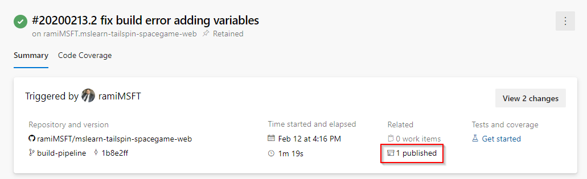
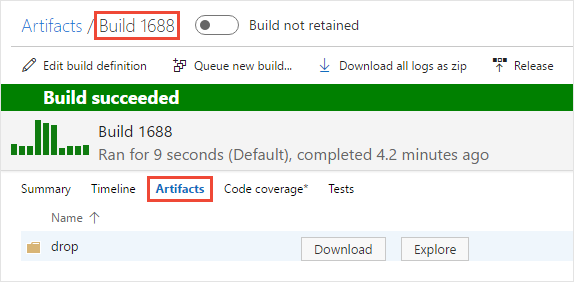

# Artifacts in Azure Pipelines

> [!NOTE]
> We recommend upgrading from **build artifacts** (`PublishBuildArtifacts@1` and `DownloadBuildArtifacts@0`) to **[pipeline artifacts](pipeline-artifacts.md)** (`PublishPipelineArtifact@1` and `DownloadPipelineArtifact@2`) for faster output storage speeds. 

Azure Artifacts is a service that enables teams to use feeds and upstream sources to manage their dependencies. You can use Azure Pipelines to publish and consume different types of artifacts as part of your CI/CD workflow.

## How do I publish artifacts?

Artifacts can be published at any stage of your pipeline. You can use YAML or the classic Azure DevOps editor to publish your packages.

### Publish a text file

#### [YAML](#tab/yaml/)
::: moniker range=">= azure-devops-2019"
```yaml
- powershell: gci env:* | sort-object name | Format-Table -AutoSize | Out-File $env:BUILD_ARTIFACTSTAGINGDIRECTORY/environment-variables.txt

- task: PublishBuildArtifacts@1
  inputs:
    pathToPublish: '$(Build.ArtifactStagingDirectory)'
    artifactName: drop
```

* **pathToPublish**: the path of your artifact. This can be an absolute or a relative path. Wildcards are not supported.
* **artifactName**: the name of your artifact.

> [!NOTE]
> Make sure you are not using one of the reserved folder names when publishing your artifact. See [Application Folders](/previous-versions/ex526337(v=vs.140)#application-folders) for more details.

::: moniker-end

::: moniker range="< azure-devops-2019"
YAML is not supported in TFS.
::: moniker-end

#### [Classic](#tab/classic/)

If you don't have a Git repository yet, you can follow this article to [Create a new Git repo in your project](../../repos/git/create-new-repo.md).

Add the **Publish Build Artifacts** task to your pipeline and fill out the required fields.

:::image type="icon" source="media/publish-task.png" border="false"::: 

The text file should be at the root of your repository.

- Path to publish: $(Build.SourcesDirectory)/environment-variables.txt

- Artifact name: drop

- Artifact publish location: Azure Pipelines

* * *
### Publish two sets of artifacts

#### [YAML](#tab/yaml/)
::: moniker range=">= azure-devops-2019"
```yaml
- powershell: gci env:* | sort-object name | Format-Table -AutoSize | Out-File $env:BUILD_ARTIFACTSTAGINGDIRECTORY/environment-variables.txt

- task: PublishBuildArtifacts@1
  inputs:
    pathToPublish: '$(Build.ArtifactStagingDirectory)'
    artifactName: drop1
- task: PublishBuildArtifacts@1
  inputs:
    pathToPublish: '$(Build.ArtifactStagingDirectory)'
    artifactName: drop2
```

* **pathToPublish**: the path of your artifact. This can be an absolute or a relative path. Wildcards are not supported.
* **artifactName**: the name of your artifact.

::: moniker-end

::: moniker range="< azure-devops-2019"
YAML is not supported in TFS.
::: moniker-end

#### [Classic](#tab/classic/)

You can add multiple **Publish Build Artifacts** tasks to your pipelines.

:::image type="icon" source="media/multiple-publish-tasks.png" border="false"::: 

Your package should be at the root of your repository.

- Path to publish: $(Build.SourcesDirectory)/environment-variables.txt

- Artifact name: drop

- Artifact publish location: Azure Pipelines

In a real world scenario, you probably won't need to publish two copies of the same files. This example was an illustration to show how a user can publish multiple artifacts that can be independently managed and consumed by the deployment pipeline.

* * *
## Example: Assemble C++ artifacts into one location and publish as an artifact

#### [YAML](#tab/yaml/)
::: moniker range=">= azure-devops-2019"
```yaml
- powershell: gci env:* | sort-object name | Format-Table -AutoSize | Out-File $env:BUILD_ARTIFACTSTAGINGDIRECTORY/environment-variables.txt

- task: CopyFiles@2
  inputs:
    sourceFolder: '$(Build.SourcesDirectory)'
    contents: '**/$(BuildConfiguration)/**/?(*.exe|*.dll|*.pdb)'
    targetFolder: '$(Build.ArtifactStagingDirectory)'
- task: PublishBuildArtifacts@1
  inputs:
    pathToPublish: '$(Build.ArtifactStagingDirectory)'
    artifactName: drop
```
* **sourceFolder**: the folder that contains the files you want to copy. If you leave this value empty, copying will be done from the root folder of your repo (`$(Build.SourcesDirectory)`).
* **contents**: location(s) of the file(s) that will be copied to the destination folder.
* **targetFolder**: destination folder. 
* **pathToPublish**: the folder or file path to publish. It can be an absolute or a relative path, and wildcards are not supported.
* **artifactName**: the name of the artifact that you want to create.

> [!NOTE]
> You cannot use **Bin**, **App_Data** and other folder names reserved by IIS as an artifact name because this content is not served in response to Web requests. Please see [ASP.NET Web Project Folder Structure](/previous-versions/ex526337(v=vs.140)) for more details.

::: moniker-end

::: moniker range="< azure-devops-2019"
YAML is not supported in TFS.
::: moniker-end

#### [Classic](#tab/classic/)
:::image type="icon" source="../tasks/utility/media/copy-files.png" border="false"::: **Utility: Copy Files**

* Source folder:

   ```
   $(Build.SourcesDirectory)
   ```

* Contents:

   ```
   /$(BuildConfiguration)//?(*.exe|*.dll|*.pdb)
   ```

* Target folder:

   ```
   $(Build.ArtifactStagingDirectory)
   ```

:::image type="icon" source="../tasks/utility/media/publish-build-artifacts.png" border="false"::: **Utility: Publish Build Artifacts**

* Path to publish:

   ```
   $(Build.ArtifactStagingDirectory)
   ```

* Artifact name:

   ```
   drop
   ```

* Artifact publish location: Azure Pipelines/TFS (**TFS 2018 RTM and older**: Artifact type: Server)

* * *
## How do I consume artifacts?

You can consume your artifacts in different ways: you can use it in your release pipeline, pass it between your pipeline jobs, download it directly from your pipeline and even download it from feeds and upstream sources.

### Consume artifacts in release pipelines

You can download artifacts produced by either a build pipeline (created in a classic editor) or a YAML pipeline (created through a YAML file) in a release pipeline and deploy them to the target of your choice.

### Consume an artifact in the next job of your pipeline

You can consume an artifact produced by one job in a subsequent job of the pipeline, even when that job is in a different stage (YAML pipelines). This can be useful to test your artifact. 

### Download to debug

You can download an artifact directly from a pipeline for use in debugging.

#### [YAML](#tab/yaml/)
::: moniker range=">= azure-devops-2019"
```yaml
- powershell: gci env:* | sort-object name | Format-Table -AutoSize | Out-File $env:BUILD_ARTIFACTSTAGINGDIRECTORY/environment-variables.txt

- task: DownloadBuildArtifacts@0
  inputs:
    buildType: 'current'
    downloadType: 'single'
    artifactName: 'drop'
    downloadPath: '$(System.ArtifactsDirectory)'
```
* **buildType**: specify which build artifacts will be downloaded: `current` (the default value) or from a specific build.
* **downloadType**: choose whether to download a single artifact or all artifacts of a specific build.
* **artifactName**: the name of the artifact that will be downloaded.
* **downloadPath**: path on the agent machine where the artifacts will be downloaded.

::: moniker-end

::: moniker range="< azure-devops-2019"
YAML is not supported in TFS.
::: moniker-end

#### [Classic](#tab/classic/)
:::image type="icon" source="../tasks/utility/media/downloadbuildartifacts.png" border="false"::: **Utility: Download Build Artifacts**

* Download artifacts produced by: Current build

* Download type: Specific artifact

* Artifact name:

   ```
   drop
   ```

* Destination directory:

   ```
   $(System.ArtifactsDirectory)
   ```

* * *

> [!NOTE]
> In case you are using a `deployment` task, you can then reference your build artifacts by using `$(Agent.BuildDirectory)` variable. See [Agent variables](../build/variables.md#agent-variables) for more information on how to use predefined variables.

## Tips

* **Artifact publish location** argument: **Azure Pipelines/TFS** (**TFS 2018 RTM and older**: Artifact type: Server) is the best and simplest choice in most cases. This choice causes the artifacts to be stored in Azure Pipelines or TFS. But if you're using a private Windows agent, you've got the option to [drop to a UNC file share](#unc-file-share).

* Use forward slashes in file path arguments so that they work for all agents. Backslashes don't work for macOS and Linux agents.

* Build artifacts are stored on a Windows filesystem, which causes all UNIX permissions to be lost, including the execution bit. You might need to restore the correct UNIX permissions after downloading your artifacts from Azure Pipelines or TFS.

* On Azure Pipelines and some versions of TFS, two different [variables](../build/variables.md) point to the staging directory: `Build.ArtifactStagingDirectory` and `Build.StagingDirectory`. These are interchangeable.

* The directory referenced by `Build.ArtifactStagingDirectory` is cleaned up after each build.

* Deleting a build that published Artifacts to a file share will result in the deletion of all Artifacts in that UNC path.  

* You can [get build artifacts from the REST API](/rest/api/vsts/build/artifacts).

## Related tasks for publishing artifacts

Use these tasks to publish artifacts:

* :::image type="icon" source="../tasks/utility/media/copy-files.png" border="false"::: [Utility: Copy Files](../tasks/utility/copy-files.md) By copying files to `$(Build.ArtifactStagingDirectory)`, you can publish multiple files of different types from different places specified by your [matching patterns](../tasks/file-matching-patterns.md).
* :::image type="icon" source="../tasks/utility/media/delete-files.png" border="false"::: [Utility: Delete Files](../tasks/utility/delete-files.md) You can prune unnecessary files that you copied to the staging directory.
* :::image type="icon" source="../tasks/utility/media/publish-build-artifacts.png" border="false"::: [Utility: Publish Build Artifacts](../tasks/utility/publish-build-artifacts.md)

## Explore, download, and deploy your artifacts

::: moniker range=">= azure-devops-2019"

When the build is done, if you watched it run, select the **Summary** tab and see your artifact in the **Build artifacts published** section.

> [!div class="mx-imgBorder"]
> 

::: moniker-end

::: moniker range=">=tfs-2015 < azure-devops-2019"

When the build is done, if you watched it run, select the name of the completed build and then select the **Artifacts** tab to see your artifact.

> [!div class="mx-imgBorder"]
> 

::: moniker-end

From here, you can explore or download the artifacts.

You can also use Azure Pipelines to deploy your app by using the artifacts that you've published. See [Artifacts in Azure Pipelines releases](../release/artifacts.md).

::: moniker range=">=tfs-2015 < azure-devops-2019"
<a name="unc-file-share" />

## Publish from TFS to a UNC file share

If you're using a private Windows agent, you can set the **artifact publish location** option (**TFS 2018 RTM and older**: artifact type) to publish your files to a UNC **file share**.

> [!NOTE]
> Use a Windows build agent. This option doesn't work for macOS and Linux agents.

Choose **file share** to copy the artifact to a file share. Common reasons to do this:

* The size of your drop is large and consumes too much time and bandwidth to copy.

* You need to run some custom scripts or other tools against the artifact.

If you use a file share, specify the UNC file path to the folder. You can control how the folder is created for each build by using [variables](../build/variables.md). For example: ```\\my\share\$(Build.DefinitionName)\$(Build.BuildNumber)```.

<a name="tfs-2015" />

## Publish artifacts from TFS 2015 RTM

If you're using TFS 2015 RTM, the steps in the preceding examples are not available. Instead, you copy and publish your artifacts by using a single task: [Build: Publish Build Artifacts](../tasks/utility/publish-build-artifacts.md).

::: moniker-end

## Related articles

- [Publish and download artifacts in Azure Pipelines](./pipeline-artifacts.md)
- [Define your multi-stage classic pipeline](../release/define-multistage-release-process.md)
- [How to mitigate risk when using private package feeds](https://azure.microsoft.com/resources/3-ways-to-mitigate-risk-using-private-package-feeds/)
