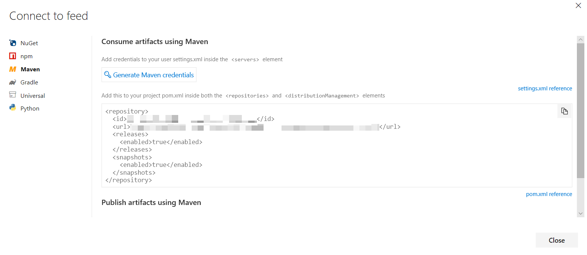

# Set up Azure Pipelines and Maven

[!INCLUDE [version-tfs-2018](../_shared/version-tfs-2018.md)]

::: moniker range="<= tfs-2018"
[!INCLUDE [temp](../_shared/concept-rename-note.md)]
::: moniker-end

This guide covers the basics of using Azure Pipelines to work with Maven artifacts in Azure Artifacts feeds.

1. Navigate to your Maven feed and click "Connect to Feed". Click on "Maven".


1. Click on "Generate Maven Credentials"

1. Create a local file named `settings.xml` from the following template and then paste the generated XML, replacing the comment:
    > [!IMPORTANT]
    > Do not commit this file into your repository.

    ```xml
    <settings xmlns="http://maven.apache.org/SETTINGS/1.0.0" xmlns:xsi="http://www.w3.org/2001/XMLSchema-instance" xsi:schemaLocation="http://maven.apache.org/SETTINGS/1.0.0
                          https://maven.apache.org/xsd/settings-1.0.0.xsd">
        <servers>
          <!-- Paste the <server> snippet generated by Azure DevOps here -->
        </servers>
    </settings>
    ````

1. Below the `settings.xml` snippet in the generated credentials dialog, there is a snippet to be added to the `<repositories>` section of your project's `pom.xml`. Add that snippet. If you intend to use Maven to publish to Artifacts, add the snippet to the `<distributionManagement>` section of the POM file as well. Commit and push this change.

1. Upload `settings.xml` created in step 3 as a [Secure File into the pipeline's library](../library/secure-files.md).

1. Add tasks to your pipeline to [download the secure file](../tasks/utility/download-secure-file.md) and to copy it to the `(~/.m2)` directory. The latter can be accomplished with the following PowerShell script, where `settingsxml` is the reference name of the "Download secure file" task:

```powershell
New-Item -Type Directory -Force "${HOME}/.m2"
Copy-Item -Force "$(settingsxml.secureFilePath)" "${HOME}/.m2/settings.xml"
```