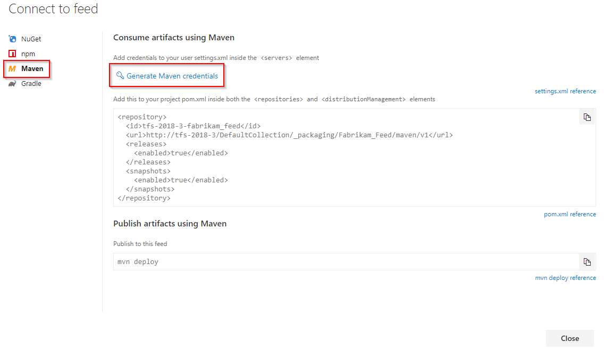
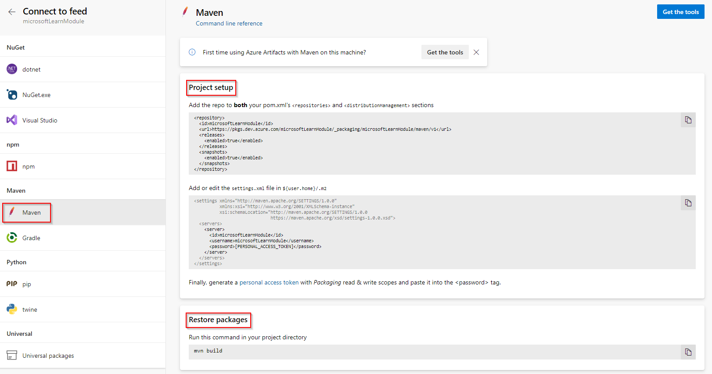

# Set up Azure Pipelines and Maven

[!INCLUDE [version-tfs-2018](../includes/version-tfs-2018.md)]

::: moniker range="<= tfs-2018"
[!INCLUDE [temp](../includes/concept-rename-note.md)]
::: moniker-end

This guide covers the basics of using Azure Pipelines to work with Maven artifacts in Azure Artifacts feeds.

## Set up your feed

::: moniker range=">=tfs-2018 < azure-devops-2019"

1. Select **Build and Release**.

1. Select **Packages**.

1. With your feed selected, select **Connect to feed**.

1. Select **Maven**.

    > [!div class="mx-imgBorder"]
    >

1. Click on "Generate Maven Credentials"

1. Create a local file named `settings.xml` from the following template and then paste the generated XML, replacing the comment:
    > [!IMPORTANT]
    > Do not commit this file into your repository.

    ```xml
    <settings xmlns="http://maven.apache.org/SETTINGS/1.0.0" xmlns:xsi="http://www.w3.org/2001/XMLSchema-instance" xsi:schemaLocation="http://maven.apache.org/SETTINGS/1.0.0
                          https://maven.apache.org/xsd/settings-1.0.0.xsd">
        <servers>
          <!-- Paste the <server> snippet generated by Azure DevOps here -->
        </servers>
    </settings>
    ````

1. Below the `settings.xml` snippet in the generated credentials dialog, there is a snippet to be added to the `<repositories>` section of your project's `pom.xml`. Add that snippet. If you intend to use Maven to publish to Artifacts, add the snippet to the `<distributionManagement>` section of the POM file as well. Commit and push this change.

1. Upload `settings.xml` created in step 3 as a [Secure File into the pipeline's library](../library/secure-files.md).

1. Add tasks to your pipeline to [download the secure file](../tasks/utility/download-secure-file.md) and to copy it to the `(~/.m2)` directory. The latter can be accomplished with the following PowerShell script, where `settingsxml` is the reference name of the "Download secure file" task:

    ```PowerShell
    New-Item -Type Directory -Force "${HOME}/.m2"
    Copy-Item -Force "$(settingsxml.secureFilePath)" "${HOME}/.m2/settings.xml"
    ```

::: moniker-end

::: moniker range=">=azure-devops-2019"

1. Navigate to **Artifacts**.

1. With your feed selected, select **Connect to feed**.

1. Select **Maven**.

    > [!div class="mx-imgBorder"]
    >

1. Set up your project by following these steps:

    1. Add the repo to **both** your pom.xml's `<repositories>` and `<distributionManagement>` sections. Replace the `[ORGANIZATION_NAME]` placeholder with your own organization.
    
        ```xml
        <repository>
          <id>[ORGANIZATION_NAME]</id>
          <url>https://pkgs.dev.azure.com/[ORGANIZATION_NAME]/_packaging/[ORGANIZATION_NAME]/maven/v1</url>
          <releases>
            <enabled>true</enabled>
          </releases>
          <snapshots>
            <enabled>true</enabled>
          </snapshots>
        </repository>
        ```

    1. Add or edit the settings.xml file in ${user.home}/.m2. Replace the `[ORGANIZATION_NAME]` placeholder with your own organization.
    
        ```xml
        <server>
          <id>[ORGANIZATION_NAME]</id>
          <username>[ORGANIZATION_NAME]</username>
          <password>[PERSONAL_ACCESS_TOKEN]</password>
        </server>
        ```

    1. Generate a [Personal Access Token](/azure/devops/organizations/accounts/use-personal-access-tokens-to-authenticate) with Packaging read & write scopes and paste it into the `<password>` tag.

> [!IMPORTANT]
> In order to automatically authenticate Maven feeds from Azure Artifacts, you must have the `mavenAuthenticateFeed` argument set to `true` in your Maven task. See [Maven build task](../tasks/build/maven.md) for more information.

## Restore your package

Run this command in your project directory to restore your package.

```
mvn build
```

::: moniker-end

## Publish your package

Run this command in your project directory to publish your package.

```
mvn deploy
```
