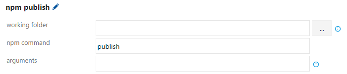

# Publish npm packages

[!INCLUDE [version-tfs-2017-rtm](../_shared/version-tfs-2017-rtm.md)]

::: moniker range="<= tfs-2018"
[!INCLUDE [temp](../_shared/concept-rename-note.md)]
::: moniker-end

You can publish npm packages produced by your build to:

* Azure Artifacts or the TFS Package Management service.
* Other registries such as `https://registry.npmjs.org/`.

# [YAML](#tab/yaml)

::: moniker range=">= azure-devops-2019"
[!INCLUDE [package management permissions](_shared/package-management-permissions-for-yaml-build.md)] Add the following snippet to your `azure-pipelines.yml` file, where **useFeed** is the codename for using an Azure Artifacts feed, and **feedName** is the feed that you want to publish to:

```yaml
- task: Npm@1
  inputs:
    command: publish
    publishRegistry: useFeed
    publishFeed: feedName
```

To publish to an external npm registry, you must first create a service connection to point to that feed. You can do this by going to **Project settings**, selecting **Services**, and then creating a **New service connection**. Select the **npm** option for the service connection. Fill in the registry URL and the credentials to connect to the registry.

To publish a package to an npm registry, add the following snippet to your azure-pipelines.yml file.

```yaml
- task: Npm@1
  inputs:
    command: publish
    publishEndpoint: '<copy and paste the name of the service connection here>'
```

For a list of other options, see the [npm task](../tasks/package/npm.md).

::: moniker-end

::: moniker range="< azure-devops-2019"
YAML is not supported in TFS.
::: moniker-end

# [Designer](#tab/designer)

To publish an npm package to a Package Management feed, add the **npm** task. Then, configure these options:

- **working folder**: Select the folder that contains your `.npmrc` and `package.json`; leave blank if those files are at the root of the repo
- **npm command**: `publish`



[!INCLUDE [package management permissions](_shared/package-management-permissions-for-web-build.md)]

To publish to an external npm registry, you must first create a service connection to point to that registry. You can do this by going to **Project settings**, selecting **Service connections**, and then creating a **New service connection**. Select the **npm** option for the service connection. Fill in the registry URL and the credentials to connect to the registry.

---

> [!NOTE]
> The build does not support using the `publishConfig` property to specify the `registry` to which you're publishing. Ensure that your working folder has an `.npmrc` file with a `registry=` line, as detailed in the **Connect to feed** screen in your feed.

## Q&A

### Where can I learn about the Azure Pipelines and TFS Package Management service?

[Package Management service](../../artifacts/index.md) 
