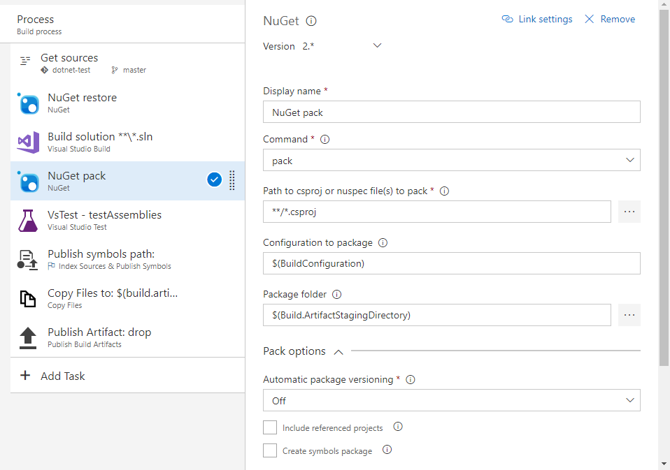

# Publish to NuGet feeds

[!INCLUDE [version-tfs-2017-rtm](../_shared/version-tfs-2017-rtm.md)]

::: moniker range="<= tfs-2018"
[!INCLUDE [temp](../_shared/concept-rename-note.md)]
::: moniker-end

You can publish NuGet packages from your build to NuGet feeds. You can publish these packages to: 

* Azure Artifacts or the TFS Package Management service.
* Other NuGet services such as NuGet.org.
* Your internal NuGet repository.

## Create a NuGet package

There are various ways to create NuGet packages during a build. If you're already using MSBuild or some other task to create your packages, skip this section and [publish your packages](#publish-packages). Otherwise, add a **NuGet** task:

# [YAML](#tab/yaml)

::: moniker range=">= azure-devops-2019"
To create a package, add the following snippet to your azure-pipelines.yml file.

```yaml
- task: NuGetCommand@2
  inputs:
    command: pack
    packagesToPack: '**/*.csproj'
```

The NuGet task supports a number of options. The following list describes some of the key ones. The [task documentation](../tasks/package/nuget.md) describes the rest.

- **packagesToPack**: The path to the files that describe the package you want to create. If you don't have these, see the [NuGet documentation](/nuget/create-packages/creating-a-package) to get started.
- **configuration**: The default is `$(BuildConfiguration)` unless you want to always build either `Debug` or `Release` packages, or unless you have a custom build configuration.
- **packDestination**: The default is `$(Build.ArtifactStagingDirectory)`. If you set this, make a note of the location so you can use it in the [publish task](#publish-packages).

::: moniker-end

::: moniker range="< azure-devops-2019"
YAML is not supported in TFS.
::: moniker-end

# [Designer](#tab/designer)

Add the **NuGet** task to your build in order to create a NuGet package. Make sure to add this task below the task that builds your application and above any tasks that require the packages you build.

The NuGet task supports a number of options. The following list describes some of the key ones. The [task documentation](../tasks/package/nuget.md) describes the rest.

- **Command:** pack
- **Path to csproj or nuspec file(s) to pack**: The path to the files that describe the package you want to create. If you don't have these, see the [NuGet documentation](/nuget/create-packages/creating-a-package) to get started.
- **Configuration to package**: Leave this as `$(BuildConfiguration)` unless you want to always build either `Debug` or `Release` packages, or unless you have a custom build configuration.
- **Package folder**: Leave this as `$(Build.ArtifactStagingDirectory)`. If you change this, make a note of the location so you can use it in the [publish task](#publish-packages).
- **Pack options** > **Use Build number to version package**: See the 
[next section](#package-versioning).



---

<a name="package-versioning"></a>
## Package versioning

In NuGet, a particular package is identified by its name and version number. A recommended approach to versioning packages is to use Semantic Versioning. Semantic version numbers have three numeric components, `Major.Minor.Patch`. 

When you fix a bug, you increment the patch (`1.0.0` to `1.0.1`). When you release a new backward-compatible feature, you increment the minor version and reset the patch version to 0 (`1.4.17` to `1.5.0`). When you make a backward-incompatible change, you increment the major version and reset the minor and patch versions to 0 (`2.6.5` to `3.0.0`).

In addition to `Major.Minor.Patch`, Semantic Versioning provides for a prerelease label. Prerelease labels are a hyphen (`-`) followed by whatever letters and numbers you want. Version `1.0.0-alpha`, `1.0.0-beta`, and `1.0.0-foo12345` are all prerelease versions of `1.0.0`. Even better, Semantic Versioning specifies that when you sort by version number, those prerelease versions fit exactly where you’d expect: `0.99.999` < `1.0.0-alpha` < `1.0.0` < `1.0.1-beta`.

When you create a package in continuous integration (CI), you can use Semantic Versioning with prerelease labels. You can use the **NuGet** task for this purpose. It supports the following formats:

* Use the same versioning scheme for your builds and packages, if that scheme has at least three parts separated by periods. The following build pipeline formats are examples of versioning schemes that are compatible with NuGet:
  * `$(Major).$(Minor).$(rev:.r)`, where `Major` and `Minor` are two variables defined in the build pipeline. This format will automatically increment the build number and the package version with a new patch number. It will keep the major and minor versions constant, until you change them manually in the build pipeline.
  * `$(Major).$(Minor).$(Patch).$(date:yyyyMMdd)`, where `Major`, `Minor`, and `Patch` are variables defined in the build pipeline. This format will create a new prerelease label for the build and package while keeping the major, minor, and patch versions constant.

* Use a version that's different from the build number. You can customize the major, minor, and patch versions for your packages in the NuGet task, and let the task generate a unique prerelease label based on date and time.

* Use a script in your build pipeline to generate the version.

#  [YAML](#tab/yaml)

::: moniker range=">= azure-devops-2019"
This example shows how to use the date and time as the prerelease label.

```yaml
variables:
  Major: '1'
  Minor: '0'
  Patch: '0'

steps:
- task: NuGetCommand@2
  inputs:
    command: pack
    versioningScheme: byPrereleaseNumber
    majorVersion: '$(Major)'
    minorVersion: '$(Minor)'
    patchVersion: '$(Patch)'
```

For a list of other possible values for `versioningScheme`, see the [NuGet task](../tasks/package/nuget.md).

::: moniker-end

::: moniker range="< azure-devops-2019"
YAML is not supported in TFS.
::: moniker-end

# [Designer](#tab/designer)

In the **NuGet** task, select **Pack options** and select one of the values for **Automatic package versioning**.

---

Although Semantic Versioning with prerelease labels is a good solution for packages produced in CI builds, including a prerelease label is not ideal when you want to release a package to your users. The challenge is that after packages are produced, they're [immutable](/azure/devops/artifacts/feeds/immutability). They can't be updated or replaced. 

When you’re producing a package in a build, you can’t know whether it will be the version that you aim to release to your users or just a step along the way toward that release. Although none of the following solutions are ideal, you can use one of these depending on your preference:

* After you validate a package and decide to release it, produce another package without the prerelease label and publish it. The drawback of this approach is that you have to validate the new package again, and it might uncover new issues.

* Publish only packages that you want to release. In this case, you won't use a prerelease label for every build. Instead, you'll reuse the same package version for all packages. Because you do not publish packages from every build, you do not cause a conflict.

<a name="publish-packages"></a>
## Publish your packages

In the previous section, you learned how to create a package with every build. When you're ready to share the changes to your package with your users, you can publish it.

#  [YAML](#tab/yaml)

::: moniker range=">= azure-devops-2019"
To publish to an Azure Artifacts feed, set the **Project Collection Build Service** identity to be a **Contributor** on the feed. To learn more about permissions to Package Management feeds, see [Secure and share packages using feed permissions](/azure/devops/artifacts/feeds/feed-permissions). Add the following snippet to your `azure-pipelines.yml` file.

```yaml
steps:
- task: NuGetCommand@2
  displayName: 'NuGet push'
  inputs:
    command: push
    publishVstsFeed: '<feedName>'
    allowPackageConflicts: true
```

To publish to an external NuGet feed, you must first create a service connection to point to that feed. You can do this by going to **Project settings**, selecting **Service connections**, and then creating a **New service connection**. Select the **NuGet** option for the service connection. To connect to the feed, fill in the feed URL and the API key or token.

To publish a package to a NuGet feed, add the following snippet to your `azure-pipelines.yml` file.

```yaml
- task: NuGetCommand@2
  inputs:
    command: push
    nuGetFeedType: external
    publishFeedCredentials: '<Name of the NuGet service connection>'
    versioningScheme: byEnvVar
    versionEnvVar: <VersionVariableName>
```
::: moniker-end

::: moniker range="< azure-devops-2019"
YAML is not supported in TFS.
::: moniker-end

# [Designer](#tab/designer)

To publish NuGet packages created by your build, add the **NuGet** task and configure these options:

- **Command**: push
- **Path to NuGet package(s) to publish**: Leave this set to `$(Build.ArtifactStagingDirectory)` unless you decided earlier to pack your packages in another location in the last task.
- **Target feed location**: You can publish to an Azure Artifacts or TFS Package Management feed in this organization or collection, to NuGet.org, or to an internal NuGet repository.
- **Target feed**: Select the feed that you want to publish to.


[!INCLUDE [package management permissions](_shared/package-management-permissions-for-web-build.md)]

::: moniker range=">= tfs-2018"

To publish to an external NuGet feed, you must first create a service connection to point to that feed. You can do this by going to **Project settings**, selecting **Service connections**, and then creating a **New service connection**. Select the **NuGet** option for the service connection. To connect to the feed, fill in the feed URL and the API key or token.

::: moniker-end

::: moniker range="tfs-2017"

To publish to an external NuGet feed, you must first create a service connection to point to that feed. You can do this by going to **Project settings**, selecting **Services**, and then creating a **New service Endpoint**. Select the **NuGet** option for the service connection. To connect to the feed, fill in the feed URL and the API key or token.

> If you are running TFS Update 2 or older, **Nuget** is not a service endpoint option, you must use the **Generic** connection.

::: moniker-end

---

## Publish symbols for your packages

When you push packages to a Package Management feed, you can also [publish symbols](/azure/devops/pipelines/artifacts/symbols).

## Q&A

### Where can I learn more about Azure Artifacts and the TFS Package Management service?

[Package Management in Azure Artifacts and TFS](../../artifacts/index.md)
