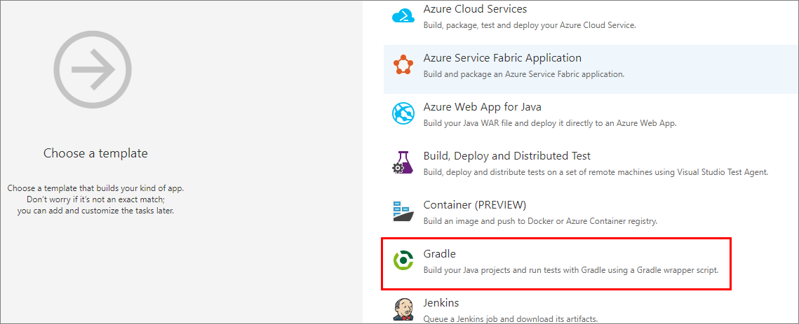

# Install Maven artifacts using Gradle

**Azure DevOps Services | Azure DevOps Server 2020 | Azure DevOps Server 2019 | TFS 2018 - TFS 2017**

Gradle is a popular build tool for Java applications and the primary build tool for Android. Using Azure Pipelines, we can add the gradle task to our build definition and install Maven artifacts.

## Prerequisites

- [Install Java](https://www.oracle.com/technetwork/java/javase/downloads/index.html).
- [Install Gradle](https://gradle.org/install/).

To make sure you have all the prerequisites set up, run the following command in an elevated command prompt to check which Java version is installed on your machine.

```Command
java -version
```

If the above command doesn't return a java version, make sure you go back and install the Java JDK or JRE first. 

To confirm the installation of Gradle, run the following command in an elevated command prompt:

```Command
gradle -v
```

## Set up authentication

::: moniker range=">= azure-devops-2019"

1. Select **User settings**, and then select **Personal access tokens**

    :::image type="content" source="media/create-pat.png" alt-text="Screenshot showing how to create a personal access token":::

2. Select **New Token**, and then fill out the required fields. Make sure you select the **Packaging** > **Read & write** scope. 

    :::image type="content" source="media/create-packaging-pat.png" alt-text="Screenshot showing how to create a new personal access token.":::  

3. Select **Create** when you are done.

::: moniker-end

::: moniker range=">= tfs-2017 <= tfs-2018"

1. Select your profile icon, and then select **Security**.

2. Select **New Token**, and then name your token and set its expiration date. 

3. Select the **Packaging (Read & write)** scope.

    :::image type="content" source="media/select-scope.png" alt-text="Screenshot showing the available scopes for a pat.":::

::: moniker-end

4. Copy your token and save it in a secure location.

5. Create a new file in your `.gradle` folder and name it **gradle.properties**. The path to your gradle folder is usually in `%INSTALLPATH%/gradle/user/home/.gradle/`.

6. Open the **gradle.properties** file with a text editor and add the following snippet:

    ```
    vstsMavenAccessToken=<PASTE_YOUR_PERSONAL_ACCESS_TOKEN_HERE>
    ```

7. Save your file when you are done.

## Install Maven artifacts using Gradle

1. Open your *build.gradle* file and make sure it starts with the following:

    ```groovy
    apply plugin: 'java'
    ```

1. Add the following snippet to your *build.gradle* file to download your artifact during the build. Replace the placeholders with your groupID, artifactID, and versionNumber. For example: `compile(group: 'siteOps', name: 'odata-wrappers', version: '1.0.0.0')

    ```groovy
    dependencies { 
        compile(group: '<YOUR_GROUP_ID>', name: '<ARTIFACT_ID>', version: '<VERSION_NUMBER>')  
    } 
    ```   

To test this, we can create a simple Java console app and build it with Gradle.

```java
public class HelloWorld { 
    public static void main(String[] args) { 
        System.out.println("Hello, world!"); 
    } 
} 
```

Run the following command to build your project. Your build output should return: `BUILD SUCCESSFUL`

```Command
gradle build
```

## Configure your build to install Maven artifacts using Gradle

Run the following from a command prompt:

```cli
gradle wrapper
```

The Gradle wrapper is created in the directory where you ran the above command. The wrapper's file name is **gradlew**. Do not rename this file.

`git push` an update that contains the wrapper (gradlew) from your cloned (local) repo to `origin`. Team Build requires this file on the remote repo for Gradle to build your project.

Go to the **Build and Release** page for your project, and then select **Builds**.

Select the **+ New** button. Scroll down and select the **Gradle** template.



Select **Apply** to start configuring the build to use your Gradle wrapper.

Now, select the **gradlew build** step. You can use the default settings to start.


Here, you can configure various Gradle tasks to run during the build.  Once you've configured the build pipeline, click **Save & queue** from the top menu and start building with your Gradle wrapper. You're done!