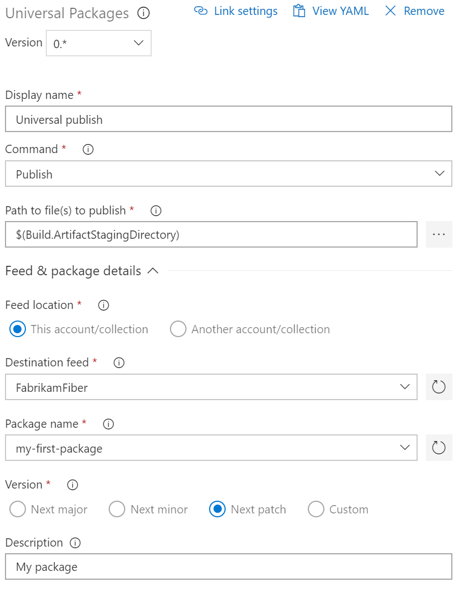
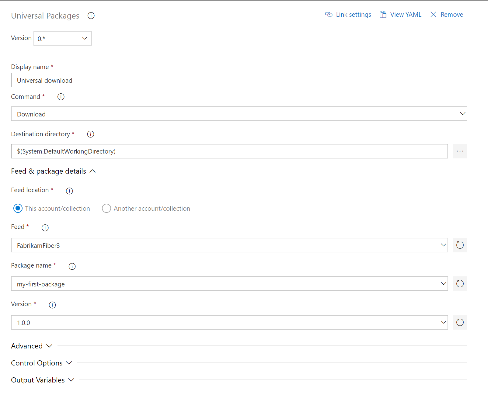

# Publish and download Universal Packages in Azure Pipelines

**Azure Pipelines**

> [!NOTE]
> Universal Packages are currently in public preview.

When you want to publish a set of related files from a pipeline as a single package, you can use [Universal Packages](../../artifacts/quickstarts/universal-packages.md) hosted in Azure Artifacts feeds.

## Prepare your Universal Package

[Universal Packages](../../artifacts/quickstarts/universal-packages.md) are created from a directory of files. By default, the Universal Packages task will publish all files in `$(Build.ArtifactStagingDirectory)`. To prepare your Universal Package for publishing, either configure preceding tasks to place output files in that directory, or use the [Copy Files utility task](../tasks/utility/copy-files.md) to assemble the files that you want to publish.

<a name="publish-packages"></a>

## Publish your packages

# [YAML](#tab/yaml)

To publish a Universal Package to your feed, add the following snippet to your azure-pipelines.yml file.

```yaml
- task: UniversalPackages@0
  displayName: Universal Publish
  inputs:
    command: publish
    publishDirectory: '$(Build.ArtifactStagingDirectory)'
    vstsFeedPublish: '<Feed name>'
    vstsFeedPackagePublish: '<Package name>'
    packagePublishDescription: '<Package description>'

```

[!INCLUDE [package management permissions](_shared/package-management-permissions-for-yaml-build.md)]

To publish to an external Universal Packages feed, you must first create a [service connection](../library/service-endpoints.md) to point to that feed. You can do this by going to **Project settings**, selecting **Service connections**, and then creating a **New Service Connection**. Select the **Team Foundation Server/Team Services** option for the service connection. Fill in the feed URL and a [personal access token](../..//organizations/accounts/use-personal-access-tokens-to-authenticate.md) to connect to the feed.

# [Designer](#tab/designer)

To publish the files that you assembled previously as a Universal Package, add the **Universal Package** task and configure these options:

- **Command:** Publish
- **Path to file(s) to publish:** Leave this set to `$(Build.ArtifactStagingDirectory)` unless you selected a different output directory in the last step.
- **Feed location:** Publish to an Azure Artifacts feed in this organization or in another organization.
- **Destination feed:** Select the feed that you want to publish to.
- **Package name:** Select an existing package (to publish a new version of that package), or enter a new package name (to publish the first version of a new package).



[!INCLUDE [package management permissions](_shared/package-management-permissions-for-web-build.md)]

To publish to an external Universal Packages feed, you must first create a [service connection](../library/service-endpoints.md) to point to that feed. You can do this by going to **Project settings**, selecting **Service connections**, and then creating a **New Service Connection**. Select the **Azure Repos/Team Foundation Server** option for the service connection. Fill in the feed URL and a [personal access token](../../organizations/accounts/use-personal-access-tokens-to-authenticate.md) to connect to the feed.

---

<a name="package-versioning"></a>

## Package versioning

In Universal Packages, a particular package is identified by its name and version number. Currently, Universal Packages require [Semantic Versioning](https://semver.org). Semantic version numbers have three numeric components, `Major.Minor.Patch`. When you fix a bug, you increment the patch (`1.0.0` to `1.0.1`). When you release a new backward-compatible feature, you increment the minor version and reset the patch version to 0 (`1.4.17` to `1.5.0`). When you make a backward-incompatible change, you increment the major version and reset the minor and patch versions to 0 (`2.6.5` to `3.0.0`).

The Universal Packages task automatically selects the next major, minor, or patch version for you when you publish a new package. Just set the appropriate option. 

# [YAML](#tab/yaml)

In the **Universal Packages** snippet that you added previously, add the `versionOption` key with the `major`, `minor`, `patch`, or `custom` value. If you enter the `custom` value, you must also provide the `versionPublish` key.

```yaml
- task: UniversalPackages@0
  displayName: Universal Publish
  inputs:
    command: publish
    publishDirectory: '$(Build.ArtifactStagingDirectory)'
    vstsFeedPublish: '<Feed GUID>'
    vstsFeedPackagePublish: '<Package name>'
    versionOption: custom
    versionPublish: <Package version>
    packagePublishDescription: '<Package description>'
```

# [Designer](#tab/designer)

In the **Universal Packages** task that you configured previously, choose the appropriate **Version** increment option.

---

## Download a Universal Package

You can also download a Universal Package from your pipeline.

# [YAML](#tab/yaml)

To download a Universal Package from a feed in your organization, use the following snippet: 

```yaml
steps:
- task: UniversalPackages@0
  displayName: 'Universal download'
  inputs:
    command: download
    vstsFeed: 'fabrikamFeed'
    vstsFeedPackage: 'fabrikam-package'
    vstsPackageVersion: 1.0.0
```

| Argument                       | Description                                                         |
| ------------------------------ | ------------------------------------------------------------------- |
| vstsFeed                       | Feed that the package will be downloaded from.     |
| vstsFeedPackage                | Name of the package to be downloaded.    |
| vstsPackageVersion             | Version of the package to be downloaded. |
| [!INCLUDE [temp](../tasks/_shared/control-options-arguments.md)] | |

To download a Universal Package from an external source, use the following snippet:

```yaml
steps:
- task: UniversalPackages@0
  displayName: 'Universal download'
  inputs:
    command: download
    feedsToUse: external
    externalFeedCredentials: MSENG2
    feedDownloadExternal: `fabrikamFeedExternal`
    packageDownloadExternal: `fabrikam-package`
    versionDownloadExternal: 1.0.0
```

| Argument                       | Description                                                         |
| ------------------------------ | ------------------------------------------------------------------- |
| feedsToUse                     | Value should be `external` when you're downloading from an external source.|
| externalFeedCredentials        | Name of a service connection to another Azure DevOps organization or server. See [service connections](/azure/devops/pipelines/library/service-endpoints#sep-tfsts).                    |
| feedDownloadExternal           | Feed that the package will be downloaded from.        |
| packageDownloadExternal        | Name of the package to be downloaded.                             |
| versionDownloadExternal        | Version of the package to be downloaded.        |
| [!INCLUDE [temp](../tasks/_shared/control-options-arguments.md)] | |

# [Designer](#tab/designer)

To download a Universal Package, add the **Universal Package** task and configure these options:

- **Command:** Download
- **Destination directory**: Directory to download the package. The default is `$(System.DefaultWorkingDirectory)`.
- **Feed location:** Download a Universal Package from an Azure Artifacts feed in this organization or in another organization.
- **Feed:** Select the feed that you want to download from.
- **Package name:** Select the package that you want to download.
- **Version:** Select the version of the package that you want to download.




---

## Q&A

### Where can I learn more about Azure Artifacts and the TFS Package Management service?

[Package Management in Azure Artifacts and TFS](../../artifacts/index.md)