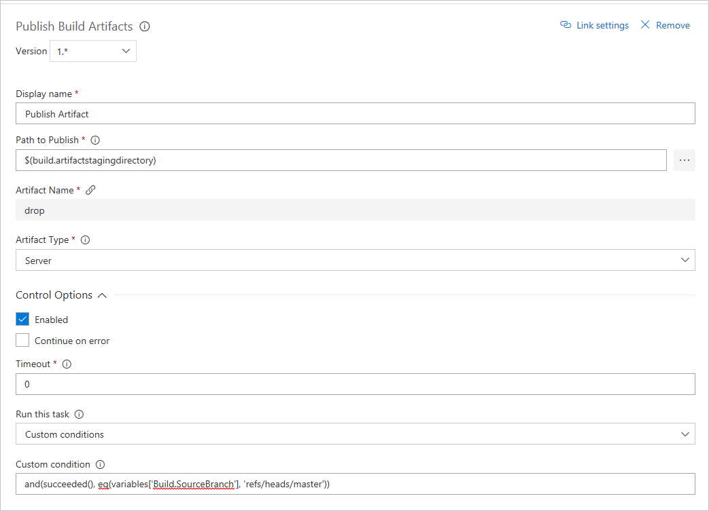
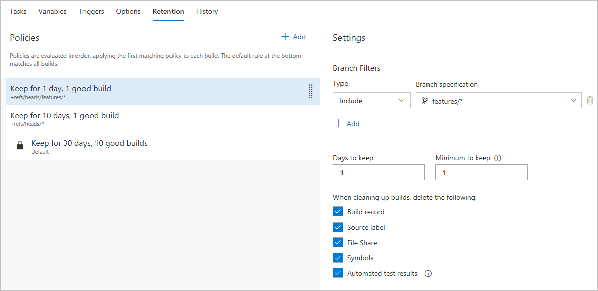

# Build multiple branches

[!INCLUDE [version-tfs-2017-rtm](../_shared/version-tfs-2017-rtm.md)]

::: moniker range="<= tfs-2018"
[!INCLUDE [temp](../_shared/concept-rename-note.md)]
::: moniker-end

You can build every commit and pull request to your Git repository using Azure Pipelines or TFS. In this tutorial, we will discuss additional considerations when building multiple branches in your Git repository. You will learn how to:

> [!div class="checklist"]
> * Set up a CI trigger for topic branches
> * Automatically build a change in topic branch
> * Exclude or include tasks for builds based on the branch being built
> * Keep code quality high by building pull requests
> * Use retention policies to clean up completed builds

## Prerequisites

* You need a Git repository in Azure Pipelines, TFS, or GitHub with your app. If you do not have one, we recommend importing the [sample .NET Core app](https://github.com/MicrosoftDocs/pipelines-dotnet-core) into your Azure Pipelines or TFS project, or forking it into your GitHub repository. Note that you must use Azure Pipelines to build a GitHub repository. You cannot use TFS.

* You also need a working build for your repository.

## Set up a CI trigger for a topic branch

A common workflow with Git is to create temporary branches from your master branch.  These branches are called topic or feature branches and help you isolate your work.  In this workflow, you create a branch for a particular feature or bug fix.  Eventually, you merge the code back to the master branch and delete the topic branch.

# [YAML](#tab/yaml)

::: moniker range="azure-devops"

Unless you specify a [trigger](../yaml-schema.md#push-trigger) in your YAML file, a change in any of the branches will trigger a build. Add the following snippet to your YAML file in the `master` branch. This will cause any changes to `master` and `features/*` branches to be automatically built.

```yaml
trigger:
- master
- features/*
```
::: moniker-end

::: moniker range="< azure-devops"
YAML builds are not yet available on TFS.
::: moniker-end

# [Designer](#tab/designer)

Follow the steps below to create a CI trigger that will run a build for feature branches.

1. Select **Pipelines**, and then choose **Builds**.
2. Locate the build pipeline that services your master branch. Select **Edit**.
3. Select the **Triggers** menu for your build.  Ensure you have **Continuous integration** enabled.
4. Select the **+ Add** icon under **Branch filters**.
5. Under the **Branch specification** dropdown, type `features/*` in the **Filter my branches** text box and press **Enter**. The trigger now supports CI for all feature branches that match the wildcard as well as the master branch. Note that the filtered list of branches may not populate as you type `*`. You can still press **Enter** and save the branch filter.
6. Select the **Save & queue** menu and then Select **Save**.

---

## Automatically build a change in topic branch

Your are now ready for CI for both the master branch and future feature branches that match the branch pattern.  Every code change for the branch will use an automated build pipeline to ensure the quality of your code remains high.

Follow the steps below to edit a file and create a new topic branch.

1. Navigate to your code in Azure Repos, TFS, or GitHub.
1. Create a new branch for your code that starts with `features/`, e.g., `features/feature-123`.
1. Make a change to your code in the feature branch and commit the change.
1. Navigate to the **Pipelines** menu in Azure Pipelines or TFS and select **Builds**.
1. Select the build pipeline for this repo. You should now see a new build executing for the topic branch. This build was initiated by the trigger you created earlier. Wait for the build to finish.

Your typical development process includes developing code locally and periodically pushing to your remote topic branch.  Each push you make results in a build pipeline executing in the background.  The build pipeline helps you catch errors earlier and helps you to maintain a quality topic branch that can be safely merged to master.  Practicing CI for your topic branches helps to minimize risk when merging back to master.

## Exclude or include tasks for builds based on the branch being built

The master branch typically produces deployable artifacts such as binaries.  You do not need to spend time creating and storing those artifacts for short-lived feature branches.  You implement custom conditions in Azure Pipelines or TFS so that certain tasks only execute on your master branch during a build run.  You can use a single build with multiple branches and skip or perform certain tasks based on conditions.

# [YAML](#tab/yaml)

Edit the `azure-pipelines.yml` file in your `master` branch, locate a task in your YAML file, and add a condition to it. For example, the following snippet adds a condition to [publish artifacts](../tasks/utility/publish-build-artifacts.md) task.

::: moniker range="azure-devops"

```yaml
- task: PublishBuildArtifacts@1
  condition: and(succeeded(), eq(variables['Build.SourceBranch'], 'refs/heads/master'))
```
::: moniker-end
::: moniker range="< azure-devops"

YAML builds are not yet available on TFS.

::: moniker-end

# [Designer](#tab/designer)

1. Locate the build pipeline that services your master branch. Select **Edit**.
1. Choose a task in your build pipeline. If you are following the .NET Core sample, then select the [**Publish Artifact**](../tasks/utility/publish-build-artifacts.md) task.
1. Select **Control Options** for the task on the bottom right hand part of your screen.
51. Select the dropdown for **Run this task** and choose **Custom conditions**.

    

1. Enter the following snippet:
```
and(succeeded(), eq(variables['Build.SourceBranch'], 'refs/heads/master'))
```

1.  Select **Save & queue**.
1.  Choose your **topic branch**.  Select **Queue**.  We are not building the master branch, and the task for **Publish artifacts** will not execute.
1.  Select the build to monitor the progress.  Once the build completes, confirm the build skipped the **Publish artifacts** task.

---

## Validate pull requests

Use policies to protect your branches by requiring successful builds before merging pull requests.  You have options to always require a new successful build before merging changes to important branches such as the master branch.  There are other branch policy settings to build less frequently.  You can also require a certain number of code reviewers to help ensure your pull requests are high quality and don't result in broken builds for your branches.

### GitHub repository

# [YAML](#tab/yaml)

::: moniker range="azure-devops"

Unless you specify `pr` triggers in your YAML file, pull request builds are automatically enabled for all branches.
You can specify the target branches for your pull request builds. 
For example, to run the build only for pull requests that target: `master` and `features/*`:

```yaml
pr:
- master
- features/*
```

For more details, see [Triggers](../build/triggers.md).

::: moniker-end

::: moniker range="< azure-devops"
YAML builds are not yet available on TFS.
::: moniker-end


# [Designer](#tab/designer)

1. Navigate to your project in Azure Pipelines or TFS. Select **Pipelines**, and then select **Builds**. Locate your build, and select **Edit**.
1. Select **Triggers**. Enable the **Pull request validation** trigger. Ensure you include the **master branch** under **Branch filters**.
1. Select **Save & queue**, then select **Save**.
1. Navigate to your GitHub account. Navigate to the main page for your **repository**.
1. Select the **Branch** selector, and then type a name for a new branch and press enter. This will create a branch based on master.
1. Edit a file in your new branch. **Commit** your change to the new branch.
1. Select **Pull requests**. Select **New pull request**.
1. Create the pull request. Navigate back to your build pipeline. A build will be queued or completed for the merge commit of your pull request.

---

### Azure Pipelines or TFS repository

1.  Navigate to the **Code** hub in Azure Repos or TFS.
1.  Choose your **repository** and Select **Branches**.  Choose the **master branch**.
1.  You will implement a branch policy to protect the master branch.  Select the **ellipsis** to the right of your branch name and Select **Branch policies**.
1.  Choose the checkbox for **Protect this branch**.  There are several options for protecting the branch.   
1.  Under the **Build validation** menu choose **Add build policy**.
1.  Choose the appropriate build pipeline.
1.  Ensure **Trigger** is set to automatic and the **Policy requirement** is set to required.
1.  Enter a descriptive **Display name** to describe the policy.  
1.  Select **Save** to create and enable the policy.  Select **Save changes** at the top left of your screen.
1. To test the policy navigate to the **Pull request** menu in Azure Pipelines or TFS.
1. Select **New pull request**.  Ensure your topic branch is set to merge into your master branch.  Select **create**.
1. Your screen displays the **policy** being executed.  
1. Select the **policy name** to examine the build.  If the build succeeds your code will be merged to master.  If the build fails the merge is blocked.

Once the work is completed in the topic branch and merged to master, you can delete your topic branch.  You can then create additional feature or bug fix branches as necessary.

## Use retention policies to clean up your completed builds

Retention policies allow you to control and automate the cleanup of your various builds.  For shorter-lived branches like topic branches, you may want to retain less history to reduce clutter and storage costs.  If you create CI builds on multiple related branches, it will become less important to keep builds for all of your branches.  

1.  Navigate to the **Pipelines** menu in Azure Pipelines or TFS.
2.  Locate the build pipeline that you set up for your repo.
3.  Select **Edit** at the top right of your screen.
4.  Under the build pipeline name, Select the **Retention** tab.  Select **Add** to add a new retention policy.

    

5.  Type **features/*** in the **Branch specification** dropdown.  This ensures any feature branches matching the wildcard will use the policy.
6.  Set **Days to keep** to 1 and **Minimum to keep** to 1.
7.  Select the **Save & queue** menu and then Select **Save**.  

Policies are evaluated in order, applying the first matching policy to each build. The default rule at the bottom matches all builds.  The retention policy will clean up build resources each day.  You retain at least one build at all times.  You can also choose to keep any particular build for an indefinite amount of time.

## Next steps

In this tutorial, you learned how to manage CI for multiple branches in your Git repositories using Azure Pipelines or TFS.

You learned how to:

> [!div class="checklist"]
> * Set up a CI trigger for topic branches
> * Automatically build a change in topic branch
> * Exclude or include tasks for builds based on the branch being built
> * Keep code quality high by building pull requests
> * Use retention policies to clean up completed builds
