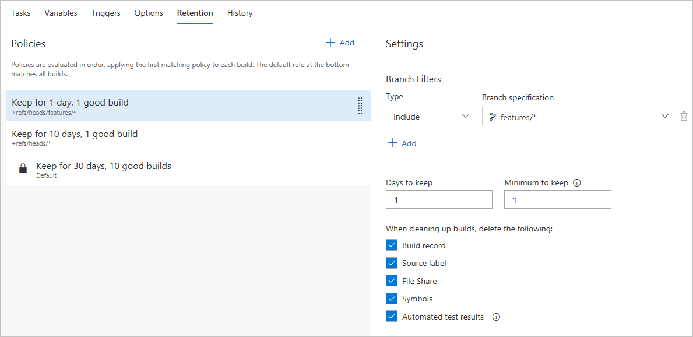

# Build multiple branches in Azure Pipelines

[!INCLUDE [version-lt-eq-azure-devops](../../includes/version-lt-eq-azure-devops.md)]

Using Azure Pipelines, you can create triggers to build your project on every new commit and pull request to your repository. In this article, you will learn how to enable continuous integration and set up multiple branch builds for your repository.

## Prerequisites

- An Azure DevOps organization and a project. Create an [organization](../../organizations/accounts/create-organization.md) or a [project](../../organizations/projects/create-project.md#create-a-project) if you haven't already.

- A working pipeline. Follow the instructions in [Create your first pipeline](../create-first-pipeline.md) to create your pipeline.

## Enable CI trigger for a topic branch

When working with Git, it is a common practice to create temporary branches from the main branch to facilitate a streamlined workflow. These branches, often referred to as topic or feature branches, serve the purpose of isolating your work. Within this workflow, you create a branch dedicated to a specific feature or bug fix, and once completed, you merge the code back into the main branch before deleting the topic branch.

#### [YAML](#tab/yaml/)
::: moniker range=">=azure-devops-2020"

If no trigger is explicitly specified in your YAML file, any changes made to any branch will trigger a run. To add triggers for both the *main* branch and any *feature/* branches, include the following snippet in your YAML file. This will ensure that any modifications made to these branches will automatically trigger a pipeline run.

```yaml
trigger:
- main
- feature/*
```
::: moniker-end

::: moniker range="< azure-devops"
YAML builds are not yet available on TFS.
::: moniker-end

#### [Classic](#tab/classic/)

1. Sign in to your Azure DevOps organization, and then navigate to your project.

1. Select **Pipelines**, and then select your classic pipeline. Select **Edit** to modify your pipeline.

1. Select **Triggers** and then check the **Enable continuous integration** checkbox.

1. Under **Path filters** dropdown, type `feature/*` in the **Path specification** text box to trigger on any changes to all feature branches. 

1. Select the **Save & queue** menu and then Select **Save**.

:::image type="content" source="./media/classic-ci-trigger.png" alt-text="A screenshot showing how to add a CI trigger to a classic pipeline.":::

* * *

## Customize build tasks based on the branch being built

The main branch is usually responsible for generating deployable artifacts, such as binaries. For short-lived feature branches, there is no need to invest time in creating and storing these artifacts. In Azure Pipelines, you can implement custom conditions to ensure that specific tasks are executed only on the main branch.

#### [YAML](#tab/yaml/)

Edit the *azure-pipelines.yml* file in your *main* branch, and add a condition to your desired task. For example, the following snippet adds a condition to the [publish pipeline artifacts](/azure/devops/pipelines/tasks/reference/publish-pipeline-artifact-v1) task.

::: moniker range=">=azure-devops-2020"

```yaml
- task: PublishPipelineArtifact@1
  condition: and(succeeded(), eq(variables['Build.SourceBranch'], 'refs/heads/main'))
```
::: moniker-end

::: moniker range="< azure-devops"

YAML builds are not yet available on TFS.

::: moniker-end

#### [Classic](#tab/classic/)

The following example adds a custom condition to the [publish build artifacts](/azure/devops/pipelines/tasks/reference/publish-build-artifacts-v1) task.

1. Select the **Control Options** section, and then check the **Enabled** checkbox.

1. Select the **Run this task** dropdown menu, and then select **Custom conditions**.

1. Enter the following snippet in the **Custom condition** text box. This task will only execute if you're building the main branch.
   
    ```
   and(succeeded(), eq(variables['Build.SourceBranch'], 'refs/heads/main'))
   ```

1. Select **Save & queue** when you're done.

:::image type="content" source="media/ci-build-git/customconditions.png" alt-text="A screenshot showing how to add a custom condition to the publish build artifacts task.":::

* * *

## Validate pull requests

Use policies to protect your branches by requiring successful builds before merging pull requests.  You have options to always require a new successful build before merging changes to important branches such as the main branch.  There are other branch policy settings to build less frequently.  You can also require a certain number of code reviewers to help ensure your pull requests are high quality and don't result in broken builds for your branches.

### GitHub repository

#### [YAML](#tab/yaml/)
::: moniker range=">=azure-devops-2020"

Unless you specify `pr` triggers in your YAML file, pull request builds are automatically enabled for all branches.
You can specify the target branches for your pull request builds. 
For example, to run the build only for pull requests that target: `main` and `feature/*`:

```yaml
pr:
- main
- feature/*
```

For more details, see [Triggers](../build/triggers.md).

::: moniker-end

::: moniker range="< azure-devops"
YAML builds are not yet available on TFS.
::: moniker-end


#### [Classic](#tab/classic/)
1. Navigate to your project in Azure Pipelines or TFS. Select **Pipelines**, and then select **Builds**. Locate your build, and select **Edit**.
1. Select **Triggers**. Enable the **Pull request validation** trigger. Ensure you include the **main branch** under **Branch filters**.
1. Select **Save & queue**, then select **Save**.
1. Navigate to your GitHub account. Navigate to the main page for your **repository**.
1. Select the **Branch** selector, and then type a name for a new branch and press enter. This will create a branch based on main.
1. Edit a file in your new branch. **Commit** your change to the new branch.
1. Select **Pull requests**. Select **New pull request**.
1. Create the pull request. Navigate back to your build pipeline. A build will be queued or completed for the merge commit of your pull request.

* * *
### Azure Pipelines or TFS repository

1.  Navigate to the **Repos** hub in Azure Repos or TFS.
1.  Choose your **repository** and select **Branches**.  Choose the **main branch**.
1.  You will implement a branch policy to protect the main branch.  Select the **ellipsis** to the right of your branch name and select **Branch policies**.
1.  Choose the checkbox for **Protect this branch**.  There are several options for protecting the branch.   
1.  Under the **Build validation** menu choose **Add build policy**.
1.  Choose the appropriate build pipeline.
1.  Ensure **Trigger** is set to automatic and the **Policy requirement** is set to required.
1.  Enter a descriptive **Display name** to describe the policy.  
1.  Select **Save** to create and enable the policy.  Select **Save changes** at the top left of your screen.
1. To test the policy navigate to the **Pull request** menu in Azure Pipelines or TFS.
1. Select **New pull request**.  Ensure your topic branch is set to merge into your main branch.  Select **create**.
1. Your screen displays the **policy** being executed.  
1. Select the **policy name** to examine the build.  If the build succeeds your code will be merged to main.  If the build fails the merge is blocked.

Once the work is completed in the topic branch and merged to main, you can delete your topic branch.  You can then create additional feature or bug fix branches as necessary.

::: moniker range="azure-devops-2022"

> [!IMPORTANT]
> Azure Pipelines no longer supports per-pipeline retention policies. We recommend using project-level retention rules.

::: moniker-end

::: moniker range="<=azure-devops-2020"

## Use retention policies to clean up your completed builds

Retention policies allow you to control and automate the cleanup of your various builds.  For shorter-lived branches like topic branches, you may want to retain less history to reduce clutter and storage costs.  If you create CI builds on multiple related branches, it will become less important to keep builds for all of your branches.  

1.  Navigate to the **Pipelines** menu in Azure Pipelines or TFS.
2.  Locate the build pipeline that you set up for your repo.
3.  Select **Edit** at the top right of your screen.
4.  Under the build pipeline name, Select the **Retention** tab.  Select **Add** to add a new retention policy.

    

5.  Type **feature/*** in the **Branch specification** dropdown.  This ensures any feature branches matching the wildcard will use the policy.
6.  Set **Days to keep** to 1 and **Minimum to keep** to 1.
7.  Select the **Save & queue** menu and then Select **Save**.  

Policies are evaluated in order, applying the first matching policy to each build. The default rule at the bottom matches all builds.  The retention policy will clean up build resources each day.  You retain at least one build at all times.  You can also choose to keep any particular build for an indefinite amount of time.

::: moniker-end

## Next steps

In this tutorial, you learned how to manage CI for multiple branches in your Git repositories using Azure Pipelines or TFS.

You learned how to:

> [!div class="checklist"]
> * Set up a CI trigger for topic branches
> * Automatically build a change in topic branch
> * Exclude or include tasks for builds based on the branch being built
> * Keep code quality high by building pull requests
> * Use retention policies to clean up completed builds
