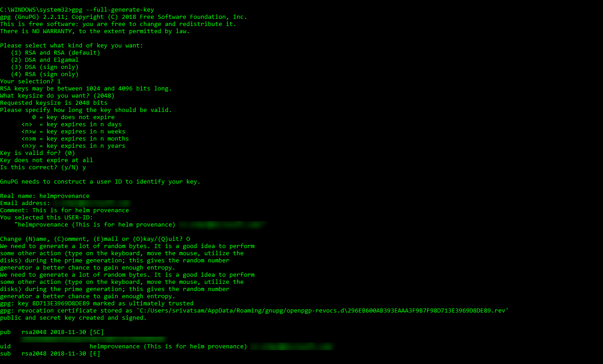
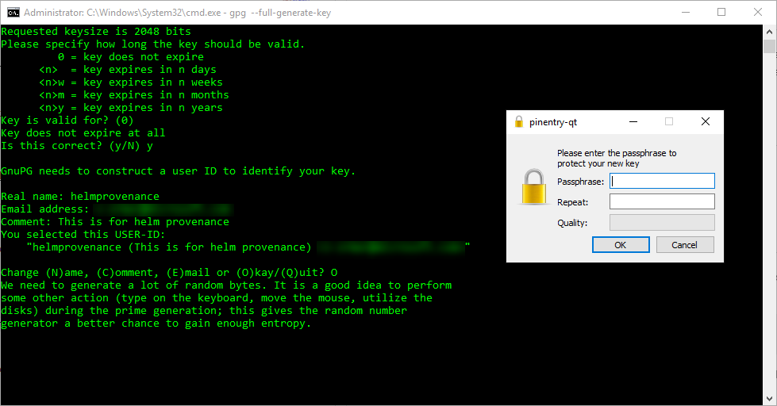
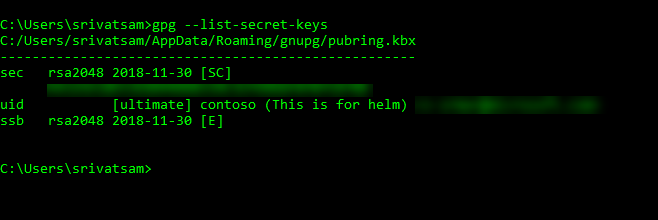
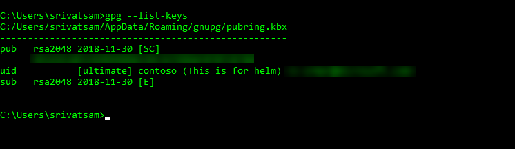

# Package and sign Helm charts

[!INCLUDE [include](../_shared/version-team-services.md)]

In this step-by-step guide you'll learn how to package and sign Helm charts in a pipeline.

## Generate a private-public key pair to sign the helm chart using GPG

1. Download [GPG](https://www.gnupg.org/download/index.html).

2. Launch the command prompt in an administrator mode. Run the following command to generate a private-public key pair to sign the helm chart using gpg. While creating the key, you'll be prompted for the username and email address. The "name email address" is later used to name the private-public key pair that is created.

   ```cmd
   gpg --full-generate-key
   ```
   
   

3. You'll be prompted for the passphrase. Give the value and click ok.

   

4. After creating the key, you can see the list of keys which contains both private and public using the following command.

   - To see list of private keys

     ```cmd
     gpg --list-secret-keys
     ```

     

     - To see the list of public keys

       ```cmd
       gpg --list-keys
       ```

       

5. Store the private and public keys in 2 different files with the extension **gpg** as shown below.

   * For a private key

   ```cmd
   gpg --export-secret-key 94325E18E53EDD99DD8339C3CFD9DAF0707CB788 contoso@microsoft.com > C:/somepath/privatekeys.gpg
   ```

   You'll see the **privatekeys.gpg** file exported to the path which was mentioned above.

   * For a public key

   ```cmd
   gpg --export-key 94325E18E53EDD99DD8339C3CFD9DAF0707CB788 contoso@microsoft.com > C:/somepath/publickey.gpg
   ```

   You'll see the **publickey.gpg** file exported to the path which was mentioned above.

In Azure DevOps, save the **privatekey.gpg** file in the library **secure files** section.

## Example

```YAML
  queue:
  name: Hosted Ubuntu 1604

  variables:
  # The below variable should be secure
  HelmKeyPassphrase: contoso@123
  keyName: contoso contoso@microsoft.com
  azureSubscriptionEndpoint: contoso
  azureResourceGroup: contoso
  kubernetesCluster: contoso

  steps:
  - task: DownloadSecureFile@1
    displayName: Download Secure file
    inputs:
      secureFile: privatekey.gpg
    name: privateKeyRing

  - task: HelmInstaller@0
    displayName: Install Helm 2.12.0
    inputs:
      helmVersion: 2.12.0

  - task: HelmDeploy@0
    displayName: helm init
    inputs:
      azureSubscriptionEndpoint: $(azureSubscriptionEndpoint)
      azureResourceGroup: $(azureResourceGroup)
      kubernetesCluster: $(kubernetesCluster)
      command: init
      arguments: --client-only

  - task: HelmDeploy@0
    displayName: helm package
    inputs:
      azureSubscriptionEndpoint: $(azureSubscriptionEndpoint)
      azureResourceGroup: $(azureResourceGroup)
      kubernetesCluster: $(kubernetesCluster)
      command: package
      chartPath: Application/charts/sampleapp
      arguments: --sign --key "$(keyName)" --keyring $(privateKeyRing.secureFilePath)

    env:
      HelmKeyPassphrase: $(HelmKeyPassphrase)
```