# Migrate from XAML builds to new builds

**Azure Pipelines | TFS 2018 | TFS 2017 | XAML builds**

::: moniker range="<= tfs-2018"
[!INCLUDE [temp](../_shared/concept-rename-note.md)]
::: moniker-end

We introduced XAML build automation capabilities based on the Windows Workflow Foundation in Team Foundation Server (TFS) 2010. We released another version of [XAML builds](http://msdn.microsoft.com/library/ms181709%28v=vs.120%29.aspx) in TFS 2013.

After that we sought to expand beyond .NET and Windows and add support for other kinds of apps that are based on operating systems such as macOS and Linux. It became clear that we needed to switch to a more open, flexible, web-based foundation for our build automation engine. In early 2015 in Azure Pipelines, and then in TFS 2015, we introduced a simpler task- and script-driven cross-platform build system.

Because the systems are so different, there's no automated or general way to migrate a XAML build pipeline into a new build pipeline.  The migration process is to manually create the new build pipelines that replicate what your XAML builds do.

If you're building standard .NET applications, you probably used our default templates as provided out-of-the-box. In this case the process should be reasonably easy.

If you have customized your XAML templates or added custom tasks, then you'll need to also take other steps including writing scripts, installing extensions, or creating custom tasks.

## Overview of the migration effort

Here are the steps to migrate from XAML builds to newer builds:

1. If you're using a private TFS server, [set up agents](../agents/v2-windows.md) to run your builds.

1. To get familiar with the new build system, create a ["Hello world" build pipeline](../create-first-pipeline.md).

1. Create a new build pipeline intended to replace one of your XAML build pipelines.

 1. Create a new build pipeline.
 
 1. Port your XAML settings.

1. On the [General tab](#general-tab), disable the XAML build pipeline.

1. Repeat the previous two steps for each of your XAML build pipelines.

1. Take advantage of new build features and learn more about the kinds of apps you can build.

1. Learn how to customize, and if necessary extend your system.

1. When you no longer need the history and artifacts from your XAML builds, delete the XAML builds, and then the XAML build pipelines.

 > [!WARNING]
 > After you delete the XAML builds and pipelines, you cannot get them back.

## Create new build pipelines

If you're building a standard .NET app, you're probably using one of the out-of-the-box build templates such as TfvcTemplate.12.xaml or GitTemplate.12.xaml. In this case, it will probably just take you a few clicks to create build pipelines in the new build system.

<ol>
    [!INCLUDE [include](../_shared/begin-create-build-definition.md)]

<li>Select a template to add commonly used tasks to your build pipeline.</li>

<li>Make any necessary changes to your build pipeline to replicate your XAML build pipeline. The tasks added by the template should simply work in many cases. But if you changed process parameters or other settings in your XAML build pipelines, below are some pointers to get you started replicating those changes.</li>
</ol>

## Port your XAML settings

In each of the following sections we show the XAML user interface, and then provide a pointer to the place where you can port the setting into your new build pipeline.

### General tab

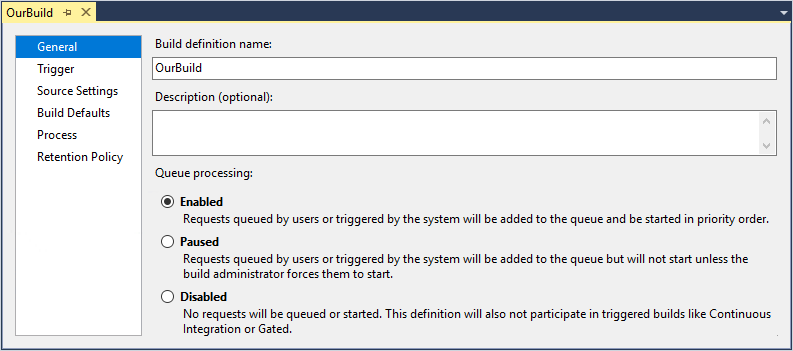

| XAML setting | TFS 2017 equivalent | Azure Pipelines and TFS 2018 and newer equivalent |
|-|-|-|
| Build pipeline name | You can change it whenever you save the pipeline. | <p>When editing the pipeline: On the **Tasks** tab, in left pane click **Pipeline**, and the **Name** field appears in right pane.</p><p>In the **Builds** hub (**Mine** or **All pipelines** tab), open the action menu and choose **Rename**.</p> |
| Description (optional) | Not supported. | Not supported. |
| Queue processing | Not yet supported. As a partial alternative, disable the triggers. | Not yet supported. As an alternative, disable the triggers. |

### Source Settings tab

#### TFVC

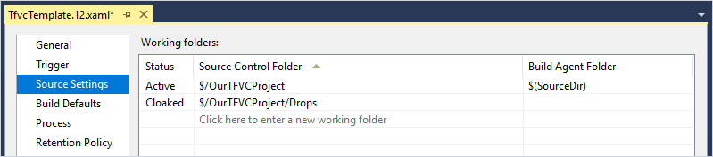

| XAML setting | TFS 2017 and newer equivalent | Azure Pipelines equivalent |
|-|-|-|
| Source Settings tab | On the **Repository** tab specify your mappings with Active paths as **Map** and Cloaked paths as **Cloak**. | On the **Tasks** tab, in left pane click **Get sources**. Specify your workspace mappings with Active paths as **Map** and Cloaked paths as **Cloak**. |

The new build pipeline offers you some new options. The specific extra options you'll see depend on the version you're using of TFS or Azure Pipelines.  If you're using Azure Pipelines, first make sure to display **Advanced settings**. See [Build TFVC repositories](../repos/tfvc.md).

#### Git

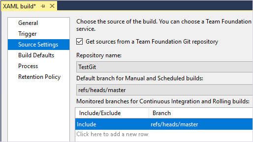

| XAML setting | TFS 2017 and newer equivalent | Azure Pipelines equivalent |
|-|-|-|
| Source Settings tab | On the **Repository** tab specify the repository and default branch. | On the **Tasks** tab, in left pane click **Get sources**. Specify the repository and default branch. |

The new build pipeline offers you some new options. The specific extra options you'll see depend on the version you're using of TFS or Azure Pipelines.  If you're using Azure Pipelines, first make sure to display **Advanced settings**. See [Pipeline options for Git repositories](../repos/pipeline-options-for-git.md).

### Trigger tab

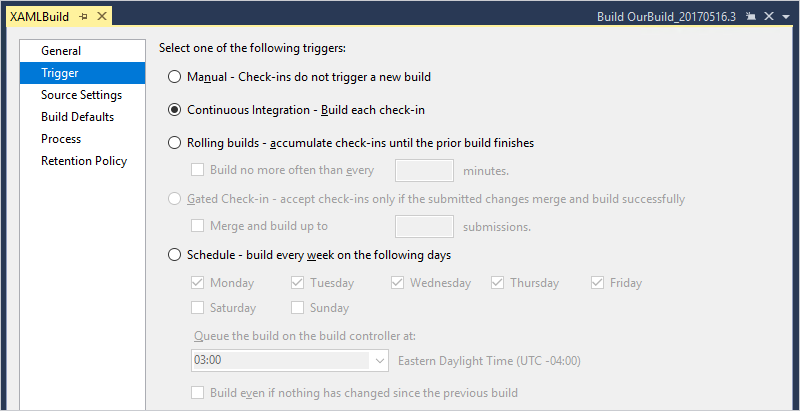

| XAML setting | TFS 2017 and newer, Azure Pipelines equivalent |
|-|-|
|Trigger tab | On the **Triggers** tab, select the trigger you want to use: CI, scheduled, or gated. |

The new build pipeline offers you some new options. For example:

* You can potentially create fewer build pipelines to replace a larger number of XAML build pipelines. This is because you can use a single new build pipeline with multiple triggers. And if you're using Azure Pipelines, then you can add multiple scheduled times.

* The **Rolling builds** option is replaced by the **Batch changes** option. You can't specify minimum time between builds. But if you're using Azure Pipelines, you can specify the maximum number of parallel jobs per branch.

* If your code is in TFVC, you can add folder path filters to include or exclude certain sets of files from triggering a CI build.

* If your code is in TFVC and you're using the gated check-in trigger, you've got the option to also run CI builds or not. You can also use the same workspace mappings as your repository settings, or specify different mappings.

* If your code is in Git, then you specify the branch filters directly on the **Triggers** tab. And you can add folder path filters to include or exclude certain sets of files from triggering a CI build.

The specific extra options you'll see depend on the version you're using of TFS or Azure Pipelines. See [Build pipeline triggers](../build/triggers.md)

We don't yet support the **Build even if nothing has changed since the previous build** option.

### Build Defaults tab

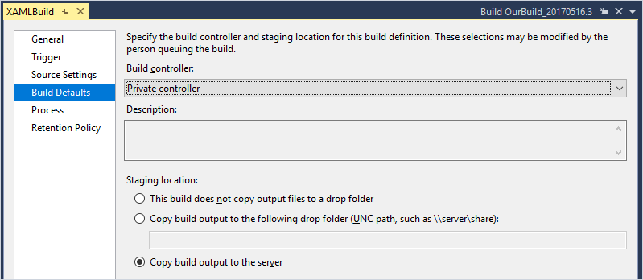

| XAML process parameter | TFS 2017 and newer equivalent | Azure Pipelines equivalent |
|-|-|-|
| Build controller | On the **General** tab, select the default agent pool. | On the **Options** tab, select the default agent pool. |
| Staging location | On the **Tasks** tab, specify arguments to the Copy Files and Publish Build Artifacts tasks. See [Build artifacts](../artifacts/pipeline-artifacts.md). | On the **Tasks** tab, specify arguments to the Copy Files and Publish Build Artifacts tasks. See [Build artifacts](../artifacts/pipeline-artifacts.md). |

The new build pipeline offers you some new options. For example:

* You don't need a controller, and the new agents are easier to set up and maintain. See [Build and release agents](../agents/agents.md).

* You can exactly specify which sets of files you want to publish as build artifacts. See [Build artifacts](../artifacts/pipeline-artifacts.md).

### Process tab

#### TF Version Control

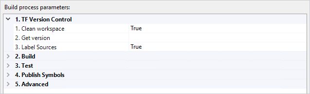

| XAML process parameter | TFS 2017 and newer equivalent | Azure Pipelines equivalent |
|-|-|-|
| Clean workspace | On the **Repository** tab, open the **Clean** menu, and then select **true**. | On the **Tasks** tab, in left pane click **Get sources**. Display **Advanced settings**, and then select **Clean**. (We plan to change move this option out of advanced settings.) |
| Get version | You can't specify a changeset in the build pipeline, but you can specify one when you manually queue a build. | You can't specify a changeset in the build pipeline, but you can specify one when you manually queue a build. |
| Label Sources | On the **Repository** tab, select an option from the **Label sources** menu. | **Tasks** tab, in left pane click **Get sources**. Select one of the **Tag sources** options. (We plan to change the name of this to **Label sources**.) |

The new build pipeline offers you some new options. See [Build TFVC repositories](../repos/tfvc.md).

#### Git

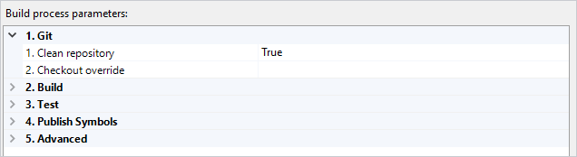

| XAML process parameter | TFS 2017 and newer equivalent | Azure Pipelines equivalent |
|-|-|-|
| Clean repository | **Repository** tab, open **Clean** menu, select **true**. | On the **Tasks** tab, in left pane click **Get sources**. Show **Advanced settings**, and then select **Clean**. (We plan to change move this option out of advanced settings.) |
| Checkout override | You can't specify a commit in the build pipeline, but you can specify one when you manually queue a build. | You can't specify a commit in the build pipeline, but you can specify one when you manually queue a build. |

The new build pipeline offers you some new options. See [Pipeline options for Git repositories](../repos/pipeline-options-for-git.md).

#### Build

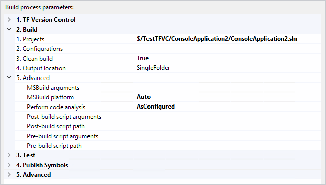

On the **Build** tab (TFS 2017 and newer) or the **Tasks** tab (Azure Pipelines), after you select the Visual Studio Build task, you'll see the arguments that are equivalent to the XAML build parameters.

| XAML process parameter | TFS 2017 and newer, Azure Pipelines equivalent argument |
|-|-|
| Projects | Solution |
| Configurations | Platform, Configuration. See [Visual Studio Build: How do I build multiple configurations for multiple platforms?](../tasks/build/visual-studio-build.md#how-do-i-build-multiple-configurations-for-multiple-platforms) | 
| Clean build | Clean | 
| Output location | The Visual Studio Build task builds and outputs files in the same way you do it on your dev machine, in the local workspace. We give you full control of publishing artifacts out of the local workspace on the agent. See [Artifacts in Azure Pipelines](../artifacts/pipeline-artifacts.md). |
| Advanced, MSBuild arguments | MSBuild Arguments | 
| Advanced, MSBuild platform | Advanced, MSBuild Architecture |
| Advanced, Perform code analysis | Use an MSBuild argument such as`/p:RunCodeAnalysis=true` |
| Advanced, post- and pre-build scripts | You can run one or more scripts at any point in your build pipeline by adding one or more instances of the PowerShell, Batch, and Command tasks. For example, see [Use a PowerShell script to customize your build pipeline](../scripts/powershell.md). |

> [!IMPORTANT] 
> 
> In the Visual Studio Build arguments, on the **Visual Studio Version** menu, make sure to select version of Visual Studio that you're using.

The new build pipeline offers you some new options. See [Visual Studio Build](../tasks/build/visual-studio-build.md).

Learn more: [Visual Studio Build task](../tasks/build/visual-studio-build.md) (for building solutions), [MSBuild task](../tasks/build/msbuild.md) (for building individual projects).

#### Test

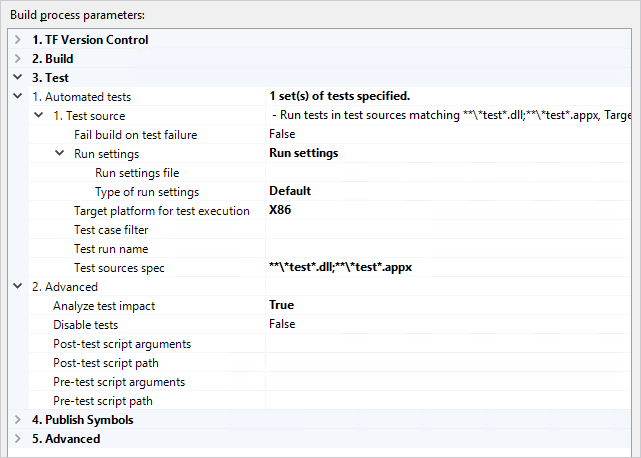

See [continuous testing](../languages/dotnet-core.md#run-your-tests) and [Visual Studio Test task](../tasks/test/vstest.md).

#### Publish Symbols

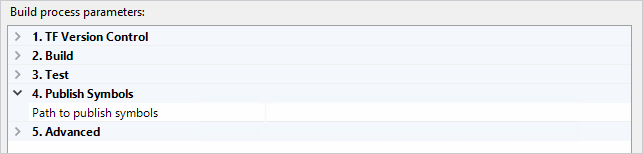

| XAML process parameter | TFS 2017 and newer, Azure Pipelines equivalent |
|-|-|
| Path to publish symbols | Click the Publish Symbols task and then copy the path into the **Path to publish symbols** argument. |

#### Advanced

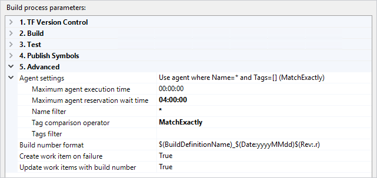

| XAML process parameter | TFS 2017 and newer equivalent| Azure Pipelines equivalent |
|-|-|-|
| Maximum agent execution time | None | On the **Options** tab you can specify **Build job timeout in minutes**. |
| Maximum agent reservation wait time | None | None |
| Name filter, Tag comparison operator, Tags filter | A build pipeline asserts demands that are matched with agent capabilities. See [Agent capabilities](../agents/agents.md#capabilities). | A build pipeline asserts demands that are matched with agent capabilities. See [Agent capabilities](../agents/agents.md#capabilities). |
| Build number format | On the **General** tab, copy your build number format into the **Build number format** field. | On the **General** tab, copy your build number format into the **Build number format** field. |
| Create work item on failure | On the **Options** tab, select this check box. | On the **Options** tab, enable this option. |
| Update work items with build number | None | On the **Options** tab you can enable **Automatically link new work in this build**. | 

The new build pipeline offers you some new options. See:

* [Agent capabilities](../agents/agents.md#capabilities)

* [Build number format](../build/options.md#build-number-format)

### Retention Policy tab

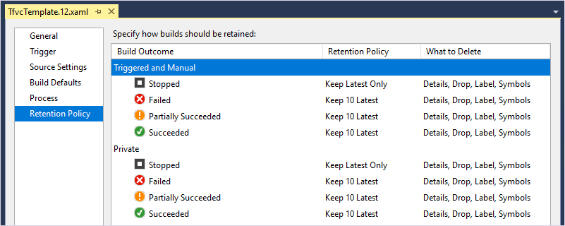

| XAML process parameter | TFS 2017 and newer, Azure Pipelines equivalent |
|-|-|
| Retention Policy tab | On the **Retention** tab specify the policies you want to implement. | 

The new build pipeline offers you some new options. See [Build and release retention policies](../policies/retention.md).

## Build and release different kinds of apps

In XAML builds you had to create your own custom templates to build different types of apps. In the new build system you can pick from a set of pre-defined templates. The largest and most current set of templates are available on Azure Pipelines and in our newest version of TFS.

### Build

Here are a few examples of the kinds of apps you can build:

* [Build your ASP.NET 4 app](../apps/aspnet/build-aspnet-4.md).

* Build your ASP.NET Core app

* [Build your Universal Windows Platform app](../apps/windows/universal.md)

* [Build your Xamarin app](../apps/mobile/xamarin.md)

* [C++ apps for Windows](../apps/windows/cpp.md)

### Release

The new build system is tightly integrated with Azure Pipelines. So it's easier then ever to automatically kick off a deployment after a successful build. Learn more:

* [Create your first pipeline](../create-first-pipeline.md)

* [Release pipelines](../release/index.md)

* [Triggers](../release/triggers.md)

A few examples include:

* [Continuous deployment of your app to an Azure web site](../apps/cd/deploy-webdeploy-webapps.md)

* [IIS using deployment groups](../apps/cd/deploy-webdeploy-iis-deploygroups.md)

### Other apps and tasks

For more examples of apps you can build and deploy, see [Build and deploy your app](../apps/index.md).

For a complete list of our build, test, and deployment tasks, see [Build and release tasks](../tasks/index.md).

## Customize your tasks

In XAML builds you created custom XAML tasks. In the new builds, you've got a range of options that begin with easier and lighter-weight approaches.

### Get tasks from the Marketplace

[Visual Studio Marketplace](https://marketplace.visualstudio.com/azuredevops)
offers hundreds of extensions that you can install to add tasks that extend your build and deployment capabilities.

### Write a script

A major feature of the new build system is its emphasis on using scripts to customize your build pipeline. You can check your scripts into version control and customize your build using any of these methods:

* [PowerShell scripts](../tasks/utility/powershell.md) (Windows)
* [Batch scripts](../tasks/utility/batch-script.md) (Windows)
* [Command prompt](../tasks/utility/command-line.md)
* [Shell scripts](../tasks/utility/shell-script.md) (macOS and Linux)

> [!TIP]
> 
> If you're using TFS 2017 or newer, you can write a short PowerShell script directly inside your build pipeline.

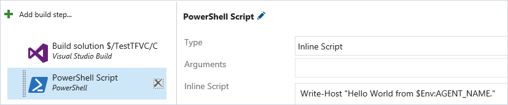
_TFS 2017 or newer inline PowerShell script_

For all these tasks we offer a set of built-in variables, and if necessary, you can define your own variables. See [Build variables](../build/variables.md).

### Write a custom task

If necessary, you can write your own [custom extensions](../../integrate/index.md) to [custom tasks](../../extend/develop/add-build-task.md) for your builds and releases.

## Reuse patterns 

In XAML builds you created custom XAML templates. In the new builds, it's easier to create reusable patterns.

### Create a template

If you don't see a template for the kind of app you can start from an empty pipeline and [add the tasks you need](../tasks/index.md). After you've got a pattern that you like, you can clone it or save it as a template directly in your web browser. See [Create your first pipeline](../create-first-pipeline.md).

### Task groups (TFS 2017 or newer)

In XAML builds, if you change the template, then you also change the behavior of all pipelines based on it. In the new build system, templates don't work this way. Instead, a template behaves as a traditional template. After you create the build pipeline, subsequent changes to the template have no effect on build pipelines.

If you want to create a reusable and automatically updated piece of logic, then [create a task group](../library/task-groups.md). You can then later modify the task group in one place and cause all the pipelines that use it to automatically be changed.

## Q & A

<!-- BEGINSECTION class="md-qanda" -->

::: moniker range=">=tfs-2018"

### I don't see XAML builds. What do I do?

XAML builds are deprecated. We strongly recommend that you migrate to the new builds as explained above.

::: moniker-end

::: moniker range="azure-devops"

If you're not yet ready to migrate, then to enable XAML builds you must connect a XAML build controller to your organization. See [Configure and manage your build system](https://msdn.microsoft.com/library/ms252495%28v=vs.120%29.aspx).

::: moniker-end

::: moniker range="tfs-2018"

If you're not yet ready to migrate, then to enable XAML builds:  

1. Install [TFS 2018.2](https://visualstudio.microsoft.com/downloads/?q=tfs).

1. Connect your XAML build servers to your TFS instance. See [Configure and manage your build system](https://msdn.microsoft.com/library/ms252495%28v=vs.120%29.aspx).

::: moniker-end

### How do I add conditional logic to my build pipeline?

Although the new build pipelines are essentially linear, we do give you control of the conditions under which a task runs.

On TFS 2015 and newer: You can select Enabled, Continue on error, or Always run.

On Azure Pipelines, you can specify one of four built-in choices to control when a task is run. If you need more control, you can specify custom conditions. For example:

```
and(failed(), in(variables['Build.Reason'], 'IndividualCI', 'BatchedCI'), startsWith(variables['Build.SourceBranch'], 'refs/heads/features/'))
```

See [Specify conditions for running a task](../process/conditions.md).

<!-- ENDSECTION -->
