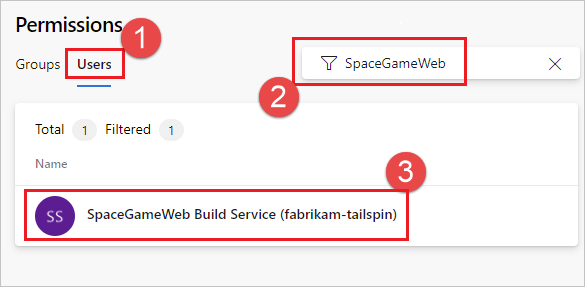

# Build options

::: moniker range="<= tfs-2018"

[!INCLUDE [temp](../includes/concept-rename-note.md)]

::: moniker-end

## Create a work item on failure

If the build pipeline fails, you can automatically create a work item to track getting the problem fixed. You can specify the work item type.

You can also select if you want to assign the work item to the requestor. For example, if this is a CI build, and a team member checks in some code that breaks the build, then the work item is assigned to that person.

**Additional Fields:** You can set the value of work item fields. For example:

| Field | Value |
|---|---|
| ```System.Title``` | ```Build $(Build.BuildNumber) failed``` |
| ```System.Reason``` |  ```Build failure``` |

**Q:** What other work item fields can I set? **A:**  [Work item field index](../../boards/work-items/guidance/work-item-field.md)


## Allow scripts to access the OAuth token

Select this check box if you want to enable your script to use the build pipeline OAuth token.

For an example, see [Use a script to customize your build pipeline](../scripts/powershell.md).


## Default agent pool

::: moniker range="<= tfs-2017"

> **TFS 2017.1 and older**
>
> This section is available under <b>General<b> tab.

::: moniker-end

Select the [pool](../agents/pools-queues.md) that's attached to the pool that contains the agents you want to run this pipeline.

> [!TIP]
> If your code is in Azure Pipelines and you run your builds on Windows, in many cases the simplest option is to use the [Hosted pool](../agents/hosted.md).

## Build job authorization scope

::: moniker range="<= tfs-2017"

> **TFS 2017.1 and older**
>
> This section is available under <b>General<b> tab.

::: moniker-end

Specify the authorization scope for a build job. Select:

* **Project Collection** if the build needs access to multiple projects.
* **Current Project** if you want to restrict this build to have access only the resources in the current project.

::: moniker range=">=azure-devops-2020"

### Scoped build identities

Azure DevOps uses two built-in identities to execute pipelines.

* A **collection-scoped identity**, which has access to all projects in the collection (or organization for Azure DevOps Services)
* A **project-scoped identity**, which has access to a single project

 These identities are allocated permissions necessary to perform build/release execution time activities when calling back to the Azure DevOps system. There are built-in default permissions, and you may also manage your own permissions as needed.
 
The **collection-scoped identity** name has the following format:
- `Project Collection Build Service ({OrgName})`
- For example, if the organization name is `fabrikam-tailspin`, this account has the name `Project Collection Build Service (fabrikam-tailspin)`.
 
The **project-scoped identity** name has the following format:
- `{Project Name} Build Service ({Org Name})`
- For example, if the organization name is `fabrikam-tailspin` and the project name is `SpaceGameWeb`, this account has the name `SpaceGameWeb Build Service (fabrikam-tailspin)`.

By default, the collection-scoped identity is used, unless one of the **Limit job authorization scope to current project** is set, as described in the following section.

### Limit job authorization scope

Azure Pipelines provides several security settings to configure the job authorization scope that your pipelines run with. These settings can be configured at organization level or project level. If one of these settings is enabled at organization level, that setting is grayed out at project level.  These settings are configured in **Project settings** > **Settings**, or **Organization settings** > **Settings**.

:::image type="content" source="media/options/limit-job-authorization-scope.png" alt-text="Limit job authorization scope":::


* [Limit job authorization scope to current project for non-release pipelines](#limit-job-authorization-scope-to-current-project-for-non-release-pipelines)
* [Limit job authorization scope to current project for release pipelines](#limit-job-authorization-scope-to-current-project-for-release-pipelines)
* [Limit job authorization scope to referenced Azure DevOps repositories](#limit-job-authorization-scope-to-referenced-azure-devops-repositories)

### Limit job authorization scope to current project for non-release pipelines

> [!NOTE]
> This setting applies to YAML pipelines and classic build pipelines.
> This setting does not apply to [classic release pipelines](../release/index.md).

Pipelines run with collection scoped access tokens unless **Limit job authorization scope to current project for non-release pipelines** is enabled. With this option enabled, you can reduce the scope of access for all pipelines to the current project. This can impact your pipeline if you are accessing an Azure Repos Git repository in a different project in your organization. 

If your resources are in a different project than your pipeline, and **Limit job authorization scope to current project for non-release pipelines** is enabled, you must grant permission to the build service identity for your pipeline to the second project. For more information, see [Pipeline build options - build job authorization scope](../build/options.md#build-job-authorization-scope).

### Limit job authorization scope to current project for release pipelines

> [!NOTE]
> This setting applies to [classic release pipelines](../release/index.md) only.

Releases run with collection scoped access tokens by default. When **Limit job authorization scope to current project for release pipelines** is enabled, you can reduce the scope of access for all release pipelines to the current project. That means your releases shall fail if they are accessing an Azure Repos Git repository in a different project in your organization. 

If your resources are in a different project than your pipeline, and **Limit job authorization scope to current project for release pipelines** is enabled, you must grant permission to the build service identity for your pipeline to the second project. 

### Limit job authorization scope to referenced Azure DevOps repositories

This setting applies when referencing Azure Repos Git repositories in your pipeline. For more information, see [Azure Repos Git - Limit job authorization scope to referenced Azure DevOps repositories](../repos/azure-repos-git.md#limit-job-authorization-scope-to-referenced-azure-devops-repositories).

### Managing Permissions

One result for setting project-scoped access may be that the project-scoped identity may not have permissions to a resource that the collection-scoped one did have.
 
A solution is to assign permissions directly to the project-scoped identity, if required. These can be assigned cross-project within the same project collection. 

> [!NOTE]
> If you don't see the project-scoped identities, you must first enable **Limit job authorization scope to current project for non-release pipelines** and then run a pipeline in that project.

#### Configure permissions to access another repo in the same project project collection

In this example, the `fabrikam-tailspin/SpaceGameWeb` project-scoped build identity is granted permission to access the `FabrikamFiber` repository in the `fabrikam-tailspin/FabrikamFiber` project.

1. In the **FabrikamFiber** project, navigate to **Project settings**, **Repositories**, **FabrikamFiber**.

    

2.  Choose the **+** icon, start to type in the name **SpaceGameWeb**, and select the **SpaceGameWeb Build Service** account.

    

3. Configure the desired permissions for that user.

    

#### Configure permissions to access other resources in the same project collection

In this example, the `fabrikam-tailspin/SpaceGameWeb` project-scoped build identity is granted permissions to access other resources in the `fabrikam-tailspin/FabrikamFiber` project.

1. In the **FabrikamFiber** project, navigate to **Project settings**, **Permissions**.

    

2.  Choose **Users**, start to type in the name **SpaceGameWeb**, and select the **SpaceGameWeb Build Service** account. If you don't see any search results initially, select **Expand search**.

    

3. Configure the desired permissions for that user.

    

::: moniker-end

## Build (run) number

This documentation has moved to [Build (run) number](../process/run-number.md).
