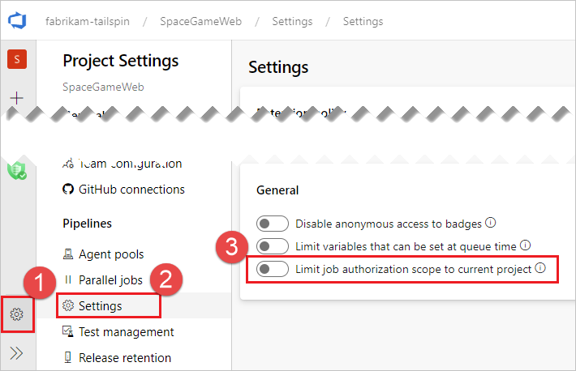

# Build options

::: moniker range="<= tfs-2018"

[!INCLUDE [temp](../_shared/concept-rename-note.md)]

::: moniker-end

## Create a work item on failure

If the build pipeline fails, you can automatically create a work item to track getting the problem fixed. You can specify the work item type.

You can also select if you want to assign the work item to the requestor. For example, if this is a CI build, and a team member checks in some code that breaks the build, then the work item is assigned to that person.

**Additional Fields:** You can set the value of work item fields. For example:

| Field | Value |
|---|---|
| ```System.Title``` | ```Build $(Build.BuildNumber) failed``` |
| ```System.Reason``` |  ```Build failure``` |

**Q:** What other work item fields can I set? **A:**  [Work item field index](../../boards/work-items/guidance/work-item-field.md)


## Allow scripts to access the OAuth token

Select this check box if you want to enable your script to use the build pipeline OAuth token.

For an example, see [Use a script to customize your build pipeline](../scripts/powershell.md).


## Default agent pool

::: moniker range="<= tfs-2017"

> **TFS 2017.1 and older**
>
> This section is available under <b>General<b> tab.

::: moniker-end

Select the [pool](../agents/pools-queues.md) that's attached to the pool that contains the agents you want to run this pipeline.

> [!TIP]
> If your code is in Azure Pipelines and you run your builds on Windows, in many cases the simplest option is to use the [Hosted pool](../agents/hosted.md).

## Build job authorization scope

::: moniker range="<= tfs-2017"

> **TFS 2017.1 and older**
>
> This section is available under <b>General<b> tab.

::: moniker-end

Specify the authorization scope for a build job. Select:

* **Project Collection** if the build needs access to multiple projects.

* **Current Project** if you want to restrict this build to have access only the resources in the current project.

- [Scoped build identities](#scoped-build-identities)
- [Managing Permissions](#managing-permissions)

### Scoped build identities

There are 2 built-in identities that we use to execute pipelines.

* A collection-scoped identity, which has access to all projects in the collection (or organization for Azure DevOps Services)
* A project-scoped identity, which has access to a single project

 These identities are allocated permissions necessary to perform build/release execution time activities when calling back to the Azure DevOps system. There are built-in default permissions, and customers may also manage their own permissions as needed.
 
The collection-scoped identity name has the following format:
- `Project Collection Build Service ({OrgName})
- For example, if the organization name is `fabrikam-tailspin`, this account would has the name `Project Collection Build Service (fabrikam-tailspin)`.
 
The project-scoped identity name has the following format:
- `{Project Name} Build Service ({Org Name})`
- For example, if the organization name is `fabrikam-tailspin` and the project name is `SpaceGameWeb`, this account would has the name `SpaceGameWeb Build Service (fabrikam-tailspin)`.

By default, the collection-scoped identity is used, unless the **Limit job authorization scope to current project** is set in **Project Settings**, **Settings**.



### Managing Permissions

One result for forcing project-scoped access may be that the project-scoped identity may not have permissions to a resource that the collection-scoped one did have.
 
A solution is to assign permissions directly to the project-scoped identity, if required. These can be assigned cross-project within the same project collection. 
 
Example: Giving permissions to the `fabrikam-tailspin/SpaceGameWeb` project-scoped build identity in the `fabrikam-tailspin/FabrikamFiber` project:


## Build (run) number

This documentation has moved to [Build (run) number](../process/run-number.md).
