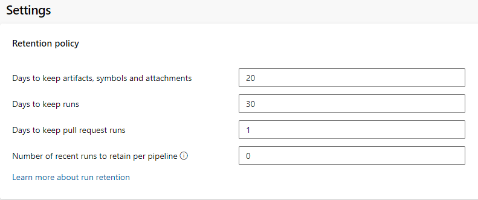

# Pipeline Run Retention

Retaining a pipeline run for longer than the configured [project settings](../policies/retention.md) is handled by the creation of **retention leases**. Temporary retention leases are often created by automatic processes and more permanent leases by manipulating the UI or when Release Management retains artifacts, but they can also be manipulated through the [REST API](/rest/api/azure/devops/build/leases). Here are a some examples of tasks that you can add to your yaml pipeline that will cause a run to retain itself.

## Prerequisites

By default, members of the Contributors, Build Admins, Project Admins, and Release Admins groups can manage retention policies.

## Example: Override a short project-level retention window

In this example, the project is configured to delete pipeline runs after only thirty days.

> [!div class="mx-imgBorder"]
> 

If a pipeline in this project is important and runs should be retained for longer than thirty days, this task ensures the run will be valid for two years by [adding a new retention lease](/rest/api/azure/devops/build/leases/add).

```
- task: PowerShell@2
  condition: and(succeeded(), not(canceled()))
  name: RetainOnSuccess
  displayName: Retain on Success
  inputs:
    failOnStderr: true
    targetType: 'inline'
    script: |
      $contentType = "application/json";
      $headers = @{ Authorization = 'Bearer $(System.AccessToken)' };
      $rawRequest = @{ daysValid = 365 * 2; definitionId = 1; ownerId = 'User:$(Build.RequestedForId)'; protectPipeline = $false; runId = $(Build.BuildId) };
      $request = ConvertTo-Json @($rawRequest);
      $uri = "$(System.CollectionUri)$(System.TeamProject)/_apis/build/retention/leases?api-version=6.0-preview.1";
      Invoke-RestMethod -uri $uri -method POST -Headers $headers -ContentType $contentType -Body $request;
```

#### Question: can a pipeline be retained for _less_ than the configured project values?

No, leases do not work in the reverse. If a project is configured to retain for two years, pipeline runs will not be cleaned up by the system for two years. To delete these runs earlier, manually delete them or use the equivalent REST API.

## Example: Only runs on branches named `releases/*` should be retained for a long time

This is similar to above, only the condition needs to change:

```
- task: PowerShell@2
  condition: and(succeeded(), not(canceled()), startsWith(variables['Build.SourceBranchName'], 'releases/'))
  name: RetainReleaseBuildOnSuccess
  displayName: Retain Release Build on Success
  inputs:
    failOnStderr: true
    targetType: 'inline'
    script: |
      $contentType = "application/json";
      $headers = @{ Authorization = 'Bearer $(System.AccessToken)' };
      $rawRequest = @{ daysValid = 365 * 2; definitionId = 1; ownerId = 'User:$(Build.RequestedForId)'; protectPipeline = $false; runId = $(Build.BuildId) };
      $request = ConvertTo-Json @($rawRequest);
      $uri = "$(System.CollectionUri)$(System.TeamProject)/_apis/build/retention/leases?api-version=6.0-preview.1";
      Invoke-RestMethod -uri $uri -method POST -Headers $headers -ContentType $contentType -Body $request;
```

## Example: Updating the retention window for a multi-stage pipeline based on stage success

Consider a two-stage pipeline that first runs a build and then a release. When successful, the `Build` stage will retain the run for three days, but the project administrator wants a successful `Release` stage to extend the lease to one year.

The `Build` stage can retain the pipeline as in the above examples, but with one addition: by saving the new lease's `Id` in an output variable, the lease can be updated later when the release stage runs.

```
- task: PowerShell@2
  condition: and(succeeded(), not(canceled()))
  name: RetainOnSuccess
  displayName: Retain on Success
  inputs:
  failOnStderr: true
  targetType: 'inline'
  script: |
    $contentType = "application/json";
    $headers = @{ Authorization = 'Bearer $(System.AccessToken)' };
    $rawRequest = @{ daysValid = 3; definitionId = 1; ownerId = 'User:$(Build.RequestedForId)'; protectPipeline = $false; runId = $(Build.BuildId) };
    $request = ConvertTo-Json @($rawRequest);
    $uri = "$(System.CollectionUri)$(System.TeamProject)/_apis/build/retention/leases?api-version=6.0-preview.1";
    $newLease = Invoke-RestMethod -uri $uri -method POST -Headers $headers -ContentType $contentType -Body $request;
    $newLeaseId = $newLease.Value[0].LeaseId
    echo "##vso[task.setvariable variable=newLeaseId;isOutput=true]$newLeaseId";
```

To [_update_ a retention lease](/rest/api/azure/devops/build/leases/update) requires a different REST API call.

```
- stage: Release
  dependsOn: Build
  jobs:
  - job: default
    variables:
    - name: NewLeaseId
      value: $[ stageDependencies.Build.default.outputs['RetainOnSuccess.newLeaseId']]
    steps:
    - task: PowerShell@2
      condition: and(succeeded(), not(canceled()))
      name: RetainOnSuccess
      displayName: Retain on Success
      inputs:
        failOnStderr: true
        targetType: 'inline'
        script: |
          $contentType = "application/json";
          $headers = @{ Authorization = 'Bearer $(System.AccessToken)' };
          $rawRequest = @{ daysValid = 365; leaseId = $newLeaseId; ownerId = 'User:$(Build.RequestedForId)' };
          $request = ConvertTo-Json @($rawRequest);
          $uri = "$(System.CollectionUri)$(System.TeamProject)/_apis/build/retention/leases?api-version=6.0-preview.2";
          Invoke-RestMethod -uri $uri -method PATCH -Headers $headers -ContentType $contentType -Body $request;
```

## Next steps

With these examples, you learned how to use custom pipeline tasks to manage run retention.

You learned how to:

> [!div class="checklist"]
>
> - Override a short retention window
> - Override retention for runs on specific branches
> - Update a retention lease when a run should be retained even longer
