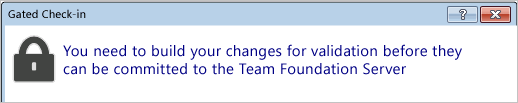

# Specify events that trigger pipelines

[!INCLUDE [version-tfs-2015-rtm](../includes/version-tfs-2015-rtm.md)]

::: moniker range="<= tfs-2018"
[!INCLUDE [temp](../includes/concept-rename-note.md)]
::: moniker-end

Use triggers to run a pipeline automatically. Azure Pipelines supports many types of triggers. Select the appropriate one from the list below based on the type of your pipeline.

## Classic build pipelines or YAML pipelines

Continuous integration (CI) triggers vary based on the type of respository you build in your pipeline.

- [CI triggers in Azure Repos Git](../repos/azure-repos-git.md#ci-triggers)
- [CI triggers in GitHub](../repos/github.md#ci-triggers)

Pull request validation (PR) triggers also vary based on the type of repository.
- [PR triggers in Azure Repos Git](../repos/azure-repos-git.md#pr-triggers)
- [PR triggers in GitHub](../repos/github.md#pr-triggers)

[Comment triggers](../repos/github.md#comment-triggers) are supported only for GitHub repositories.

[Scheduled triggers](scheduled-triggers.md) are independent of the repository and allow you to run a pipeline according to a schedule.

Pipeline triggers in YAML pipelines and build completion triggers in classic build pipelines allow you to trigger one pipeline upon the completion of another.

## Release pipelines


### TFVC Include

Select the version control paths you want to include and exclude. In most cases, you should make sure that these filters are consistent with your TFVC mappings on the [Repository tab](../repos/index.md).

### CI trigger for a remote Git repo or Subversion

You can also select the CI trigger if your code is in a remote Git repo or Subversion. In this case, Azure Pipelines polls for changes at a regular interval. For this to work, Azure Pipelines or your Team Foundation Server must be able to resolve the network address of the service or server where your code is stored. For example if there's a firewall blocking the connection, then the CI trigger won't work.

## PR triggers

### Other Git

Pull request triggers are not available for Other/external Git repos.


<h2 id="gated">TFVC gated check-in</h2>

If your code is in a [Team Foundation version control (TFVC)](../../repos/tfvc/overview.md) repo, use gated check-in to protect against breaking changes.

By default **Use workspace mappings for filters** is selected. Builds are triggered whenever a change is checked in under a path specified in your mappings in the [source repository settings](../repos/index.md).

Otherwise, you can clear this check box and specify the paths in the trigger.

### How it affects your developers

When developers try to check-in, they are prompted to build their changes.



The system then creates a shelveset and builds it.

For details on the gated check-in experience, see [Check in to a folder that is controlled by a gated check-in build pipeline](../../repos/tfvc/check-folder-controlled-by-gated-check-build-process.md).


### Option to run CI builds

By default, CI builds are not run after the gated check-in process is complete and the changes are checked in.

However, if you **do** want CI builds to run after a gated check-in, select the **Run CI triggers for committed changes** check box. When you do this, the build pipeline does not add **&#42;&#42;&#42;NO_CI&#42;&#42;&#42;** to the changeset description. As a result, CI builds that are affected by the check-in are run.


### A few other things to know

* Make sure the folders you include in your trigger are also included in your mappings on the [Repository tab](../repos/index.md).

* You can run gated builds on either a [Microsoft-hosted agent](../agents/hosted.md) or a [self-hosted agent](../agents/agents.md).

::: moniker range=">= azure-devops-2019"

<a name="BuildCompletion"></a>
## Pipeline triggers

Large products have several components that are dependent on each other.
These components are often independently built. When an upstream component (a library, for example) changes, the downstream dependencies have to be rebuilt and revalidated.

In situations like these, add a pipeline trigger to run your pipeline upon the successful completion of the **triggering pipeline**.

# [YAML](#tab/yaml)

To trigger a pipeline upon the completion of another, specify the triggering pipeline as a [pipeline resource](../process/resources.md#resources-pipelines).

> [!NOTE]
> Previously, you may have navigated to the classic editor for your YAML pipeline and configured **build completion triggers** in the UI. While that model still works, it is no longer recommended. The recommended approach is to specify **pipeline triggers** directly within the YAML file. Build completion triggers as defined in the classic editor have various drawbacks, which have now been addressed in pipeline triggers. For instance, there is no way to trigger a pipeline on the same branch as that of the triggering pipeline using build completion triggers.


```yaml
# this is being defined in app-ci pipeline
resources:
  pipelines:
  - pipeline: securitylib   # Name of the pipeline resource
    source: security-lib-ci # Name of the triggering pipeline
    trigger: 
      branches:
      - releases/*
      - master
```

In this example, `pipeline: securitylib` specifies the name of the pipeline resource (used when referring to the pipeline resource from other parts of the pipeline, such as pipeline resource variables), 
and `source: security-lib-ci` specifies the name of the triggering pipeline. You can retrieve a pipeline's name from the Azure DevOps portal in several places, such as the [Pipelines landing page](../get-started/multi-stage-pipelines-experience.md#pipelines-landing-page). To configure the pipeline name 
setting, edit the YAML pipeline, choose **Triggers** from the settings menu, and navigate to the **YAML** pane.


> [!NOTE] 
> If the triggering pipeline is in another Azure DevOps project, you must specify the
> project name using `project: OtherProjectName`. If the triggering pipeline is in another
> Azure DevOps organization, you must also create a 
> [service connection](../library/service-endpoints.md) to that project and reference it 
> in your pipeline resource. For more information, see [pipeline resource](../process/resources.md#resources-pipelines).

In the above example, we have two pipelines - `app-ci` and `security-lib-ci`. We want the `app-ci` pipeline to run automatically every time a new version of the security library is built in master or a release branch.

Similar to CI triggers, you can specify the branches to include or exclude:

```yaml
resources:
  pipelines:
  - pipeline: securitylib
    source: security-lib-ci
    trigger: 
      branches:
        include: 
        - releases/*
        exclude:
        - releases/old*
```

If the triggering pipeline and the triggered pipeline use the same repository, then both the pipelines will run using the same commit when one triggers the other. This is helpful if your first pipeline builds the code, and the second pipeline tests it. However, if the two pipelines use different repositories, then the triggered pipeline will use the latest version of the code from its default branch.

When you specify both CI triggers and pipeline triggers, you can expect new runs to be started every time (a) an update is made to the repository and (b) a run of the upstream pipeline is completed. Consider an example of a pipeline `B` that depends on `A`. Let us also assume that both of these pipelines use the same repository for the source code, and that both of them also have CI triggers configured. When you push an update to the repository, then:

- A new run of `A` is started.
- At the same time, a new run of `B` is started. This run will consume the previously produced artifacts from `A`.
- As `A` completes, it will trigger another run of `B`.

To prevent triggering two runs of `B` in this example, you must remove its CI trigger or pipeline trigger.

# [Classic](#tab/classic)

In the classic editor, pipeline triggers are called **build completion triggers**. You can select any other build in the same project to be the triggering pipeline.

After you add a **build completion** trigger, select the **triggering build**. If the triggering build is sourced from a Git repo, you can also specify **branch filters**. If you want to use wildcard characters, then type the branch specification (for example, `features/modules/*`) and then press Enter.

> [!NOTE]
> Keep in mind that in some cases, a single [multi-job build](../process/phases.md) could meet your needs.
> However, a build completion trigger is useful if your requirements include different configuration settings, options, or a different team to own the dependent pipeline.

### Download artifacts from the triggering build

In many cases, you'll want to download artifacts from the triggering build. To do this:

1. Edit your build pipeline.

1. Add the **Download Build Artifacts** task to one of your jobs under **Tasks**.

1. For **Download artifacts produced by**, select **Specific build**.

1. Select the team **Project** that contains the triggering build pipeline.

1. Select the triggering **Build pipeline**.

1. Select **When appropriate, download artifacts from the triggering build**.

1. Even though you specified that you want to download artifacts from the triggering build, you must still select a value for **Build**. The option you choose here determines which build will be the source of the artifacts whenever your triggered build is run because of any other reason than `BuildCompletion` (e.g. `Manual`, `IndividualCI`, `Schedule`, and so on).

1. Specify the **Artifact name** and make sure it matches the name of the artifact published by the triggering build.

1. Specify the **Destination directory** to which you want to download the artifacts. For example: `$(Build.BinariesDirectory)`

---

::: moniker-end

## Wildcards

When specifying a branch or tag, you may use an exact name or a wildcard.
Wildcards patterns allow `*` to match zero or more characters and `?` to match a single character.


* If you start your pattern with `*` in a YAML pipeline, you must wrap the pattern in quotes, like `"*-releases"`.
* For branches and tags:
  * A wildcard may appear anywhere in the pattern.
* For paths:
  * You may include `*` as the final character, but it doesn't do anything differently from specifying the directory name by itself.
  * You may **not** include `*` in the middle of a path filter, and you may not use `?`.

```yaml
trigger:
  branches:
    include:
    - master
    - releases/*
    - feature/*
    exclude:
    - releases/old*
    - feature/*-working
  paths:
    include:
    - '*' # same as '/' for the repository root
    exclude:
    - 'docs/*' # same as 'docs/'
```

## Q & A

<!-- BEGINSECTION class="md-qanda" -->


### How do I protect my Git codebase from build breaks?

If your code is in a Git repo on Azure Repos or Team Foundation Server, you can create a branch policy that runs your build. See [Improve code quality with branch policies](../../repos/git/branch-policies.md). This option is also available for GitHub repos. See [About protected branches](https://help.github.com/en/articles/about-protected-branches).

::: moniker range="azure-devops"

### I defined a schedule in the YAML file. But it didn't run. What happened?

* Check the next few runs that Azure Pipelines has scheduled for your pipeline. You can find these by selecting the **Scheduled runs** action in your pipeline. You need to have the **Multi-stage pipelines** preview feature enabled to see this action. The list is filtered down to only show you the upcoming few runs over the next few days. If this does not meet your expectation, it is probably the case that you have mistyped your cron schedule, or you do not have the schedule defined in the correct branch. Read the topic above to understand how to configure schedules. Reevaluate your cron syntax. All the times for cron schedules are in UTC.

* If you have any schedules defined in the UI, then your YAML schedules are not honored. Ensure that you do not have any UI schedules.

* There is a limit on the number of runs you can schedule for a pipeline. Read more about [limits](#limits).

* If there are no changes to your code, they Azure Pipelines may not start new runs. Learn how to [override](#always) this behavior.

### Schedules work for one branch but not the other.

Schedules are defined in YAML files, and these files are associated with branches. If you want a pipeline to be scheduled for a particular branch, say features/X, then make sure that the YAML file in that branch has the cron schedule defined in it, and that it has the correct branch inclusions for the schedule. The YAML file in features/X branch should have the following in this example: 
 
```yaml
schedules: 
- cron: "0 12 * * 0"   # replace with your schedule 
  branches: 
    include: 
    - features/X  
```

### My build pipeline is using yaml file from branch2 even though I set it to use from branch1. 

Pipelines are not associated with a branch. They are associated with the repositories they build, and with the location of the YAML file relative to the root of that repository. However, every time a pipeline runs, it uses the YAML file and the content from a specific branch. That branch is determined based on where the change is pushed to (in the case of CI builds), where the PR is targeted to (in the case of PR builds), or what you manually specify (in the case of manual runs). Each branch's YAML file independently determines whether the pipeline should be scheduled for that branch.  

::: moniker-end

::: moniker range=">= azure-devops-2019"

### The YAML file in my branch is different than the YAML file in my master branch, which one is used?

* For [CI triggers](#ci-triggers), the YAML file that is in the branch you are pushing is evaluated to see if a CI build should be run.
* For [PR triggers](#pr-triggers), the YAML file that is in the source branch of the PR is evaluated to see if a PR build should be run.
* For [Scheduled triggers](#scheduled-triggers), the YAML file that is in the branch is used to set the scheduled triggers for that branch.

### My CI or PR trigger doesn't seem to fire

Ensure that your CI or PR trigger isn't being overridden by the pipeline settings.

::: moniker-end

[!INCLUDE [temp](../includes/qa-agents.md)]

::: moniker range="< azure-devops"
[!INCLUDE [temp](../includes/qa-versions.md)]
::: moniker-end


<!-- ENDSECTION -->
