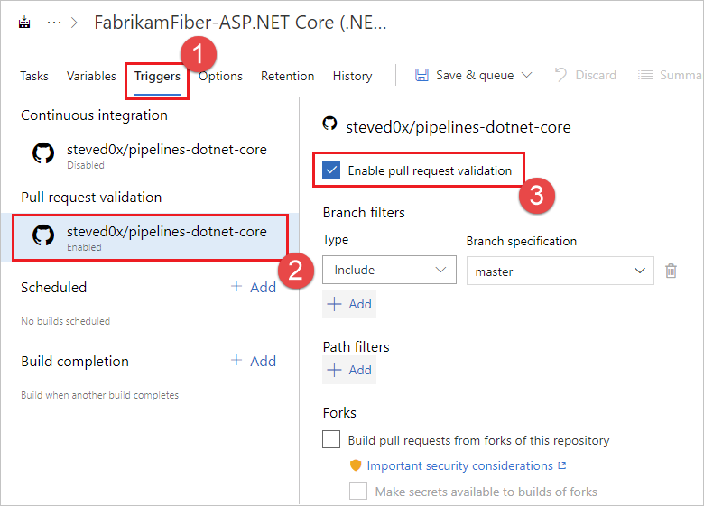
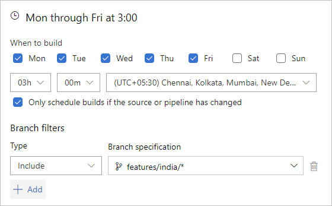
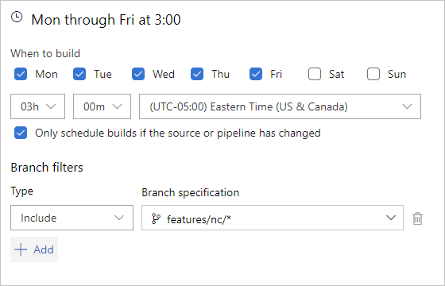
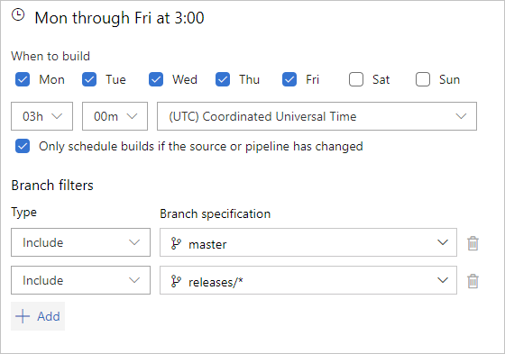
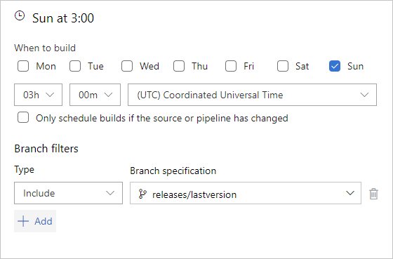
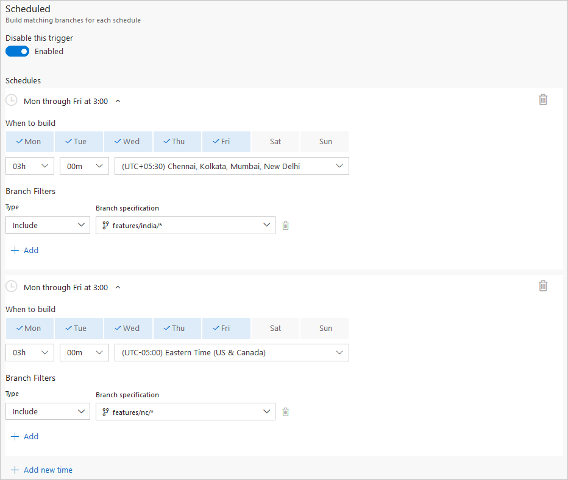
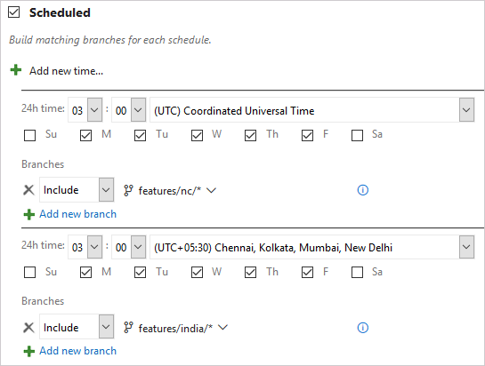
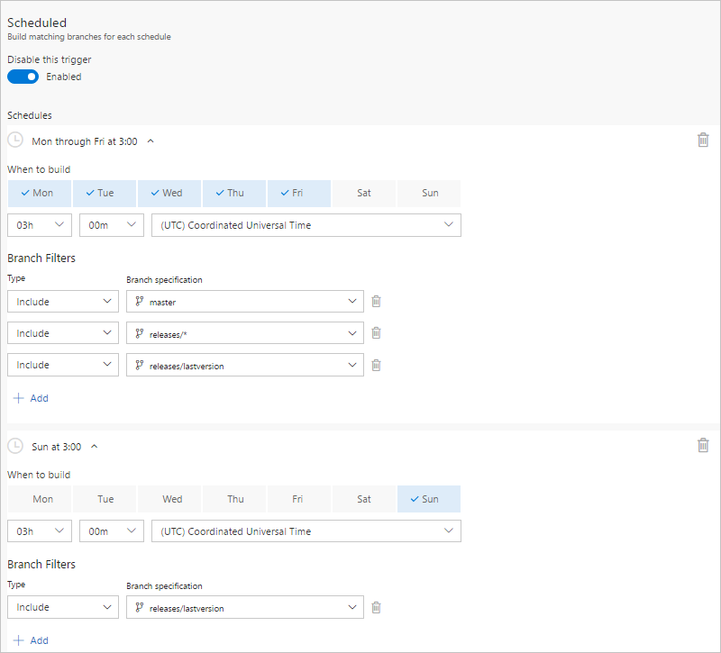
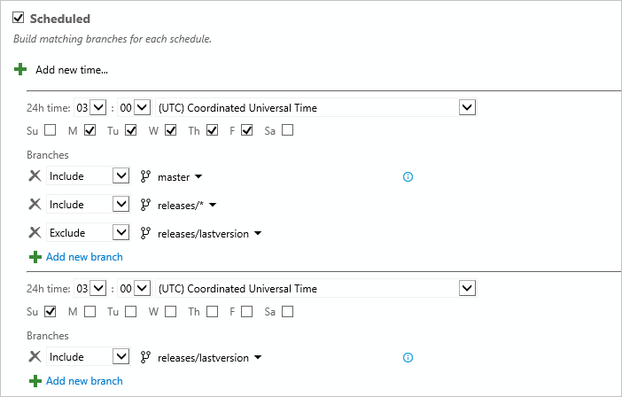

# Build pipeline triggers

[!INCLUDE [version-tfs-2015-rtm](../_shared/version-tfs-2015-rtm.md)]

::: moniker range="<= tfs-2018"
[!INCLUDE [temp](../_shared/concept-rename-note.md)]
::: moniker-end

On the Triggers tab, you specify the events that trigger the build. You can use the same build pipeline for both CI and scheduled builds.

<a name="ci"></a>
## CI triggers

Continuous integration (CI) triggers cause a build to run whenever a push is made to the specified branches or a specified tag is pushed.

# [YAML](#tab/yaml)

::: moniker range="azure-devops"

YAML builds are configured by default with a CI trigger on all branches.

::: moniker-end

::: moniker range="azure-devops-2019"

YAML builds are configured by default with a CI trigger on all branches.

::: moniker-end

::: moniker range=">= azure-devops-2019"

### Branches

You can control which branches get CI triggers with a simple syntax:

```yaml
trigger:
- master
- releases/*
```

You can specify the full name of the branch (for example, `master`) or a wildcard (for example, `releases/*`).
See [Wildcards](#wildcards) for information on the wildcard syntax.
Note: you cannot use [variables](../process/variables.md) in triggers, as variables are evaluated at runtime (after the trigger has fired).

You can specify branches to include and exclude. For example:

```yaml
# specific branch build
trigger:
  branches:
    include:
    - master
    - releases/*
    exclude:
    - releases/old*
```

In addition to specifying branch names in the `branches` lists, you can also configure triggers based on tags by using the following format:

```yaml
trigger:
  branches:
    include:
      refs/tags/{tagname}
    exclude:
      refs/tags/{othertagname}
```

If you don't specify any triggers, the default is as if you wrote:

```yaml
trigger:
  branches:
    include:
    - '*'  # must quote since "*" is a YAML reserved character; we want a string
```

>[!IMPORTANT]
>When you specify a trigger, it replaces the default implicit trigger, and only pushes to branches that are explicitly configured to be included will trigger a pipeline. Includes are processed first, and then excludes are removed from that list. If you specify an exclude but don't specify any includes, nothing will trigger.

### Batching CI builds

If you have a lot of team members uploading changes often, you may want to reduce the number of builds you're running.
If you set `batch` to `true`, when a build is running, the system waits until the build is completed, then queues another build of all changes that have not yet been built.

```yaml
# specific branch build with batching
trigger:
  batch: true
  branches:
    include:
    - master
```

### Paths

You can specify file paths to include or exclude.
Note that the [wildcard syntax](#wildcards) is different between branches/tags and file paths.

```yaml
# specific path build
trigger:
  branches:
    include:
    - master
    - releases/*
  paths:
    include:
    - docs/*
    exclude:
    - docs/README.md
```

When you specify paths, you also need to explicitly specify branches to trigger on. 

::: moniker-end

::: moniker range="azure-devops"

### Tags

In addition to specifying tags in the `branches` lists as covered in the previous section, you can directly specify tags to include or exclude:

```yaml
# specific branch build
trigger:
  tags:
    include:
    - v2.*
    exclude:
    - v2.0
```

If you don't specify any tag triggers, then by default, tags will not trigger pipelines.

> [!NOTE]
> If you specify tags in combination with branch filters that include file paths, the trigger will fire if the branch filter is satisfied and either the tag or the path filter is satisfied.

::: moniker-end

::: moniker range=">= azure-devops-2019"

### Opting out of CI builds

#### Disabling the CI trigger

You can opt out of CI builds entirely by specifying `trigger: none`.

```yaml
# A pipeline with no CI trigger
trigger: none
```

>[!IMPORTANT]
>When you push a change to a branch, the YAML file in that branch is evaluated to determine if a CI build should be run.

For more information, see [Triggers](../yaml-schema.md#triggers) in the [YAML schema](../yaml-schema.md).

::: moniker-end

#### Skipping CI for individual commits

::: moniker range="<= azure-devops-2019"

You can also tell Azure Pipelines to skip running a pipeline that a commit would normally trigger. Just include `***NO_CI***` in the commit message of the HEAD commit and Azure Pipelines will skip running CI. This is supported for commits to Azure Repos Git and GitHub.

::: moniker-end

::: moniker range="> azure-devops-2019"

You can also tell Azure Pipelines to skip running a pipeline that a commit would normally trigger. Just include `[skip ci]` in the commit message or description of the HEAD commit and Azure Pipelines will skip running CI. You can also use any of the variations below. This is supported for commits to Azure Repos Git, Bitbucket Cloud, GitHub, and GitHub Enterprise Server.

- `[skip ci]` or `[ci skip]`
- `skip-checks: true` or `skip-checks:true`
- `[skip azurepipelines]` or `[azurepipelines skip]`
- `[skip azpipelines]` or `[azpipelines skip]`
- `[skip azp]` or `[azp skip]`
- `***NO_CI***`

::: moniker-end

::: moniker range="< azure-devops-2019"
YAML builds are not yet available on TFS.
::: moniker-end

# [Classic](#tab/classic)

Select this trigger if you want the build to run whenever someone checks in code.

### Batch changes

Select this check box if you have many team members uploading changes often and you want to reduce the number of builds you are running. If you select this option, when a build is running, the system waits until the build is completed and then queues another build of all changes that have not yet been built.

> You can batch changes when your code is in Git in the project or on GitHub. This option is not available if your code is in a remote Git repo or in Subversion.

### Git filters

If your repository is Git then you can specify the branches where you want to trigger builds. If you want to use wildcard characters, then type the branch specification (for example, `features/modules/*`) and then press Enter.

#### Path filters in Azure Pipelines and Team Foundation Services (TFS)

If your Git repo is in Azure Repos or TFS, you can also specify path filters to reduce the set of files that you want to trigger a build.

 > **Tips:**
 * If you don't set path filters, then the root folder of the repo is implicitly included by default.
 * When you add an explicit path filter, the implicit include of the root folder is removed. So make sure to explicitly include all folders that your build needs.
 * If you exclude a path, you cannot also include it unless you qualify it to a deeper folder. For example if you exclude _/tools_ then you could include _/tools/trigger-runs-on-these_
 * The order of path filters doesn't matter.

#### Example

For example, you want your build to be triggered by changes in master and most, but not all, of your feature branches. You also don't want builds to be triggered by changes to files in the tools folder.

::: moniker range=">= tfs-2017"

**Azure Pipelines, TFS 2017.3 and newer**


::: moniker-end

::: moniker range="<= tfs-2017"

**TFS 2017.1 and older versions**


::: moniker-end

### TFVC Include

Select the version control paths you want to include and exclude. In most cases, you should make sure that these filters are consistent with your TFVC mappings on the [Repository tab](repository.md).

### CI trigger for a remote Git repo or Subversion

You can also select the CI trigger if your code is in a remote Git repo or Subversion. In this case we poll for changes at a regular interval. For this to work, Azure Pipelines or your Team Foundation Server must be able to resolve the network address of the service or server where your code is stored. For example if there's a firewall blocking the connection, then the CI trigger won't work.

---

## PR triggers

Pull request (PR) triggers cause a build to run whenever a pull request is opened with one of the specified target branches,
or when changes are pushed to such a pull request.

# [YAML](#tab/yaml)

::: moniker range="azure-devops"

> [!IMPORTANT]
> YAML PR triggers are only supported in GitHub and Bitbucket Cloud. If you are using Azure Repos Git, you can configure a [branch policy for build validation](../../repos/git/branch-policies.md#build-validation) in order to trigger your build pipeline for validation.

::: moniker-end

::: moniker range="azure-devops-2019"

> [!NOTE]
> New pipelines automatically override YAML PR triggers with a setting in the UI.
> To opt into YAML-based control, you need to disable this setting on the **Triggers** tab in the UI.

> [!IMPORTANT]
> YAML PR triggers are only supported in GitHub. If you are using Azure Repos Git, you can configure a [branch policy for build validation](../../repos/git/branch-policies.md#build-validation) in order to trigger your build pipeline for validation.

::: moniker-end

::: moniker range=">= azure-devops-2019"

You can specify the target branches for your pull request builds.
For example, to run pull request builds only for source branches in a PR that
target `master` and `releases/*`, you can use the following `pr` trigger. 
This configuration triggers a build upon creation of any pull request where the target branch 
is set to the `master` or `releases/*` branches. 
The pipeline also triggers once with any commit coming into the source branch when the target branch 
is set to be `master` or `releases/*`, while the pull request is active.


```yaml
pr:
- master
- releases/*
```

PR triggers will fire for these branches once the pipeline YAML file has reached that branch.
For example, if you add `master` in a topic branch, PRs to `master` will not start automatically building.
When the changes from the topic branch are merged into `master`, then the trigger will be fully configured.

If no `pr` triggers appear in your YAML file, pull request builds are automatically enabled for all 
branches, as if you wrote the following `pr` trigger. This configuration triggers a build when any 
pull request is created, and when commits come into the source branch of any active pull request.

```yaml
pr:
  branches:
    include:
    - '*'  # must quote since "*" is a YAML reserved character; we want a string
```

>[!IMPORTANT]
>When you specify a `pr` trigger, it replaces the default implicit `pr` trigger, and only pushes to branches that are explicitly configured to be included will trigger a pipeline. Includes are processed first, and then excludes are removed from that list. If you specify an exclude but don't specify any includes, nothing will trigger.

You can specify the full name of the branch (for example, `master`) or a wildcard (for example, `releases/*`).
See [Wildcards](#wildcards) for information on the wildcard syntax.

You can specify branches to include and exclude. For example:

```yaml
# specific branch build
pr:
  branches:
    include:
    - master
    - releases/*
    exclude:
    - releases/old*
```

You can specify file paths to include or exclude. For example:

```yaml
# specific path build
pr:
  branches:
    include:
    - master
    - releases/*
  paths:
    include:
    - docs/*
    exclude:
    - docs/README.md
```

Note that the [wildcard syntax](#wildcards) is different between branches/tags and file paths.

::: moniker-end

::: moniker range="azure-devops"

You can specify whether additional pushes to a PR should cancel in-progress runs for the same PR. The default is `true`.

```yaml
# auto cancel false
pr:
  autoCancel: false
  branches:
    include:
    - master
```

You can opt out of pull request builds entirely by specifying `pr: none`.

```yaml
# no PR builds
pr: none
```

::: moniker-end

::: moniker range=">= azure-devops-2019"

>[!IMPORTANT]
>When you create a pull request, or push a change to the source branch of a PR, the YAML file in the source branch is evaluated to determine if a PR build should be run.

For more information, see [PR trigger](../yaml-schema.md#pr-trigger) in the [YAML schema](../yaml-schema.md).

::: moniker-end

::: moniker range="< azure-devops-2019"
YAML builds are not yet available on TFS.
::: moniker-end

# [Classic](#tab/classic)

### GitHub, GitHub Enterprise Server, Subversion, and Bitbucket Cloud

Select the **Pull request validation** trigger and check the **Enable pull request validation** check box to enable builds on pull requests.



You can specify branches to include and exclude.
Select a branch name from the drop-down menu and select **Include** or **Exclude** as appropriate.
For included branches, a build will be triggered on each push to a pull request targeting that branch.

For GitHub repos, you can choose whether or not to build pull requests from forks. There are [security implications](../repos/github.md?#validate-contributions-from-forks) to enabling this feature that you should understand before selecting it.
If you choose to build fork pull requests, you may also choose whether or not to expose secrets (like secret variables and secure files) to fork pull request builds.

### Azure Repos Git

If your Git repo is hosted in Azure Repos, there won't be a **Pull request validation** trigger on the **Triggers** page. To enable pull request validation in Azure Git Repos, navigate to the branch policies for the desired branch, and configure the [Build validation policy](../../repos/git/branch-policies.md#build-validation) for that branch. For more information, see [Configure branch policies](../../repos/git/branch-policies.md).

### Other Git

Pull request triggers are not available for Other/external Git repos.

---

::: moniker range="azure-devops"

### Trigger builds using GitHub pull request comments

If your team uses GitHub pull requests, you can manually trigger pipelines using pull request comments. See details [here](../repos/github.md#comment-triggers).

::: moniker-end

## Scheduled triggers

# [YAML](#tab/yaml)

::: moniker range="> azure-devops-2019"

Scheduled triggers cause a build to run on a schedule defined using [cron syntax](#supported-cron-syntax).

```yaml
schedules:
- cron: string # cron syntax defining a schedule
  displayName: string # friendly name given to a specific schedule
  branches:
    include: [ string ] # which branches the schedule applies to
    exclude: [ string ] # which branches to exclude from the schedule
  always: boolean # whether to always run the pipeline or only if there have been source code changes since the last run. The default is false.
```

In the following example, two schedules are defined.

```yaml
schedules:
- cron: "0 0 * * *"
  displayName: Daily midnight build
  branches:
    include:
    - master
    - releases/*
    exclude:
    - releases/ancient/*
- cron: "0 12 * * 0"
  displayName: Weekly Sunday build
  branches:
    include:
    - releases/*
  always: true
```

The first schedule, **Daily midnight build**, runs a pipeline at midnight every day, but only if the code has changed since the last run, for `master` and all `releases/*` branches, except those under `releases/ancient/*`.

The second schedule, **Weekly Sunday build**, runs a pipeline at noon on Sundays, whether the code has changed or not since the last run, for all `releases/*` branches.

> [!NOTE]
> The time zone for cron schedules is UTC, so in these examples, the midnight build and the noon build are at midnight and noon in UTC.

The schedules are read and updated when the following events occur, and schedules get 
added to the scheduling database for the current branch, if the branch criteria is satisfied.

* The yaml file is created or updated
* A pipeline is created or updated
* A new branch is created

### Supported cron syntax

Each cron expression is a space-delimited expression with five entries in the following order.

```
mm HH DD MM DW
 \  \  \  \  \__ Days of week
  \  \  \  \____ Months
   \  \  \______ Days
    \  \________ Hours
     \__________ Minutes
```

Field        | Accepted values
-------------|----------------
Minutes      | 0 through 59
Hours        | 0 though 23
Days         | 1 through 31
Months       | 1 through 12, full English names, first three letters of English names
Days of week | 0 through 6 (starting with Sunday), full English names, first three letters of English names

Values can be in the following formats.

Format          | Example          | Description
----------------|------------------|------------
Wildcard        | `*`              | Matches all values for this field
Single value    | `5`              | Specifies a single value for this field
Comma delimited | `3,5,6`          | Specifies multiple values for this field. Multiple formats can be combined, like `1,3-6`
Ranges          | `1-3`            | The inclusive range of values for this field
Intervals       | `*/4` or `1-5/2` | Intervals to match for this field, such as every 4th value or the range 1-5 with a step interval of 2

Example | Cron expression
--------|----------------
Build every Monday, Wednesday, and Friday at 6:00 PM | `0 18 * * Mon,Wed,Fri`, `0 18 * * 1,3,5`, `0 18 * * Mon,Wed,Fri`, or `0 18 * * 1-5/2`
Build every 6 hours | `0 0,6,12,18 * * *`, `0 */6 * * *`, or `0 0-18/6 * * *`
Build every 6 hours starting at 9:00 AM | `0 9,15,21 * * *` or `0 9-21/6 * * *`

For more information on supported formats, see [Crontab Expression](https://github.com/atifaziz/NCrontab/wiki/Crontab-Expression).

> [!NOTE]
> Each cron schedule has a maximum of 100 pipeline runs per week. If you need more, 
> you can split your cron schedule into multiple cron schedules that each result in 
> 100 or less pipeline runs per week.

### Migrating from the classic editor

The following examples show you how to migrate your schedules from the classic editor to YAML.

* [Example: Nightly build of Git repo in multiple time zones](#example-nightly-build-of-git-repo-in-multiple-time-zones)
* [Example: Nightly build with different frequencies](#example-nightly-build-with-different-frequencies)

#### Example: Nightly build of Git repo in multiple time zones

In this example, the classic editor scheduled trigger has two entries, producing the following builds.

* Every Monday - Friday at 3:00 AM (UTC + 5:30 time zone), build branches that meet the `features/india/*` branch filter criteria

    

* Every Monday - Friday at 3:00 AM (UTC - 5:00 time zone), build branches that meet the `features/nc/*` branch filter criteria

    

The equivalent YAML scheduled trigger is:

```yaml
schedules:
- cron: "30 21 * * Sun-Thu"
  displayName: M-F 3:00 AM (UTC + 5:30) India daily build
  branches:
    include:
    - /features/india/*
- cron: "0 8 * * Mon-Fri"
  displayName: M-F 3:00 AM (UTC - 5) NC daily build
  branches:
    include:
    - /features/nc/*
```

In the first schedule, **M-F 3:00 AM (UTC + 5:30) India daily build**, the cron syntax (`mm HH DD MM DW`) is `30 21 * * Sun-Thu`.

* Minutes and Hours - `30 21` - This maps to `21:30 UTC`, or `9:30 PM UTC`. Since the specified time zone in the classic editor is **UTC + 5:30**, we need to subtract 5 hours and 30 minutes from the desired build time of 3:00 AM to arrive at the desired UTC time to specify for the YAML trigger.
* Days and Months are specified as wildcards since this schedule doesn't specify to run only on certain days of the month, or on a specific month. 
* Days of the week - `Sun-Thu` - because of the timezone conversion, for our builds to run at 3:00 AM in the UTC + 5:30 India time zone, we need to specify starting them the previous day in UTC time. We could also specify the days of the week as `0-4` or `0,1,2,3,4`.

In the second schedule, **M-F 3:00 AM (UTC - 5) NC daily build**, the cron syntax is `0 8 * * Mon-Fri`.

* Minutes and Hours - `0 8` - This maps to `8:00 AM UTC`. Since the specified time zone in the classic editor is **UTC - 5:00**, we need to add 5 hours from the desired build time of 3:00 AM to arrive at the desired UTC time to specify for the YAML trigger.
* Days and Months are specified as wildcards since this schedule doesn't specify to run only on certain days of the month, or on a specific month. 
* Days of the week - `Mon-Fri` - Because our timezone conversions don't span multiple days of the week for our desired schedule, we don't need to do any conversion here. We could also specify the days of the week as `1-5` or `1,2,3,4,5`.

> [!IMPORTANT]
> The UTC time zones in YAML scheduled triggers don't account for daylight savings time.

#### Example: Nightly build with different frequencies

In this example, the classic editor scheduled trigger has two entries, producing the following builds.

* Every Monday - Friday at 3:00 AM UTC, build branches that meet the `master` and `releases/*` branch filter criteria

    

* Every Sunday at 3:00 AM UTC, build the `releases/lastversion` branch, even if the source or pipeline hasn't changed

    

The equivalent YAML scheduled trigger is:

```yaml
schedules:
- cron: "0 3 * * Mon-Fri"
  displayName: M-F 3:00 AM (UTC) daily build
  branches:
    include:
    - master
    - /releases/*
- cron: "0 3 * * Sun"
  displayName: Sunday 3:00 AM (UTC) weekly latest version build
  branches:
    include:
    - /releases/lastversion
  always: true
```

In the first schedule, **M-F 3:00 AM (UTC) daily build**, the cron syntax is `0 3 * * Mon-Fri`.

* Minutes and Hours - `0 3` - This maps to `3:00 AM UTC`. Since the specified time zone in the classic editor is **UTC**, we don't need to do any time zone conversions.
* Days and Months are specified as wildcards since this schedule doesn't specify to run only on certain days of the month, or on a specific month. 
* Days of the week - `Mon-Fri` - because there is no timezone conversion, the days of the week map directly from the classic editor schedule. We could also specify the days of the week as `1,2,3,4,5`.

In the second schedule, **Sunday 3:00 AM (UTC) weekly latest version build**, the cron syntax is `0 3 * * Sun`.

* Minutes and Hours - `0 3` - This maps to `3:00 AM UTC`. Since the specified time zone in the classic editor is **UTC**, we don't need to do any time zone conversions.
* Days and Months are specified as wildcards since this schedule doesn't specify to run only on certain days of the month, or on a specific month. 
* Days of the week - `Sun` - Because our timezone conversions don't span multiple days of the week for our desired schedule, we don't need to do any conversion here. We could also specify the days of the week as `0`.
* We also specify `always: true` since this build is scheduled to run whether or not the source code has been updated.

::: moniker-end

::: moniker range="azure-devops-2019"

Scheduled builds are not yet supported in YAML syntax.
After you create your YAML build pipeline, you can use pipeline settings to specify a scheduled trigger.

::: moniker-end

::: moniker range="< azure-devops-2019"

YAML builds are not yet available on TFS.

::: moniker-end

# [Classic](#tab/classic)

::: moniker range="> azure-devops-2019"

> [!IMPORTANT]
> Scheduled triggers are moving from the classic editor to YAML. 
> Existing schedules defined in the classic editor will be honored, but
> can't be updated, and new schedules can't be defined in the classic editor.
> To update your existing classic editor schedules, migrate them to 
> [YAML scheduled triggers](triggers.md?tabs=yaml#scheduled-triggers) 
> and update them there. See [Migrating from the classic editor](triggers.md?tabs=yaml#migrating-from-the-classic-editor) for migration guidance.

::: moniker-end

Select the days and times when you want to run the build.

If your repository is Azure Repos Git, GitHub, or Other Git, then you can also specify branches to include and exclude. If you want to use wildcard characters, then type the branch specification (for example, `features/modules/*`) and then press Enter.


### Example: Nightly build of Git repo in multiple time zones

::: moniker range=">= azure-devops-2019"

**Azure Pipelines and Azure DevOps 2019 Server**

In this example, the classic editor scheduled trigger has two entries, producing the following builds.

* Every Monday - Friday at 3:00 AM (UTC + 5:30 time zone), build branches that meet the `features/india/*` branch filter criteria

    

* Every Monday - Friday at 3:00 AM (UTC - 5:00 time zone), build branches that meet the `features/nc/*` branch filter criteria

    

::: moniker-end

::: moniker range=">= tfs-2017 <= tfs-2018"

**TFS 2017.3 through TFS 2018**



::: moniker-end

::: moniker range="<= tfs-2017"

**TFS 2017.1 and older versions**



::: moniker-end

### Example: Nightly build with different frequencies

::: moniker range=">=azure-devops-2019"

**Azure Pipelines and Azure DevOps 2019 Server**

In this example, the classic editor scheduled trigger has two entries, producing the following builds.

* Every Monday - Friday at 3:00 AM UTC, build branches that meet the `master` and `releases/*` branch filter criteria

    

* Every Sunday at 3:00 AM UTC, build the `releases/lastversion` branch, even if the source or pipeline hasn't changed

    

::: moniker-end

::: moniker range=">= tfs-2017 <= tfs-2018"

**TFS 2017.3 through TFS 2018**



::: moniker-end

::: moniker range="<= tfs-2017"

**TFS 2017.1 and older versions**



::: moniker-end

---

<h2 id="gated">TFVC gated check-in</h2>

If your code is in a [Team Foundation version control (TFVC)](../../repos/tfvc/overview.md) repo, use gated check-in to protect against breaking changes.

By default **Use workspace mappings for filters** is selected. Builds are triggered whenever a change is checked in under a path specified in your mappings in the [source repository settings](repository.md).

Otherwise, you can clear this check box and specify the paths in the trigger.

### How it affects your developers

When developers try to check-in, they are prompted to build their changes.


The system then creates a shelveset and builds it.

For details on the gated check-in experience, see [Check in to a folder that is controlled by a gated check-in build pipeline](../../repos/tfvc/check-folder-controlled-by-gated-check-build-process.md).


### Option to run CI builds

By default, CI builds are not run after the gated check-in process is complete and the changes are checked in.

However, if you **do** want CI builds to run after a gated check-in, select the **Run CI triggers for committed changes** check box. When you do this, the build pipeline does not add **&#42;&#42;&#42;NO_CI&#42;&#42;&#42;** to the changeset description. As a result, CI builds that are affected by the check-in are run.


### A few other things to know

* Make sure the folders you include in your trigger are also included in your mappings on the [Repository tab](repository.md).

* You can run gated builds on either a [Microsoft-hosted agent](../agents/hosted.md) or a [self-hosted agent](../agents/agents.md).

::: moniker range=">= azure-devops-2019"

<a name="BuildCompletion"></a>
## Build completion triggers

# [YAML](#tab/yaml)

Build completion triggers are not yet supported in YAML syntax.
After you create your YAML build pipeline, you can use the classic editor to specify a build completion trigger.

# [Classic](#tab/classic)

Large products have several components that are dependent on each other.
These components are often independently built. When an upstream component (a library, for example) changes, the downstream dependencies have to be rebuilt and revalidated.

In situations like these, add a build completion trigger to run your build upon the successful completion of the **triggering build**. You can select any other build in the same project.

After you add a **build completion** trigger, select the **triggering build**. If the triggering build is sourced from a Git repo, you can also specify **branch filters**. If you want to use wildcard characters, then type the branch specification (for example, `features/modules/*`) and then press Enter.

> [!NOTE]
> Keep in mind that in some cases, a single [multi-job build](../process/phases.md) could meet your needs.
> However, a build completion trigger is useful if your requirements include different configuration settings, options, or a different team to own the dependent pipeline.

### Download artifacts from the triggering build

In many cases, you'll want to download artifacts from the triggering build. To do this:

1. Edit your build pipeline.

1. Add the **Download Build Artifacts** task to one of your jobs under **Tasks**.

1. For **Download artifacts produced by**, select **Specific build**.

1. Select the team **Project** that contains the triggering build pipeline.

1. Select the triggering **Build pipeline**.

1. Select **When appropriate, download artifacts from the triggering build**.

1. Even though you specified that you want to download artifacts from the triggering build, you must still select a value for **Build**. The option you choose here determines which build will be the source of the artifacts whenever your triggered build is run because of any other reason than `BuildCompletion` (e.g. `Manual`, `IndividualCI`, or `Schedule`, and so on).

1. Specify the **Artifact name** and make sure it matches the name of the artifact published by the triggering build.

1. Specify the **Destination directory** to which you want to download the artifacts. For example: `$(Build.BinariesDirectory)`

---

::: moniker-end

## Wildcards

When specifying a branch or tag, you may use an exact name or a wildcard.
Wildcards patterns allow `*` to match zero or more characters and `?` to match a single character.
For branches and tags, a wildcard may appear anywhere in the pattern.

For paths, you may include `*` as the final character, but it doesn't do anything differently from specifying the directory name by itself.
You may not include `*` in the middle of a path filter, and you may not use `?`.

```yaml
trigger:
  branches:
    include:
    - master
    - releases/*
    - feature/*
    exclude:
    - releases/old*
    - feature/*-working
  paths:
    include:
    - '*' # same as '/' for the repository root
    exclude:
    - 'docs/*' # same as 'docs/'
```

## Q & A

<!-- BEGINSECTION class="md-qanda" -->


### How do I protect my Git codebase from build breaks?

If your code is in a Git repo on Azure Repos or Team Foundation Server, you can create a branch policy that runs your build. See [Improve code quality with branch policies](../../repos/git/branch-policies.md). This option is not available for GitHub repos.

::: moniker range="azure-devops"

### My build didn't run. What happened?

Someone must view a page in your organization regularly for CI and scheduled builds to run. It can be any page, including, for example, **Azure Pipelines**.

Your organization goes dormant five minutes after the last user signed out of Azure DevOps. After that, each of your build pipelines will run one more time. For example, while your organization is dormant:

 * A nightly build of code in your organization will run only one night until someone signs in again.

 * CI builds of an Other Git repo will stop running until someone signs in again.

::: moniker-end

::: moniker range=">= azure-devops-2019"

### The YAML file in my branch is different than the YAML file in my master branch, which one is used?

* For [CI triggers](#ci-triggers), the YAML file that is in the branch you are pushing is evaluated to see if a CI build should be run.
* For [PR triggers](#pr-triggers), the YAML file that is in the source branch of the PR is evaluated to see if a PR build should be run.

::: moniker-end

[!INCLUDE [temp](../_shared/qa-agents.md)]

::: moniker range="< azure-devops"
[!INCLUDE [temp](../_shared/qa-versions.md)]
::: moniker-end


<!-- ENDSECTION -->
