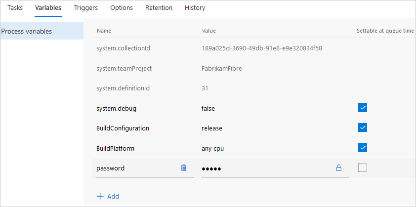
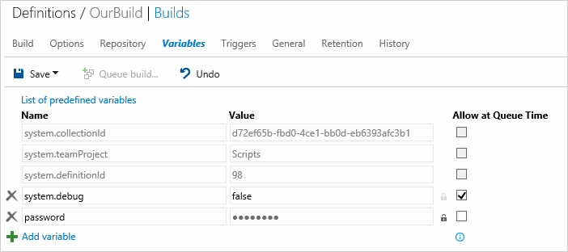

# Build variables

**VSTS | TFS 2018 | TFS 2017 | TFS 2015 | [Previous versions (XAML builds)](https://msdn.microsoft.com/library/hh850448%28v=vs.120%29.aspx)**

::: moniker range="< vsts"
> [!NOTE]
> 
> Some features and predefined variables are not available in certain versions of TFS. We're working on updating this topic to call out these differences.
::: moniker-end

Variables give you a convenient way to get key bits of data into various parts of your build process.

| Use | User-defined  | Predefined, all scopes | Predefined, agent scope | Format | Examples and more information |
|---|---|---|---|---|---|
| As arguments to build tasks | Yes | Yes | Yes | `$(Build.DefinitionName)` | [Command line](../tasks/utility/command-line.md), [Copy files](../tasks/utility/copy-files.md) |
| Apply a version control label during the build process | Yes | Yes | No | `$(Build.DefinitionName)` | [Repository tab](repository.md) (Git and Team Foundation version control **Label format**) |
| Customize the build number | Yes | Yes | No  | `$(Build.DefinitionName)` | [Build number format options](options.md) |
| Environment variable in Windows batch scripts| Yes | Yes | Yes | `%BUILD_DEFINITIONNAME%` | [Batch script ](../tasks/utility/batch-script.md#example) |
| Environment variable in PowerShell scripts | Yes | Yes | Yes | `$env:BUILD_DEFINITIONNAME` | [PowerShell script](../scripts/powershell.md) |
| Environment variable in Shell scripts | Yes | Yes | Yes | `$BUILD_DEFINITIONNAME` | [Shell script](../tasks/utility/shell-script.md#example) |

## User-defined variables

Variables are a great way to store and share key bits of data in your build definition. Some build templates automatically define some variables for you.

For example, when you [create a new .NET app build](../apps/windows/dot-net.md), `BuildConfiguration` and `BuildPlatform` are automatically defined for you.

User-defined variables are formatted differently in different contexts. See above table.

### Secret Variables

We recommend that you make the variable 
**Secret** if it contains a password, keys, or some other kind of data that you need to avoid exposing.

::: moniker range="tfs-2017"
**TFS 2017.2, TFS 2017.3**
::: moniker-end

::: moniker range=">= tfs-2017"

::: moniker-end

::: moniker range="tfs-2017"
**TFS 2017 RTM**
::: moniker-end

::: moniker range=">= tfs-2015 <= tfs-2017"

::: moniker-end

Secret variables are:

* Encrypted at rest with a 2048-bit RSA key.

* Not returned back to the client. They are automatically masked out of any log output from the build or release.  

* Not decrypted into environment variables. So scripts and programs run by your build tasks are not given access by default.

* Decrypted for access by your build tasks. So you can use them in password arguments and also pass them explicitly into a script or a program from your build task (for example as `$(password)`).

### Allow at queue time

Select this check box if you want to enable your team to modify the value when they manually queue a build.

[!INCLUDE [include](../_shared/set-variables-in-scripts.md)]

## Control variables

::: moniker range=">= tfs-2015 <= tfs-2017"
###Build.Clean 

Modifies how the build agent cleans things up. See [Source repositories](repository.md).
::: moniker-end

### System.Debug

If you need more detailed logs to debug build problems, define and set it to `true`.

## Environment variables

You can pass environment variables of the build machine into build tasks. For example, on the [Build tab](../tasks/index.md) of a build definition, add this task:

| Task | Arguments |
| ---- | --------- |
|  **Utility: Command Line** | Tool: `echo` Arguments: `$(PATH)` |

> [!NOTE]
> If you have defined the a variable of the same name (for example `PATH`) on the [variables tab](variables.md), then your value overrides the environment variable when you use it as shown above.

## Predefined variables

::: moniker range=">= tfs-2015"

### Agent.BuildDirectory

Environment variable: AGENT_BUILDDIRECTORY

Scope: Agent

The local path on the agent where all folders for a given build definition are created. 

::: moniker-end

::: moniker range=">= tfs-2017 < vsts"

For example: `c:\agent\_work\1`

::: moniker-end

::: moniker range="tfs-2015"

For example:

* In TFS 2015.4: `C:\TfsData\Agents\Agent-MACHINENAME\_work\1`

* In TFS 2015 RTM: `C:\TfsData\Build\_work\6c3842c6`

::: moniker-end

::: moniker range=">= tfs-2015"
### Agent.HomeDirectory

Environment variable: AGENT_HOMEDIRECTORY

Scope: Agent

The directory the agent is installed into. This contains the agent software. 

::: moniker-end

::: moniker range=">= tfs-2017 < vsts"

For example: `c:\agent`

::: moniker-end

::: moniker range="tfs-2015"

For example:

* In TFS 2015.4: `C:\TfsData\Agents\Agent-MACHINENAME`

* In TFS 2015 RTM: 

 - Pre-configured agent: `C:\Program Files\Microsoft Team Foundation Server 14.0\Build`

 - Agent installed by you: `C:\Agent`

::: moniker-end

::: moniker range=">= tfs-2015 < vsts"

This directory is specified by you. See [Agents](../agents/agents.md).

::: moniker-end

::: moniker range=">= tfs-2015"
### Agent.Id

Environment variable: AGENT_ID

Scope: Agent

The ID of the agent.  
::: moniker-end

::: moniker range=">= tfs-2015"
### Agent.JobStatus

::: moniker-end

::: moniker range=">= tfs-2017"

Environment variable: AGENT_JOBSTATUS or agent.jobstatus

::: moniker-end

::: moniker range="tfs-2015"

Environment variable: agent.jobstatus

::: moniker-end

::: moniker range=">= tfs-2015"

Scope: Agent
                
The status of the build.

* `Canceled`
* `Failed`
* `Succeeded`
* `SucceededWithIssues` (partially successful)

::: moniker-end

### Agent.MachineName

Environment variable: AGENT_MACHINENAME

Scope: Agent

The name of the machine on which the agent is installed.

::: moniker range="tfs-2015"

> [!NOTE]
> 
> This variable is available in **TFS 2015.4**, not in **TFS 2015 RTM**.

::: moniker-end

### Agent.Name

Environment variable: AGENT_NAME

Scope: Agent
                
The name of the agent that is registered with the pool.

If you are using an on-premises agent, this directory is specified by you. See agents(../concepts/agents/agents.md).

### Agent.WorkFolder

Environment variable: AGENT_WORKFOLDER

Scope: Agent

The working directory for this agent. For example: `c:\agent\_work`.

::: moniker range=">= tfs-2015"
### Build.ArtifactStagingDirectory

Environment variable: BUILD_ARTIFACTSTAGINGDIRECTORY

Scope: Agent
::: moniker-end

::: moniker range="tfs-2015"

The local path on the agent where any artifacts are copied to before being pushed to their destination. For example:

* TFS 2015.4: `C:\TfsData\Agents\Agent-MACHINENAME\_work\1\a`

* TFS 2015 RTM default agent: C:\TfsData\Build\_work\6c3842c6\artifacts        

* TFS 2015 RTM agent installed by you: C:\Agent\_work\6c3842c6\artifacts

This directory is purged before each new build, so you don't have to clean it up yourself.

A typical way to use this folder is to publish your build artifacts with the [Copy files](../tasks/utility/copy-files.md) and [Publish build artifacts](../tasks/utility/publish-build-artifacts.md) tasks. See [Artifacts in Team Build](artifacts.md).

In **TFS 2015.4**, Build.ArtifactStagingDirectory and Build.StagingDirectory are interchangeable. 

::: moniker-end

::: moniker range=">= tfs-2017"
[!INCLUDE [include](_shared/variables-build-artifacts-directory.md)]
::: moniker-end

### Build.BuildId

Environment variable: BUILD_BUILDID

Scope: All

The ID of the record for the completed build.

### Build.BuildNumber

Environment variable: BUILD_BUILDNUMBER

Scope: Agent, label format (see Notes)

The name of the completed build. You can specify the build number format that generates this value in the [definition options](options.md).

A typical use of this variable is to make it part of the label format, which you specify on the [repository tab](repository.md).
                
[!INCLUDE [include](_shared/variables-invalid-label-characters.md)]

### Build.BuildUri

Environment variable: BUILD_BUILDURI

Scope: Agent

The URI for the build. For example: `vstfs:///Build/Build/1430`.

::: moniker range=">= tfs-2017"

### Build.BinariesDirectory

::: moniker-end

::: moniker range="tfs-2015"

### Build.BinariesDirectory (TFS 2015.4)

::: moniker-end

::: moniker range=">= tfs-2015"

Environment variable: BUILD_BINARIESDIRECTORY

Scope: Agent

The local path on the agent you can use as an output folder for compiled binaries. 

::: moniker-end

::: moniker range=">= tfs-2017"

For example: `c:\agent\_work\1\b`.

::: moniker-end

::: moniker range="tfs-2015"

For example: `C:\TfsData\Agents\Agent-MACHINENAME\_work\1\b`

::: moniker-end

::: moniker range=">= tfs-2015"

By default, new build definitions are not set up to clean this directory. You can define your build to clean it up on the [Repository tab](repository.md).

::: moniker-end

### Build.DefinitionName

Environment variable: BUILD_DEFINITIONNAME

Scope: All (see Notes)

The name of the build definition.

[!INCLUDE [include](_shared/variables-invalid-label-characters.md)]

### Build.DefinitionVersion

Environment variable: BUILD_DEFINITIONVERSION

Scope: All

The version of the build definition.

### Build.QueuedBy

Environment variable: BUILD_QUEUEDBY

Scope: All (see Notes)
                
[How are the identity variables set?](#identity_values)
                
[!INCLUDE [include](_shared/variables-invalid-label-characters.md)]

### Build.QueuedById

Environment variable: BUILD_QUEUEDBYID

Scope: All
                
[How are the identity variables set?](#identity_values)

### Build.Reason

Environment variable: BUILD_REASON

Scope: All

> **VSTS Only**

The event that caused the build to run.

* `Manual`: A user manually queued the build.
* `IndividualCI`: **Continuous integration (CI)** triggered by a Git push or a TFVC check-in.
* `BatchedCI`: **Continuous integration (CI)** triggered by a Git push or a TFVC check-in, and the **Batch changes** was selected.
* `Schedule`: **Scheduled** trigger.
* `ValidateShelveset`: A user manually queued the build of a specific TFVC shelveset.
* `CheckInShelveset`: **Gated check-in** trigger.
* `PullRequest`: The build was triggered by a Git branch policy that requires a build.
::: moniker range="vsts"
* `BuildCompletion`: The build was [triggered by another build](triggers.md#BuildCompletion)
::: moniker-end

See [Build definition triggers](triggers.md), [Improve code quality with branch policies](../../git/branch-policies.md).
        
### Build.Repository.Clean

Environment variable: BUILD_REPOSITORY_CLEAN

Scope: Agent

The value you've selected for **Clean** in the [source repository settings](repository.md).

### Build.Repository.LocalPath

Environment variable: BUILD_REPOSITORY_LOCALPATH

Scope: Agent

[!INCLUDE [include](_shared/variables-build-sources-directory.md)]

### Build.Repository.Name

Environment variable: BUILD_REPOSITORY_NAME

Scope: Agent

The name of the [repository](repository.md).

### Build.Repository.Provider

Environment variable: BUILD_REPOSITORY_PROVIDER

Scope: Agent
                
The type of [repository you selected](repository.md).

* `TfsGit`: [TFS Git repository](../../git/overview.md)
* `TfsVersionControl`: [Team Foundation Version Control](../../tfvc/overview.md)
* `Git`: Git repository hosted on an external server
* `GitHub`
* `Svn`: Subversion

### Build.Repository.Tfvc.Workspace

Environment variable: BUILD_REPOSITORY_TFVC_WORKSPACE

Scope: Agent
                
Defined if your [repository](repository.md) is Team Foundation Version Control. The name of the [TFVC workspace](../../tfvc/create-work-workspaces.md) used by the build agent.
                
For example, if the Agent.BuildDirectory is `c:\agent\_work\12` and the Agent.Id is `8`, the workspace name could be: `ws_12_8`

### Build.Repository.Uri

Environment variable: BUILD_REPOSITORY_URI

Scope: Agent
                
The URL for the repository. For example:

* Git: `https://fabrikamfiber.visualstudio.com/_git/Scripts`
* TFVC: `https://fabrikamfiber.visualstudio.com/`

### Build.RequestedFor

Environment variable: BUILD_REQUESTEDFOR

Scope: All (see Notes)
                
[How are the identity variables set?](#identity_values)
                
[!INCLUDE [include](_shared/variables-invalid-label-characters.md)]

### Build.RequestedForEmail

Environment variable: BUILD_REQUESTEDFOREMAIL

Scope: All

[How are the identity variables set?](#identity_values)

### Build.RequestedForId

Environment variable: BUILD_REQUESTEDFORID

Scope: All

[How are the identity variables set?](#identity_values)

### Build.SourceBranch

Environment variable: BUILD_SOURCEBRANCH

Scope: All (see Notes)
                
The branch the build was queued for. Some examples:

* Git repo branch: `refs/heads/master`
* Git repo pull request: `refs/pull/1/merge`
* TFVC repo branch: `$/teamproject/main`
* TFVC repo gated check-in: `Gated_2016-06-06_05.20.51.4369;username@live.com`
* TFVC repo shelveset build: `myshelveset;username@live.com`

When you use this variable in your build number format, the forward slash characters (`/`) are replaced with underscore characters <code>&#095;</code>).

Note: In TFVC, if you are running a gated check-in build or manually building a shelveset, you cannot use this variable in your build number format.

### Build.SourceBranchName

Environment variable: BUILD_SOURCEBRANCHNAME

Scope: All (see Notes)
                
The name of the branch the build was queued for.

* Git repo branch or pull request: The last path segment in the ref. For example, in `refs/heads/master` this value is `master`.
* TFVC repo branch: The last path segment in the root server path for the workspace. For example in `$/teamproject/main` this value is `main`.
* TFVC repo gated check-in or shelveset build is the name of the shelveset. For example, `Gated_2016-06-06_05.20.51.4369;username@live.com` or `myshelveset;username@live.com`.

Note: In TFVC, if you are running a gated check-in build or manually building a shelveset, you cannot use this variable in your build number format.

### Build.SourcesDirectory

Environment variable: BUILD_SOURCESDIRECTORY

Scope: Agent

[!INCLUDE [include](_shared/variables-build-sources-directory.md)]

### Build.SourceVersion

Environment variable: BUILD_SOURCEVERSION

Scope: Agent
                
The latest version control change that is included in this build.

* Git: The [commit](../../git/tutorial/commits.md) ID.
* TFVC: the [changeset](../../tfvc/find-view-changesets.md).

::: moniker range=">= tfs-2015"
### Build.StagingDirectory

Environment variable: BUILD_STAGINGDIRECTORY

Scope: Agent
::: moniker-end

::: moniker range="tfs-2015"
#### TFS 2015 RTM

The local path on the agent you can use as an output folder for compiled binaries. For example: `C:\TfsData\Build\_work\6c3842c6\staging`.

By default, new build definitions are not set up to clean this directory. You can define your build to clean it up on the [Repository tab](repository.md).

#### TFS 2015.4

The local path on the agent where any artifacts are copied to before being pushed to their destination. For example: `C:\TfsData\Agents\Agent-MACHINENAME\_work\1\a`

This directory is purged before each new build, so you don't have to clean it up yourself.

A typical way to use this folder is to publish your build artifacts with the [Copy files](../tasks/utility/copy-files.md) and [Publish build artifacts](../tasks/utility/publish-build-artifacts.md) tasks. See [Artifacts in Team Build](artifacts.md).

In **TFS 2015.4**, Build.ArtifactStagingDirectory and Build.StagingDirectory are interchangeable. 

::: moniker-end

::: moniker range=">= tfs-2017"
[!INCLUDE [include](_shared/variables-build-artifacts-directory.md)]
::: moniker-end

### Build.Repository.Git.SubmoduleCheckout

Environment variable: BUILD_REPOSITORY_GIT_SUBMODULECHECKOUT

Scope: Agent

The value you've selected for **Checkout submodules** on the [repository tab](repository.md).

### Build.SourceTfvcShelveset

Environment variable: BUILD_SOURCETFVCSHELVESET

Scope: All (see Notes)

Defined if your [repository](repository.md) is Team Foundation Version Control.
                
If you are running a [gated build](triggers.md#gated) or a [shelveset build](../get-started-designer.md#queueabuild), this is set to the name of the [shelveset](../../tfvc/suspend-your-work-manage-your-shelvesets.md) you are building.

Note: This variable yields a value that is invalid for build use in a build number format

### Common.TestResultsDirectory

Environment variable: COMMON_TESTRESULTSDIRECTORY

Scope: Agent

The local path on the agent where the test results are created. For example: `c:\agent\_work\1\TestResults`

::: moniker range="vsts"

### Build.TriggeredBy.BuildId

Environment variable: BUILD_TRIGGEREDBY_BUILDID

Scope: Agent

If the build was [triggered by another build](triggers.md#BuildCompletion), then this variable is set to the BuildID of the triggering build.

### Build.TriggeredBy.DefinitionId

Environment variable: BUILD_TRIGGEREDBY_DEFINITIONID

If the build was [triggered by another build](triggers.md#BuildCompletion), then this variable is set to the DefinitionID of the triggering build.

### Build.TriggeredBy.BuildDefinitionName

Environment variable: BUILD_TRIGGEREDBY_DEFINITIONNAME

If the build was [triggered by another build](triggers.md#BuildCompletion), then this variable is set to the name of the triggering build definition.

### Build.TriggeredBy.BuildNumber

Environment variable: BUILD_TRIGGEREDBY_BUILDNUMBER

If the build was [triggered by another build](triggers.md#BuildCompletion), then this variable is set to the number of the triggering build.

### Build.TriggeredBy.ProjectID

Environment variable: BUILD_TRIGGEREDBY_PROJECTID

If the build was [triggered by another build](triggers.md#BuildCompletion), then this variable is set to ID of the team project that contains the triggering build.

::: moniker-end

### System.AccessToken

Environment variable: SYSTEM_ACCESSTOKEN

Scope: Agent

[Use the OAuth token to access the REST API](../scripts/powershell.md#oauth).

### System.CollectionId

Environment variable: SYSTEM_COLLECTIONID

Scope: All

The GUID of the team foundation collection.

### System.DefaultWorkingDirectory

Environment variable: SYSTEM_DEFAULTWORKINGDIRECTORY

Scope: Agent

[!INCLUDE [include](_shared/variables-build-sources-directory.md)]

### System.DefinitionId

Environment variable: SYSTEM_DEFINITIONID

Scope: All

The ID of the build definition.

### System.PullRequest.IsFork

Environment variable: SYSTEM_PULLREQUEST_ISFORK

Scope: All

If the pull request is from a fork of the repository, this variable is set to `True`. 
Otherwise, it is set to `False`.

### System.PullRequest.PullRequestId

Environment variable: SYSTEM_PULLREQUEST_PULLREQUESTID

Scope: All

The ID of the pull request that caused this build. For example: `17`. (This variable is initialized only if the build ran because of a [Git PR affected by a branch policy](../../git/branch-policies.md#require-the-pull-request-to-build).)

### System.PullRequest.PullRequestNumber

Environment variable: SYSTEM_PULLREQUEST_PULLREQUESTNUMBER

Scope: All

The number of the pull request that caused this build. This variable is populated for pull requests from GitHub which have a different pull request ID and pull request number.

### System.PullRequest.SourceBranch

Environment variable: SYSTEM_PULLREQUEST_SOURCEBRANCH

Scope: All

The branch that is being reviewed in a pull request. For example: `refs/heads/users/raisa/new-feature`. (This variable is initialized only if the build ran because of a [Git PR affected by a branch policy](../../git/branch-policies.md#require-the-pull-request-to-build).)
                
### System.PullRequest.SourceRepositoryURI

Environment variable: SYSTEM_PULLREQUEST_SOURCEREPOSITORYURI

Scope: All

> **VSTS Only**
                
The URL to the repo that contains the pull request. For example: `https://ouraccount.visualstudio.com/_git/OurProject`. (This variable is initialized only if the build ran because of a [VSTS Git PR affected by a branch policy](../../git/branch-policies.md#require-the-pull-request-to-build). It is not initialized for GitHub PRs.)

### System.PullRequest.TargetBranch

Environment variable: SYSTEM_PULLREQUEST_TARGETBRANCH

Scope: All

The branch that is the target of a pull request. For example: `refs/heads/master`. (This variable is initialized only if the build ran because of a [Git PR affected by a branch policy](../../git/branch-policies.md#require-the-pull-request-to-build).)

### System.TeamFoundationCollectionUri

Environment variable: SYSTEM_TEAMFOUNDATIONCOLLECTIONURI

Scope: Agent

The URI of the team foundation collection. For example: `https://fabrikamfiber.visualstudio.com/`.

### System.TeamProject

Environment variable: SYSTEM_TEAMPROJECT

Scope: All

The name of the team project that contains this build.

### System.TeamProjectId

Environment variable: SYSTEM_TEAMPROJECTID

Scope: All

The ID of the team project that this build belongs to.

### TF_BUILD

Scope: Agent

Set to `True` if the script is being run by a build task.

## Q&A
<!-- BEGINSECTION class="md-qanda" -->

### What are the predefined Release Management variables?

[Default release management variables](../release/variables.md#default-variables)

### How are the identity variables set?

The value depends on what caused the build.

| If the build is triggered... | Then the Build.QueuedBy and Build.QueuedById values are based on... | Then the Build.RequestedFor and Build.RequestedForId values are based on... |
| --- | --- | ---|
| In Git or TFVC by the [Continuous integration (CI) triggers](triggers.md) | The system identity, for example: `[DefaultCollection]\Project Collection Service Accounts` | The person who pushed or checked in the changes. |
| In Git or by a [branch policy build](../../git/branch-policies.md#require-the-pull-request-to-build). | The system identity, for example: `[DefaultCollection]\Project Collection Service Accounts` | The person who checked in the changes. |
| In TFVC by a [gated check-in trigger](triggers.md) | The person who checked in the changes. | The person who checked in the changes. |
| In Git or TFVC by the [Scheduled triggers](triggers.md) | The system identity, for example: `[DefaultCollection]\Project Collection Service Accounts` | The system identity, for example: `[DefaultCollection]\Project Collection Service Accounts` |
| Because you clicked the **Queue build** button | You | You |

[!INCLUDE [temp](../_shared/qa-agents.md)]

::: moniker range="< vsts"
[!INCLUDE [temp](../_shared/qa-versions.md)]
::: moniker-end

<!-- ENDSECTION -->
