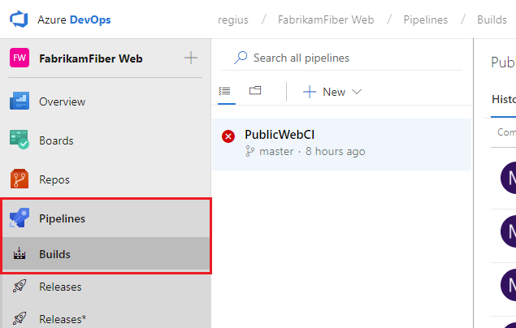
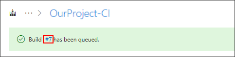
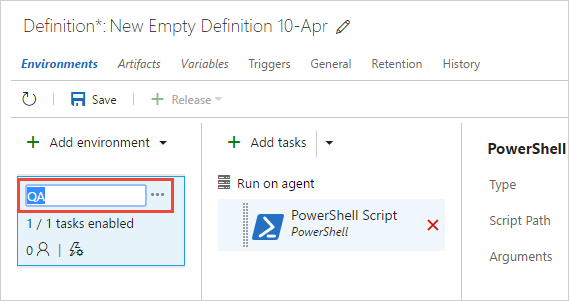

# Create your first pipeline

[!INCLUDE [version-tfs-2017-rtm](_shared/version-tfs-2017-rtm.md)]

::: moniker range="azure-devops"

This is a step-by-step guide to using Azure Pipelines to build a GitHub repository.

## Prerequisites

[!INCLUDE [include](_shared/ci-cd-prerequisites-vsts.md)]

* You need a GitHub account, where you can create a repository.

## Get the sample code

You can use Azure Pipelines to build an app written in any language.
Select a sample repository of your choice from the following languages and fork it into your own GitHub user account:

| Programming language | Repository with a sample app |
|----------------------|----------------------------|
| Docker | https://github.com/MicrosoftDocs/pipelines-dotnet-core-docker |
| .NET Core | https://github.com/MicrosoftDocs/pipelines-dotnet-core |
| Go | https://github.com/MicrosoftDocs/pipelines-go |
| Java | https://github.com/MicrosoftDocs/pipelines-java |
| Node.js | https://github.com/MicrosoftDocs/pipelines-javascript |
| Python | https://github.com/MicrosoftDocs/pipelines-python-django |

You should now have a sample app in your GitHub account.

## Get your first build

1. Sign in to your Azure DevOps organization and navigate to your project.

1. In your project, navigate to the **Pipelines** page. Then choose **New, New build pipeline**.

   > [!div class="mx-imgBorder"]
   

1. Walk through the steps of the wizard by first selecting **GitHub** as the location of your source code.

   > [!div class="mx-imgBorder"]
   

1. You might be redirected to GitHub to sign in. If so, enter your GitHub credentials.

1. When the list of repositories appears, select your desired sample app repository.

1. Azure Pipelines will analyze your repository.

  - If your repository already contains an `azure-pipelines.yml` file, then that file will be used, and you'll see a **Run** button. Click it to start a build.
  - If your repository doesn't have a YAML file, Azure Pipelines recommends a starter template based on the code in your repository. You'll see a **Save and run** button instead of **Run**. Select **Save and run**, then select **Commit directly to the master branch**, and then choose **Save and run** again.

1. Wait for the build to finish.

<a name="get-the-status-badge"></a>
## Add a CI status badge to your repository

Many developers like to show that they're keeping their code quality high by displaying a CI build status badge in their repo.


To copy the status badge to your clipboard:

1. In Azure Pipelines, go to the **Builds** page to view the list of pipelines. Select the pipeline you created in the previous section.

1. In the context menu for the pipeline, select **Status badge**.

   > [!div class="mx-imgBorder"]
   

1. Copy the sample Markdown from the status badge panel.

Now with the badge Markdown in your clipboard, take the following steps in GitHub:

1. Go to the list of files and select `Readme.md`. Select the pencil icon to edit.

1. Paste the status badge Markdown at the beginning of the file.

1. Commit the change to the `master` branch.

1. Notice that the status badge appears in the description of your repository.

Because you just changed the `Readme.md` file in this repository, Azure Pipelines automatically builds your code, according to the configuration in the `azure-pipelines.yml` file at the root of your repository. Back in Azure Pipelines, observe that a new build appears. Each time you make an edit, Azure Pipelines queues a new build.

## Next steps

You've just learned the basics of using Azure Pipelines. Now you're ready to further configure your pipeline to run tests, publish test results, create container images, or even deploy the app to a cloud service. Follow a track for the language of your choice:

* [.NET Core](languages/dotnet-core.md)
* [Docker](languages/docker.md)
* [Go](languages/go.md)
* [Java](languages/java.md)
* [Node.js](languages/javascript.md)
* [Python](languages/python.md)

To adjust the timeout of your job, see [Timeouts](process/phases.md#timeouts).

To run your pipeline in a container, see [Container jobs](process/container-phases.md).

For details about building GitHub repositories, see [Build GitHub repositories](repos/github.md).

To learn what else you can do in YAML pipelines, see [YAML schema reference](yaml-schema.md).

::: moniker-end


::: moniker range="<= azure-devops-2019"

[!INCLUDE [temp](_shared/concept-rename-note.md)]

::: moniker-end

::: moniker range="tfs-2017"

> [!NOTE]
> 
> This guidance applies to TFS version 2017.3 and newer.
> 
::: moniker-end

::: moniker range="azure-devops-2019"

We'll show you how to use the classic editor in Azure DevOps Server 2019 to create a build and release that prints "Hello world".

::: moniker-end

::: moniker range="<= tfs-2018"

We'll show you how to use the classic editor in TFS to create a build and a release that prints "Hello world".

::: moniker-end

::: moniker range="<= azure-devops-2019"

## Prerequisites

* A [self-hosted Windows agent](agents/v2-windows.md).

<a name="initialize-repo"></a>
## Initialize your repository

> If you already have a repository in your project, you can skip to the next step: [Add a script to your repository](#add-a-script-to-your-repository)

::: moniker-end

::: moniker range="azure-devops-2019"

1. Go to **Azure Repos**. (The **Code** hub in the previous navigation)

  

2. If your project is empty, you will be greeted with a screen to help you add code to your repository. Choose the bottom choice to **initialize** your repo with a `readme` file: 

  

::: moniker-end

::: moniker range="< azure-devops-2019"

1. Navigate to your repository by clicking **Code** in the top navigation. 

2. If your project is empty, you will be greeted with a screen to help you add code to your repository. Choose the bottom choice to **initialize** your repo with a `readme` file: 

  

::: moniker-end

::: moniker range="<= azure-devops-2019"

<a name="add-script"></a>
## Add a script to your repository

Create a PowerShell script that prints `Hello world`.

::: moniker-end

::: moniker range="azure-devops-2019"
1. Go to **Azure Repos**.

1. Add a file.

   > [!div class="mx-imgBorder"] 
   >
   > 

1. In the dialog box, name your new file and create it.
 ```
HelloWorld.ps1
```

1. Copy and paste this script.
 ```ps
Write-Host "Hello world"
 ```

1. **Commit** (save) the file.

::: moniker-end

::: moniker range="<= tfs-2018"

1. Go to the **Code** hub.

2. Add a file.

   ::: moniker-end

   ::: moniker range="tfs-2018"

   # [TFS 2018.2](#tab/tfs-2018-2)
    

   # [TFS 2018 RTM](#tab/tfs-2018-rtm)
    

   ---

   ::: moniker-end

   ::: moniker range="tfs-2017"

   

   ::: moniker-end

::: moniker range="< azure-devops-2019"

1. In the dialog box, name your new file and create it.
 ```
HelloWorld.ps1
```

1. Copy and paste this script.
 ```ps
Write-Host "Hello world"
 ```

1. **Commit** (save) the file.

::: moniker-end

::: moniker range="<= azure-devops-2019"

> In this tutorial, our focus is on CI/CD, so we're keeping the code part simple. We're working in an Azure Repos Git repository directly in your web browser.
>
> When you're ready to begin building and deploying a real app, you can use a wide range of version control clients and services with Azure Pipelines CI builds. [Learn more](#version-control).

## Create a build pipeline

Create a build pipeline that prints "Hello world."

::: moniker-end

::: moniker range="azure-devops-2019"

1. Select **Azure Pipelines**, it should automatically take you to the **Builds** page.

   > [!div class="mx-imgBorder"] 
   > 
   >

1. Create a new pipeline.

   > [!div class="mx-imgBorder"] 
   > 
   >

  For new Azure DevOps accounts, this will automatically take you to the _YAML pipeline creation experience_. To get to the classic editor and complete this guide, you must turn off the **preview feature** for the _New YAML pipeline creation experience_:

  

  

1. Make sure that the **source**, **project**, **repository**, and default **branch** match the location in which you created the script.

1. Start with an **Empty job**.

1. On the left side, select **Pipeline** and specify whatever **Name** you want to use. For the **Agent pool**, select **Hosted VS2017**.

1. On the left side, select the plus sign **( + )** to add a task to **Job 1**. On the right side, select the **Utility** category, select the **PowerShell** task from the list, and then choose **Add**.

   > [!div class="mx-imgBorder"] 
   > 
   >
   
1. On the left side, select your new **PowerShell** script task.

1. For the **Script Path** argument, select the <span style="background-color: rgb(244,244,244);font-weight:bold;padding:5px">...</span> button to browse your repository and select the script you created.

   > [!div class="mx-imgBorder"] 
   > 
   >
 
1. Select **Save & queue**, and then select **Save**.

 ::: moniker-end

 ::: moniker range="tfs-2018"

1. Select **Build and Release**, and then choose **Builds**.

   

1. Create a new pipeline.

   

1. Start with an **empty pipeline**

1. Select **Pipeline** and specify whatever **Name** you want to use. For the **Agent pool**, select **Default**.

1. On the left side, select **+ Add Task** to add a task to the job, and then on the right side select the **Utility** category, select the **PowerShell** task, and then choose **Add**.

   

1. On the left side, select your new **PowerShell** script task.

1. For the **Script Path** argument, select the <span style="background-color: rgb(244,244,244);font-weight:bold;padding:5px">...</span> button to browse your repository and select the script you created.

   

1. Select **Save & queue**, and then select **Save**.

 ::: moniker-end

::: moniker range="tfs-2017"

1. Select **Azure Pipelines**, and then the **Builds** tab.

 

1. Create a new pipeline.

 

1. Start with an **empty pipeline**.

1. Select **Pipeline** and specify whatever **Name** you want to use.

1. On the **Options** tab, select **Default** for the **Agent pool**, or select whichever pool you want to use that has Windows build agents.

1. On the **Tasks** tab, make sure that **Get sources** is set with the **Repository** and **Branch** in which you created the script.

1. On the left side select **Add Task**, and then on the right side select the **Utility** category, select the **PowerShell** task, and then select **Add**.

1. On the left side, select your new **PowerShell** script task.

1. For the **Script Path** argument, select the <span style="background-color: rgb(244,244,244);font-weight:bold;padding:5px">...</span> button to browse your repository and select the script you created.

   

1. Select **Save & queue**, and then select **Save**.

::: moniker-end

::: moniker range="<= azure-devops-2019"

> A build pipeline is the entity through which you define your automated build pipeline. In the build pipeline, you compose a set of tasks, each of which perform a step in your build. The task catalog provides a rich set of tasks for you to get started. You can also add PowerShell or shell scripts to your build pipeline.

## Publish an artifact from your build

A typical build produces an artifact that can then be deployed to various stages in a release. Here to demonstrate the capability in a simple way, we'll simply publish the script as the artifact.

::: moniker-end

::: moniker range="azure-devops-2019"

1. On the **Tasks** tab, select the plus sign **( + )** to add a task to **Job 1**.

1. Select the **Utility** category, select the **Publish Build Artifacts** task, and then select **Add**.

   

   **Path to publish**: Select the <span style="background-color: rgb(244,244,244);font-weight:bold;padding:5px">...</span> button to browse and select the script you created.

   **Artifact name**: Enter `drop`.

   **Artifact publish location**: Select **Azure Artifacts/TFS**.

::: moniker-end


::: moniker range="<= tfs-2018"

1. On the **Tasks** tab, select **Add Task**.

1. Select the **Utility** category, select the **Publish Build Artifacts** task, and then select **Add**.

 

 **Path to Publish**: Select the <span style="background-color: rgb(244,244,244);font-weight:bold;padding:5px">...</span> button to browse and select the script you created.

 **Artifact Name**: Enter `drop`.

 **Artifact Type**: Select **Server**.

::: moniker-end

::: moniker range="<= azure-devops-2019"

> Artifacts are the files that you want your build to produce. Artifacts can be nearly anything your team needs to test or deploy your app. For example, you've got a .DLL and .EXE executable files and .PDB symbols file of a C# or C++ .NET Windows app.
>
> To enable you to produce artifacts, we provide tools such as copying with pattern matching, and a staging directory in which you can gather your artifacts before publishing them. See [Artifacts in Azure Pipelines](artifacts/artifacts-overview.md).

## Enable continuous integration (CI)

1. Select the **Triggers** tab.

1. Enable **Continuous integration**.

>  A continuous integration trigger on a build pipeline indicates that the system should automatically queue a new build whenever a code change is committed. You can make the trigger more general or more specific, and also schedule your build (for example, on a nightly basis). See [Build triggers](build/triggers.md).

## Save and queue the build

Save and queue a build manually and test your build pipeline.

::: moniker-end

::: moniker range="azure-devops-2019"

1. Select **Save & queue**, and then select **Save & queue**.

1. On the dialog box, select **Save & queue** once more.

   This queues a new build on the Microsoft-hosted agent.

1. You see a link to the new build on the top of the page.

   > [!div class="mx-imgBorder"] 
   > 
   >

   Choose the link to watch the new build as it happens. Once the agent is allocated, you'll start seeing the live logs of the build. Notice that the PowerShell script is run as part of the build, and that "Hello world" is printed to the console.

   > [!div class="mx-imgBorder"] 
   > 
   >

1. Go to the build summary. On the **Artifacts** tab of the build, notice that the script is published as an artifact.

   > [!div class="mx-imgBorder"] 
   > 
   >

::: moniker-end

::: moniker range="tfs-2018"

1. Select **Save & queue**, and then select **Save & queue**.

1. On the dialog box, select **Save & queue** once more.

   This queues a new build on the Microsoft-hosted agent.
   
1. You see a link to the new build on the top of the page.

   

   Choose the link to watch the new build as it happens. Once the agent is allocated, you'll start seeing the live logs of the build. Notice that the PowerShell script is run as part of the build, and that "Hello world" is printed to the console.

   # [TFS 2018.2](#tab/tfs-2018-2)
   

   # [TFS 2018 RTM](#tab/tfs-2018-rtm)
   

   ---

1. Go to the build summary.

   

1. On the **Artifacts** tab of the build, notice that the script is published as an artifact.

   

> You can view a summary of all the builds or drill into the logs for each build at any time by navigating to the **Builds** tab in **Azure Pipelines**. For each build, you can also view a list of commits that were built and the work items associated with each commit. You can also run tests in each build and analyze the test failures.

::: moniker-end

::: moniker range="tfs-2017"

1. Select **Save & queue**, and then select **Save & queue**.

1. On the dialog box, select the **Queue** button.

   This queues a new build on the agent. Once the agent is allocated, you'll start seeing the live logs of the build. Notice that the PowerShell script is run as part of the build, and that "Hello world" is printed to the console.

   

1. Go to the build summary.

   

1. On the **Artifacts** tab of the build, notice that the script is published as an artifact.

   

> You can view a summary of all the builds or drill into the logs for each build at any time by navigating to the **Builds** tab in **Build and Release**. For each build, you can also view a list of commits that were built and the work items associated with each commit. You can also run tests in each build and analyze the test failures.

::: moniker-end

::: moniker range="<= azure-devops-2019"

## Add some variables and commit a change to your script

We'll pass some build variables to the script to make our pipeline a bit more interesting. Then we'll commit a change to a script and watch the CI pipeline run automatically to validate the change.  

1. Edit your build pipeline.

1. On the **Tasks** tab, select the PowerShell script task.

1. Add these arguments.

 ::: moniker-end

 ::: moniker range="azure-devops-2019"

  > [!div class="mx-imgBorder"] 
  > 
  >

 ::: moniker-end

 ::: moniker range="tfs-2018"

 # [TFS 2018.2](#tab/tfs-2018-2)
 

 # [TFS 2018 RTM](#tab/tfs-2018-rtm)
 

 ---

 ::: moniker-end

 ::: moniker range="tfs-2017"

 

 ::: moniker-end

 ::: moniker range="<= azure-devops-2019"

 **Arguments**

 ```
-greeter "$(Build.RequestedFor)" -trigger "$(Build.Reason)"
```

Finally, save the build pipeline. 

Next you'll add the arguments to your script.

1. Go to your **Files** in **Azure Repos** (the **Code** hub in the previous navigation and TFS).

1. Select the **HelloWorld.ps1** file, and then **Edit** the file.

1. Change the script as follows:

 ```ps
Param(
   [string]$greeter,
   [string]$trigger
)
Write-Host "Hello world" from $greeter
Write-Host Trigger: $trigger
```

1. **Commit** (save) the script.

::: moniker-end

::: moniker range="azure-devops-2019"

Now you can see the results of your changes. Go to **Azure Pipelines** and select **Queued**. Notice under the **Queued or running** section that a build is automatically triggered by the change that you committed.

::: moniker-end

::: moniker range="<= tfs-2018"

Now you can see the results of your changes. Go to the **Build and Release** page and select **Queued**. Notice under the **Queued or running** section that a build is automatically triggered by the change that you committed.

::: moniker-end

::: moniker range="<= azure-devops-2019"

1. Select the new build that was created and view its log.

1. Notice that the person who changed the code has their name printed in the greeting message. You also see printed that this was a CI build.

 ::: moniker-end

 ::: moniker range="azure-devops-2019"
 > [!div class="mx-imgBorder"] 
 > 
 >

 ::: moniker-end

 ::: moniker range="<= tfs-2018"
 > [!div class="mx-imgBorder"]
 > 
 >

 ::: moniker-end

::: moniker range="<= azure-devops-2019"

> We just introduced the concept of build variables in these steps. We printed the value of a variable that is automatically predefined and initialized by the system. You can also define custom variables and use them either in arguments to your tasks, or as environment variables within your scripts. To learn more about variables, see [Build variables](build/variables.md).

## You've got a build pipeline. What's next?

You've just created a build pipeline that automatically builds and validates whatever code is checked in by your team. At this point you can continue to the next section to learn about release pipelines. Or, if you prefer, you can [skip ahead](#next-steps) to create a build pipeline for your app.

## Create a release pipeline

Define the process for running the script in two stages.

::: moniker-end

::: moniker range="azure-devops-2019"

1. Go to the **Pipelines** tab, and then select **Releases**.

1. Select the action to create a **New pipeline**. If a release pipeline is already created, select the plus sign **( + )** and then select  **Create a release pipeline**.

1. Select the action to start with an **Empty job**.

1. Name the stage **QA**.

1. In the Artifacts panel, select **+ Add** and specify a **Source (Build pipeline)**. Select **Add**.

1. Select the **Lightning bolt** to trigger continuous deployment and then enable the **Continuous deployment trigger** on the right.

   > [!div class="mx-imgBorder"] 
   > 
   >   

1. Select the **Tasks** tab and select your **QA** stage.

1. Select the plus sign **( + )** for the job to add a task to the job.

1. On the **Add tasks** dialog box, select **Utility**, locate the **PowerShell** task, and then select its **Add** button.

1. On the left side, select your new **PowerShell** script task.

1. For the **Script Path** argument, select the <span style="background-color: rgb(244,244,244);font-weight:bold;padding:5px">...</span> button to browse your artifacts and select the script you created.

1. Add these **Arguments**:

   ```
   -greeter "$(Release.RequestedFor)" -trigger "$(Build.DefinitionName)"
   ```

1. On the **Pipeline** tab, select the **QA** stage and select **Clone**.

   > [!div class="mx-imgBorder"] 
   > 
   >   

1. Rename the cloned stage **Production**.

1. Rename the release pipeline **Hello world**.

   > [!div class="mx-imgBorder"] 
   > 
   >

1. Save the release pipeline.

::: moniker-end

::: moniker range="tfs-2018"

1. Go to the **Build and Release** tab, and then select **Releases**.

1. Select the action to create a **New pipeline**. If a release pipeline is already created, select the plus sign **( + )** and then select  **Create a release definition**.

1. Select the action to start with an **Empty definition**.

1. Name the stage **QA**.

1. In the Artifacts panel, select **+ Add** and specify a **Source (Build pipeline)**. Select **Add**.

1. Select the **Lightning bolt** to trigger continuous deployment and then enable the **Continuous deployment trigger** on the right.
  
 # [TFS 2018.2](#tab/tfs-2018-2)
 > [!div class="mx-imgBorder"] 
 > 

 # [TFS 2018 RTM](#tab/tfs-2018-rtm)
 > [!div class="mx-imgBorder"] 
 > 

 ---

1. Select the **Tasks** tab and select your **QA** stage.

1. Select the plus sign **( + )** for the job to add a task to the job.

1. On the **Add tasks** dialog box, select **Utility**, locate the **PowerShell** task, and then select its **Add** button.

1. On the left side, select your new **PowerShell** script task.

1. For the **Script Path** argument, select the <span style="background-color: rgb(244,244,244);font-weight:bold;padding:5px">...</span> button to browse your artifacts and select the script you created.

1. Add these **Arguments**:

   ```
   -greeter "$(Release.RequestedFor)" -trigger "$(Build.DefinitionName)"
   ```

1. On the **Pipeline** tab, select the **QA** stage and select **Clone**.

   > [!div class="mx-imgBorder"] 
   > 
   >
   
1. Rename the cloned stage **Production**.

1. Rename the release pipeline **Hello world**.

   > [!div class="mx-imgBorder"] 
   > 
   >   

1. Save the release pipeline.

::: moniker-end

::: moniker range="tfs-2017"

1. Go to **Azure Pipelines**, and then to the **Releases** tab.

1. Select the action to create a **New pipeline**.

1. On the dialog box, select the **Empty** template and select **Next**.

1. Make sure that your **Hello world** build pipeline that you created above is selected. Select **Continuous deployment**, and then select **Create**.

1. Select **Add tasks** in the stage.

1. On the **Task catalog** dialog box, select **Utility**, locate the **PowerShell** task, and then select its **Add** button. Select the **Close** button.

1. For the **Script Path** argument, select the <span style="background-color: rgb(244,244,244);font-weight:bold;padding:5px">...</span> button to browse your artifacts and select the script you created.

1. Add these **Arguments**:

 ```
-greeter "$(Release.RequestedFor)" -trigger "$(Build.DefinitionName)"
```

1. Rename the stage **QA**.

 

1. **Clone** the **QA** stage.

 

 Leave **Automatically approve** and **Deploy automatically...** selected, and select **Create**.

1. Rename the new stage **Production**.

1. Rename the release pipeline **Hello world**.

 

1. Save the release pipeline.

::: moniker-end

::: moniker range="<= azure-devops-2019"

> A release pipeline is a collection of stages to which the application build artifacts are deployed. It also defines the actual deployment pipeline for each stage, as well as how the artifacts are promoted from one stage to another.
>
> Also, notice that we used some variables in our script arguments. In this case, we used [release variables](release/variables.md) instead of the build variables we used for the build pipeline.

## Deploy a release

Run the script in each stage.

::: moniker-end

 ::: moniker range="azure-devops-2019"

1. Create a new release.

   > [!div class="mx-imgBorder"] 
   > 
   >

 When **Create new release** appears, select **Create**.

1. Open the release that you just created.

   > [!div class="mx-imgBorder"] 
   > 
   >
 
1. View the logs to get real-time data about the release.

   > [!div class="mx-imgBorder"] 
   > 
   >

 ::: moniker-end

 ::: moniker range="tfs-2018"

1. Create a new release.

 

 When **Create new release** appears, select **Create** (TFS 2018.2) or **Queue** (TFS 2018 RTM).

1. Open the release that you just created.

 

1. View the logs to get real-time data about the release.

 

 ::: moniker-end

 ::: moniker range="tfs-2017"

1. Create a new release.

 

1. Open the release that you just created.

 

1. View the logs to get real-time data about the release.

 

 ::: moniker-end

::: moniker range="<= azure-devops-2019"

> You can track the progress of each release to see if it has been deployed to all the stages. You can track the commits that are part of each release, the associated work items, and the results of any test runs that you've added to the release pipeline.

## Change your code and watch it automatically deploy to production

We'll make one more change to the script. This time it will automatically build and then get deployed all the way to the production stage.

1. Go to the **Code** hub, **Files** tab, edit the **HelloWorld.ps1** file, and change it as follows:

 ```ps
Param(
   [string]$greeter,
   [string]$trigger
)
Write-Host "Hello world" from $greeter
Write-Host Trigger: $trigger
Write-Host "Now that you've got CI/CD, you can automatically deploy your app every time your team checks in code."
```

1. **Commit** (save) the script.

1. Select the **Builds** tab to see the build queued and run.

1. After the build is completed, select the **Releases** tab, open the new release, and then go to the **Logs**.

Your new code automatically is deployed in the **QA** stage, and then in the **Production** stage.

::: moniker-end

::: moniker range="azure-devops-2019"

> [!div class="mx-imgBorder"] 
> 
>

::: moniker-end

::: moniker range="tfs-2018"

> [!div class="mx-imgBorder"] 
> 
>
   
::: moniker-end

::: moniker range="tfs-2017"


::: moniker-end

::: moniker range="<= azure-devops-2019"

> In many cases, you probably would want to edit the release pipeline so that the production deployment happens
  only after some testing and approvals are in place. See [Approvals and gates overview](release/approvals/index.md).

<a name="next-steps"></a>
## Next steps

You've just learned the basics of using the classic editor to create and run a pipeline.
Now you're ready to configure your build pipeline for the programming language you're using.
Go ahead and create a new build pipeline, and this time, use one of the following templates.

| Language | Template to use | 
|-|-|
| [.NET](apps/aspnet/build-aspnet-4.md) | ASP.NET |
| [.NET Core](languages/dotnet-core.md) | ASP.NET Core |
| [C++](apps/windows/cpp.md) | .NET Desktop | 
| [Go](apps/go/go.md) | Go |
| [Java](languages/java.md) | Gradle |
| [JavaScript](languages/javascript.md) | Node.js |
| [Xcode](languages/xcode.md) | Xcode |

## Q & A

### Where can I read articles about DevOps and CI/CD?
<!-- BEGINSECTION class="md-qanda" -->

[What is Continuous Integration?](/azure/devops/what-is-continuous-integration)

[What is Continuous Delivery?](/azure/devops/what-is-continuous-delivery)

[What is DevOps?](/azure/devops/what-is-devops)

<a name="version-control"></a>
### What kinds of version control can I use

We've used a Git repository in Azure Repos to keep things focused on CI/CD for this tutorial.

When you're ready to get going with CI/CD for your app, you can use the version control system of your choice:

* Clients

 * [Visual Studio Code for Windows, macOS, and Linux](https://code.visualstudio.com)

 * [Visual Studio with Git for Windows](../repos/git/share-your-code-in-git-vs.md) or [Visual Studio for Mac](https://visualstudio.microsoft.com/vs/visual-studio-mac/)

 * [Visual Studio with TFVC](../repos/tfvc/share-your-code-in-tfvc-vs.md)

 * [Eclipse](../repos/git/share-your-code-in-git-eclipse.md)

 * [Xcode](../repos/git/share-your-code-in-git-xcode.md)

 * [IntelliJ](../java/download-intellij-plug-in.md)

 * [Command line](../repos/git/share-your-code-in-git-cmdline.md)

* Services

 * [Azure Pipelines](https://visualstudio.microsoft.com/team-services/)

 * Git service providers such as GitHub and Bitbucket Cloud

 * Subversion

### How do I replicate a pipeline?

If your pipeline has a pattern that you want to replicate in other pipelines, clone it, export it, or save it as a template.

::: moniker-end

::: moniker range="azure-devops-2019"

> [!div class="mx-imgBorder"] 
> 
>

::: moniker-end

::: moniker range="<= tfs-2018"


::: moniker-end

::: moniker range="< azure-devops"

After you clone a pipeline, you can make changes and then save it.

After you export a pipeline, you can import it from the **All pipelines** tab.

After you create a template, your team members can use it to follow the pattern in new pipelines.

> [!TIP]
>
> If you're using the **New Build Editor**, then your custom templates are shown at the bottom of the list.

### How do I work with drafts?

If you're editing a build pipeline and you want to test some changes that are not yet ready for production, you can save it as a draft.

::: moniker-end

::: moniker range="azure-devops-2019"

> [!div class="mx-imgBorder"] 
> 
>

::: moniker-end

::: moniker range="<= tfs-2018"


::: moniker-end

::: moniker range="<= azure-devops-2019"

You can edit and test your draft as needed.

::: moniker-end

::: moniker range="azure-devops-2019"

> [!div class="mx-imgBorder"] 
> 
>

::: moniker-end

::: moniker range="tfs-2017"


::: moniker-end

::: moniker range="<= azure-devops-2019"

When you're ready you can publish the draft to merge the changes into your build pipeline.

::: moniker-end

::: moniker range="azure-devops-2019"

> [!div class="mx-imgBorder"] 
> 
>

::: moniker-end

::: moniker range="<= tfs-2018"


::: moniker-end

::: moniker range="<= azure-devops-2019"

Or, if you decide to discard the draft, you can delete it from the **All Pipeline** tab shown above.

<a name="queueabuild"></a>
### What else can I do when I queue a build?

You can queue builds [automatically](build/triggers.md) or manually.

When you manually queue a build, you can, for a single run of the build:

* Specify the [pool](agents/pools-queues.md) into which the build goes.

* Add and modify some [variables](build/variables.md).

* Add [demands](build/options.md#demands).

* In a Git repository

 - Build a [branch](../repos/git/branches.md) or a [tag](http://git-scm.com/book/en/v2/Git-Basics-Tagging).

 - Build a [commit](../repos/git/commits.md).

* In a TFVC repository

 - Specify the source version as a [label](https://msdn.microsoft.com/library/ms181439.aspx) or [changeset](https://msdn.microsoft.com/library/ms181408.aspx).

 - Run a private build of a [shelveset](https://msdn.microsoft.com/library/ms181403.aspx). (You can use this option on either a [Microsoft-hosted agent](agents/hosted.md) or a [self-hosted agent](agents/agents.md).)

### Where can I learn more about build pipeline settings?

To learn more about build pipeline settings, see:

* [Getting sources](repos/index.md)

* [Tasks](tasks/index.md)

* [Variables](build/variables.md)

* [Triggers](build/triggers.md)

* [Options](build/options.md)

* [Retention](policies/retention.md)

* [History](build/history.md)

### How do I programmatically create a build pipeline?

[REST API Reference: Create a build pipeline](../integrate/index.md)

> [!NOTE]
> You can also manage builds and build pipelines from the command line or scripts using the [Azure Pipelines CLI](/cli/azure/ext/azure-devops/?view=azure-cli-latest).

<!-- ENDSECTION -->

::: moniker-end

