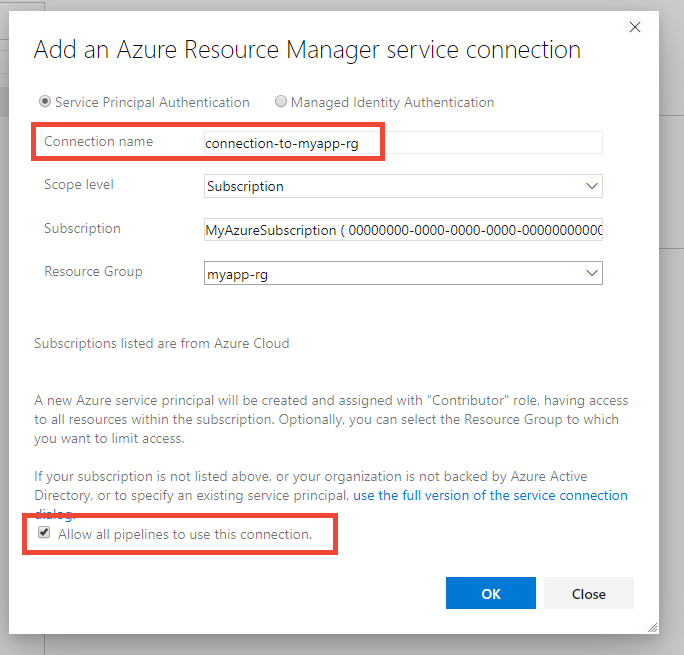

Now create the service connection:

1. From your project dashboard, select **Project settings** on the bottom left.

2. On the settings page, select **Pipelines** > **Service connections**, select **New service connection**, and then select **Azure Resource Manager**.

3. The *Add an Azure Resource Manager service connection** dialog box appears. 

   * **Name** Type a name and then copy and paste it into a text file so you can use it later. 
   * **Scope** Select Subscription. 
   * **Subscription** Select the subscription in which you created the App Service.
   * **Resource Group** Select the resource group you created earlier 
   * Select **Allow all pipelines to use this connection**.

   

> [!Tip]
> If you need to create a connection to an Azure subscription that's owned by someone else, see [Create an Azure Resource Manager service connection with an existing service principal](https://docs.microsoft.com/azure/devops/pipelines/library/connect-to-azure?view=azure-devops#create-an-azure-resource-manager-service-connection-with-an-existing-service-principal).
