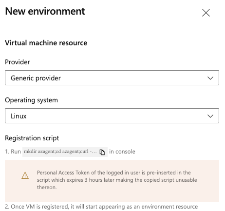
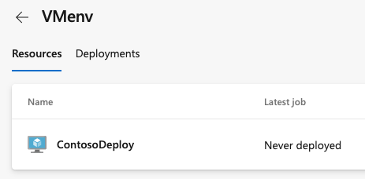

# Deploy to a Linux Virtual Machine

> [!NOTE]
> If you want to deploy your application to a Linux virtual machine using the classic editor, see [Deploy web apps to Linux VMs](../apps/cd/deploy-linuxvm-deploygroups.md).

Azure Pipelines provides a complete, fully featured set of CI/CD automation tools for deployments to virtual machines. 

You can use continuous integration (CI) and continuous deployment (CD) to build, release, and deploy your code. Learn how to set up a CI/CD pipeline for multi-machine deployments.

This article covers how to set up continuous deployment of your app to a web server running on Ubuntu. You can use these steps for any app that publishes a web deployment package.

## Get your sample code

#### [Java](#tab/java)

[!INCLUDE [include](includes/get-code-before-sample-repo-option-to-use-own-code.md)]

```
https://github.com/spring-projects/spring-petclinic
```
> [!NOTE]
> Petclinic is a [Spring Boot](https://spring.io/guides/gs/spring-boot) application built using [Maven](https://spring.io/guides/gs/maven/).

#### [JavaScript](#tab/java-script)

[!INCLUDE [include](includes/get-code-before-sample-repo-option-to-use-own-code.md)] 

```
https://github.com/azure-devops/fabrikam-node
```
> [!NOTE]
> The app was built with [Yeoman](https://yeoman.io/learning/index.html). It uses Express, Bower, and Grunt. The app also has npm package dependencies.
> The sample also contains a script that sets up Nginx and deploys the app. It is executed on the virtual machines. Specifically, the script:
> 1. Installs Node, Nginx, and PM2.
> 2. Configures Nginx and PM2.
> 3. Starts the Node app.

* * * 

## Prerequisites for the Linux VM

Use Ubuntu 16.04 for this quickstart. Follow additional steps for Java or JavaScript.

#### [Java](#tab/java)

- For deploying Java Spring Boot and Spring Cloud based apps, create a Linux VM in Azure using [this](https://azuremarketplace.microsoft.com/marketplace/apps/azul.azul-zulu13-ubuntu-2004) template, which provides a fully supported OpenJDK-based runtime.
- For deploying Java servlets on Tomcat server, create a Linux VM with Java 8 using [this](https://azuremarketplace.microsoft.com/marketplace/apps/azul.azul-zulu13-ubuntu-2004) Azure template and [configure Tomcat 9.x as a service](https://tomcat.apache.org/tomcat-9.0-doc/setup.html).
- For deploying Java EE-based Wildfly app, follow the [blog post](https://azure.github.io/AppService/2020/01/31/Wildfly-on-App-Service.html) here. To provision the VM, use an Azure template to create a [Linux VM + Java + WebSphere 9.x](https://azuremarketplace.microsoft.com/marketplace/apps/midvision.websphere-application-server-nde-90) or a [Linux VM + Java + WebLogic 12.x](https://azuremarketplace.microsoft.com/marketplace/apps/oracle.20191009-arm-oraclelinux-wls-admin) or a [Linux VM +Java](https://azuremarketplace.microsoft.com/marketplace/apps/azul.azul-zulu13-ubuntu-2004) + WildFly/JBoss 14 


#### [JavaScript](#tab/java-script)

- For installing a JavaScript or Node.js app, set up a Linux VM with Nginx in Azure using [this](/azure/virtual-machines/linux/quick-create-cli).

* * * 

## Create an environment with virtual machines

Virtual machines can be added as resources within [environments](../process/environments.md) and can be targeted for multi-VM deployments. 
The deployment history view provides traceability from the VM to the commit.

You can create an environment in **Environments** within **Pipelines**.
1.	Sign into your Azure DevOps organization and navigate to your project.
2.	Navigate to the Pipelines page. Select **Environments** and click **Create Environment**. Specify a **Name** (required) for the environment and a **Description**.
3.	Choose **Virtual Machines** as a **Resource** to be added to the environment. Click **Next**.
4.	Choose the Windows or Linux for the **Operating System** and copy PS registration script. 
5.	Run the copied script from an administrator PowerShell command prompt on each of the target VMs registered with this environment.
    > [!NOTE]
    > - The Personal Access Token (PAT) of the logged in user is pre-inserted in the script and expires after three hours.
    > - If your VM already has any agent running on it, provide a unique name to register with environment.
6.	Once VM is registered, it will start appearing as an environment resource under **Resources**.
    > [!div class="mx-imgBorder"]
    > 

7.	To add more VMs, copy the script again. Click **Add resource** and choose **Virtual Machines**. This script is the same for all the VMs you want to add to the same environment. 
8.	Each machine interacts with Azure Pipelines to coordinate deployment of your app.
    > [!div class="mx-imgBorder"]
    > 

9. You can add or remove tags for the VM. Click on the dots at the end of each VM resource in **Resources**.
The tags you assign allow you to limit deployment to specific VMs when the environment is used in a deployment job. Tags are each limited to 256 characters, but there is no limit to the number of tags you can create.
    > [!div class="mx-imgBorder"]
    > 

* * * 

## Define your CI build pipeline

You'll need a continuous integration (CI) build pipeline that publishes your web application and a deployment script that can be run locally on the Ubuntu server. Set up a CI build pipeline based on the runtime you want to use. 

1. Sign in to your Azure DevOps organization and navigate to your project.

1. In your project, navigate to the **Pipelines** page. Then choose the action to create a new pipeline.

1. Walk through the steps of the wizard by first selecting **GitHub** as the location of your source code.

1. You may be redirected to GitHub to sign in. If so, enter your GitHub credentials.

1. When the list of repositories appears, select your desired sample app repository.

1. Azure Pipelines will analyze your repository and recommend a suitable pipeline template.

#### [Java](#tab/java)

Select the **starter** template and copy this YAML snippet to build your Java project and runs tests with Apache Maven:
```YAML
- job: Build
    displayName: Build Maven Project
    steps:
    - task: Maven@3
      displayName: 'Maven Package'
      inputs:
        mavenPomFile: 'pom.xml'
    - task: CopyFiles@2
      displayName: 'Copy Files to artifact staging directory'
      inputs:
        SourceFolder: '$(System.DefaultWorkingDirectory)'
        Contents: '**/target/*.?(war|jar)'
        TargetFolder: $(Build.ArtifactStagingDirectory)
    - upload: $(Build.ArtifactStagingDirectory)
      artifact: drop
```
For more guidance, follow the steps mentioned in [Build your Java app with Maven](java.md) for creating a build.

#### [JavaScript](#tab/java-script)

Select the **starter** template and copy this YAML snippet to build a general Node.js project with npm.
```YAML
- stage: Build
  displayName: Build stage
  jobs:  
  - job: Build
    displayName: Build
    - task: NodeTool@0
      inputs:
        versionSpec: '10.x'
      displayName: 'Install Node.js'
    - script: |
        npm install
        npm run build --if-present
        npm run test --if-present
      displayName: 'npm install, build and test'
    - task: ArchiveFiles@2
      displayName: 'Archive files'
      inputs:
        rootFolderOrFile: '$(System.DefaultWorkingDirectory)'
        includeRootFolder: false
        archiveType: zip
        archiveFile: $(Build.ArtifactStagingDirectory)/$(Build.BuildId).zip
        replaceExistingArchive: true
    - upload: $(Build.ArtifactStagingDirectory)/$(Build.BuildId).zip
      artifact: drop
```
For more guidance, follow the steps mentioned in [Build your Node.js app with gulp](javascript.md) for creating a build.

- Select **Save and run**, then select **Commit directly to the main branch**, and then choose **Save and run** again.

- A new run is started. Wait for the run to complete.

* * * 

## Define CD steps to deploy to the Linux VM
1. Edit your pipeline and include a [deployment job](../process/deployment-jobs.md) by referencing the environment and the VM resources you created earlier:
    ```YAML
    jobs:  
    - deployment: VMDeploy
      displayName: web
      environment:
        name:  <environment name>
        resourceType: VirtualMachine
        tags: web1
      strategy:
    ```
2. You can select specific sets of virtual machines from the environment to receive the deployment by specifying the **tags** that you have defined for each virtual machine in the environment.
[Here](../yaml-schema.md?tabs=schema#deployment-job) is the complete YAML schema for Deployment job.

3. You can specify either `runOnce` or `rolling` as a deployment strategy. 

   `runOnce` is the simplest deployment strategy. All the life-cycle hooks, namely `preDeploy` `deploy`, `routeTraffic`, and `postRouteTraffic`, are executed once. Then,  either `on:` `success` or `on:` `failure` is executed.

   Below is an example YAML snippet for `runOnce` :
   ```YAML
   jobs:
   - deployment: VMDeploy
     displayName: web
     pool:
       vmImage: 'ubuntu-latest'
     environment:
       name: <environment name>
       resourceType: VirtualMachine
     strategy:
       runOnce:
         deploy:
           steps:
           - script: echo my first deployment
   ```

4. Below is an example YAML snippet for the rolling strategy. You can update up to 5 targets gets in each iteration. `maxParallel` will determine the number of targets that can be deployed to, in parallel. The selection accounts for absolute number or percentage of targets that must remain available at any time excluding the targets that are being deployed to. It is also used to determine the success and failure conditions during deployment.

    ```YAML
    jobs: 
    - deployment: VMDeploy
      displayName: web
      environment:
        name: <environment name>
        resourceType: VirtualMachine
      strategy:
          rolling:
            maxParallel: 2  #for percentages, mention as x%
            preDeploy:
              steps:
              - download: current
                artifact: drop
              - script: echo initialize, cleanup, backup, install certs
            deploy:
              steps:
              - task: Bash@3
                inputs:
                  targetType: 'inline'
                  script: |
                    # Modify deployment script based on the app type
                    echo "Starting deployment script run"
                    sudo java -jar '$(Pipeline.Workspace)/drop/**/target/*.jar'
            routeTraffic:
              steps:
              - script: echo routing traffic
            postRouteTraffic:
              steps:
              - script: echo health check post-route traffic
            on:
              failure:
                steps:
                - script: echo Restore from backup! This is on failure
              success:
                steps:
                - script: echo Notify! This is on success
    ```
    With each run of this job, deployment history is recorded against the `<environment name>` environment that you have created and registered the VMs.

## Pipeline traceability views in environment
The **Deployments**  view provides complete traceability of commits and work items, and a cross-pipeline deployment history per environment.
> [!div class="mx-imgBorder"]
> 
  
> [!div class="mx-imgBorder"]
> 

## Next Steps
To learn more about the topics in this guide see [Jobs](../process/phases.md), [Tasks](../process/tasks.md), [Catalog of Tasks](../tasks/index.md), [Variables](../process/variables.md), [Triggers](../build/triggers.md), or [Troubleshooting](../troubleshooting/troubleshooting.md).

To learn what else you can do in YAML pipelines, see [YAML schema reference](../yaml-schema.md).