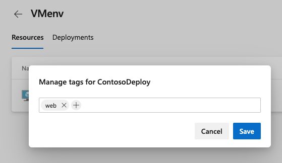

# Deploy to a Linux Virtual Machine

[!INCLUDE [version-eq-azure-devops](../../includes/version-eq-azure-devops.md)]

Learn how to set up a continuous improvement/continuous development (CI/CD) pipeline for multi-virtual machine deployments. Use the instructions in this article for any app that publishes a web deployment package.

> [!NOTE]
> If you want to deploy your application to a Linux virtual machine using the classic editor, see [Deploy web apps to Linux virtual machines (VMs)](../apps/cd/deploy-linuxvm-deploygroups.md).

## Get your sample code

#### [Java](#tab/java)

[!INCLUDE [include](includes/get-code-before-sample-repo-option-to-use-own-code.md)]

```
https://github.com/spring-projects/spring-petclinic
```
> [!NOTE]
> Petclinic is a [Spring Boot](https://spring.io/guides/gs/spring-boot) application built using [Maven](https://spring.io/guides/gs/maven/).

#### [JavaScript](#tab/javascript)

[!INCLUDE [include](includes/get-code-before-sample-repo-option-to-use-own-code.md)] 

```
https://github.com/azure-devops/fabrikam-node
```
> [!NOTE]
> The app was built with [Yeoman](https://yeoman.io/learning/index.html) and uses Express, Bower, and Grunt. The app also has npm package dependencies.
> The sample also contains a script that sets up Nginx and deploys the app. The script gets executed on the virtual machines - specifically, the script does the following tasks:
> - Installs Node, Nginx, and PM2
> - Configures Nginx and PM2
> - Starts the Node app

* * * 

## Prerequisites for the Linux VM

Use Ubuntu 16.04 for following the next section in this article, and more steps for Java or JavaScript.

#### [Java](#tab/java)

- To deploy a Java Spring Boot and Spring Cloud based apps, create a Linux VM in Azure using [this](https://azuremarketplace.microsoft.com/marketplace/apps/azul.azul-zulu13-ubuntu-2004) template, which provides a fully supported OpenJDK-based runtime.
- To deploy Java servlets on Tomcat server, create a Linux VM with Java 8 using [this Azure template](https://azuremarketplace.microsoft.com/marketplace/apps/azul.azul-zulu13-ubuntu-2004) and [configure Tomcat 9.x as a service](https://tomcat.apache.org/tomcat-9.0-doc/setup.html).
- To deploy a Java EE-based Wildfly app, follow the [blog post](https://azure.github.io/AppService/2020/01/31/Wildfly-on-App-Service.html). To provision the VM, use an Azure template to create a [Linux VM + Java + WebSphere 9.x](https://azuremarketplace.microsoft.com/marketplace/apps/midvision.websphere-application-server-nde-90) or a [Linux VM + Java + WebLogic 12.x](https://azuremarketplace.microsoft.com/marketplace/apps/oracle.20191009-arm-oraclelinux-wls-admin) or a [Linux VM +Java](https://azuremarketplace.microsoft.com/marketplace/apps/azul.azul-zulu13-ubuntu-2004) + WildFly/JBoss 14. 


#### [JavaScript](#tab/javascript)

- To install a JavaScript or Node.js app, set up a Linux VM with Nginx in Azure, see [Create a Linux VM with Azure CLI](/azure/virtual-machines/linux/quick-create-cli).

* * * 

## Create an environment with virtual machines

You can add virtual machines as resources within [environments](../process/environments.md) and target for multi-VM deployments. The deployment history view provides traceability from the VM to the commit.

1. Sign into your Azure DevOps organization and navigate to your project.
2. Go to the Pipelines page and select **Environments** > **Create Environment**. 
3. Specify a **Name** (required) for the environment and a **Description**.
4. Choose **Virtual Machines** as a **Resource** to be added to the environment, and then select **Next**.
5. Choose the Windows or Linux for the **Operating System** and copy the PowerShell registration script. 
6. Run the PowerShell registration script on each of the target VMs registered with the environment.
   
   > [!NOTE]
   > - The Personal Access Token (PAT) of the signed in user gets pre-inserted in the script and expires after three hours.
   > - If your VM already has any agent running on it, provide a unique name to register with the environment.
7.	Once VM is registered, it will start appearing as an environment resource under **Resources**.

    :::image type="content" source="media/vm-creation.png" alt-text="VMcreation screenshot.":::

8.	To add more VMs, copy the script again. Select **Add resource** and choose **Virtual Machines**. This script is the same for all the VMs you want to add to the same environment. 
   
    Each machine interacts with Azure Pipelines to coordinate deployment of your app.

    :::image type="content" source="media/vm-resourceview.png" alt-text="VMresource view":::

9. You can add or remove tags for the VM. Select on the dots at the end of each VM resource in **Resources**.
   
   Tags limit deployment to specific VMs when the environment's used in a deployment job. Each tag is limited to 256 characters. There's no limit to the number of tags you can create.
   
   > [!div class="mx-imgBorder"]
   > 

* * *

## Define your CI build pipeline

You need a CI build pipeline that publishes your web app. You also need a deployment script that can be run locally on the Ubuntu server. Set up a CI build pipeline based on the runtime you want to use. 

1. Sign in to your Azure DevOps organization and go to your project.

2. In your project, go to the **Pipelines** page, and then choose the action to create a new pipeline.

3. Select **GitHub** as the location of your source code.

   You may be redirected to GitHub to sign in. If so, enter your GitHub credentials.

4. When the list of repositories appears, select the sample app repository that you want.

5. Azure Pipelines analyzes your repository and recommends a suitable pipeline template.

#### [Java](#tab/java)

Select the **starter** template and copy this YAML snippet to build your Java project and run tests with Apache Maven:

```YAML
- job: Build
    displayName: Build Maven Project
    steps:
    - task: Maven@3
      displayName: 'Maven Package'
      inputs:
        mavenPomFile: 'pom.xml'
    - task: CopyFiles@2
      displayName: 'Copy Files to artifact staging directory'
      inputs:
        SourceFolder: '$(System.DefaultWorkingDirectory)'
        Contents: '**/target/*.?(war|jar)'
        TargetFolder: $(Build.ArtifactStagingDirectory)
    - upload: $(Build.ArtifactStagingDirectory)
      artifact: drop
```

For more information, do the steps mentioned in [Build your Java app with Maven](java.md) for creating a build.

#### [JavaScript](#tab/javascript)

Select the **starter** template and copy this YAML snippet to build a general Node.js project with npm.

```YAML
- stage: Build
  displayName: Build stage
  jobs:  
  - job: Build
    displayName: Build
    - task: NodeTool@0
      inputs:
        versionSpec: '10.x'
      displayName: 'Install Node.js'
    - script: |
        npm install
        npm run build --if-present
        npm run test --if-present
      displayName: 'npm install, build and test'
    - task: ArchiveFiles@2
      displayName: 'Archive files'
      inputs:
        rootFolderOrFile: '$(System.DefaultWorkingDirectory)'
        includeRootFolder: false
        archiveType: zip
        archiveFile: $(Build.ArtifactStagingDirectory)/$(Build.BuildId).zip
        replaceExistingArchive: true
    - upload: $(Build.ArtifactStagingDirectory)/$(Build.BuildId).zip
      artifact: drop
```
For more guidance, follow the steps mentioned in [Build your Node.js app with gulp](javascript.md) for creating a build.

- Select **Save and run** > **Commit directly to the main branch** > **Save and run**.

  A new run starts. Wait for the run to complete.

* * * 

## Define CD steps to deploy to the Linux VM

1. Edit your pipeline and include a [deployment job](../process/deployment-jobs.md) by referencing the environment and the VM resources you created earlier:

    ```YAML
    jobs:  
    - deployment: VMDeploy
      displayName: web
      environment:
        name:  <environment name>
        resourceType: VirtualMachine
        tags: web1
      strategy:
    ```
2. Select specific sets of VMs from the environment to receive the deployment by specifying the **tags** that you've defined for each VM in the environment.

   For more information, see the [complete YAML schema for deployment job](/azure/devops/pipelines/yaml-schema/jobs-deployment).

3. Specify either `runOnce` or `rolling` as a deployment strategy. 

   `runOnce` is the simplest deployment strategy. All the life-cycle hooks, namely `preDeploy` `deploy`, `routeTraffic`, and `postRouteTraffic`, get executed once. Then, either `on:` `success` or `on:` `failure` gets executed.

   See the following example of a YAML snippet for `runOnce` :
   ```YAML
   jobs:
   - deployment: VMDeploy
     displayName: web
     pool:
       vmImage: 'ubuntu-latest'
     environment:
       name: <environment name>
       resourceType: VirtualMachine
     strategy:
       runOnce:
         deploy:
           steps:
           - script: echo my first deployment
   ```

4. See the following example of a YAML snippet for the rolling strategy. You can update up to five targets gets in each iteration. `maxParallel` determines the number of targets that can be deployed to, in parallel. The selection accounts for absolute number or percentage of targets that must remain available at any time, excluding the targets being deployed to. It's also used to determine the success and failure conditions during deployment.

    ```YAML
    jobs: 
    - deployment: VMDeploy
      displayName: web
      environment:
        name: <environment name>
        resourceType: VirtualMachine
      strategy:
          rolling:
            maxParallel: 2  #for percentages, mention as x%
            preDeploy:
              steps:
              - download: current
                artifact: drop
              - script: echo initialize, cleanup, backup, install certs
            deploy:
              steps:
              - task: Bash@3
                inputs:
                  targetType: 'inline'
                  script: |
                    # Modify deployment script based on the app type
                    echo "Starting deployment script run"
                    sudo java -jar '$(Pipeline.Workspace)/drop/**/target/*.jar'
            routeTraffic:
              steps:
              - script: echo routing traffic
            postRouteTraffic:
              steps:
              - script: echo health check post-route traffic
            on:
              failure:
                steps:
                - script: echo Restore from backup! This is on failure
              success:
                steps:
                - script: echo Notify! This is on success
    ```
    With each run of this job, deployment history gets recorded against the `<environment name>` environment that you've created and registered the VMs.

## Pipeline traceability views in environment

The **Deployments** view provides complete traceability of commits and work items, and a cross-pipeline deployment history per environment.

> [!div class="mx-imgBorder"]
> 
  
> [!div class="mx-imgBorder"]
> 

## Next steps

> [!div class="nextstepaction"]
> [Learn more about Jobs](../process/phases.md)

## Related articles
 
- [Tasks](../process/tasks.md)
- [Catalog of Tasks](../tasks/index.md)
- [Variables](../process/variables.md)
- [Triggers](../build/triggers.md)
- [Troubleshooting](../troubleshooting/troubleshooting.md).
- [YAML schema reference](/azure/devops/pipelines/yaml-schema).
