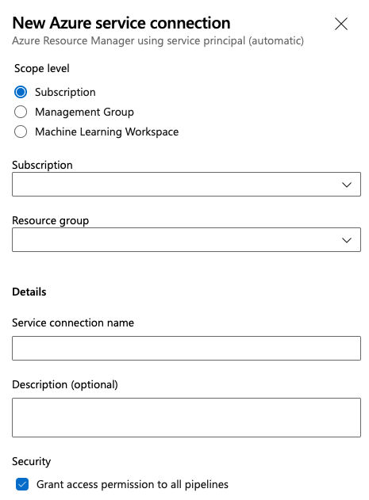

Now create the service connection:

1. From your project dashboard, select **Project settings** on the bottom left.

2. On the settings page, select **Pipelines** > **Service connections**, select **New service connection**, and then select **Azure Resource Manager**.

3. Select **Service principal (automatic)** and **Next**.

3. The **Add an Azure Resource Manager service connection** dialog box appears. 
   * **Scope** Select **Subscription**.
   * **Subscription** Select your Azure portal subscription.
   * **Resource Group** Select the resource group you created earlier.
   * **Service connection name** Type a name and then copy and paste it into a text file so you can use it later. 
   * Select **Grant access permission to all pipelines**.

   

> [!Tip]
> If you need to create a connection to an Azure subscription that's owned by someone else, see [Create an Azure Resource Manager service connection with an existing service principal](../../library/connect-to-azure.md#create-an-azure-resource-manager-service-connection-with-an-existing-service-principal).