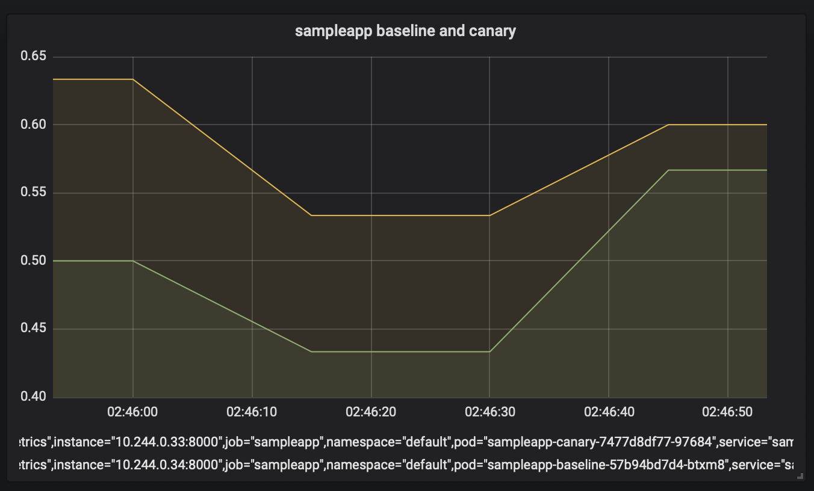

# Canary deployment strategy for Kubernetes deployments
[!INCLUDE [include](../../_shared/version-team-services.md)]

Canary deployment strategy involves deploying new versions of application next to stable production versions to see how the canary version compares against the baseline before promoting or rejecting the deployment. This step-by-step guide covers usage of [Kubernetes manifest task's](../../tasks/deploy/kubernetes-manifest.md) canary strategy support for setting up canary deployments for Kubernetes and the associated workflow in terms of instrumenting code and using the same for comparing baseline and canary before taking a manual judgment on promotion/rejection of the canary.

## Pre-requisites
- A repository in Azure Container Registry or Docker Hub (Azure Container Registry, Google Container Registry, Docker Hub) with push privileges.
- Any Kubernetes cluster (Azure Kubernetes Service, Google Kubernetes Engine, Amazon Elastic Kubernetes Service).

## Sample code

Fork the following repository on GitHub - 
```
https://github.com/MicrosoftDocs/azure-pipelines-canary-k8s
```

Here's a brief overview of the files in the repository that are used during the course of this guide - 
- ./app:
    - app.py - Simple Flask based web server instrumented using [Prometheus instrumentation library for Python applications](https://github.com/prometheus/client_python). A custom counter is set up for the number of 'good' and 'bad' responses given out based on the value of `success_rate` variable.
    - Dockerfile - Used for building the image with each change made to app.py. With each change made to app.py, build pipeline (CI) is triggered and the image gets built and pushed to the container registry.
- ./manifests:
    - deployment.yml - Contains specification of the `sampleapp` Deployment workload corresponding to the image published earlier. This manifest file is used not just for the stable version of Deployment object, but for deriving the -baseline and -canary variants of the workloads as well.
    - service.yml - Creates `sampleapp` service for routing requests to the pods spun up by the Deployments (stable, baseline, and canary) mentioned above.
- ./misc
    - service-monitor.yml - Used for setup of a [ServiceMonitor](https://github.com/coreos/prometheus-operator#customresourcedefinitions) object to set up Prometheus metric scraping.
    - fortio-deploy.yml - Used for setup of fortio deployment that is subsequently used as a load-testing tool to send a stream of requests to the `sampleapp` service deployed earlier. With `sampleapp` service's selector being applicable for all the three pods resulting from the Deployment objects that get created during the course of this how-to guide - `sampleapp`, `sampleapp-baseline` and `sampleapp-canary`, the stream of requests sent to `sampleapp` get routed to pods under all these three deployments.

> [!NOTE]
> While [Prometheus](https://prometheus.io/) is used for code instrumentation and monitoring in this how-to guide, any equivalent solution like [Azure Application Insights](https://docs.microsoft.com/en-us/azure/azure-monitor/learn/nodejs-quick-start) can be used as an alternative as well.

## Install prometheus-operator
Use the following command from your development machine (with kubectl and Helm installed and context set to the cluster you want to deploy against) to install Prometheus on your cluster. [Grafana](https://grafana.com), which is used later in this how-to guide for visualizing the baseline and canary metrics on dashboards, is installed as part of this Helm chart  - 
```
helm install --name sampleapp stable/prometheus-operator
```


## Create service connections
- Navigate to **Project settings** -> **Pipelines** -> **Service connections**.
- Create a [Docker registry service connection](../../library/service-endpoints.md#sep-docreg) associated with your container registry. Name it **azure-pipelines-canary-k8s**.
- Create a [Kubernetes service connection](../../library/service-endpoints.md#sep-kuber) for the Kubernetes cluster and namespace you want to deploy to. Name it **azure-pipelines-canary-k8s**.

## Setup continuous integration
1. Navigate to **Pipelines** -> **New pipeline** and select your repository.
1. Upon reaching **Configure** tab, choose **Starter pipeline**
1. In **Review** tab, replace the contents of the pipeline YAML with the following snippet - 
    ```YAML
    trigger:
    - master
    
    pool:
      vmImage: Ubuntu-16.04
    
    variables:
      imageName: azure-pipelines-canary-k8s
    
    steps:
    - task: Docker@2
      displayName: Build and push image
      inputs:
        containerRegistry: dockerRegistryServiceConnectionName #replace with name of your Docker registry service connection
        repository: $(imageName)
        command: buildAndPush
        Dockerfile: app/Dockerfile
        tags: |
          $(Build.BuildId)
    ```
    If the Docker registry service connection created by you was associated with `foobar.azurecr.io`, then the image is to `foobar.azurecr.io/azure-pipelines-canary-k8s:$(Build.BuildId)` based on the above configuration.

## Edit manifest file
In manifests/deployment.yml, replace `<foobar>` with your container registry's URL. For example after replacement, the image field should look something like `contosodemo.azurecr.io/azure-pipelines-canary-k8s`.

## Setup continuous deployment

### Deploy canary stage
1. Navigate to **Pipelines** -> **Releases** -> **New** -> **New release pipeline**. Name it **CanaryK8sDemo**
1. In the subsequent model for selecting a template for Stage 1, choose **Empty job**. Name the stage as **Deploy canary**.
1. Select **Add an artifact**, choose **GitHub**, and configure the following - 
    - Choose an existing Git service connection or create a new one through which the forked repository can be accessed, and then choose the same in **Source (repository)** dropdown.
    - **Default branch**: master
    - **Default version**: Latest from the default branch
    - **Source alias**: azure-pipelines-canary-k8s
    - Confirm your inputs by choosing **Add**.
1. Select **Add an artifact**, choose **Azure container registry** or **Docker Hub** depending on the container registry you had chosen under pre-requisites. Provide appropriate values for the input dropdowns to locate your container registry, provide `image` as the alias for this artifact, and confirm the inputs by choosing **Add**. Once the artifact has been added, click on the lightning bolt icon on the artifact card to enable continuous deployment trigger.
1. In **Deploy Canary** stage that you just created, click on **1 job, 0 task** link to be navigated to the window for adding jobs and stages
1. Click on **Agent job**. In the configuration window, in the **Agent pool** dropdown window, choose **Hosted Ubuntu 1604**
1. Click on the '+' on the agent job row to add a new task. Add **Deploy Kubernetes manifests** task with the following configuration -
    - **Display name**: Create secret
    - **Action**: create secret
    - **Kubernetes service connection**: azure-pipelines-canary-k8s
    - **Namespace**: namespace within the cluster you want to deploy to
    - **Type of secret**: dockerRegistry
    - **Secret name**: azure-pipelines-canary-k8s
    - **Docker registry service connection**: azure-pipelines-canary-k8s
1. Add another **Deploy Kubernetes manifests** task with the following configuration -
    - **Display name**: Deploy canary
    - **Action**: deploy
    - **Kubernetes service connection**: azure-pipelines-canary-k8s
    - **Namespace**: namespace within the cluster you want to deploy to
    - **Strategy**: Canary
    - **Percentage**: 25
    - **Manifests**: azure-pipelines-canary-k8s/manifests/*
    - **Containers**: <foobar>/azure-pipelines-canary-k8s:$(Release.Artifacts.image.BuildId) where `<foobar>` is to be replaced with the container registry URL
    - **ImagePullSecrets**: azure-pipelines-canary-k8s
1. Add another **Deploy Kubernetes manifests** task with the following configuration -
    - **Display name**: Deploy Fortio and ServiceMonitor
    - **Action**: deploy
    - **Kubernetes service connection**: azure-pipelines-canary-k8s
    - **Namespace**: namespace within the cluster you want to deploy to
    - **Strategy**: None
    - **Manifests**: azure-pipelines-canary-k8s/misc/*

### Manual intervention for promoting or rejecting canary
1. Click on **Pipeline** tab to go back to the pipeline view. Add a new stage named **Promote/reject canary** based on the empty job template.
1. Add an agentless job to this stage and reorder this job to be the first job of this stage. Name this agentless job **Promote/reject input**.
1. Add a **Manual Intervention** task to this job and change the display name of the task to **Promote or reject canary**
1. Configure the currently empty agent job placed after the **Promote/reject input** agentless job as follows - 
    - **Display name**: Promote canary
    - **Agent pool**: Hosted Ubuntu 1604
    - **Run this job**: Only when all previous jobs have succeeded
1. Add **Deploy Kubernetes manifests** task with the following configuration to the **Promote canary** job -
    - **Display name**: Promote canary
    - **Action**: promote
    - **Kubernetes service connection**: azure-pipelines-canary-k8s
    - **Namespace**: namespace within the cluster you want to deploy to
    - **Strategy**: Canary
    - **Percentage**: 25
    - **Manifests**: azure-pipelines-canary-k8s/manifests/*
    - **Containers**: <foobar>/azure-pipelines-canary-k8s:$(Release.Artifacts.image.BuildId) where `<foobar>` is to be replaced with the container registry URL
    - **ImagePullSecrets**: azure-pipelines-canary-k8s
1. Add another agent job with the following configuration after **Promote canary** agent job - 
    - **Display name**: Reject canary
    - **Agent pool**: Hosted Ubuntu 1604
    - **Run this job**: Only when a previous job has failed
1. Add **Deploy Kubernetes manifests** task with the following configuration to the **Reject canary** job -
    - **Display name**: Reject canary
    - **Action**: promote
    - **Kubernetes service connection**: azure-pipelines-canary-k8s
    - **Namespace**: namespace within the cluster you want to deploy to
    - **Strategy**: Canary
    - **Percentage**: 25
    - **Manifests**: azure-pipelines-canary-k8s/manifests/*

## Deploy a stable version
Currently for the first run of the pipeline, the stable version of the workloads and their baseline/canary version do not exist in the cluster. To deploy the stable version -
1. In `app/app.py`, change `success_rate = 5` to `success_rate = 10`.This change triggers the  pipeline leading to build and push of the image to container registry. The continuous deployment trigger setup earlier on the image push event results in triggering of the release pipeline.
2. In the **CanaryK8sDemo** release pipeline, select the **Promote/reject canary** stage of the release where it is waiting on manual intervention.
3. Click on **Resume/Reject** button and then on **Resume button** in the subsequent dialog box. This will result in the stable version of the workloads (`sampleapp` deployment in manifests/deployment.yml) being deployed to the namespace

## Initiate canary workflow
Once the above release has been completed, the stable version of workload `sampleapp` now exists in the cluster. To understand how baseline and canaries are created for comparison purposes with every subsequent deployment, perform the following changes to the simulation application - 
1. In `app/app.py`, change `success_rate = 10` to `success_rate = 20`

The above change triggers build pipeline resulting in build and push of image to the container registry, which in turn triggers the release pipeline and the commencement of **Deploy canary** stage.

## Simulate requests
On your development machine, run the following commands and keep it running to send a constant stream of requests at the `sampleapp` service. `sampleapp` service routes the requests to the pods spun by stable `sampleapp` deployment and the pods spun up by `sampleapp-baseline` and `sampleapp-canary` deployments as the selector specified for `sampleapp` is applicable for all these pods.

```
FORTIO_POD=$(kubectl get pod | grep fortio | awk '{ print $1 }')
kubectl exec -it $FORTIO_POD -c fortio /usr/bin/fortio -- load -allow-initial-errors -t 0 http://sampleapp:8080/
```

## Setup Grafana dashboard
1. Run the following port forwarding command on your local development machine to be able to access Grafana -
    ```
    kubectl port-forward svc/sampleapp-grafana 3000:80
    ```
1. In a browser, open the following URL -
    ```
    http://localhost:3000/login
    ```
1. When prompted for login credentials, unless the adminPassword value was overridden during prometheus-operator Helm chart installation, use the following values - 
    - username: admin
    - password: prom-operator
1. In the left navigation menu, choose **+** -> **Dashboard** -> **Graph**
1. Click anywhere on the newly added panel and type `e` to edit the panel.
1. In the **Metrics** tab, enter the following query -
    ```
    rate(requests_total{pod=~"sampleapp-.*", custom_status="good"}[1m])
    ```
1. In the **General** tab, change the name of this panel to **All sampleapp pods**
1. In the overview bar at the top of the page, change the duration range to **Last 5 minutes** or **Last 15 minutes**.
1. Click on the save icon in the overview bar to save this panel.
1. While the above panel visualizes success rate metrics from all the variants - stable (from `sampleapp` deployment), baseline (from `sampleapp-baseline` deployment) and canary (from `sampleapp-canary` deployment), you can visualize just the baseline and canary metrics by adding another panel with the following configuration - 
    - **General** tab -> **Title**: sampleapp baseline and canary
    - **Metrics** tab -> query to be used: 
    ```
    rate(requests_total{pod=~"sampleapp-baseline-.*|sampleapp-canary-.*", custom_status="good"}[1m])
    ```
    
    > [!NOTE]
    > Note that the panel for baseline and canary metrics will only have metrics available for comparison when the **Deploy canary** stage has successfully completed and the **Promote/reject canary** stage is waiting on manual intervention.

    > [!Tip]
    > Setup [annotations for Grafana dashboards](../../../service-hooks/services/grafana.md) to visually depict stage completion events for **Deploy canary** and **Promote/reject canary** so that you know when to start comparing baseline with canary and when the promotion/rejection of canary has completed respectively.


## Compare baseline and canary
1. At this point, with **Deploy canary** stage having successfully completed (based on the change of `success_rate` from '10' to '20') and with the **Promote/reject canary** stage is waiting on manual intervention, one can compare the success rate (as determined by custom_status=good) of baseline and canary variants in the Grafana dashboard. It should look similar to the below image - 

    > [!div class="mx-imgBorder"]
    > 

1. Based on the observation that the success rate is higher for canary, promote the canary by clicking on **Resume** in the manual intervention task
