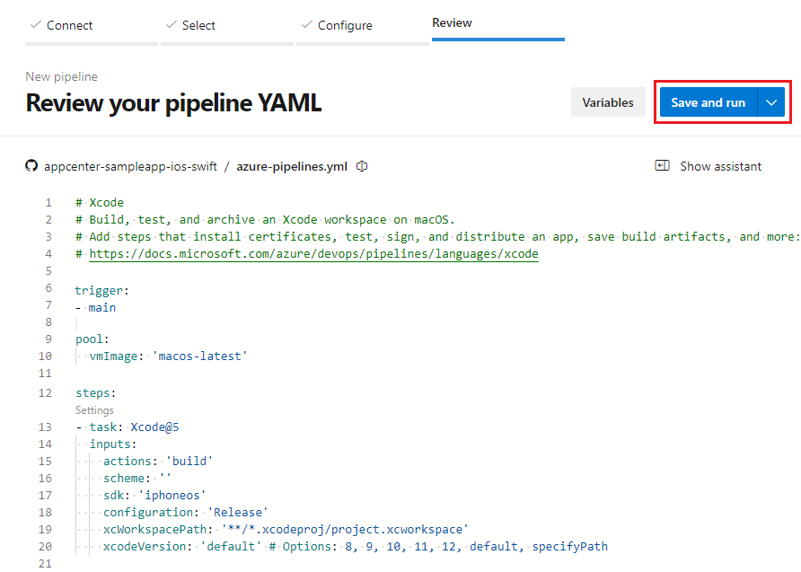

# Build, test, and deploy PHP apps

[!INCLUDE [version-eq-azure-devops](../../includes/version-eq-azure-devops.md)]

This article shows how to create a pipeline in Azure Pipelines that builds a PHP web app and deploys it to Azure App Service. App Service is an HTTP-based service for hosting web applications, REST APIs, and mobile back ends. The pipeline uses continuous integration from GitHub source and continuous delivery to App Service to automatically build, test, and deploy PHP apps.

Azure Pipelines builds your PHP projects without you having to set up any infrastructure. PHP is preinstalled on [Microsoft-hosted agents](../agents/hosted.md), along with many common libraries for PHP versions. You can use Linux, macOS, or Windows agents to run your builds. For more information about which PHP versions are preinstalled, see [Software](../agents/hosted.md#software).

## Prerequisites

- Your own fork of the sample GitHub PHP project at [https://github.com/Azure-Samples/php-docs-hello-world](https://github.com/Azure-Samples/php-docs-hello-world).

  > [!TIP]
  > The sample project uses PHP's default time zone settings, which default to UTC on Microsoft-hosted agents. If your app needs a specific time zone, refer to [Set the PHP time zone](#set-the-php-time-zone).

- A PHP web app created for the project in Azure App Service. To quickly create a PHP web app, see [Create a PHP web app in Azure App Service](/azure/app-service/quickstart-php). You can also use your own PHP GitHub project and web app.

You also need the following prerequisites:

[!INCLUDE [ecosystems-prerequisites](includes/ecosystems-prerequisites.md)]

## Example pipeline

The following example *azure-pipelines.yml* file, based on the **PHP as Linux Web App on Azure** pipeline [template](../process/templates.md), has two stages: `Build` and `Deploy`. The `Build` stage installs PHP 8.2, and then runs tasks to archive your project files and publish a ZIP build artifact to a package named `drop`.

The `Deploy` stage runs if the `Build` stage succeeds. It deploys the `drop` package to App Service by using the [Azure Web App](/azure/devops/pipelines/tasks/reference/azure-web-app-v1) task. When you use the **PHP as Linux Web App on Azure** template to create your pipeline, the generated pipeline sets and uses variables and other values based on your configuration settings.

>[!NOTE]
>If you create your pipeline from the **PHP as Linux Web App on Azure** [template](../process/templates.md), and your PHP app doesn't use Composer, remove the following lines from the generated pipeline before you save and run it. The template pipeline fails as is if *composer.json* isn't present in the repo.
>
>```yaml
>     - script: composer install --no-interaction --prefer-dist
>      workingDirectory: $(rootFolder)
>      displayName: 'Composer install'
>```

```yaml
trigger:
- main

variables:
  # Azure Resource Manager service connection
  azureSubscription: 'service-connection-based-on-subscription-id'
  # Web app name
  webAppName: 'my-php-web-app'
  # Agent VM image name
  vmImageName: 'ubuntu-22.04'
  # Environment name
  environmentName: 'my-php-web-app-environment'
  # Root folder where your composer.json file is available.
  rootFolder: $(System.DefaultWorkingDirectory)

stages:
- stage: Build
  displayName: Build stage
  variables:
    phpVersion: '8.2'
  jobs:
  - job: BuildJob
    pool:
      vmImage: $(vmImageName)
    steps:
    - script: |
        sudo update-alternatives --set php /usr/bin/php$(phpVersion)
        sudo update-alternatives --set phar /usr/bin/phar$(phpVersion)
        sudo update-alternatives --set phpdbg /usr/bin/phpdbg$(phpVersion)
        sudo update-alternatives --set php-cgi /usr/bin/php-cgi$(phpVersion)
        sudo update-alternatives --set phar.phar /usr/bin/phar.phar$(phpVersion)
        php -version
      workingDirectory: $(rootFolder)
      displayName: 'Use PHP version $(phpVersion)'

    - task: ArchiveFiles@2
      displayName: 'Archive files'
      inputs:
        rootFolderOrFile: '$(rootFolder)'
        includeRootFolder: false
        archiveType: zip
        archiveFile: $(Build.ArtifactStagingDirectory)/$(Build.BuildId).zip
        replaceExistingArchive: true

    - upload: $(Build.ArtifactStagingDirectory)/$(Build.BuildId).zip
      displayName: 'Upload package'
      artifact: drop

- stage: Deploy
  displayName: 'Deploy Web App'
  dependsOn: Build
  condition: succeeded()
  jobs:
  - deployment: DeploymentJob
    pool:
      vmImage: $(vmImageName)
    environment: $(environmentName)
    strategy:
      runOnce:
        deploy:
          steps:
          - task: AzureWebApp@1
            displayName: 'Deploy Azure Web App'
            inputs:
              azureSubscription: $(azureSubscription)
              appName: $(webAppName)
              package: $(Pipeline.Workspace)/drop/$(Build.BuildId).zip
```

## Create the YAML pipeline

To create and run the example pipeline, take the following steps:

1. In your Azure DevOps project, select **Pipelines** from the left navigation menu, and then select **New pipeline** or **Create pipeline** if this pipeline is the first in the project.
1. On the **Where is your code** page, select **GitHub**.
1. On the **Select a repository** page, select your forked **php-docs-hello-world** repository.
1. Azure Pipelines recognizes the code as a PHP app, and suggests several pipeline [templates](../process/templates.md) on the **Configure your pipeline** page. For this example, select **PHP as Linux Web App on Azure**.
1. On the next screen, select your Azure subscription and select **Continue**. This action creates a service connection to your Azure resources.
1. On the next screen, select your Azure web app and select **Validate and configure**. Azure Pipelines creates an *azure-pipelines.yml* file and displays it in the YAML pipeline editor.
1. On the **Review your pipeline YAML** screen, review the code for your pipeline. When you're ready, select **Save and run**.

   

1. On the next screen, select **Save and run** again to commit the new *azure-pipelines.yml* file to your repository and start a CI/CD build.

   >[!NOTE]
   >The first time the pipeline runs, it asks for permission to access the environment it creates. Select **Permit** to grant permission for the pipeline to access the environment.

1. To watch your pipeline in action, select the job on the run **Summary** page. When the run completes, select the **App Service Application URL** link in the **Deploy Azure Web App** step to see the deployed web app.
1. Verify the deployment succeeded by browsing to the URL. You should see the sample app's **Hello World!** output.

## Customize the pipeline

You can edit the pipeline by selecting the **More actions** icon at upper right on the run **Summary** page and then selecting **Edit pipeline**, or by selecting **Edit** at upper right on the pipeline's page. Each edit that you commit to the repository kicks off a new CI/CD pipeline run.

You can customize the pipeline in several ways:

### Use a specific PHP version

Microsoft-hosted Ubuntu agents have multiple PHP versions installed. A symlink at */usr/bin/php* points to the current PHP version, so when you run `php`, the set version executes.

To use a PHP version other than the default, point the symlink to the desired version by using the `update-alternatives` command. In your YAML pipeline, change the value of the `phpVersion` variable to the version you want. Add the following snippet to the `variables` and `steps` sections of your build stage:

```yaml
variables:
  phpVersion: 8.3

steps:
- script: |
    sudo update-alternatives --set php /usr/bin/php$(phpVersion)
    sudo update-alternatives --set phar /usr/bin/phar$(phpVersion)
    sudo update-alternatives --set phpdbg /usr/bin/phpdbg$(phpVersion)
    sudo update-alternatives --set php-cgi /usr/bin/php-cgi$(phpVersion)
    sudo update-alternatives --set phar.phar /usr/bin/phar.phar$(phpVersion)
    php -version
  displayName: 'Use PHP version $(phpVersion)'
```

### Set the PHP time zone

Microsoft-hosted agents default to UTC, so PHP functions like `date()` and `strtotime()` return UTC values. To use a different time zone in your pipeline scripts, set the `TZ` environment variable or call `date_default_timezone_set()` in your PHP code.

The following example sets the time zone to Eastern Time for a script step. Add this snippet to the `steps` section of your build job:

```yaml
- script: |
    export TZ='America/New_York'
    php -r "date_default_timezone_set('America/New_York'); echo date('Y-m-d H:i:s T');"
  displayName: 'Run PHP with Eastern time zone'
```

For a list of supported time zone identifiers, see the [PHP list of supported timezones](https://www.php.net/manual/en/timezones.php).

### Install dependencies

To use Composer to install dependencies, add the following snippet to the `steps` section of your build job:

```yaml
- script: composer install --no-interaction --prefer-dist
  displayName: 'composer install'
```

If your *composer.json* file isn't in the root directory, use the `--working-dir` argument to specify what directory to use. For example, if *composer.json* is in the subfolder */pkgs*, use `composer install --no-interaction --working-dir=pkgs`. You can also specify an absolute path by using the built-in system variable: `--working-dir='$(System.DefaultWorkingDirectory)/pkgs'`.

### Test with PHPUnit

To run tests with PHPUnit, first install it as a dev dependency with Composer, and then run it. Add the following snippet to the `steps` section of your build job:

```yaml
- script: composer require --dev phpunit/phpunit
  displayName: 'Install PHPUnit'

- script: vendor/bin/phpunit --log-junit $(Build.StagingDirectory)/test-results.xml
  displayName: 'Run tests with PHPUnit'
```

### Retain the PHP artifacts with the build record

To save the artifacts of the build with the build record, include the [Archive Files](/azure/devops/pipelines/tasks/reference/archive-files-v2) task in your pipeline, and optionally customize the value of `rootFolderOrFile` to change what the archive includes.

```yaml
- task: ArchiveFiles@2
  inputs:
    rootFolderOrFile: '$(System.DefaultWorkingDirectory)'
    includeRootFolder: false
```

## Troubleshoot

### Service connection errors

If your pipeline fails with an authorization error during deployment, verify that your [Azure Resource Manager service connection](../library/connect-to-azure.md) is configured correctly and has the required permissions to deploy to your App Service.

### Composer install failures

If `composer install` fails, verify that your *composer.json* file is present in the working directory. If the file is in a subdirectory, use the `--working-dir` argument. If *composer.json* doesn't exist in your repo, remove the Composer step from the pipeline.

### PHP version not available

If `update-alternatives` fails with an error like `no alternatives for php8.x`, the requested PHP version isn't installed on the agent image. Check the [Microsoft-hosted agent software list](../agents/hosted.md#software) for available PHP versions.

### Deployment permission denied

If the deploy stage fails with a permission error, verify that:

- Your service connection has the **Contributor** role on the App Service resource.
- The pipeline has permission to access the environment. On the first run, select **Permit** when prompted.

## Related content

- [Deploy to App Service using Azure Pipelines](/azure/app-service/deploy-azure-pipelines)
- [Deployment jobs](../process/deployment-jobs.md)
- [YAML templates in pipelines](../process/templates.md)
