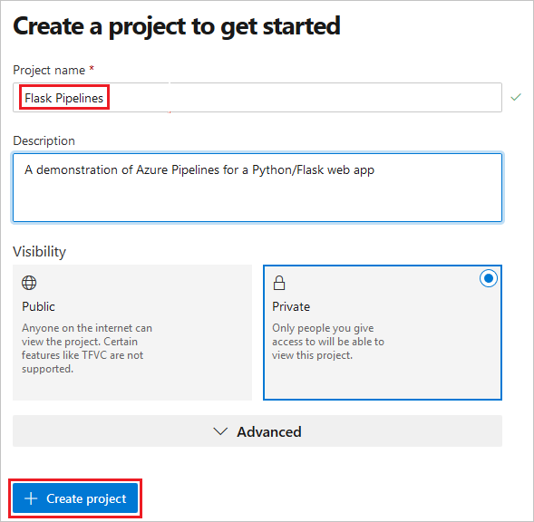
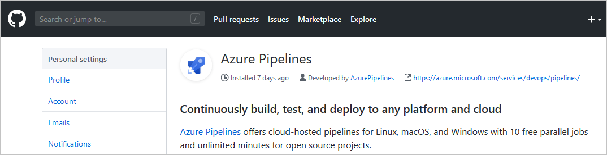
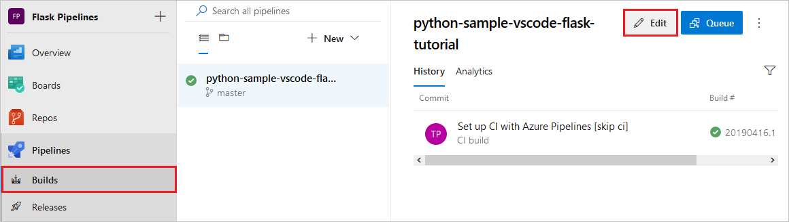

# Deploy a Python web app using CI/CD to Azure App Service on Linux

[!INCLUDE [include](../_shared/version-team-services.md)]

In this article, you use Azure Pipelines to deploy a Python web app to Azure App Service on Linux. You begin with your locally runnable app code in a GitHub repository. You then provision your target App Service through the Azure portal. Finally, you create the Azure DevOps pipeline that automatically builds the code and deploys it to the App Service whenever there's a commit to the repository.

## Create a repository for your app code

If you already have a Python web app in hand, make sure it's committed to a GitHub repository. If your app uses Django and a SQLite database, however, there are a few issues that prevent the app from running properly. See the specific [considerations for Django](#considerations-for-django) section given later in this article. If your Django app uses a separate database, you can use it with this walkthrough.

If you need an app to work with, **fork** the repository at [https://github.com/Microsoft/python-sample-vscode-flask-tutorial/](https://github.com/Microsoft/python-sample-vscode-flask-tutorial/), which comes from the tutorial, [Using Flask in Visual Studio Code](https://code.visualstudio.com/docs/python/tutorial-flask).

To test the example locally, open the folder containing the code, use the following commands as appropriate for your operating system, then open a browser and navigate to `http://localhost:5000`.

```bash
# Mac/Linux
sudo apt-get install python3-venv    # If needed
python3 -m venv .env
source .env/bin/activate
pip install -r requirements.txt
export set FLASK_APP=hello_app.webapp
python3 -m flask run
```

```powershell
# Windows
py -3 -m venv .env
.env\scripts\activate
pip install -r requirements.txt
$env:FLASK_APP = "hello_app.webapp"
python -m flask run
```

Close the browser and stop the Flask server (**Ctrl**+**C**) when you're finished.

## Provision the target Azure App Service

The quickest means to create an App Service instance is to use the Azure command-line interface (CLI) through the interactive Azure Cloud Shell. In the following steps, you use the `az webapp up` command that both provisioning the App Service and performs an initial deployment of your app.

1. Sign in to the Azure portal at [https://portal.azure.com](https://portal.azure.com).

1. Open the Azure CLI by selecting the Cloud Shell button on the portal's toolbar, then select **Bash**:

    

    If prompted to create a storage account for the Cloud Shell, select an appropriate Azure subscription and select **Create storage**. As the prompt indicates, there is a small cost for this storage. You can delete the storage account at the end of this article along with other resources you create.

1. Once the Cloud Shell initializes, it appears as follows along the bottom of the browser:

    

1. In the Cloud Shell, clone your repository using `git clone`. If you're using the example app mentioned earlier, use `git clone https://github.com/your-handle/python-sample-vscode-flask-tutorial/`, replacing `your-handle` with the name of the GitHub account where you forked that repository.
    
    > [!Tip]
    > The Cloud Shell is backed by an Azure Storage account in a resource group called "cloud-shell-storage-centralus" (or a variant appropriate to your location). That storage account contains an image of the Cloud Shell's file system, which stores the cloned repository. 

1. In the Cloud Shell, change directories into the cloned repository folder:

    ```bash
    # Change directory into the Flask app folder, or else the az webapp up command won't
    # realize that you have a Python app.
    cd python-sample-vscode-flask-tutorial
    ```

1. In the Cloud Shell, use the [`az webapp up`](https://docs.microsoft.com/cli/azure/webapp?view=azure-cli-latest#az-webapp-up) command to create an App Service and initially deploy your app (`--sku B1` specifies the lower price compute tier):

    ```bash
    # Be sure you're in the Flask app's folder, or a folder with Python code.    
    # Change the value of the -n argument to a specific name for your app service.
    # Names must be unique across Azure, as the URL becomes <name>.azurewebsites.net.

    az webapp up -n yourname-flaskpipelines --sku B1
    ```

    When the command completes, it shows JSON output in the Cloud Shell.

    > [!Tip]
    > Although the Cloud Shell interface doesn't support keystrokes like **Ctrl**+**V** to paste, you can right-click and select **Paste** from the popup menu.

    > [!Tip]
    > If you encounter a "Permission denied" error with a *.zip* file, you may have tried to run the command in a folder that doesn't contain a Python app. In that case, the `az webapp up` command tries to create a Windows app service plan with which the command fails.

1. If your app requires a custom startup command, like the python-sample-vscode-flask-tutorial app, you must set that property using the [`az webapp config set`](https://docs.microsoft.com/cli/azure/webapp/config?view=azure-cli-latest#az-webapp-config-set). For example, the python-sample-vscode-flask-tutorial app contains a file named *startup.txt* that contains its specific startup command, in which case the property is set to that filename.

    1. In the first line of output from the `az webapp up` command, copy the name of the resource group it created, which is similar to "yourname_rg_Linux_centralus'.

    1. Enter the following command, using the resource name from the previous step, the app service name used with the `az webapp up` command, and your specific startup file or command after the `--startup-file` argument: 

        ```bash
        # Customize with your resource group, app name, and startup command

        az webapp config set -g yourname_rg_Linux_centralus -n yourname-flaskpipelines --startup-file startup.txt
        ```

        Again, when the command completes, it shows JSON output in the Cloud Shell.

1. To see the running app, open a browser and go to `<app-name>.azurewebsites.net` replacing `<app_name>` with the name you specified in the `az webapp up` command. If you see a generic page, wait a few seconds for the App Service to start, and refresh the page.

> [!Note]
> For a detailed description of the specific tasks performed by the `az webapp up` command, see [Provisioning an App Service with discrete commands](#provisioning-an-app-service-with-discrete-commands) at the end of this article.

## Sign into Azure DevOps, create a DevOps project, and connect to Azure

To deploy to Azure App Service from Azure Pipelines, you need to establish a *service connection* between the two.

1. In a browser, go to [dev.azure.com](https://dev.azure.com). If you don't yet have an account on Azure DevOps, select **Start free** (accounts are free). If you have an account already, select **Sign in to Azure DevOps**.

    > [!Important]
    > To simplify the service connection, we recommend using the same email address for Azure DevOps that you use for Azure itself.

1. Once you're signed in, the browser displays your Azure DevOps dashboard (at the URL `https://dev.azure.com/<account-name>`):

    

1. An Azure DevOps account can belong to one or more *organizations*, which are listed on the left side of the Azure DevOps dashboard. By default, Azure DevOps creates an organization using the email address with which you sign in. If you have more than one organization attached to your Azure DevOps account, select the one you want to use for this walkthrough.

1. Within your selected organization, create a *project* named "Flask Pipelines". A project is a grouping for boards, repositories, pipelines, and other aspects of Azure DevOps. If you don't have any projects in an organization, you see a **Create a project to get started** screen on the dashboard as shown below. (Otherwise, use the **Create Project** button on the upper right of the dashboard which brings up the same interface.)

    

1. Once the project dashboard appears, select **Project settings** on the bottom left:

    

1. On the settings page, select **Pipelines** > **Service connections**, select **New service connection**, and then select **Azure Resource Manager**:

    

1. In the *Add an Azure Resource Manager service connection** dialog that appears, give the connection a name (and copy it somewhere, as you need it later in the pipeline), select **Subscription** for the scope, select the subscription in which you created the App Service from the **Subscription** drop-down list, then select the resource group you created earlier in the **Resource Group** drop-down list. Finally, check that the option **Allow all pipelines to use this connection** is set, then select **OK**.

    

1. After the connection is processed, it appears in the **Service connections** list and is ready to be used from Azure Pipelines in the project.

> [!Tip]
> If you need to use an Azure subscription from a different email account, follow the instructions on [Create an Azure Resource Manager service connection with an existing service principal](../library/connect-to-azure.md?view=azure-devops#create-an-azure-resource-manager-service-connection-with-an-existing-service-principal).

## Create and run an initial pipeline

In this section you create a simple starter pipeline to examine the general structure and familiarize yourself with the Azure Pipelines workflow. In the next section you then add specific steps to build and deploy your Python app.

1. On the Azure DevOps project dashboard, select **Pipelines** on the left side:

    

1. Select **New pipeline**:

    

1. On the **Where is your code?** screen, select **GitHub**. You may be prompted to sign into GitHub.

    

1. On the **Select a repository** screen, select the repo that contains your app (such as the fork of the example suggested earlier):

    

1. You may be prompted to enter your GitHub password again as a confirmation, and then GitHub prompts you to install the **Azure Pipelines** extension:

    

    On this screen, scroll down to the **Repository access** section, choose whether to install the extension on all repositories or only selected ones, then select **Approve and install**:

    

1. On the **Configure your pipeline** screen, select **Starter pipeline**:

    

1. Azure DevOps opens an editor for a file called *azure-pipelines.yml*:

    

    This YAML file defines the pipeline as a series of steps, where each step contains the details for different tasks and scripts. The key elements are as follows:

    - The `trigger` at the top indicates that commits to the `master` branch trigger the pipeline.
    - The `pool` element specifies one or more VMs in which the pipelines runs, which by default contains only a single entry for an Ubuntu VM. A pool is used when you want to run tests in multiple environments as part of the build (for example, using different versions of Python if you were creating a package).
    - The `steps` element then contains the discrete pieces of the pipeline. In the starter pipeline you see only two simple scripts that merely echo messages to the console.

1. Select **Save and run**, after which you're prompted for a commit message because Azure Pipelines adds the *azure-pipelines.yml* file to your repository. After editing the message, select **Save and run** again.

1. Azure Pipelines navigates you to a view of the pipeline's progress. For each step you see an output window:

    

    One the build is complete, you can select any of the tasks to review its specific output. Again, because the starter pipeline doesn't go anything except echo messages to the console, the only results to see this point are in the tasks outputs.

1. To see a history of builds, their triggering commits, and a summary of success and failure, select **Pipeline** > **Builds**.

## Create a Python-specific pipeline to deploy to App Service

In this section you replace the steps in the starter pipeline with specific steps that ultimately deploy the app code to Azure App Service. All of the steps in the pipeline run on a computer referred to as the *build agent*, which is different from the computer on which your App Service is running. The agent's job is to follow the instructions in the pipeline, and must therefore be configured with any software that those instructions require.

1. On the project dashboard, select **Pipelines** > **Builds**, then select **Edit** in the upper right corner:

    

1. Once Azure Pipelines opens the editor, delete the opening comments from the file, then add the following lines that define two variables, replacing `<your-service-connection>` with the name you gave the Azure service connection created earlier. Also make sure that the value for `WebAppName` matches the name you used when creating the App Service. These two values, in short, identify the exact App Service to which you deploy your code.

    ```yaml
    variables:
      # Replace this name with that of the Azure service connection in your DevOps project
      ConnectedServiceName: '<your-service-connection>'

      # Replace this name to match the name of the App Service you created earlier
      WebAppName: 'yourname-flaskpipelines'
    ```

    > [!Tip]
    > To avoid hard-coding specific variable values in your YAML file, you can define variables in the pipeline's web interface instead. For more information, see [Variables - Secrets](../process/variables.md#secret-variables)

1. Replace the `steps:` element and the two `script` elements within it with the following `UsePythonVersion@0`:

    ```yaml
    steps:
    - task: UsePythonVersion@0
      inputs:
        versionSpec: '3.6'
        architecture: 'x64'
    ```

    The `steps:` element can contain children like `- task:`, which runs a specific task that's defined in Azure DevOps (see the full [Task reference](../tasks/index.md?view=azure-devops)), and `- script:`, which runs an arbitrary set of commands as you see in a moment. The task in the code above is [UsePythonVersion](../tasks/tool/use-python-version.md?view=azure-devops), which specifies the version of Python to use on the build agent. The `@<n>` suffix indicates the version of the task; `@0` indicates "preview".

1. Because the last step in the pipeline deploys your app via a *.zip* file, the next step in the pipeline must create that file. To create the file, add an [ArchiveFiles](../tasks/utility/archive-files.md?view=azure-devops) task to the bottom of the YAML file:

    ```yaml
    - task: ArchiveFiles@2
      inputs:
        rootFolderOrFile: '$(Build.SourcesDirectory)'
        includeRootFolder: false
        archiveType: 'zip'
        archiveFile: '$(Build.ArtifactStagingDirectory)/Application$(Build.BuildId).zip'
        replaceExistingArchive: true
        verbose: # (no value); this input is optional
    ```

    Using `$()` in a parameter value is how you reference variable, such as the built-in `Build.SourcesDirectory` variable that contains the location on the build agent where the pipeline cloned the app code. The `archiveFile` parameter indicates where to place the *.zip* file, in this case using the built-in variable `Build.ArtifactsStagingDirectory`.

    > [!Important]
    > When deploying to Azure App Service, be sure to use `includeRootFolder: false`. Otherwise, the contents of the *.zip* file are contained within a folder named `s` (for "sources"), which is then replicated on the App Service. As a result, the App Service on Linux container fails to find the app code.

1. The final task uses the [AzureRMWebAppDeployment](../tasks/deploy/azure-rm-web-app-deployment.md?view=azure-devops) task to deploy the *.zip* file to the App Service identified by the `ConnectedServiceName` and `WebAppName` variables defined at the top of the pipeline file.

    ```yaml
    - task: AzureRMWebAppDeployment@4
      displayName: Azure App Service Deploy
      inputs:
        appType: webAppLinux
        RuntimeStack: 'PYTHON|3.6'
        ConnectedServiceName: $(ConnectedServiceName)
        WebAppName: $(WebAppName)
        Package: '$(Build.ArtifactStagingDirectory)/Application$(Build.BuildId).zip'

        # The following parameter is specific to the Flask example code. You may
        # or may not need a startup command for your own app.

        StartupCommand: 'gunicorn --bind=0.0.0.0 --workers=4 startup:app'
    ```

    The `StartupCommand` parameter shown here is specific to the python-vscode-flask-tutorial example code, in which the `app` is defined in the *startup.py* file. By default, Azure App Service looks for the Flask app object in a file named *app.py* or *application.py*; if your code doesn't follow this pattern, you need to customize the startup command. Django apps, for their part, may not need customization at all. For more information, see [How to configure Python on Azure App Service - Customize startup command](/azure/app-service/containers/how-to-configure-python#customize-startup-command).

    Note also that because the repository also contains the same startup command in a file named *startup.txt*, we could simply specify that file using `StartupCommand: 'startup.txt'`. 

1. After all the additions, your *azure-pipelines.yaml* file should appear as follows, using again your specific values for the variables at the top in place of `'<your-service-connection>'` and `'yourname-flaskpipelines'`. You might also have a different `StartupCommand` at the end (or none at all) if you're using your own app code.

    ```yaml
    # This is the completed azure-pipelines.yaml file from previous steps.
    variables:
      ConnectedServiceName: '<your-service-connection>'
      WebAppName: 'yourname-flaskpipelines'

    trigger:
    - master

    pool:
      name: Hosted Ubuntu 1604

    steps:
    - task: UsePythonVersion@0
      inputs:
        versionSpec: '3.6'
        architecture: 'x64'

    - task: ArchiveFiles@2
      inputs:
        rootFolderOrFile: '$(Build.SourcesDirectory)'
        includeRootFolder: false
        archiveType: 'zip'
        archiveFile: '$(Build.ArtifactStagingDirectory)/Application$(Build.BuildId).zip'
        replaceExistingArchive: true
        verbose: # Optional

    - task: AzureRMWebAppDeployment@4
      displayName: Azure App Service Deploy
      inputs:
        appType: webAppLinux
        RuntimeStack: 'PYTHON|3.6'
        ConnectedServiceName: $(ConnectedServiceName)
        WebAppName: $(WebAppName)
        Package: '$(Build.ArtifactStagingDirectory)/Application$(Build.BuildId).zip'

        # The following command is specific to the python-sample-vscode-flask-tutorial code.
        # You may or may not need a startup command for your own app.

        StartupCommand: 'gunicorn --bind=0.0.0.0 --workers=4 startup:app'
    ```

1. You're now ready to try it out! Select **Save** on the upper right of the editor, add a commit message and select **Save** in the popup, and then select **Run** on the pipeline editor. Azure Pipelines then *queues* another build, acquires an available build agent, the has that build agent run the pipeline.

1. Once the build completes (it takes a few minutes, especially the deployment step, durign which time your dependencies in `requirements.txt` should be deployed on App Service automatically), you should see green checkmarks next to each of the steps:

    

    > [!Tip]
    > If you encounter an error in the build, you can quickly return to the YAML editor by selecting the vertical dots in the upper right and selecting **Edit pipeline**:
    >
    > 

1. Select the **Azure App Service Deploy** task to display its output. You can easily visit the deployed site by Ctrl+clicking the URL after **App Service Application URL**:

    

1. If you're using the Flask example, the app should appear as follows:

    

## Run a post-deployment script

Within the `AzureRMWebAppDeployment` step, you can run a post-deployment script by using the following entries after `StartupCommand:`:

- Inline script:

    ```yaml
    ScriptType: Inline Script
    InlineScript:
      echo 'Add your inline script steps here'
    ```

- Script file:

    ```yaml
    ScriptType: File Path
    ScriptPath: 'path-to-script-file-in-your-repository'
    ```

A post-deployment script can, for example, define environment variables expected by the app code. To avoid hard-coding specific variable values in your YAML file, you can instead define variables in the pipeline's web interface and then refer to the variable name in the script. For more information, see [Variables - Secrets](../process/variables.md#secret-variables)

## Considerations for Django

As noted earlier in this article, you can use Azure Pipelines to deploy Django apps to Azure App Service on Linux provided that you're using a separate database and not a simple SQLite database. (Specifically, App Service locks the *db.sqlite3* file, preventing both reads and writes. This behavior doesn't affect an external database.)

As described on [Configure Python app on App Service - Container startup process](/azure/app-service/containers/how-to-configure-python#container-startup-process), App Service automatically looks for a *wsgi.py* file within your app code, which typically contains the app object. If you need to customize the startup command in any way, use the `StartupCommand` parameter in the `AzureRMWebAppDeployment@4` step as described in the previous section.

When using Django, you typically want to migrate the data models using `manage.py migrate` after deploying the app code. You can use a post-deployment script for this purpose:

- Inline script:

    ```yaml
    ScriptType: Inline Script
    InlineScript:
      python3.6 manage.py migrate
    ```

- Script file: (assuming the script file in your repository is named *post-deployment.sh* and contains the `python3.6 manage.py migrate` command):

    ```yaml
    ScriptType: File Path
    ScriptPath: 'post-deployment.sh'

## Run tests on the build agent

As part of your build process, you may want to run tests on your app code. Tests run on the build agent, so it's likely that you also need to first install your dependencies into a virtual environment on the build agent. After the tests have run, you can delete the virtual environment before creating the ZIP file for deployment. The following [`script`](../scripts/cross-platform-scripting.md?view=azure-devops&tabs=yaml) elements, which you would place before the `ArchiveFiles@2` task, illustrate this process:

```yaml
# The | symbol is a continuation character, indicating a multi-line script.
# A single-line script can immediately follows "- script:" without the |.
- script: |
    python3.6 -m venv .env
    source .env/bin/activate
    pip3.6 install setuptools
    pip3.6 install -r requirements.txt

  # The displayName is shows in the pipeline UI when a build runs
  displayName: 'Install Dependencies on build agent'

- script: |
    # Commands to run tests   
  displayName: 'Run tests'

- script: |
    echo Deleting .env
    deactivate
    rm -rf .env
  displayName: 'Remove .env before zip'
```

You can also use a task like [PublishTestResults@2](../tasks/test/publish-test-results.md?view=azure-devops&tabs=yaml) to make test results appear in the pipeline results screen. For more information, see [Build Python apps - Run tests](python.md#run-tests).

## Provisioning an App Service with discrete commands

The `az webapp up` command used earlier in this article is a convenient method to provision the App Service and initially deploy your app in a single step. If you want more control over the process, however, you can use discrete commands to accomplish the same tasks. For example, you might want to use a specific name for the resource group. You might also want to create an App Service within an existing App Service plan.

The following steps perform the equivalent of the `az webapp up` command:

1. In the Cloud Shell, run the following command to create a resource group in your Azure subscription (you can set a different location for the resource group by changing the `-l westus` argument). JSON output appears in the Cloud Shell as when the command completes successfully.

    ```bash
    # Change the resource group name as desired.

    az group create -l westus -n flaskpipelines-rg
    ```

    A resource group is a collection of related Azure resources. By creating a group, it's easy to delete all those resources together when you no longer need them.

1. An App Service runs inside a virtual machine defined by an App Service Plan. Run the following command to create a plan named `flaskpipelines-plan` in the `flaskpipelines-rg` resource group:

    ```bash
    # --is-linux is required for Python deployments

    az appservice plan create -g flaskpipelines-rg -n flaskpipelines-plan --is-linux --sku B1
    ```

    Again, you see JSON output in the Cloud Shell when the command completes successfully. The plan created here uses the minimal B1 basic compute tier for the virtual machine (which has an associated cost). You can easily delete the plan when you delete the resource group.

1. Run the following command to create the App Service instance in the plan, replacing `<app-name>` with an app name that's unique across Azure. (Typically, you use a personal or company name along with an app identifier, such as "yourname-flaskpipelines"; the command fails if the name is already in use.) By assigning the App Service to the same resource group as the plan, it's easy to clean up all the resources together.

    ```bash
    az webapp create -g flaskpipelines-rg -p flaskpipelines-plan -n <app-name> --runtime "Python|3.6"
    ```

    > [!Tip]
    > If you see the error message "The plan (name) doesn't exist", and you're sure that the plan name is correct, check that the spelling of the resource group specified with the -g argument is also correct and that the plan you identify is part of that resource group. If you misspell the resource group name, the command won't find the plan in that non-existent resource group and thus gives this particular error.

1. The App Service at this point contains only default app code. You can now use Azure Pipelines to deploy your specific app code.

    If you want to deploy your code when creating the app service, you can use the `--deployment-source-url` and `--deployment-source-branch` arguments with the `az webapp create` command in the previous step. For more information, see [`az webapp create`](https://docs.microsoft.com/cli/azure/webapp?view=azure-cli-latest#az-webapp-create)

    If your app also requires a custom startup command, use the `az webapp config set` command, as described earlier under [Provision the target Azure App Service](#provision-the-target-azure-app-service). For example:

    ```bash
    # Customize with your resource group, app name, and startup command

    az webapp config set -g yourname_rg_Linux_centralus -n yourname-flaskpipelines --startup-file startup.txt
    ```

## Clean up resources

To avoid incurring ongoing charges for Azure resources you created in thus tutorial, you can simply delete the resource group that contains the App Service and the App Service plan. You can delete the resource group in the Azure Portal by selecting **Resource groups** on the left-side navigation pane. In the list that appears, select **...** on the right side of the resource group, then select **Delete resource group** and follow the prompts.

You can also use the [`az group delete`](https://docs.microsoft.com/cli/azure/group?view=azure-cli-latest#az-group-delete) command in the Cloud Shell.

By starting the Cloud Shell, you also created a storage account to maintain the file system image for the shell. This storage account does incur a minimal monthly charge. You can delete it by deleting the resource group that begins with "cloud-shell-storage-".

## Next steps

- [Build Python apps](python.md)
- [Learn about build agents](../agents/agents.md)
- [Configure Python app on App Service](/azure/app-service/containers/how-to-configure-python)
