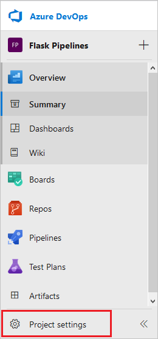
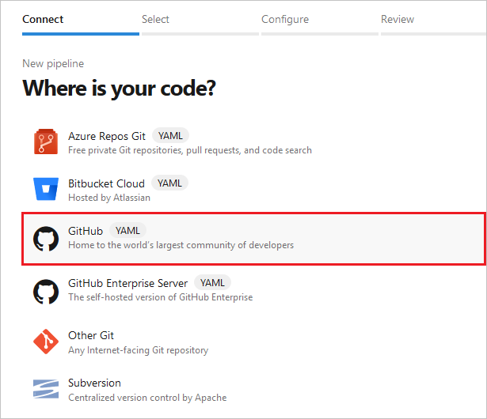
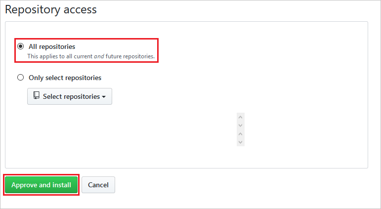
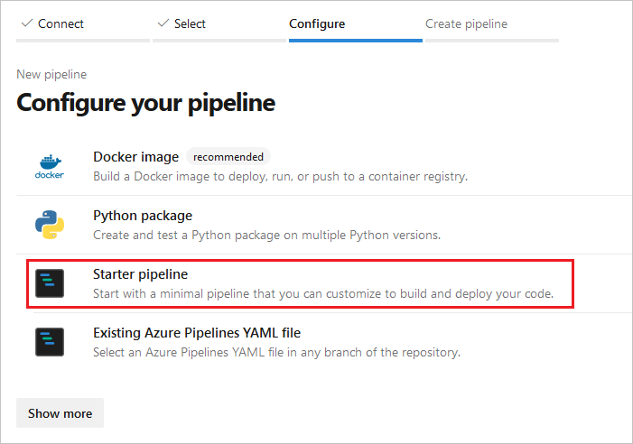
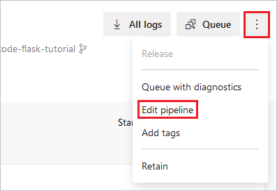

# Use CI/CD to deploy a Python web app to Azure App Service on Linux

[!INCLUDE [include](../_shared/version-team-services.md)]

In this article, you use Azure Pipelines continuous integration and continuous delivery (CI/CD) to deploy a Python web app to Azure App Service on Linux. You begin by running app code from a GitHub repository locally. You then provision a target App Service through the Azure portal. Finally, you create an Azure Pipelines CI/CD pipeline that automatically builds the code and deploys it to the App Service whenever there's a commit to the repository.

## Create a repository for your app code

If you already have a Python web app to use, make sure it's committed to a GitHub repository. 

> [!NOTE]
> If your app uses Django and a SQLite database, it won't work for this walkthrough. For more information, see [considerations for Django](#considerations-for-django) later in this article. If your Django app uses a separate database, you can use it with this walkthrough.

If you need an app to work with, you can fork and clone the repository at [https://github.com/Microsoft/python-sample-vscode-flask-tutorial](https://github.com/Microsoft/python-sample-vscode-flask-tutorial). The code is from the tutorial [Flask in Visual Studio Code](https://code.visualstudio.com/docs/python/tutorial-flask).

To test the example app locally, from the folder containing the code, run the following appropriate commands for your operating system: 

```bash
# Mac/Linux
sudo apt-get install python3-venv  # If needed
python3 -m venv .env
source .env/bin/activate
pip install -r requirements.txt
export set FLASK_APP=hello_app.webapp
python3 -m flask run
```

```powershell
# Windows
py -3 -m venv .env
.env\scripts\activate
pip install -r requirements.txt
$env:FLASK_APP = "hello_app.webapp"
python -m flask run
```

Open a browser and navigate to *http:\//localhost:5000* to view the app. When you're finished, close the browser, and stop the Flask server with **Ctrl**+**C**.

## Provision the target Azure App Service

The quickest way to create an App Service instance is to use the Azure command-line interface (CLI) through the interactive Azure Cloud Shell. In the following steps, you use [az webapp up](/cli/azure/webapp#az-webapp-up) to both provision the App Service and perform the first deployment of your app.

1. Sign in to the Azure portal at [https://portal.azure.com](https://portal.azure.com).

1. Open the Azure CLI by selecting the Cloud Shell button on the portal's toolbar:

   

1. The Cloud Shell appears along the bottom of the browser. Select **Bash** from the dropdown:

   

1. In the Cloud Shell, clone your repository using `git clone`. For the example app, use:

   ```bash
   git clone https://github.com/<your-alias>/python-sample-vscode-flask-tutorial
   ```
   
   Replace `<your-alias>` with the name of the GitHub account you used to fork the repository.
   
   > [!Tip]
   > To paste into the Cloud Shell, use **Ctrl**+**Shift**+**V**, or right-click and select **Paste** from the context menu.
   
   > [!Note]
   > The Cloud Shell is backed by an Azure Storage account in a resource group called *cloud-shell-storage-\<your-region>*. That storage account contains an image of the Cloud Shell's file system, which stores the cloned repository. There is a small cost for this storage. You can delete the storage account at the end of this article, along with other resources you create.

1. In the Cloud Shell, change directories into the repository folder that has your Python app, so the `az webapp up` command will recognize the app as Python.

   ```bash
   cd python-sample-vscode-flask-tutorial
   ```

1. In the Cloud Shell, use `az webapp up` to create an App Service and initially deploy your app. 

   ```bash
   az webapp up -n <your-appservice>
   ```

   Change `<your-appservice>` to a name for your app service that's unique across Azure. Typically, you use a personal or company name along with an app identifier, such as `<your-name>-flaskpipelines`. The app URL becomes *\<your-appservice>.azurewebsites.net*. 
   
   When the command completes, it shows JSON output in the Cloud Shell.

   > [!Tip]
   > If you encounter a "Permission denied" error with a *.zip* file, you may have tried to run the command from a folder that doesn't contain a Python app. The `az webapp up` command then tries to create a Windows app service plan, and fails. 

1. If your app uses a custom startup command, set the [az webapp config](/cli/azure/webapp/config?view=azure-cli-latest#az-webapp-config-set) property. For example, the *python-sample-vscode-flask-tutorial* app contains a file named *startup.txt* that contains its specific startup command, so you set the `az webapp config` property to `startup.txt`.

   1. From the first line of output from the previous `az webapp up` command, copy the name of your resource group, which is similar to **\<your-name>\_rg\_Linux\_\<your-region>**.

   1. Enter the following command, using your resource group name, your app service name, and your startup file or command: 

      ```bash
      az webapp config set -g <your-resource-group> -n <your-appservice> --startup-file <your-startup-file-or-command>
      ```
      
      Again, when the command completes, it shows JSON output in the Cloud Shell.

1. To see the running app, open a browser and go to *http:\//\<your-appservice>.azurewebsites.net*. If you see a generic page, wait a few seconds for the App Service to start, and refresh the page.

> [!Note]
> For a detailed description of the specific tasks performed by the `az webapp up` command, see [Provision an App Service with single commands](#provision-an-app-service-with-single-commands) at the end of this article.

## Create an Azure DevOps project and connect to Azure

To deploy to Azure App Service from Azure Pipelines, you need to establish a *service connection* between the two services.

1. In a browser, go to [dev.azure.com](https://dev.azure.com). If you don't yet have an account on Azure DevOps, select **Start free** and get a free account. If you have an account already, select **Sign in to Azure DevOps**.

   > [!Important]
   > To simplify the service connection, use the same email address for Azure DevOps as you use for Azure.

1. Once you sign in, the browser displays your Azure DevOps dashboard, at the URL *https:\//dev.azure.com/\<your-organization-name>*. An Azure DevOps account can belong to one or more *organizations*, which are listed on the left side of the Azure DevOps dashboard. By default, Azure DevOps creates a new organization using the email alias you used to sign in. 
   
   If you have more than one organization in your Azure DevOps account, select the one you want to use for this walkthrough.

   A project is a grouping for boards, repositories, pipelines, and other aspects of Azure DevOps. If your organization doesn't have any projects, enter the project name *Flask Pipelines* under **Create a project to get started**, and then select **Create project**. 

   
   
   If your organization already has projects, select **New project** on the organization page. In the **Create new project** dialog box, enter the project name *Flask Pipelines*, and select **Create**.

1. From the new project page, select **Project settings** from the left navigation.

   

1. On the **Project Settings** page, select **Pipelines** > **Service connections**, then select **New service connection**, and then select **Azure Resource Manager** from the dropdown. 

   

1. In the **Add an Azure Resource Manager service connection** dialog box:
   1. Give the connection a name. Make note of the name to use later in the pipeline.
   1. For **Scope level**, select **Subscription**.
   1. Select the subscription for your App Service from the **Subscription** drop-down list. 
   1. Under **Resource Group**, select your resource group from the dropdown. 
   1. Make sure the option **Allow all pipelines to use this connection** is selected, and then select **OK**.

   

   The new connection appears in the **Service connections** list, and is ready for Azure Pipelines to use from the project.

> [!Tip]
> If you need to use an Azure subscription from a different email account, follow the instructions on [Create an Azure Resource Manager service connection with an existing service principal](../library/connect-to-azure.md?view=azure-devops#create-an-azure-resource-manager-service-connection-with-an-existing-service-principal).

## Create and run an initial pipeline

In this section, you create a simple starter pipeline, to examine the general structure and familiarize yourself with the Azure Pipelines workflow. In the next section, you add specific steps to build and deploy your Python app.

1. From your project page left navigation, select **Pipelines**.

   

1. Select **New pipeline**:

   

1. On the **Where is your code** screen, select **GitHub**. You may be prompted to sign into GitHub.

   

1. On the **Select a repository** screen, select the repository that contains your app, such as your fork of the example app. 

   

1. You may be prompted to enter your GitHub password again as a confirmation, and then GitHub prompts you to install the **Azure Pipelines** extension:

   

   On this screen, scroll down to the **Repository access** section, choose whether to install the extension on all repositories or only selected ones, and then select **Approve and install**:

   

1. On the **Configure your pipeline** screen, select **Starter pipeline**:

   

   Azure DevOps opens an editor for a file called *azure-pipelines.yml*:

   

   This YAML file defines the pipeline as a series of *steps*, where each step contains the details for different *tasks* and *scripts*. The YAML file contains the following key elements:

   - The `trigger` at the top indicates the commits that trigger the pipeline, such as commits to the `master` branch.
   - The `pool` element specifies one or more virtual machines (VMs) in which the pipeline runs. By default, this element contains only a single entry for an Ubuntu VM. You can use a pool to run tests in multiple environments as part of the build, such as using different Python versions for creating a package.
   - The `steps` element contains discrete pieces of the pipeline. The starter pipeline has only two simple scripts that echo messages to the console.

1. Select **Save and run** at upper right. 
   
1. You're prompted for a commit message, because Azure Pipelines adds the *azure-pipelines.yml* file to your repository. After editing the message, select **Save and run** again.

Azure Pipelines displays a view of the pipeline's progress. For each step you see an output window:


Once the build is complete, you can select any of the tasks to review its output. Because the starter pipeline doesn't do anything except echo messages to the console, the only results to see at this point are the tasks outputs.

To see a history of builds, their triggering commits, and their success or failure, select **Pipeline** > **Builds**.

## Create a Python-specific pipeline to deploy to App Service

In this section, you replace the steps in the starter pipeline with specific steps to deploy your app's code to Azure App Service. All the steps in the pipeline run on a computer called the *build agent*, which is different from the computer that runs your App Service. The agent's job is to follow the instructions in the pipeline, so the agent must be configured with any software that the instructions require.

1. On the project page left navigation, select **Pipelines** > **Builds**. Select the build pipeline you want to configure, and then select **Edit** at upper right.

   

1. In *azure-pipelines.yml*, delete the opening comments, and then add the following lines that define the two variables `ConnectedServiceName` and `WebAppName`. Replace `<your-service-connection>` with the name you gave the Azure service connection, and `<your-appservice>` with your App Service name. These two values identify the exact App Service to use to deploy your code.

   ```yaml
   variables:
     ConnectedServiceName: '<your-service-connection>'
     WebAppName: '<your-appservice>'
   ```

   > [!Tip]
   > To avoid hard-coding specific variable values in your YAML file, you can define variables in the pipeline's web interface instead. For more information, see [Variables - Secrets](../process/variables.md#secret-variables).

1. Replace the `steps` element, and the two `script` elements within it, with the following code:

   ```yaml
   steps:
   - task: UsePythonVersion@0
     inputs:
       versionSpec: '3.6'
       architecture: 'x64'
   ```

   The `steps` element can contain children like `task`, which runs a specific task as defined in the Azure Pipelines [task reference](../tasks/index.md?view=azure-devops), and `script`, which runs an arbitrary set of commands. The task in the preceding code is [UsePythonVersion](../tasks/tool/use-python-version.md?view=azure-devops), which specifies the version of Python to use on the build agent. The `@<n>` suffix indicates the version of the task. The `@0` indicates preview version.

1. This step creates the *.zip* file that the last step in the pipeline deploys. To create the *.zip* file, add an [ArchiveFiles](../tasks/utility/archive-files.md?view=azure-devops) task to the end of the YAML file:

   ```yaml
   - task: ArchiveFiles@2
     inputs:
       rootFolderOrFile: '$(Build.SourcesDirectory)'
       includeRootFolder: false
       archiveType: 'zip'
       archiveFile: '$(Build.ArtifactStagingDirectory)/Application$(Build.BuildId).zip'
       replaceExistingArchive: true
       verbose: # (no value); this input is optional
   ```

   You use `$()` in a parameter value to reference variables. The built-in `Build.SourcesDirectory` variable contains the location on the build agent where the pipeline cloned the app code. The `archiveFile` parameter indicates where to place the *.zip* file. In this case, the `archiveFile` parameter uses the built-in variable `Build.ArtifactsStagingDirectory`.

   > [!Important]
   > When deploying to Azure App Service, be sure to use `includeRootFolder: false`. Otherwise, the contents of the *.zip* file are put in a folder named *s*, for "sources," which is replicated on the App Service. The App Service on Linux container then can't find the app code.

1. Finally, use the [AzureRMWebAppDeployment](../tasks/deploy/azure-rm-web-app-deployment.md?view=azure-devops) task to deploy the *.zip* file to the App Service you identified by the `ConnectedServiceName` and `WebAppName` variables at the beginning of the pipeline file. Paste the following code at the end of the file:

    ```yaml
    - task: AzureRMWebAppDeployment@4
      displayName: Azure App Service Deploy
      inputs:
        appType: webAppLinux
        RuntimeStack: 'PYTHON|3.6'
        ConnectedServiceName: $(ConnectedServiceName)
        WebAppName: $(WebAppName)
        Package: '$(Build.ArtifactStagingDirectory)/Application$(Build.BuildId).zip'

        # The following parameter is specific to the Flask example code. You may
        # or may not need a startup command for your app.

        StartupCommand: 'gunicorn --bind=0.0.0.0 --workers=4 startup:app'
    ```

    The `StartupCommand` parameter shown here is specific to the *python-vscode-flask-tutorial* example code, which defines the app in the *startup.py* file. By default, Azure App Service looks for the Flask app object in a file named *app.py* or *application.py*. If your code doesn't follow this pattern, you need to customize the startup command. Django apps may not need customization at all. For more information, see [How to configure Python on Azure App Service - Customize startup command](/azure/app-service/containers/how-to-configure-python#customize-startup-command).

    Also, because the *python-vscode-flask-tutorial* repository contains the same startup command in a file named *startup.txt*, you could specify that file in the `StartupCommand` parameter rather than the command, by using `StartupCommand: 'startup.txt'`. 

1. Your final *azure-pipelines.yml* file should appear as follows, using your values for `<your-service-connection>` and `<your-appservice>`. If you're using your own app code, you might have a different `StartupCommand` at the end, or none at all. 

   ```yaml
   variables:
     ConnectedServiceName: '<your-service-connection>'
     WebAppName: '<your-appservice>'

   trigger:
   - master

   pool:
     name: Hosted Ubuntu 1604

   steps:
   - task: UsePythonVersion@0
     inputs:
       versionSpec: '3.6'
       architecture: 'x64'

   - task: ArchiveFiles@2
     inputs:
       rootFolderOrFile: '$(Build.SourcesDirectory)'
       includeRootFolder: false
       archiveType: 'zip'
       archiveFile: '$(Build.ArtifactStagingDirectory)/Application$(Build.BuildId).zip'
       replaceExistingArchive: true
       verbose: # Optional

   - task: AzureRMWebAppDeployment@4
     displayName: Azure App Service Deploy
     inputs:
       appType: webAppLinux
       RuntimeStack: 'PYTHON|3.6'
       ConnectedServiceName: $(ConnectedServiceName)
       WebAppName: $(WebAppName)
       Package: '$(Build.ArtifactStagingDirectory)/Application$(Build.BuildId).zip'

       # The following command is specific to the python-sample-vscode-flask-tutorial code.
       # You may or may not need a startup command for your own app.

       StartupCommand: 'gunicorn --bind=0.0.0.0 --workers=4 startup:app'
   ```

## Run the pipeline

You're now ready to try it out! 

1. Select **Save** at upper right in the editor, and in the pop-up window, add a commit message and select **Save**. 
   
1. Select **Run** on the pipeline editor, and select **Run** again in the **Run pipeline** dialog box. Azure Pipelines queues another build, acquires an available build agent, and has that build agent run the pipeline.
   
   The build takes a few minutes to complete, especially the deployment step. During deployment, the dependencies in *requirements.txt* should be deployed on App Service automatically. You should see green checkmarks next to each of the steps:
   
   
   
   If there's an error in the build, you can quickly return to the YAML editor by selecting the vertical dots at upper right and selecting **Edit pipeline**:
   
   
   
1. From the build page, select the **Azure App Service Deploy** task to display its output. To visit the deployed site, hold down the **Ctrl** key and select the URL after **App Service Application URL**.
   
   
   
   If you're using the Flask example, the app should appear as follows:

   

## Run a post-deployment script

A post-deployment script can, for example, define environment variables expected by the app code. To avoid hard-coding specific variable values in your YAML file, you can instead define variables in the pipeline's web interface and then refer to the variable name in the script. For more information, see [Variables - Secrets](../process/variables.md#secret-variables).

Within the `AzureRMWebAppDeployment` step of your pipeline YAML file, you can run a post-deployment script by using the following entries after the `StartupCommand` line:

- Inline script:

  ```yaml
  ScriptType: Inline Script
  InlineScript:
    echo '<Add your inline script steps here>'
  ```

- Script file:

  ```yaml
  ScriptType: File Path
  ScriptPath: '<path-to-script-file-in-your-repository>'
  ```

## Considerations for Django

As noted earlier in this article, you can use Azure Pipelines to deploy Django apps to Azure App Service on Linux, provided that you're using a separate database. You can't use a simple SQLite database, because App Service locks the *db.sqlite3* file, preventing both reads and writes. This behavior doesn't affect an external database.

As described in [Configure Python app on App Service - Container startup process](/azure/app-service/containers/how-to-configure-python#container-startup-process), App Service automatically looks for a *wsgi.py* file within your app code, which typically contains the app object. If you need to customize the startup command in any way, use the `StartupCommand` parameter in the `AzureRMWebAppDeployment@4` step of your YAML pipeline file, as described in the previous section.

When using Django, you typically want to migrate the data models using `manage.py migrate` after deploying the app code. You can use a post-deployment script for this purpose:

- Inline script:

  ```yaml
  ScriptType: Inline Script
  InlineScript: 
  python3.6 manage.py migrate
  ```

- Script file, for a script file named *post-deployment.sh* that contains the `python3.6 manage.py migrate` command:

  ```yaml
  ScriptType: File Path
  ScriptPath: 'post-deployment.sh'
  ```

## Run tests on the build agent

As part of your build process, you may want to run tests on your app code. Tests run on the build agent, so you probably need to first install your dependencies into a virtual environment on the build agent computer. After the tests run, delete the virtual environment before you create the *.zip* file for deployment. The following script elements illustrate this process. Place them before the `ArchiveFiles@2` task in the *azure-pipelines.yml* file. For more information, see [Run cross-platform scripts](../scripts/cross-platform-scripting.md?view=azure-devops&tabs=yaml). 

```yaml
# The | symbol is a continuation character, indicating a multi-line script.
# A single-line script can immediately follow "- script:".
- script: |
    python3.6 -m venv .env
    source .env/bin/activate
    pip3.6 install setuptools
    pip3.6 install -r requirements.txt

  # The displayName shows in the pipeline UI when a build runs
  displayName: 'Install dependencies on build agent'

- script: |
    # Put commands to run tests here
  displayName: 'Run tests'

- script: |
    echo Deleting .env
    deactivate
    rm -rf .env
  displayName: 'Remove .env before zip'
```

You can also use a task like [PublishTestResults@2](../tasks/test/publish-test-results.md?view=azure-devops&tabs=yaml) to make test results appear in the pipeline results screen. For more information, see [Build Python apps - Run tests](python.md#run-tests).

## Provision an App Service with single commands

The [az webapp up](/cli/azure/webapp#az-webapp-up) command used earlier in this article is a convenient method to provision the App Service and initially deploy your app in a single step. If you want more control over the deployment process, you can use single commands to accomplish the same tasks. For example, you might want to use a specific name for the resource group, or create an App Service within an existing App Service Plan.

The following steps perform the equivalent of the `az webapp up` command:

1. Create a resource group.
   
   A resource group is a collection of related Azure resources. Creating a resource group makes it easy to delete all those resources at once when you no longer need them. In the Cloud Shell, run the following command to create a resource group in your Azure subscription. Set a location for the resource group by specifying the value of `<your-region>`. JSON output appears in the Cloud Shell when the command completes successfully.

   ```bash
   az group create -l <your-region> -n <your-resource-group>
   ```

1. Create an App Service Plan.
   
   An App Service runs inside a VM defined by an App Service Plan. Run the following command to create an App Service Plan, substituting your own values for `<your-resource-group>` and `<your-appservice-plan>`. The `--is-linux` is required for Python deployments. If you want a pricing plan other than the default F1 Free plan, use the `sku` argument. The `--sku B1` specifies the lower-price compute tier for the VM. You can easily delete the plan later by deleting the resource group.

   ```bash
   az appservice plan create -g <your-resource-group> -n <your-appservice-plan> --is-linux --sku B1
   ```

   Again, you see JSON output in the Cloud Shell when the command completes successfully.

1. Create an App Service instance in the plan.
   
   Run the following command to create the App Service instance in the plan, replacing `<your-appservice>` with a name that's unique across Azure. Typically, you use a personal or company name along with an app identifier, such as `<your-name>-flaskpipelines`. The command fails if the name is already in use. By assigning the App Service to the same resource group as the plan, it's easy to clean up all the resources at once.

   ```bash
   az webapp create -g <your-resource-group> -p <your-appservice-plan> -n <your-appservice> --runtime "Python|3.6"
   ```

   > [!Note]
   > If you want to deploy your code at the same time you create the app service, you can use the `--deployment-source-url` and `--deployment-source-branch` arguments with the `az webapp create` command. For more information, see [az webapp create](/cli/azure/webapp?view=azure-cli-latest#az-webapp-create).

   > [!Tip]
   > If you see the error message "The plan (name) doesn't exist", and you're sure that the plan name is correct, check that the resource group specified with the `-g` argument is also correct, and the plan you identify is part of that resource group. If you misspell the resource group name, the command doesn't find the plan in that nonexistent resource group, and gives this particular error.
   
1. If your app requires a custom startup command, use the `az webapp config set` command, as described earlier in [Provision the target Azure App Service](#provision-the-target-azure-app-service). For example, to customize the App Service with your resource group, app name, and startup command, run:
   
    ```bash
   az webapp config set -g <your-resource-group> -n <your-appservice> --startup-file <your-startup-command-or-file>
   ```

The App Service at this point contains only default app code. You can now use Azure Pipelines to deploy your specific app code.

## Clean up resources

To avoid incurring ongoing charges for any Azure resources you created in this walkthrough, such as a B1 App Service Plan, delete the resource group that contains the App Service and the App Service Plan. To delete the resource group from the Azure portal, select **Resource groups** in the left navigation. In the resource group list, select the **...** to the right of the resource group you want to delete, select **Delete resource group**, and follow the prompts.

You can also use [az group delete](/cli/azure/group?view=azure-cli-latest#az-group-delete) in the Cloud Shell to delete resource groups.

To delete the storage account that maintains the file system for Cloud Shell, which incurs a small monthly charge, delete the resource group that begins with **cloud-shell-storage-**.

## Next steps

- [Build Python apps](python.md)
- [Learn about build agents](../agents/agents.md)
- [Configure Python app on App Service](/azure/app-service/containers/how-to-configure-python)
