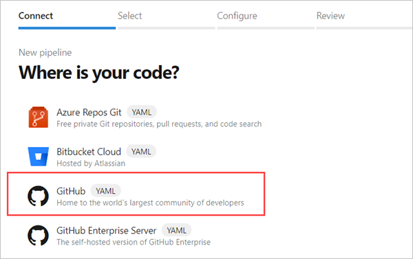

# Create your first pipeline

This is a step-by-step guide to build a GitHub repository using Azure Pipelines.

## Prerequisites

[!INCLUDE [include](_shared/ci-cd-prerequisites-vsts.md)]

* The following preview features enabled in your Azure DevOps organization.
  * **New builds hub**
  * **New YAML pipeline creation experience**

  You can check the preview features by selecting your profile in your Azure DevOps organization.
  

* A GitHub account, where you can create a repository.

## Get the sample code

Azure Pipelines can be used to build an app written in any language. Pick a language of your choice from the following sample repositories, and fork it into your own GitHub account.

| Programming language | Repository with a sample app |
|----------------------|----------------------------|
| .NET Core | `https://github.com/MicrosoftDocs/pipelines-dotnet-core` |
| NodeJS | `https://github.com/MicrosoftDocs/pipelines-javascript` |
| Java | `https://github.com/adventworks/java-sample` |
| Python |  `https://github.com/MicrosoftDocs/pipelines-python-django` |
| Go | `https://github.com/MicrosofyDocs/pipelines-go` |

You should now have a sample app in your GitHub account.

## Get your first build

1. Login to your Azure DevOps organization at http://dev.azure.com/.

1. Navigate to the **Pipelines** page, and then choose **New pipeline**.

1. Walk through the steps of the wizard by first selecting **GitHub** as the location of your source code.

   

1. For the second step, choose to **Authorize with OAuth** by clicking on **Authorize**. You may be redirected to GitHub to login. Enter your GitHub credentials.

1. When you are redirected back to Azure Pipelines, select the sample app repository.

1. For the third step, Azure Pipelines analyzes the code in your repository. If your repository already contains an `azure-pipelines.yml` file, which is the case for all sample repositories, then this step is skipped. Or else, Azure Pipelines recommends a starter template based on the code in your repository.

1. In the final step, you'll be shown the YAML file that will be used.

1. Select **Save and run** and choose the option to **Commit directly to the master branch**.

1. The YAML file is now pushed to your GitHub repository and a new build is automatically started.

1. Wait for the build to complete.

## Get the status badge

1. In the Azure pipelines page, navigate to the list of pipelines.

1. Select the pipeline that was created for you.

1. In the context menu for the pipeline, select **Status badge**.

   

1. Copy the sample markdown from the status badge panel.

## Add status badge to your repository

In GitHub:

1. Inspect the `azure-pipelines.yml` file at the root of your repository. The YAML file contains the instructions for the pipeline. The next time you change any file in this repository, Azure Pipelines will automatically build your code.

1. Go back to the list of files and select the **Readme.md** file, and then choose **Edit**.

1. Copy the status badge markdown that you copied in the previous section at the beginning of the readme.md file.

1. Commit the change to the master branch.

1. Notice that the status badge appears in the description of your repository.

Back in Azure Pipelines:

1. Observe that a new build is queued; its status could be either not started or running.

## Next steps

You've just learned the basics of using Azure Pipelines. Now you're ready to further configure your pipeline to run tests, publish test results, create container images, or even deploy the app to a cloud service. Follow the track for the language of your choice.

* [.NET Core](languages/dotnet-core.md)
* [NodeJS](languages/javascript.md)
* [Java](languages/java.md)
* [Python](languages/python.md)
* [Go](apps/go/go.md)
