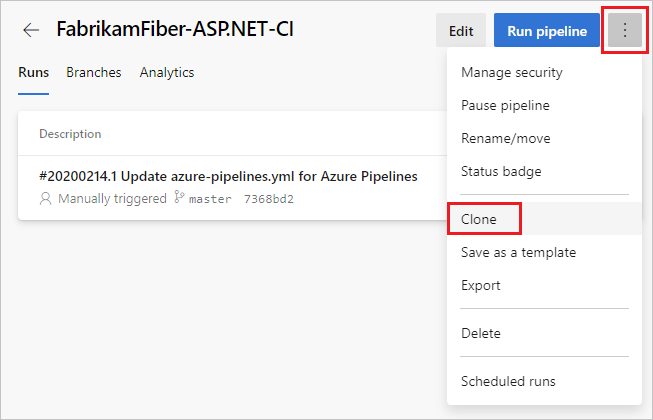
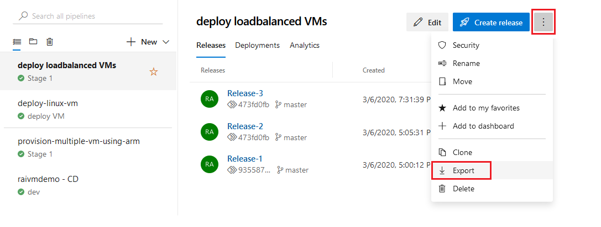
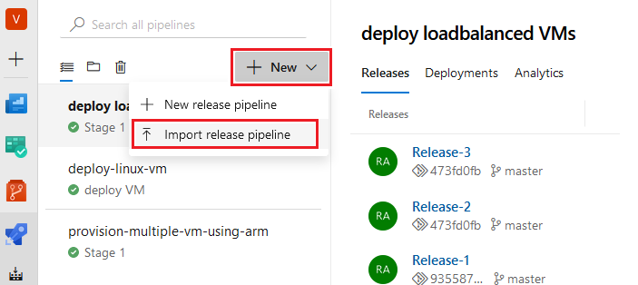

# Clone or import a pipeline

One approach to creating a pipeline is to copy an existing pipeline and use it as a starting point. For YAML pipelines, the process is as easy as copying the YAML from one pipeline to another. For pipelines created in the classic editor, the procedure depends on whether the pipeline to copy is in the same project as the new pipeline. If the pipeline to copy is in the same project, you can clone it, and if it is in a different project you can export it from that project and import it into your project.

## Clone a pipeline

#### [YAML](#tab/yaml/)

:::moniker range=">= azure-devops-2019"

For YAML pipelines, the process for cloning is to copy the YAML from the source pipeline and use it as the basis for the new pipeline.

:::moniker-end

:::moniker range="azure-devops-2019"

1. Navigate to your pipeline, and choose **Edit**.

    :::image type="content" source="media/pipeline-details-2019.png" alt-text="Pipeline details in Azure DevOps Server 2019":::

2. Copy the pipeline YAML from the editor, and paste it into the YAML editor for your new pipeline.

3. To customize your newly cloned pipeline, see [Customize your pipeline](../customize-pipeline.md).

:::moniker-end

:::moniker range="> azure-devops-2019"

1. [Navigate](multi-stage-pipelines-experience.md#navigating-pipelines) to the [pipeline details](multi-stage-pipelines-experience.md#view-pipeline-details) for your pipeline, and choose **Edit**.

    :::image type="content" source="media/pipeline-edit.png" alt-text="Edit pipeline."::: 

2. Copy the pipeline YAML from the editor, and paste it into the YAML editor for your new pipeline.

3. To customize your newly cloned pipeline, see [Customize your pipeline](../customize-pipeline.md).

:::moniker-end

:::moniker range="< azure-devops-2019"

This version of TFS doesn't support YAML pipelines.

:::moniker-end

#### [Classic](#tab/classic/)

If your new pipeline can be created by copying another classic pipeline in the same project, follow the instructions in this section. If your pipeline is in another project, you can use [import/export](#export-and-import-a-pipeline) to copy the pipeline.

:::moniker range=">= azure-devops-2019"

1. Navigate to the pipeline details page for your pipeline.

2. Choose **...** and select **Clone**.

    

3. Your pipeline is cloned with **-clone** appended to the name. Choose **Save** or **Save & queue** to save the cloned pipeline.

> [!NOTE]
> The **Clone** entry is only present on the context menu if your pipeline was created in the classic editor.

:::moniker-end

:::moniker range="< azure-devops-2019"

1. To clone a build definition, navigate to **Build Definitions** on the **Builds** hub, choose **...** beside the desired build definition, and choose **Clone**.

   :::image type="content" source="media/clone-build-definition-tfs-2018.png" alt-text="Clone a build definition in TFS 2018.":::

2. Your pipeline is cloned with **-clone** appended to the name. Choose **Save** or **Save & queue** to save the cloned pipeline.

:::moniker-end

* * *

## Export and Import a pipeline

You can create a new classic pipeline by exporting an existing one and then importing it. This is useful in cases where the new pipeline has to be created in a separate project.

#### [YAML](#tab/yaml/)

:::moniker range=">= azure-devops-2019"

In a YAML pipeline, exporting from one project and importing into another is the same process as cloning. You can simply copy the pipeline YAML from the editor and paste it into the YAML editor for your new pipeline.

:::moniker-end

:::moniker range="azure-devops-2019"

1. Navigate to your pipeline, and choose **Edit**.

    :::image type="content" source="media/pipeline-details-2019.png" alt-text="Pipeline details in Azure DevOps Server 2019":::

2. Copy the pipeline YAML from the editor, and paste it into the YAML editor for your new pipeline.

3. To customize your newly cloned pipeline, see [Customize your pipeline](../customize-pipeline.md).

:::moniker-end

:::moniker range="> azure-devops-2019"

1. [Navigate](multi-stage-pipelines-experience.md#navigating-pipelines) to the [pipeline details](multi-stage-pipelines-experience.md#view-pipeline-details) for your pipeline, and choose **Edit**.

    :::image type="content" source="media/pipeline-edit.png" alt-text="Edit pipeline."::: 

2. Copy the pipeline YAML from the editor, and paste it into the YAML editor for your new pipeline.

3. To customize your newly cloned pipeline, see [Customize your pipeline](../customize-pipeline.md).

:::moniker-end

:::moniker range="< azure-devops-2019"

This version of TFS doesn't support YAML pipelines.

:::moniker-end

#### [Classic](#tab/classic/)

To copy a pipeline definition from another project, you can export an existing definition from that project, and then import it.

:::moniker range="tfs-2018"

To export a build definition, navigate to **Build Definitions** on the **Builds** hub, choose **...** beside the desired build definition, choose **Export**, and download the .json file that contains the build definition.

:::image type="content" source="media/export-build-definition-tfs-2018.png" alt-text="Export a build definition in TFS 2018.":::

To import a build definition, choose **+Import** from the **Build Definitions** page, and select the .json file saved from the previous step.

:::image type="content" source="media/import-build-definition-tfs-2018.png" alt-text="Import a build definition in TFS 2018.":::

:::moniker-end

:::moniker range=">= azure-devops-2019"

1. Navigate to the pipeline details page for your pipeline. 

2. Choose **...** and select **Export**.

    > [!div class="mx-imgBorder"]
    > 

3. When prompted, save the JSON file on your local machine. The browser will save the file in the download directory as per your browser settings.

4. To import the pipeline, navigate to the **Builds** or **Releases** page in your project. Choose **+New** and select the corresponding import pipeline option.

    > [!div class="mx-imgBorder"]
    > 

5. You will now be prompted to select a JSON file to import its contents. Browse to and select the JSON file that you previously exported.

7. After import is complete, you will be shown the new pipeline that is created. Note that exporting a pipeline strips any project specific data like agent pools, service connections etc. You will have to once again provide these details. 

> [!NOTE]
> The **Export** item is only present on the context menu if your pipeline was created in the classic editor.

:::moniker-end

:::moniker range="tfs-2017"

This version of TFS doesn't support import/export for build definitions. For release definitions, you can import/export using the [Clone release definition (for TFS 2015 U2 and above)](https://marketplace.visualstudio.com/items?itemName=ms-devlabs.rm-import-export) extension.

:::moniker-end

* * *

## Next steps

Learn to [customize the pipeline](../customize-pipeline.md) you just cloned or imported.
