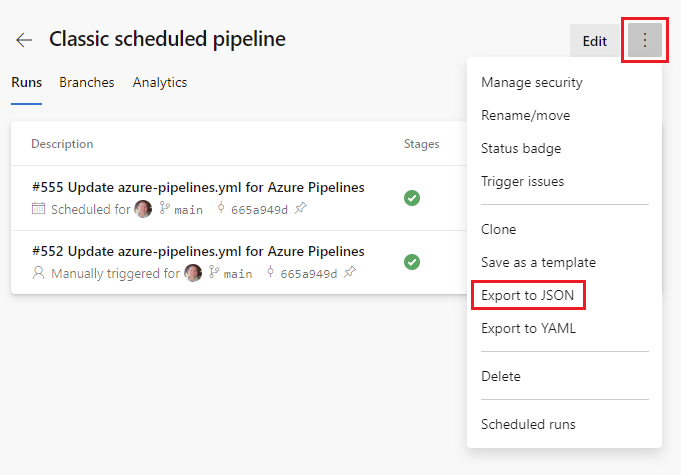

# Clone or import a pipeline

[!INCLUDE [version-lt-eq-azure-devops](../../includes/version-lt-eq-azure-devops.md)]

One approach to creating a pipeline is to copy an existing pipeline and use it as a starting point. For YAML pipelines, the process is as easy as copying the YAML from one pipeline to another. For pipelines created in the classic editor, the procedure depends on whether the pipeline to copy is in the same project as the new pipeline. If the pipeline to copy is in the same project, you can clone it, and if it is in a different project you can export it from that project and import it into your project.

Cloning a classic pipeline also clones its settings, such as variables, triggers, and options. Security settings aren't cloned. Cloning a YAML pipeline only copies the YAML content, and you need to reconfigure any other settings.

:::moniker range="azure-devops"

For information in migrating a classic build pipeline to YAML using **Export to YAML**, see [Migrate from classic pipelines](../migrate/from-classic-pipelines.md).

:::moniker-end

## Clone a pipeline

#### [YAML](#tab/yaml/)

:::moniker range="<=azure-devops"

For YAML pipelines, the process for cloning is to copy the YAML from the source pipeline and use it as the basis for the new pipeline.

:::moniker-end

:::moniker range="> azure-devops-2020"

1. [Go](../create-first-pipeline.md#view-and-manage-your-pipelines) to the [pipeline details](../create-first-pipeline.md#view-pipeline-details) for your pipeline, and choose **Edit**.

    :::image type="content" source="media/pipeline-edit.png" alt-text="Edit pipeline."::: 
1. Copy the pipeline YAML from the editor, and paste it into the YAML editor for your new pipeline.

    > [!NOTE]
    > When copying from a classic pipeline, select the agent job, **View YAML**, **Copy to clipboard**, then paste to the YAML editor for your new pipeline. You can repeat these actions for each job in the pipeline.

1. To customize your newly cloned pipeline, see [Customize your pipeline](../customize-pipeline.md).

:::moniker-end

> [!NOTE]
> When cloning a YAML pipeline, only the YAML content is copied. You need to reconfigure any other settings defined outside the scope of the YAML content, such as variables, triggers, security, and other settings.

#### [Classic](#tab/classic/)

If your new pipeline can be created by copying another classic pipeline in the same project, follow the instructions in this section. If your pipeline is in another project, you can use [import/export](#export-and-import-a-pipeline) to copy the pipeline.

You need `Edit release pipeline` or `Create build pipeline` permissions to clone a Classic pipeline. 
 
:::moniker range="<=azure-devops"

1. Navigate to the pipeline details page for your pipeline.

1. Choose **...** and select **Clone**.

    

1. Your pipeline is cloned with **-clone** appended to the name. Choose **Save** or **Save & queue** to save the cloned pipeline.

> [!NOTE]
> The **Clone** entry is only present on the context menu if your pipeline was created in the classic editor.

> [!IMPORTANT]
> Security settings aren't cloned. You must reconfigure security settings for the cloned pipeline.

:::moniker-end

* * *

## Export and Import a pipeline

You can create a new classic pipeline by exporting an existing one and then importing it. This is useful in cases where the new pipeline has to be created in a separate project.

#### [YAML](#tab/yaml/)

:::moniker range="<=azure-devops"

In a YAML pipeline, exporting from one project and importing into another is the same process as cloning. You can copy the pipeline YAML from the editor and paste it into the YAML editor for your new pipeline.

:::moniker-end

:::moniker range="<=azure-devops"

1. [Go](../create-first-pipeline.md#view-and-manage-your-pipelines) to the [pipeline details](../create-first-pipeline.md#view-pipeline-details) for your pipeline, and choose **Edit**.

    :::image type="content" source="media/pipeline-edit.png" alt-text="Edit pipeline."::: 

1. Copy the pipeline YAML from the editor, and paste it into the YAML editor for your new pipeline.

1. To customize your newly cloned pipeline, see [Customize your pipeline](../customize-pipeline.md).

:::moniker-end

#### [Classic](#tab/classic/)

To copy a build definition from another project, you can export an existing definition from that project, and then import it.

:::moniker range="azure-devops"

### Build pipeline

1. Navigate to the pipeline details page for your pipeline. 

1. Choose **...** and select **Export to JSON**.

    > [!div class="mx-imgBorder"]
    > 

1. When prompted, save the JSON file on your local machine. The browser saves the file in the download directory as per your browser settings.

1. To import the pipeline, navigate to the **Pipelines** page in your project. Choose **...**, select **Import a pipeline**, and select the corresponding import pipeline option.

1. Browse to and select the JSON file that you previously exported.

1. After import is complete, you'll be shown the new pipeline that is created. Exporting a pipeline strips any project specific data like agent pools, service connections, etc. You have to once again provide these details. 

> [!NOTE]
> The **Export** item is only present on the context menu if your pipeline was created in the classic editor.

### Release pipeline

The procedure for exporting and importing a classic release pipeline is similar to the classic build pipeline procedure, but the menus and UI are slightly different.

1. To export a classic release pipeline, navigate to **Releases**, choose **...**, and select **Export**.

    > [!div class="mx-imgBorder"]
    > 

1. To import a classic release pipeline, navigate to **Releases**, choose **+New**, and select **Import release pipeline**.

    > [!div class="mx-imgBorder"]
    > 

:::moniker-end

:::moniker range="=azure-devops-2020"

1. Navigate to the pipeline details page for your pipeline. 

1. Choose **...** and select **Export**.

    > [!div class="mx-imgBorder"]
    > 

1. When prompted, save the JSON file on your local machine. The browser saves the file in the download directory as per your browser settings.

1. To import the pipeline, navigate to the **Builds** or **Releases** page in your project. Choose **+New** and select the corresponding import pipeline option.

    > [!div class="mx-imgBorder"]
    > 

1. Browse to and select the JSON file that you previously exported.

1. After import is complete, you'll be shown the new pipeline that is created. Exporting a pipeline strips any project specific data like agent pools, service connections, etc. You have to once again provide these details. 

> [!NOTE]
> The **Export** item is only present on the context menu if your pipeline was created in the classic editor.

:::moniker-end

* * *

## Next steps

Learn to [customize the pipeline](../customize-pipeline.md) you cloned or imported.
