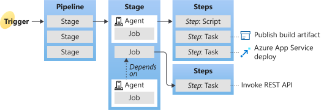

# Key concepts for new Azure Pipelines users

Learn about the key concepts and components that make up a pipeline. Understanding the basic terms and parts of a pipeline can help you deliver better code more efficiently and reliably.

**Key concepts overview**

- A [trigger](#trigger) tells a Pipeline to run. 
- A [pipeline](#pipeline) is made up of one or more [stages](#stage). A pipeline can deploy to one or more [environments](#environment).
- A [stage](#stage) is a way of organizing [jobs](#job) in a pipeline and each stage can have one or more jobs.
- Each [job](#job) runs on one [agent](#agent). A job can also be agentless. 
- Each [agent](#agent) runs a job that contains one or more [steps](#step).
- A [step](#step) can be a [task](#task) or [script](#script) and is the smallest building block of a pipeline. 
- A [task](#task) is a pre-packaged script that performs an action, such as invoking a REST API or publishing a build artifact.
- An [artifact](#artifact) is a collection of files or packages published by a [run](#run).

**Azure Pipelines terms**

## Agent

When your build or deployment runs, the system begins one or more jobs. An agent is computing infrastructure with installed agent software that runs one job at a time. For example, your job could run on a Microsoft-hosted Ubuntu agent. 

For more in-depth information about the different types of agents and how to use them, see [Azure Pipelines Agents](../agents/agents.md).

## Approvals

[Approvals](../process/approvals.md) define a set of validations required before a deployment runs. Manual approval is a common check performed to control deployments to production environments. When checks are configured on an environment, pipelines will stop before starting a stage that deploys to the environment until all the checks are completed successfully. 

## Artifact

An artifact is a collection of files or packages published by a run. Artifacts are made available to subsequent tasks, such as distribution or deployment. For more information, see [Artifacts in Azure Pipelines](../artifacts/artifacts-overview.md).

## Continuous delivery

Continuous delivery &#40;CD&#41; is a process by which code is built, tested, and deployed to one or more test and production stages. Deploying and testing in multiple stages helps drive quality. Continuous integration systems produce deployable artifacts, which include infrastructure and apps. Automated release pipelines consume these artifacts to release new versions and fixes to existing systems. Monitoring and alerting systems run constantly to drive visibility into the entire CD process. This process ensures that  errors are caught often and early.

## Continuous integration

Continuous integration &#40;CI&#41; is the practice used by development teams to simplify the testing and building of code. CI helps to catch bugs or problems early in the development cycle, which makes them easier and faster to fix. Automated tests and builds are run as part of the CI process. The process can run on a set schedule, whenever code is pushed, or both. Items known as artifacts are produced from CI systems. They're used by the continuous delivery release pipelines to drive automatic deployments.

## Deployment

For Classic pipelines, a deployment is the action of running the tasks for one stage, which can include running automated tests, deploying build artifacts, and any other actions are specified for that stage. 

For YAML pipelines, a deployment typically refers to a [deployment job](../process/deployment-jobs.md).  A deployment job is a collection of steps that are run sequentially against an environment. You can use strategies like run once, rolling, and canary for deployment jobs. 

## Deployment group

A deployment group is a set of deployment target machines that have agents installed. A deployment group is just another grouping of agents, like an [agent pool](../agents/pools-queues.md). You can set the deployment targets in a pipeline for a job using a deployment group. Learn more about provisioning agents for [deployment groups](../release/deployment-groups/howto-provision-deployment-group-agents.md). 

## Environment

An [environment](../process/environments.md) is a collection of resources, where you deploy your application. It can contain one or more virtual machines, containers, web apps, or any service that's used to host the application being developed. A pipeline might deploy the app to one or more environments after build is completed and tests are run.

## Job

A stage contains one or more [jobs](../process/phases.md). Each job runs on an agent. A job represents an execution boundary of a set of steps. All of the steps run together on the same agent. Jobs are most useful when you want to run a series of steps in different environments. For example, you might want to build two configurations - x86 and x64. In this case, you have one stage and two jobs. One job would be for x86 and the other job would be for x64.

## Pipeline

A pipeline defines the continuous integration and deployment process for your app. It's made up of one or more stages. It can be thought of as a workflow that defines how your test, build, and deployment steps are run. 

## Release

For Classic pipelines, a [release](../release/releases.md) is a versioned set of artifacts specified in a pipeline. The release includes a snapshot of all the information required to carry out all the tasks and actions in the release pipeline, such as stages, tasks, policies such as triggers and approvers, and deployment options. You can create a release manually, with a deployment trigger, or with the REST API. 

For YAML pipelines, the build and release stages are in one, [multi-stage pipeline](multi-stage-pipelines-experience.md). 

## Run

A run represents one execution of a pipeline. It collects the logs associated with running the steps and the results of running tests. During a run, Azure Pipelines will first process the pipeline and then send the run to one or more agents. Each agent will run jobs. Learn more about the [pipeline run sequence](../process/runs.md).  

## Script

A script runs code as a step in your pipeline using command line, PowerShell, or Bash. You can write [cross-platform scripts](../scripts/cross-platform-scripting.md) for macOS, Linux, and Windows. Unlike a [task](#task), a script is custom code that is specific to your pipeline. 

## Stage

A [stage](../process/stages.md) is a logical boundary in the pipeline. It can be used to mark separation of concerns (for example, Build, QA, and production). Each stage contains one or more jobs. When you define multiple stages in a pipeline, by default, they run one after the other. You can specify the conditions for when a stage runs. 
When you are thinking about whether you need a stage, ask yourself:
- Do separate groups manage different parts of this pipeline? For example, you could have a test manager that manages the jobs that relate to testing and a different manager that manages jobs related to production deployment. In this case, it makes sense to have separate stages for testing and production. 
- Is there a set of [approvals](../process/approvals.md) that are connected to a specific job or set of jobs? If so, you can use stages to break your jobs into logical groups that require approvals. 
- Are there jobs that need to run a long time? If you have part of your pipeline that will have an extended run time, it makes sense to divide them into their own stage. 

## Step

A step is the smallest building block of a pipeline. For example, a pipeline might consist of build and test steps. A step can either be a script or a task. A task is simply a pre-created script offered as a convenience to you. To view the available tasks, see the [Build and release tasks](../tasks/index.md) reference. For information on creating custom tasks, see [Create a custom task](../../extend/develop/add-build-task.md).

## Task

A [task](../process/tasks.md) is the building block for defining automation in a pipeline. A task is packaged script or procedure that has been abstracted with a set of inputs.

## Trigger

A trigger is something that's set up to tell the pipeline when to run. You can configure a pipeline to run upon a push to a repository, at scheduled times, or upon the completion of another build. All of these actions are known as triggers. For more information, see [build triggers](../build/triggers.md) and [release triggers](../release/triggers.md).

### About the authors
- [Dave Jarvis](https://github.com/DaveJarvis) contributed to the key concepts overview graphic.
