# Multi-stage pipelines user experience

The multi-stage pipelines experience brings improvements and ease of use to the Pipelines portal UI. This article shows you how to view and manage your pipelines using this new experience.

## Navigating pipelines

You can view and manage your pipelines by choosing **Pipelines** from the left-hand menu.

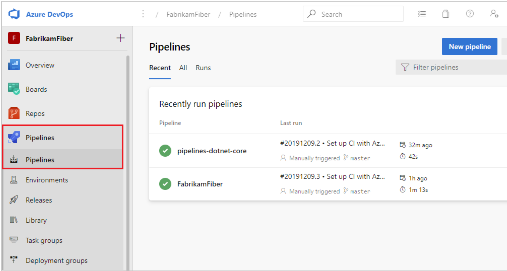

You can drill down and view pipeline details, run details, pipeline analytics, job details, logs, and more.

At the top of each page is a breadcrumb navigation bar. Select the different areas of the bar to navigate to different areas of the portal. The breadcrumb navigation is a convenient way to go back one or more steps. 

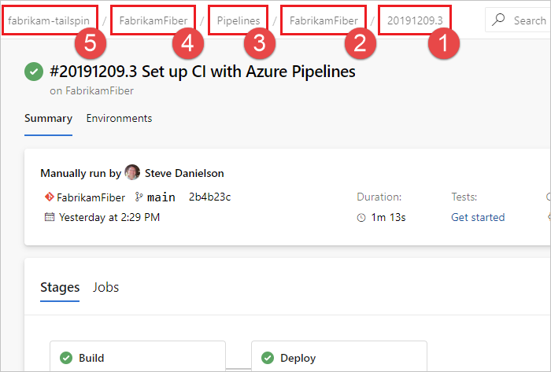

1. This area of the breadcrumb navigation shows you what page you're currently viewing. In this example, the page is the run summary for run number **20191209.3**.
2. One level up is a link to the [pipeline details](#view-pipeline-details) for that run.
3. The next level up is the [pipelines landing page](#pipelines-landing-page).
4. This link is to the **FabrikamFiber** project, which contains the pipeline for this run.
5. The root breadcrumb link is to the Azure DevOps **fabrikam-tailspin** organization, which contains the project that contains the pipeline.

Many pages also contain a back button that takes you to the previous page.

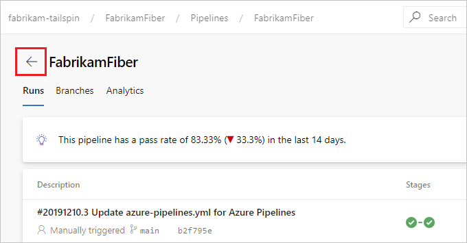

## Pipelines landing page

From the pipelines landing page you can view pipelines and pipeline runs, create and import pipelines, manage security, and drill down into pipeline and run details.

Choose **Recent** to view recently run pipelines (the default view), or choose **All** to view all pipelines.

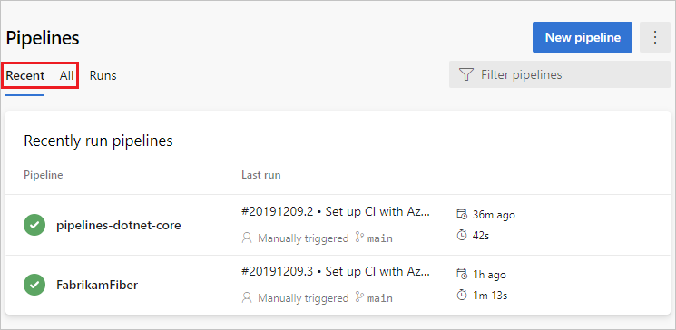

Select a pipeline to manage that pipeline and view its runs. Select the build number for the last run to view the results of that build, select the branch name to view the branch for that run, or select the context menu to run the pipeline and perform other management actions.

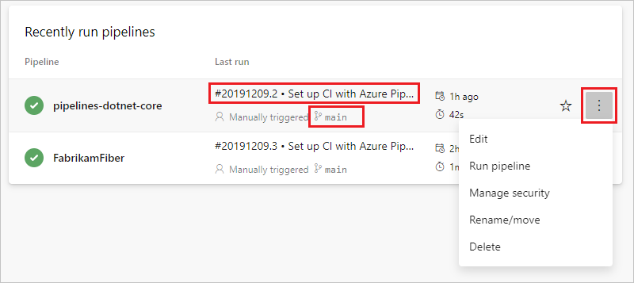

Select **Runs** to view all pipeline runs. You can optionally filter the displayed runs.

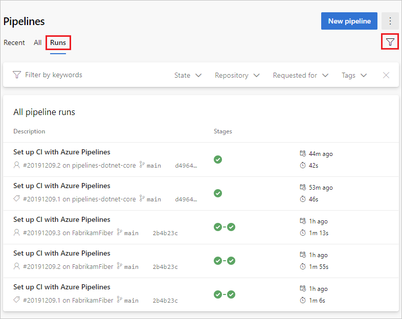

Select a pipeline run to view information about that run.

## View pipeline details

The details page for a pipeline allows you to view and manage that pipeline.

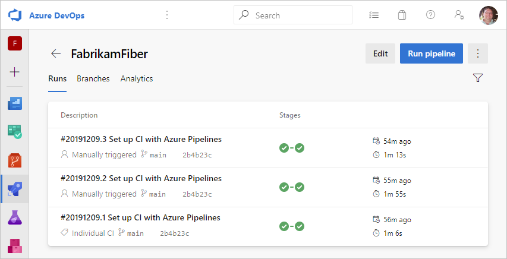

Choose **Edit** to edit your pipeline. For more information, see [YAML pipeline editor](yaml-pipeline-editor.md).

### Pipeline settings

You can view and configure pipeline settings from the **More actions** :::image type="icon" source="../../media/icons/more-actions.png"::: menu on the pipeline details page.

:::image type="content" source="media/pipeline-more-actions.png" alt-text="Pipeline settings and more actions":::

* **Manage security** - [Manage security](#manage-security)
* **Rename/move** - Edit your pipeline name and folder location.
  :::image type="content" source="media/rename-move-pipeline.png" alt-text="Rename or move pipeline":::
* **Status badge** - [Add a status badge to your repository](../create-first-pipeline.md?view=azure-devops&preserve-view=true#add-a-status-badge-to-your-repository)
* **Settings** - [Pipeline settings](../customize-pipeline.md#pipeline-settings)
* **Delete** - Deletes the pipeline including all builds and associated artifacts.
* **Scheduled runs** - [Scheduled runs view](../process/scheduled-triggers.md#scheduled-runs-view)

### Runs

Select **Runs** to view the runs for that pipeline. You can optionally filter the displayed runs.

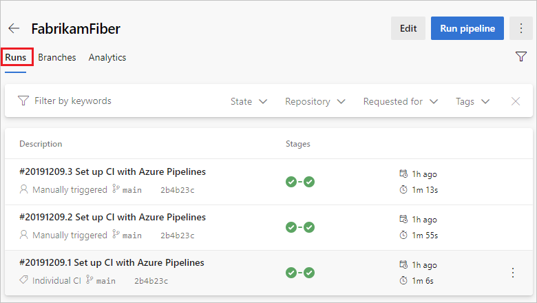

You can choose to **Retain** or **Delete** a run from the context menu. For more information on run retention, see [Build and release retention policies](../policies/retention.md).

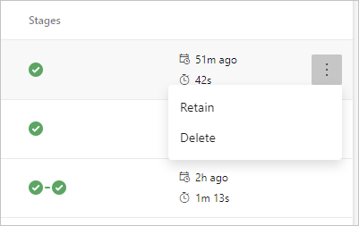

### Branches

Select **Branches** to view the history or run for that branch. Hover over the **History** to view a summary for each run, and select a run to navigate to the details page for that run.

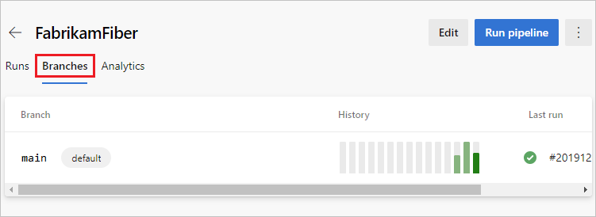

### Analytics

Select **Analytics** to view pipeline metrics such as pass rate and run duration. Choose **View full report** for more information on each metric.

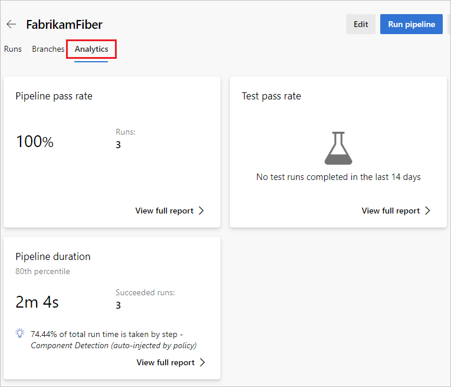

## View pipeline run details

From the pipeline run summary you can view the status of your run, both while it is running and when it is complete.

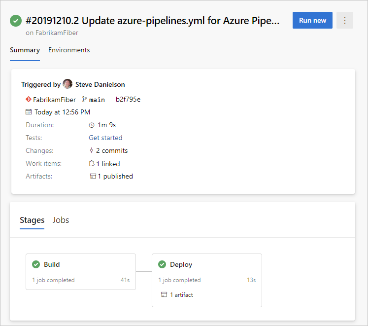

From the summary pane you can download artifacts, and navigate to linked commits, test results, and work items.

### Cancel and re-run a pipeline

If the pipeline is running, you can cancel it by choosing **Cancel**. If the run has completed, you can re-run the pipeline by choosing **Run new**.

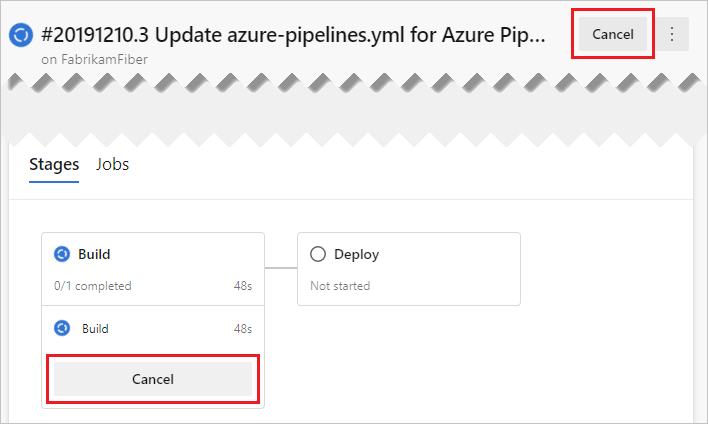

### Pipeline run more actions menu

From the **More actions** :::image type="icon" source="../../media/icons/more-actions.png"::: menu you can download logs, add tags, edit the pipeline, delete the run, and configure [retention](../policies/retention.md) for the run.

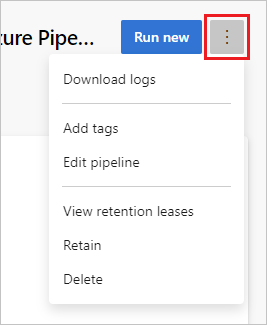

> [!NOTE]
> You can't delete a run if the run is retained. If you don't see **Delete**, choose **Stop retaining run**, and then delete the run. If you see both **Delete** and **View retention releases**, one or more configured retention policies still apply to your run. Choose **View retention releases**, delete the policies (only the policies for the selected run are removed), and then delete the run.

### Jobs and stages

The jobs pane displays an overview of the status of your stages and jobs. This pane may have multiple tabs depending on whether your pipeline has stages and jobs, or just jobs. In this example the pipeline has two stages named **Build** and **Deploy**. You can drill down into the pipeline steps by choosing the job from either the **Stages** or **Jobs** pane.

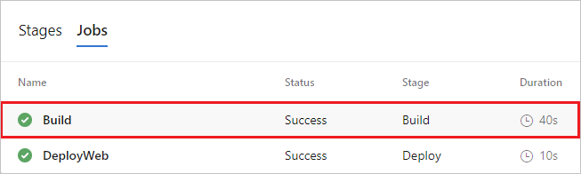

Choose a job to see the steps for that job.

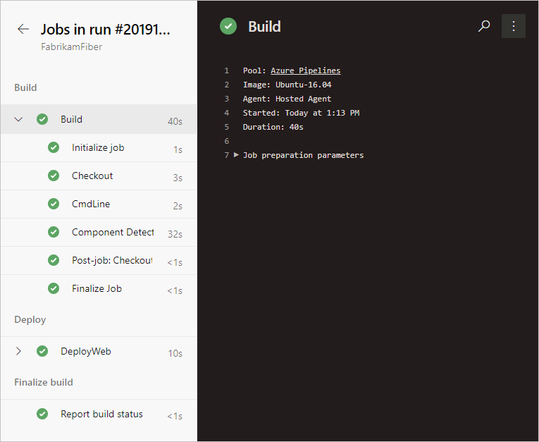

From the steps view, you can review the status and details of each step. From the **More actions** :::image type="icon" source="../../media/icons/more-actions.png"::: you can toggle timestamps or view a raw log of all steps in the pipeline.

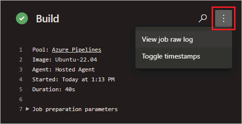

## Manage security

You can configure pipelines security on a project level from the **More actions** :::image type="icon" source="../../media/icons/more-actions.png"::: on the pipelines landing page, and on a pipeline level on the pipeline details page.

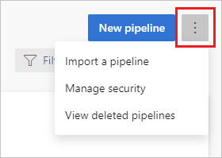

To support security of your pipeline operations, you can add users to a built-in security group, set individual permissions for a user or group, or add users to pre-defined roles. You can manage security for Azure Pipelines in the web portal, either from the user or admin context. For more information on configuring pipelines security, see [Pipeline permissions and security roles](../policies/permissions.md).

:::moniker range="azure-devops"

## Task insights for failed pipeline runs

Azure DevOps provides a **Task Insights for Failed Pipeline Runs** setting, that when enabled, provides pop-up notifications of build failures with a link to view a report.

:::image type="content" source="media/task-insights.png" alt-text="This task has failed pop-up.":::

To configure this setting, navigate to [Preview features](../../project/navigation/preview-features.md), find **Task Insights for Failed Pipeline Runs**, and choose the desired setting.

:::image type="content" source="media/task-insights-setting.png" alt-text="Task insights for failed pipeline runs setting.":::

:::moniker-end

## Next steps

Learn more about configuring pipelines in the language of your choice:

* [.NET Core](../ecosystems/dotnet-core.md)
* [Go](../ecosystems/go.md)
* [Java](../ecosystems/java.md)
* [Node.js](../ecosystems/javascript.md)
* [Python](../ecosystems/python.md)
* [Containers](../ecosystems/containers/build-image.md) and [Container jobs](../process/container-phases.md)

Learn more about building [Azure Repos](../repos/azure-repos-git.md) and [GitHub](../repos/github.md) repositories.

To learn what else you can do in YAML pipelines, see [Customize your pipeline](../customize-pipeline.md), and for a complete reference see [YAML schema reference](../yaml-schema.md).

