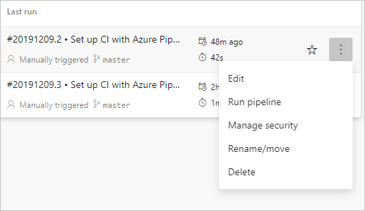
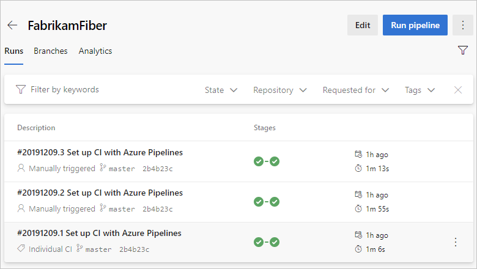
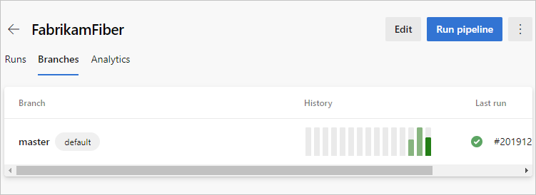
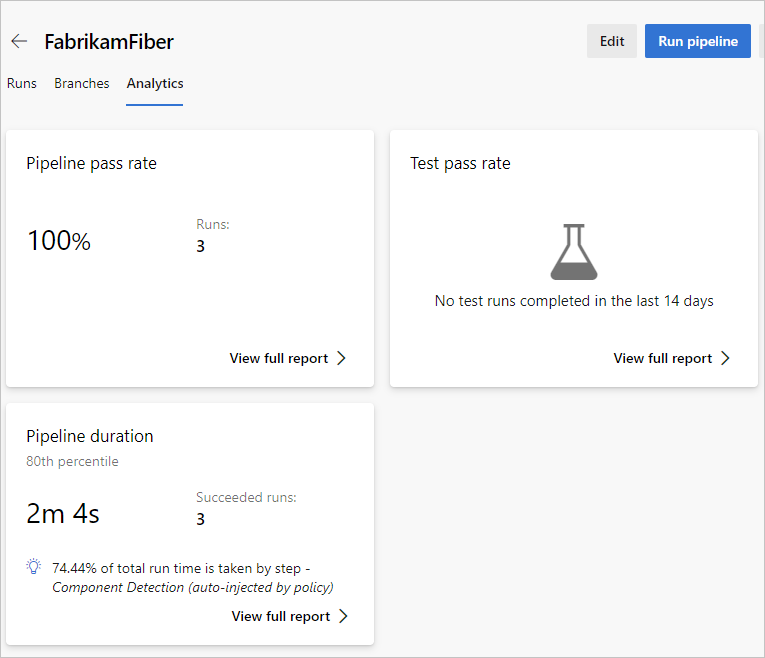

# Multi-stage pipelines user experience

The multi-stage pipelines experience brings improvements and ease of use to the Pipelines portal UI. THis article shows you how to work with your pipelines using this new user experience.

>[!div class="checklist"]      
> * Navigate to pipelines
> * Cancel and re-run pipelines
> * Download logs and artifacts
> * View error cards on the summary page  

## Navigate to pipelines

You can view and manage your pipelines by choosing Pipelines from the left-hand menu.

From the pipelines landing page you can create new pipelines, import pipelines, manage security options, and view pipelines and pipeline runs.

### View pipelines and pipeline runs

### Create and manage pipelines

### Create and manage pipelines

## Per pipeline info

### View runs, branches, and analytics

## Pipeline details

The details page for a pipeline allows you to view and manage that pipelines.

### Run new

Run summary context menu

