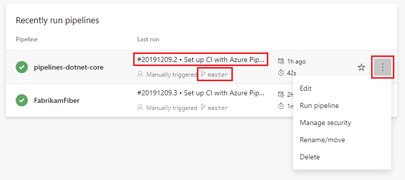
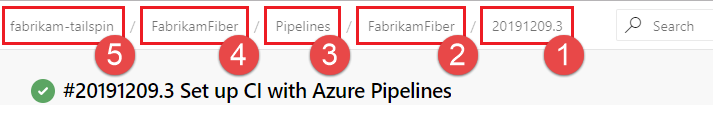

# Multi-stage pipelines user experience

The multi-stage pipelines experience brings improvements and ease of use to the Pipelines portal UI. THis article shows you how to work with your pipelines using this new user experience.

>[!div class="checklist"]      
> * Navigate to and view pipeline details
> * Manage pipeline runs
> * Download logs and artifacts
> * View error cards on the summary page  

## Navigate to pipelines

You can view and manage your pipelines by choosing Pipelines from the left-hand menu.

From the pipelines landing page you can create and import pipelines, manage security options, and view pipelines and pipeline runs.

### View pipelines and pipeline runs

Choose **Recent** to see recently run pipelines, or **All** to view all pipelines.

Select a pipeline to manage that pipeline and view its runs. Select the build number for the last run to view the results of that build, select the branch name to view the branch for that run, or select the context menu to run the pipeline and perform other management actions.

Select a pipeline run to view information about that run.

### Breadcrumb navigation

At the top of each page is a breadcrumb navigation bar. Select the different areas of the bar to navigate to different areas of the portal. The breadcrumb navigation is a convenient way to go back a step, for example when you are viewing pipeline runs, you can use the breadcrumb link to go back to the pipeline overview page.

1. This area of the breadcrumb navigation shows you what page you're currently viewing. In this example, the page is the run summary for run number **20191209.3**.
2. One level up is a link to the [pipeline details](#pipeline-details) for that run.
3. The next level up is the [pipelines landing page](#navigate-to-pipelines).
4. This link is to the **FabrikamFiber** project, which contains the pipeline for this run.
5. The root breadcrumb link is to the Azure DevOps **fabrikam-tailspin** organization, which contains the project.

## Pipeline details

The details page for a pipeline allows you to view and manage that pipeline.

Select **Runs** to view the runs for that pipeline. You can optionally filter the displayed runs.

Select **Branches** to view the history or run for that branch. Hover over the **History** to view a summary for each run, and select a run to navigate to the details page for that run.

Select **Analytics** to view pipeline metrics such as pass rate and run duration. Choose **View full report** for more information on each metric.

## Pipeline runs

### Cancel and re-run a pipeline

### Download logs and artifacts

### Run new

Run summary context menu

