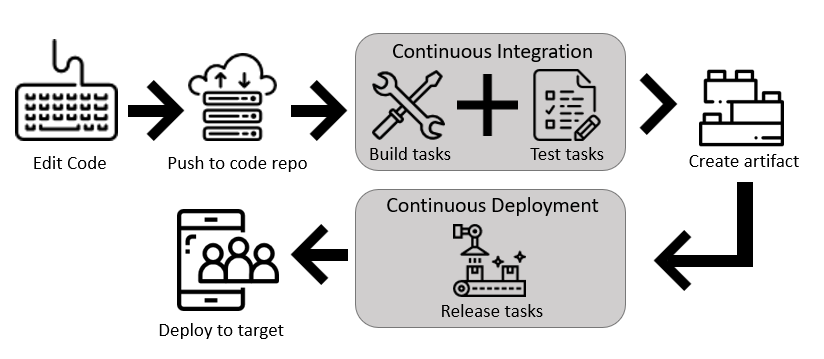

# Use Azure Pipelines

[!INCLUDE [version-tfs-2015-rtm](../_shared/version-tfs-2015-rtm.md)]

[!INCLUDE [temp](../_shared/concept-rename-note.md)]

#### [YAML](#tab/yaml/)
::: moniker range=">= azure-devops-2019"

You define your pipeline in a YAML file called `azure-pipelines.yml` with the rest of your app.

* The pipeline is versioned with your code. It follows the same branching structure. You get validation of your changes through code reviews in pull requests and branch build policies.
* Every branch you use can modify the build policy by modifying the `azure-pipelines.yml` file.
* A change to the build process might cause a break or result in an unexpected outcome. Because the change is in version control with the rest of your codebase, you can more easily identify the issue.

Follow these basic steps:

1. Configure Azure Pipelines to use your Git repo.
1. Edit your `azure-pipelines.yml` file to define your build.
1. Push your code to your version control repository. This action kicks off the default trigger to build and deploy and then monitor the results.

Your code is now updated, built, tested, and packaged. It can be deployed to any target.

[Create your first pipeline](../create-first-pipeline.md).

::: moniker-end

::: moniker range="<= tfs-2018"

YAML pipelines aren't available in TFS.

::: moniker-end

#### [Classic](#tab/classic/)

Create and configure pipelines in the [Azure DevOps Services web portal](https://dev.azure.com/) with the classic editor.
You define a *build pipeline* to build and test your code, and then to publish artifacts. You also define a *release pipeline* to consume and deploy those artifacts to deployment targets.

Follow these basic steps:

1. Configure Azure Pipelines to use your Git repo.
1. Use the Azure Pipelines classic editor to create and configure your build and release pipelines.
1. Push your code to your version control repository. This action triggers your pipeline and runs tasks such as building or testing code.

The build creates an artifact that's used by the rest of your pipeline to run tasks such as deploying to staging or production.

Your code is now updated, built, tested, and packaged. It can be deployed to any target.

[Create your first pipeline](../create-first-pipeline.md).

* * *
