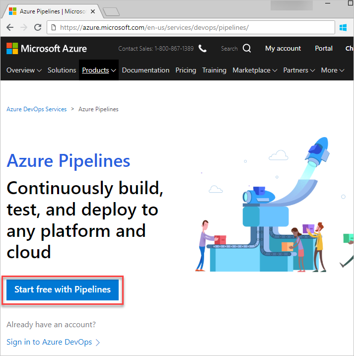
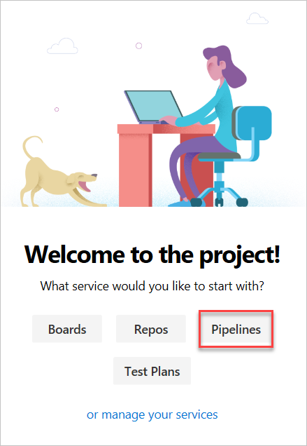
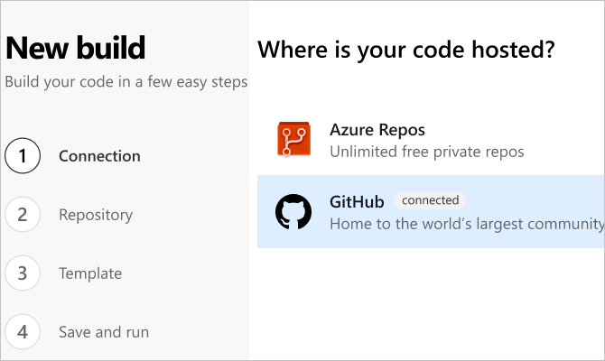
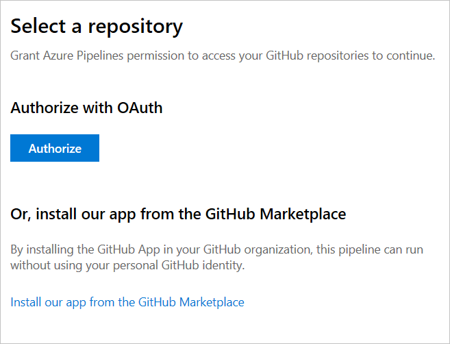
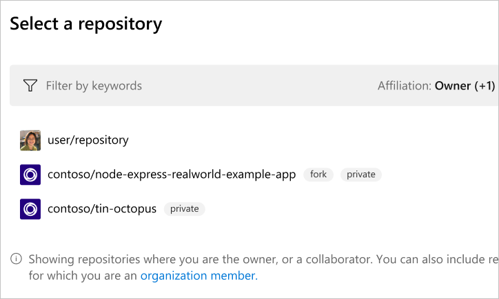
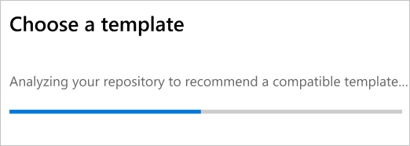
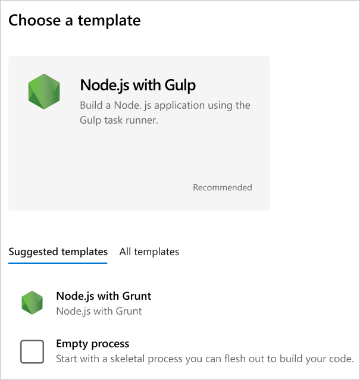
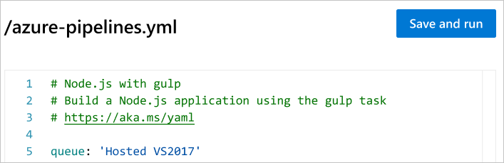
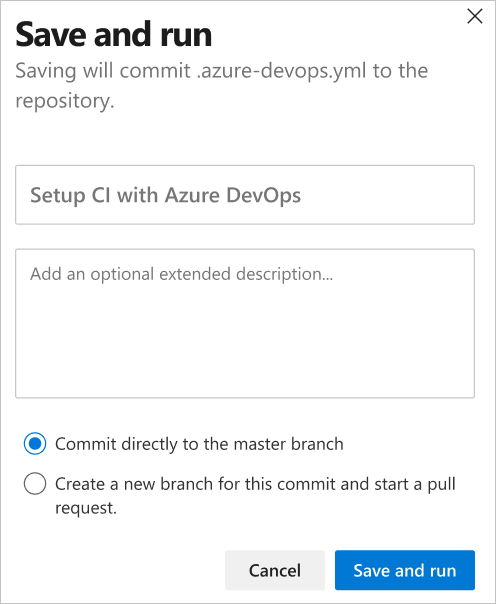

# Sign up for Azure Pipelines

**Azure Pipelines**

Sign up for an Azure DevOps organization and Azure Pipelines to begin managing CI/CD to deploy your code with high-performance pipelines. This sequence walks you through the sign-up process.

1. From the [Azure website](https://azure.microsoft.com/services/devops/pipelines/), select **Start free with Azure Pipelines**.

   

   If you already [signed up for Azure DevOps Services](../../user-guide/sign-up-invite-teammates.md), on your new project page, select **Azure Pipelines**.

   

2. Select the location of your code, either **GitHub** or **Azure Repos**.

   

3. Grant Azure Pipelines permission to access your GitHub repositories. Select **Authorize** to authorize with OAuth, or select **Install our app from the GitHub Marketplace**.

   

   

4.  Select a repository.

    

    

5. Select a template.

   

6. Select **Save and run**.

   

7. Select to commit directly to the master branch. Or select to create a new branch for this commit and start a pull request.

   

## Next steps

> [!div class="nextstepaction"]
> [Get started with Azure Pipelines](../get-started/pipelines-get-started.md)