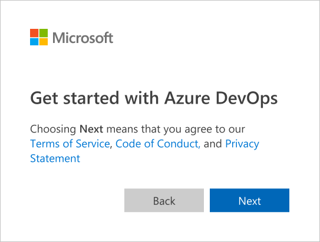

# Sign up for Azure Pipelines

1. From the Azure website, choose **Start free with Pipelines**.

   

2. Enter your email address, phone number, or Skype ID for your Microsoft account.

   If you're a Visual Studio subscriber and get DevOps as a benefit, use the Microsoft account associated with your subscription. Choose **Next**.

   

3. Enter your password and choose **Sign in**.

   If you don't have a Microsoft account, you can [create a Microsoft account](https://login.live.com/login.srf?lw=1) at this time.

   

4. Choose **Next**.

   

5. Create a project to get started. For more information, see [Define your Azure DevOps organizations and projects](../../user-guide/define-organizations-and-projects.md) and [Create a project](../../organizations/projects/create-project.md).

   

## Next steps

> [!div class="nextstepaction"]
> [Get started with Azure Pipelines](../get-started/pipelines-get-started.md)