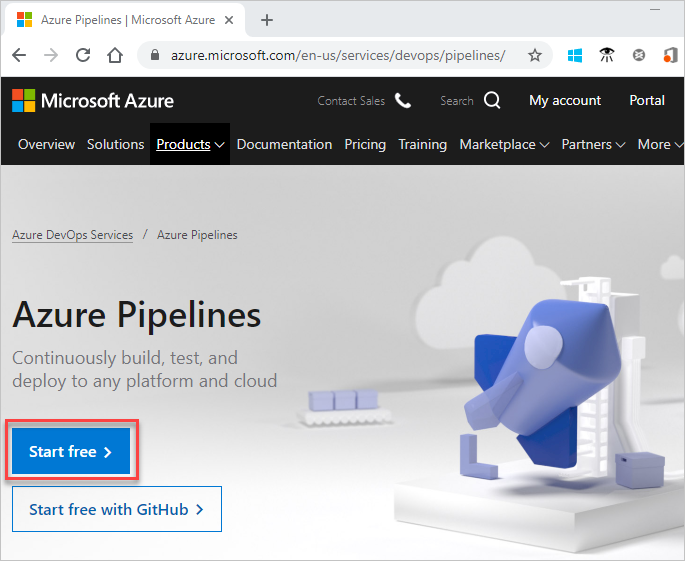
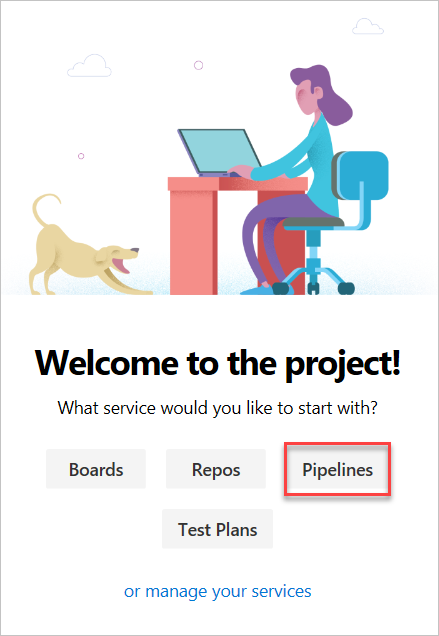
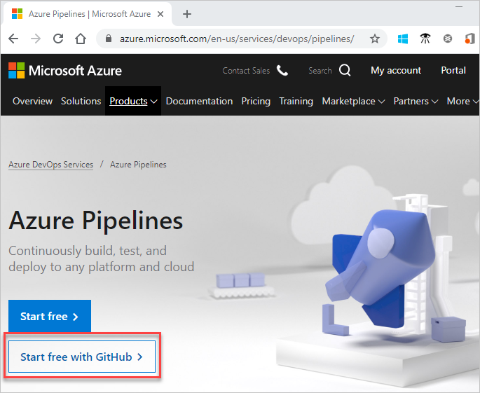
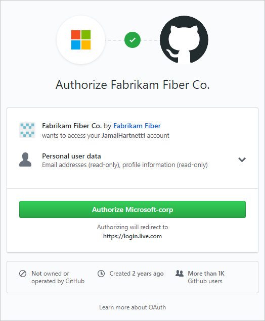
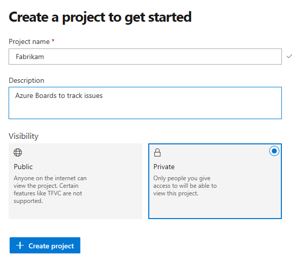
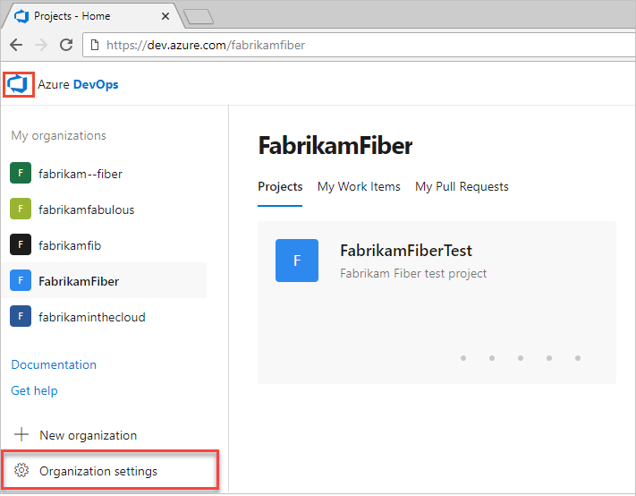

# Sign up for Azure Pipelines

[!INCLUDE [version-team-services](../includes/version-team-services.md)]

Sign up for an Azure DevOps organization and Azure Pipelines to begin managing CI/CD to deploy your code with high-performance pipelines.

For more information on Azure Pipelines, see [What is Azure Pipelines](what-is-azure-pipelines.md).

## Sign up with a personal Microsoft account

If you have a Microsoft account, complete the following steps to sign up for Azure Pipelines.

1. Open [Azure Pipelines](https://azure.microsoft.com/services/devops/pipelines) and select **Start free**.

   

2. Enter your email address, phone number, or Skype ID for your Microsoft account. If you're a Visual Studio subscriber and you get Azure DevOps as a benefit, use the Microsoft account associated with your subscription. Select **Next**.

    > [!div class="mx-imgBorder"]
    >

3. Enter your password and select **Sign in**.

   

4. To get started with Azure Pipelines, select **Continue**.

    

5. Select the service you'd like to start your project with, **Pipelines**.

    

   An organization is created based on the account you used to sign in. Use the following URL to sign in to your organization at any time:

   `https://dev.azure.com/{yourorganization}`

Your next step is to [create a project](#create-project).

## Sign up with a GitHub account

If you have a GitHub account, complete the following steps to sign up for Azure Pipelines.

> [!IMPORTANT]
> If your GitHub email address is associated with an Azure AD-backed organization in Azure DevOps, you can't sign in with your GitHub account, rather you must sign in with your Azure AD account.

1. Choose **Start free with GitHub**. If you're already part of an Azure DevOps organization, choose **Start free**.

   

2. Enter your GitHub account credentials, and then select **Sign in**.

   

3. Select **Authorize Microsoft-corp**.

   

4. Select **Continue**.

   

   An organization gets created based on the account you used to sign in. Use the following URL to sign in to your organization at any time: `https://dev.azure.com/{yourorganization}`

For more information about GitHub authentication, see [FAQs](../../organizations/security/faq-github-authentication.yml).

Your next step is to [create a project](#create-project).

<a id="create-project" />

## Create a project

If you signed up for Azure DevOps with an existing MSA or GitHub identity, you're automatically prompted to create a project. Create either a public or private project. To learn more about public projects, see [What is a public project?](../../organizations/public/about-public-projects.md).

1. Enter a name for your project, select the visibility, and optionally provide a description. Then choose **Create project**.

   > [!div class="mx-imgBorder"]
   >

   Special characters aren't allowed in the project name (such as / : \ ~ & % ; @ ' " ? < > | # $ * } { , + = [ ]).  The project name also can't begin with an underscore, can't begin or end with a period, and must be 64 characters or less. Set your project visibility to either public or private. Public visibility allows for anyone on the internet to view your project. Private visibility is for only people who you give access to your project.

2. When your project is created, the Kanban board automatically appears.

   > [!div class="mx-imgBorder"]
   > 

   You're now set to [create your first pipeline](../create-first-pipeline.md), or [invite other users](#invite-others) to collaborate with your project.

<a id="invite-others" />

## Invite team members - optional

You don't need to invite team members to sign up for Azure Pipelines. You can add and invite others to work on your project by adding their email address to your organization and project.

1. From your project web portal, choose the :::image type="icon" source="../../media/icons/project-icon.png" border="false"::: Azure DevOps icon, and then select  **Organization settings**.

   

2. Select **Users** > **Add users**.

   :::image type="content" source="../../media/add-new-users.png" alt-text="Select Add users":::

3. Complete the form by entering or selecting the following information:

   - **Users:** Enter the email addresses (Microsoft accounts) or GitHub IDs for the users. You can add several email addresses by separating them with a semicolon (;). An email address appears in red when it's accepted.
   - **Access level:** Assign one of the following access levels:
      - **Basic:** Assign to users who must have access to all Azure Pipelines features. You can grant up to five users Basic access for free.
      - **Stakeholder:** Assign to users for limited access to features to view, add, and modify work items. You can assign an unlimited amount of users Stakeholder access for free.
   - **Add to project:** Select the project you named in the preceding procedure.
   - **Azure DevOps groups:** Select one of the following security groups, which will determine the permissions the users have to do select tasks. To learn more, see [Azure Pipelines resources](../security/resources.md).
      - **Project Readers:** Assign to users who only require read-only access.
      - **Project Contributors:** Assign to users who will contribute fully to the project.
      - **Project Administrators:** Assign to users who will configure project resources.

   > [!NOTE]  
   > Add email addresses for [personal Microsoft accounts](https://account.microsoft.com/account) and IDs for GitHub accounts unless you plan to use [Azure Active Directory (Azure AD)](/azure/active-directory/fundamentals/active-directory-whatis) to authenticate users and control organization access. If a user doesn't have a Microsoft or GitHub account, ask the user to [sign up](https://signup.live.com/) for a Microsoft account or a GitHub account.  

4. When you're done, select **Add** to complete your invitation.

For more information, see [Add organization users for Azure DevOps Services](../../organizations/accounts/add-organization-users.md).

## Change organization or project settings

You can rename and delete your organization, or change the organization location. To learn more, see the following articles:

- [Manage organizations](../../organizations/accounts/organization-management.md)
- [Rename an organization](../../organizations/accounts/rename-organization.md)
- [Change the location of your organization](../../organizations/accounts/change-organization-location.md)

You can rename your project or change its visibility. To learn more about managing projects, see the following articles:

- [Manage projects](../../organizations/projects/about-projects.md)
- [Rename a project](../../organizations/projects/rename-project.md)
- [Change the project visibility, public or private](../../organizations/public/make-project-public.md)

## Next steps  

> [!div class="nextstepaction"]
> [Create your first pipeline](../create-first-pipeline.md)

## Related articles

- [What is Azure Pipelines?](what-is-azure-pipelines.md)
- [Key concepts for new Azure Pipelines users](key-pipelines-concepts.md)
- [Create your first pipeline](../create-first-pipeline.md)
