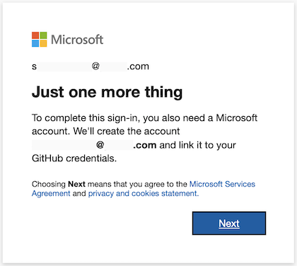
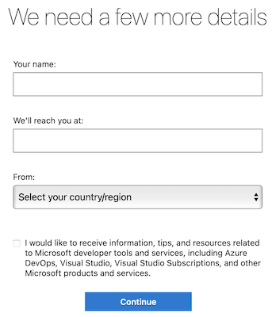

# Sign up for Azure Pipelines

[!INCLUDE [version-eq-azure-devops](../../includes/version-eq-azure-devops.md)]

Sign up for an Azure DevOps organization and Azure Pipelines to begin managing CI/CD to deploy your code with high-performance pipelines.

For more information about Azure Pipelines, see [What is Azure Pipelines](what-is-azure-pipelines.md).

You can sign up with either a [Microsoft account](#signup-microsoft) or a [GitHub account](#signup-github).

## Sign up with a Microsoft account

To sign up for Azure DevOps with a Microsoft account, complete the following steps.

1. Check that your account is up to date by logging into your <a href="https://account.microsoft.com/account" target="_blank">Microsoft account</a>. 

2. Open <a href="https://azure.microsoft.com/services/devops/pipelines" target="_blank">Azure Pipelines</a> and select **Start free**.

   

3. Log into your Microsoft account.

4. To get started with Azure Pipelines, select **Continue**.

    

5. Enter a name for your organization, select a host location from the drop-down menu, enter the characters you see, and then select **Continue**.

   :::image type="content" source="../media/almost-done-name-organization.png" alt-text="Screenshot of Almost done pane, name your organization.":::

Use the following URL to sign in to your organization at any time: `https://dev.azure.com/{yourorganization}`

You're now prompted to [create a project](#create-project).

## Sign up with a GitHub account

To sign up for Azure DevOps with a GitHub account, complete the following steps.

> [!IMPORTANT]
> If your GitHub email address is associated with an Azure AD-backed organization in Azure DevOps, you can't sign in with your GitHub account, rather you must sign in with your Azure AD account.

1. Check that your account is up to date by logging into your <a href="https://github.com/login" target="_blank">GitHub account</a>.

2. Open <a href="https://azure.microsoft.com/services/devops/pipelines" target="_blank">Azure Pipelines</a> and select **Start free with GitHub**. If you're already part of an Azure DevOps organization, choose **Start free**.

   

3. Enter your GitHub account credentials, and then select **Sign in**.

   

4. Select **Authorize Microsoft-corp**.

   

5. Select **Next** to create a new Microsoft account linked to your GitHub credentials.

    

    For more information about GitHub authentication, see [FAQs](../../organizations/security/faq-github-authentication.yml).

6. Fill in your name, email address, and country/region.
    
    

7. To get started with Azure Pipelines, select **Continue**.

    

8. Enter a name for your organization, select a host location from the drop-down menu, enter the characters you see, and then select **Continue**.

   :::image type="content" source="../media/almost-done-name-organization.png" alt-text="Screenshot of Almost done pane, name your organization.":::

Use the following URL to sign in to your organization at any time: `https://dev.azure.com/{yourorganization}`

You're now prompted to create a project.

## Create a project

You can create public or private projects. To learn more about public projects, see [What is a public project?](../../organizations/projects/about-projects.md).

1. Enter a name for your project, select the visibility, and optionally provide a description. Then choose **Create project**.

   > [!div class="mx-imgBorder"]
   >

   Special characters aren't allowed in the project name (such as / : \ ~ & % ; @ ' " ? < > | # $ * } { , + = [ ]).  The project name also can't begin with an underscore, can't begin or end with a period, and must be 64 characters or less. Set your project visibility to either public or private. Public visibility allows for anyone on the internet to view your project. Private visibility is for only people who you give access to your project.

2. When your project is created, if you signed up with a Microsoft account, the wizard to create a new pipeline automatically starts. If you signed up with a GitHub account, you're asked to select which services to use.

You're now set to [create your first pipeline](../create-first-pipeline.md), or [invite other users](#invite-others) to collaborate with your project.

## Invite team members - optional

Add and invite others to work on your project by adding their email address to your organization and project.

1. From your project web portal, choose :::image type="icon" source="../../media/icons/project-icon.png" border="false"::: Azure DevOps >  **Organization settings**.

   

2. Select **Users** > **Add users**.

   :::image type="content" source="../../media/add-new-users.png" alt-text="Select Add users":::

3. Complete the form by entering or selecting the following information:

   - **Users:** Enter the email addresses (Microsoft accounts) or GitHub IDs for the users. You can add several email addresses by separating them with a semicolon (;). 
   - **Access level:** Assign one of the following access levels:
      - **Basic:** Assign to users who must have access to all Azure Pipelines features. You can grant up to five users Basic access for free.
      - **Stakeholder:** Assign to users for limited access to features to view, add, and modify work items. You can assign an unlimited amount of users Stakeholder access for free.
      - **Visual Studio Subscriber:** Assign to users who already have a Visual Studio subscription.
   - **Add to project:** Select the project you named in the preceding procedure.
   - **Azure DevOps groups:** Select one of the following security groups, which will determine the permissions the users have to do select tasks. To learn more, see [Azure Pipelines resources](../security/resources.md).
      - **Project Readers:** Assign to users who only require read-only access.
      - **Project Contributors:** Assign to users who will contribute fully to the project.
      - **Project Administrators:** Assign to users who will configure project resources.

   > [!NOTE]  
   > Add email addresses for [Microsoft accounts](https://account.microsoft.com/account) and IDs for GitHub accounts unless you plan to use [Azure Active Directory (Azure AD)](/azure/active-directory/fundamentals/active-directory-whatis) to authenticate users and control organization access. If a user doesn't have a Microsoft or GitHub account, ask the user to [sign up](https://signup.live.com/) for a Microsoft account or a GitHub account.  

4. When you're done, select **Add** to complete your invitation.

For more information, see [Add organization users for Azure DevOps Services](../../organizations/accounts/add-organization-users.md).

## Change organization or project settings

You can rename and delete your organization, or change the organization location. For more information, see the following articles:

- [Manage organizations](../../organizations/accounts/organization-management.md)
- [Rename an organization](../../organizations/accounts/rename-organization.md)
- [Change the location of your organization](../../organizations/accounts/change-organization-location.md)

You can rename your project or change its visibility. To learn more about managing projects, see the following articles:

- [Manage projects](../../organizations/projects/about-projects.md)
- [Rename a project](../../organizations/projects/rename-project.md)
- [Change the project visibility, public or private](../../organizations/projects/make-project-public.md)

## Next steps  

> [!div class="nextstepaction"]
> [Create your first pipeline](../create-first-pipeline.md)

## Related articles

- [What is Azure Pipelines?](what-is-azure-pipelines.md)
- [Key concepts for new Azure Pipelines users](key-pipelines-concepts.md)
- [Customize your pipeline](../customize-pipeline.md)
