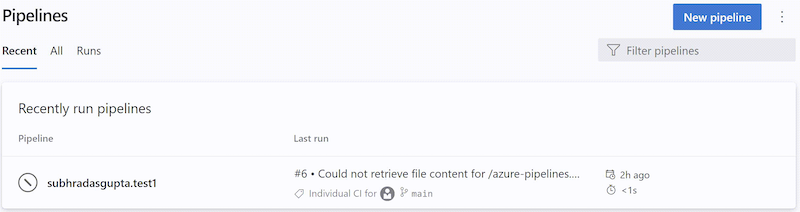

An informational run tells you Azure DevOps tried running a YAML pipeline, but failed to retrieve its source code. Such a run looks like in the following screenshot. 

You can recognize an informational run by the following attributes:
- Status is `Canceled`
- Duration is `< 1s`
- Run name contains one of the following texts:
    - `Could not retrieve file content for {file_path} from repository {repo_name} hosted on {host} using commit {commit_sha}.`
    - `Could not retrieve content for object {commit_sha} from repository {repo_name} hosted on {host}.`
    - `Could not retrieve the tree object {tree_sha} from the repository {repo_name} hosted on {host}.`
    - `Could not find {file_path} from repository {repo_name} hosted on {host} using version {commit_sha}. One of the directories in the path contains too many files or subdirectories.`
- Run name generally contains the BitBucket / GitHub error that caused the YAML pipeline load to fail
- No stages / jobs / steps