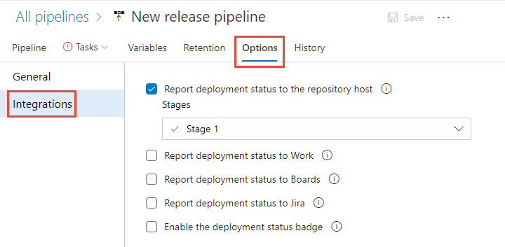
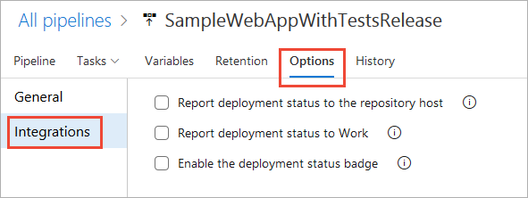
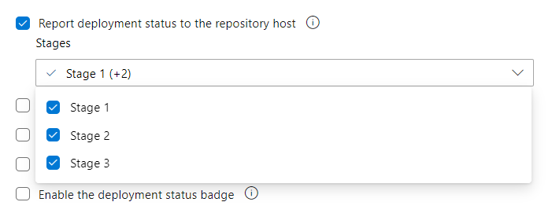

# Configure pipelines to support work tracking

[!INCLUDE [temp](../../includes/version-tfs-2017-through-vsts.md)]

To support integration and traceability across Azure DevOps services with pipelines, you can configure several options. You can report pipeline status, copy the syntax for status badges, and set up automatic linking of work items to builds and releases. 
 

## Supported pipeline and work tracking integration features 

Several features provide support for end-to-end traceability as user stories and features move through the development cycle. As with Azure Repos, you can link work items to pipeline objects with the following link types: *Build, Integrated in build*, and *Integrated in release*.  Note, that the *Integrated in release environment* link can only be created by enabling the **Report release status to Boards** option in Classic release pipelines. 

:::image type="content" source="media/pipelines-integration/concept-link-types-pipelines.png" alt-text="Conceptual image of link types that link work items to Azure Pipelines objects.":::

The following table summarizes the integration points between Azure Boards and Azure Pipelines. Options and configuration steps differ depending on whether you are configuring a YAML or Classic pipeline, and your Azure DevOps version.  Most options are supported for pipelines run against an Azure Repos Git repository unless otherwise noted. 
 
:::row:::
   :::column span="2":::
      **Feature** 
   :::column-end:::
   :::column span="2":::
     **Description**
   :::column-end:::
   :::column span="1":::
     **Supported versions**
   :::column-end:::
:::row-end:::
---
:::row:::
   :::column span="2":::
      Manually link work items to builds  
   :::column-end::: 
   :::column span="2":::
      You can link from a work item to builds within the same project or other projects within the organization. For details, see [Link to work items from other objects](../../notifications/add-links-to-work-items.md).
   :::column-end:::
   :::column span="1":::
      All versions 
   :::column-end::: 
:::row-end:::
---
:::row:::
   :::column span="2":::
      View builds linked to from a work item 
   :::column-end::: 
   :::column span="2":::
      You can view all builds linked to from a work item, whether manual or automatically linked, from the Links tab.  For details, see [Link to work items from other objects, View list of linked objects](../../notifications/add-links-to-work-items.md#view-list-links).
   :::column-end:::
   :::column span="1":::
      All versions 
   :::column-end::: 
:::row-end:::
---
:::row:::
   :::column span="2":::
      Automatically link work items to builds  
   :::column-end:::
   :::column span="2":::
      Required to populate the **Development** control with *Integrated in build* links. The work items or commits that are part of a release are computed from the versions of artifacts. For example, each build in Azure Pipelines is associated with a set of work items and commits. For details, see [Automatically link work items](#auto-link-work-items-builds) later in this article. 
   :::column-end:::
   :::column span="1":::
      YAML, Azure DevOps Server 2020 and later  
      Classic, TFS 2017.2 and later 
   :::column-end:::
:::row-end:::
---
::: moniker range=">= azure-devops-2020"
:::row:::
   :::column span="2":::
      Automatically link work items to releases and report deployment status to a work item (Classic only)
   :::column-end:::
   :::column span="2":::
      Required to populate **Deployment** control in work item form with *Integrated in release stage* links. For details, see [Report deployment status to Boards](#classic-report-boards) later in this article.
   :::column-end:::
   :::column span="1":::
      Azure DevOps Server 2020 and later  
   :::column-end:::
:::row-end:::
---
::: moniker-end
:::row:::
   :::column span="2":::
      View list of work items linked to a build or release
   :::column-end:::
   :::column span="2":::
      Review and open the work items included in a build or release.   
   :::column-end:::
   :::column span="1":::
      YAML, Azure DevOps Server 2020 and later  
      Classic, TFS 2017.2 and later  
   :::column-end:::
:::row-end:::
---
:::row:::
   :::column span="2":::
      Create work item on failure (Classic)
   :::column-end:::
   :::column span="2":::
      Automatically create a work item when a build fails, and optionally set values for work item fields. For details, see [Create work item on failure](#create-work-item-on-failure) later in this article.  
   :::column-end:::
   :::column span="1":::
      TFS 2018 and later versions 
   :::column-end:::
:::row-end:::
---
::: moniker range=">= azure-devops-2020"
:::row:::
   :::column span="2":::
      Query Work Items task, ensure the number of matching work items returned from a query is within a threshold.
   :::column-end::: 
   :::column span="2":::
       Use this task to ensure the number of matching items returned by a work item query is within the configured thresholds. For details, see [Query Work Items task, Control deployments with gates and approvals](../tasks/utility/work-item-query.md).  
   :::column-end:::
   :::column span="1":::
      Azure DevOps Server 2020 and later versions 
   :::column-end:::
:::row-end:::
--- 
::: moniker-end

## Prerequisites

- To configure the integration options for a Classic release pipeline, you must have permissions to edit the release. 
- To link work items to commits and pull requests, you must have your **Edit work items in this node** permissions set to **Allow** for the Area Path assigned to the work item. By default, the Contributors group has this permission set.  
- To view work items, you must have your **View work items in this node** permissions set to **Allow** for the Area Path assigned to the work item.  
 

## Open pipeline settings, build options, or integration options 
 

# [YAML](#tab/yaml)

<a id="yaml-open-settings" /> 

**Open Pipeline settings**

::: moniker range=">= azure-devops-2020"

For YAML-defined release pipelines, you configure the integration through the **Pipeline settings** dialog.  

1. Open the pipeline, choose :::image type="icon" source="../../media/icons/more-actions.png" border="false"::: **More actions**, and then choose **Settings**.

	:::image type="content" source="media/pipelines-integration/open-pipeline-settings.png " alt-text="Open Pipeline settings.":::

	The Pipeline Settings dialog appears. For details on automatic linking, see [Automatically link work items](#auto-link-work-items-builds) later in this article.

	:::image type="content" source="media/pipelines-integration/pipeline-settings-enable-link-work-items.png" alt-text="YAML Pipeline settings dialog.":::

	 
::: moniker-end
::: moniker range="< azure-devops-2020"
This setting isn't available for Azure DevOps Server 2019 or earlier versions. 
::: moniker-end

# [Classic Build](#tab/classic-build)

<a id="classic-open-settings" /> 

<a id="classic-build-properties" />

**Build properties**

Open the build pipeline, choose to edit the pipeline, and then choose the **Options** tab. 

::: moniker range=">= azure-devops-2019"
:::image type="content" source="media/pipelines-integration/open-classic-build-properties-options.png" alt-text="Screenshot of Classic Build pipeline, Options tab.":::
::: moniker-end 
::: moniker range="tfs-2018"
:::image type="content" source="media/pipelines-integration/open-classic-build-properties-options-tfs-2018.png" alt-text="Build and Release pipeline Build properties dialog, TFS-2018.":::
::: moniker-end 

The Build properties page appears. 

::: moniker range=">= azure-devops-2019"
:::image type="content" source="media/pipelines-integration/classic-build-options.png" alt-text="Build properties dialog.":::

For details on each setting, use one of the following links:  
- [Build number format](../release/index.md#how-do-i-manage-the-names-for-new-releases)
- [Automatically link work items](#auto-link-work-items-builds)
- [Create work item on failure](#create-work-item-on-failure)
- [Status badge](#status-badge)

::: moniker-end 

::: moniker range="tfs-2018"
:::image type="content" source="media/pipelines-integration/build-properties-tfs-2018.png" alt-text="Build properties dialog, TFS-2018.":::

For details on each setting, use one of the following links: 
- [Build number format](../release/index.md#how-do-i-manage-the-names-for-new-releases)
- [Badge enabled](#status-badge)
- [Automatically link work items](#auto-link-work-items-builds)
- [Create work item on failure](#create-work-item-on-failure)

::: moniker-end 

# [Classic Release](#tab/classic-release)

<a id="classic-release-options" /> 

**Release integration options**

For Classic release pipelines, open **Pipelines>Releases**, choose to edit your pipeline, then choose **Options** and then **Integrations**.

::: moniker range=">= azure-devops-2020"
> [!div class="mx-imgBorder"]
> 

For details on each setting, use one of the following links: 
- [Report deployment status to the repository host](#classic-report-git)
- [Report deployment status to Work](#auto-link-work-items-builds)
- [Report deployment status to Boards](#classic-report-boards)
- [Report deployment status to Jira](#classic-report-jira)
- [Enable the deployment status badge](#enable-status-badge)
::: moniker-end 

::: moniker range="<= azure-devops-2019"
> [!div class="mx-imgBorder"]
> 

For details on each setting, use one of the following links: 
- [Report deployment status to the repository host](#classic-report-git)
- [Report deployment status to Work](#auto-link-work-items-builds)
- [Enable the deployment status badge](#status-badge)
::: moniker-end 

 
***

<a id="auto-link-work-items-builds" />

::: moniker range=">= azure-devops-2020"

## Automatically link work items to builds or releases 

By enabling automatic linking, you can track the builds or releases that have incorporated work without having to manually search through a large set of builds or releases. Each successful build associated with the work item automatically appears in the **Development** control of the work item form. Each release stage associated with the work item automatically appears in the **Deployment** control of the work item form.

::: moniker-end 

::: moniker range="< azure-devops-2020"

## Automatically link work items to builds

By enabling automatic linking, you can track the builds that have incorporated work without having to manually search through a large set of builds. Each successful build associated with the work item automatically appears in the **Development** control of the work item form.  

::: moniker-end 

<a id="yaml-auto-link" /> 

# [YAML](#tab/yaml)

::: moniker range=">= azure-devops-2020"

1. Open **Pipeline settings** as describe in [Open Pipeline settings](#yaml-open-settings).

1. Enable **Automatically link new work in this build**.  

	:::image type="content" source="media/pipelines-integration/pipeline-settings-enable-link-work-items.png" alt-text="Screenshot of Pipeline settings dialog, Automatically link work items in this build.":::

	Once enabled, **Integrated in build** links are generated for all work items linked to the selected pull request with each release run. 
::: moniker-end
	
::: moniker range="< azure-devops-2020"
This feature isn't supported for YAML pipelines in Azure DevOps Server 2019. 
::: moniker-end

# [Classic Build](#tab/classic-build)

1. Open pipeline **Build properties** as describe in [Build properties](#classic-build-properties).

1. Enable **Automatically link work items included in this run**. Add the branches to include or exclude.   
	:::image type="content" source="media/pipelines-integration/auto-link-work-items-classic-build-pipeline.png" alt-text="Screenshot of Automatically link work items in this build property settings.":::

	Once enabled, **Integrated in build** are generated for all work items linked to the selected branches in each run.  
 
	To view a list of work items linked to the build, choose the Related link on the Summary page.  

	:::image type="content" source="media/pipelines-integration/build-view-work-items.png" alt-text="Screenshot of link to view work items linked to build.":::

1.	Save your pipeline.

# [Classic Release](#tab/classic-release) 
 
<a id="classic-report-boards" />

::: moniker range=">= azure-devops-2020"
 
Prior to choosing your integration options, you should set up the release stages as described in [Define your multi-stage continuous deployment (CD) pipeline](../../pipelines/release/define-multistage-release-process.md).

1. Open **Options>Integrations** for the release pipeline as describe in [Release integration options](#classic-release-options).

1. Check the **Report deployment status to Boards** checkbox. Map the **Deployment type** to each stage, or leave **Unmapped**. Select this option if you want to create links to all work items that represent associated changes to the source, when a release is complete. This option must be enabled in order for the work item form [**Deployment**](../../boards/work-items/work-item-deployments-control.md) control to work.

	:::image type="content" source="media/pipelines-integration/release-settings-stages-1.png" alt-text="Screenshot of Report deployment status to Boards, Classic release, 5 stages.":::
 
	To view a list of work items linked to the release, choose **Release (old view)** from :::image type="icon" source="../../media/icons/actions-icon.png" border="false"::: **More commands**, and then choose the **Work Items** tab.   

	:::image type="content" source="media/pipelines-integration/release-pipeline-view-work-items.png" alt-text="Screenshot of link to view work items linked to a release.":::

1.	Save your pipeline.

To verify the integration is working, perform the following steps:  

1. Link one or more work items to a commit or pull request in Azure Repos Git repository. For details, see: 
	-  [Drive Git development from a work item](../backlogs/connect-work-items-to-git-dev-ops.md)  
	-  [Link to work items from other objects](../../notifications/add-links-to-work-items.md)
1.  Run the pipeline. 

1. Open one of the linked work items and view the [**Deployment**](../../boards/work-items/work-item-deployments-control.md) control control. As shown in the following image, the  **Deployment** control shows release information for two release stages those work items that have been linked to a Git commit or pull request for a release pipeline configured to integrate with Azure Boards.  

:::image type="content" source="../../boards/backlogs/media/deployments-control/deployment-control-intro.png " alt-text="Screenshot of Work item form, Deployment control.":::
 
::: moniker-end
 

::: moniker range="< azure-devops-2019"

This feature isn't supported for Azure DevOps Server 2019 and earlier versions.
::: moniker-end

*** 
 
### What work items are included in automatic linking? 

When developing your software, you can link work items when you create a branch, commit, or pull request. Or, you can initiate a branch, commit, or pull request from a work item, automatically linking these objects as described in [Drive Git development from a work item](../../boards/backlogs/connect-work-items-to-git-dev-ops.md). For example, here we create a new branch from the Cancel order form user story.

:::image type="content" source="media/pipelines-integration/create-branch-link-work-item.png" alt-text="Create branch dialog from work item form.":::

When automatically linking work items to builds, the following computations are made: 

- For a first-time build: 
	- Identify all work items linked to the branch, commits, and pull requests associated with the build.  

- For subsequent builds: 
	- Identify all work items associated with the current commit (C1) being built. 
	- Identify all work items associated with the commit (C2) of the last successful build of the same source branch. 
	- Identify all work items associated with the commits between C1 and C2 in the commit tree. 
 

<a id="create-work-item-on-failure" /> 

## Create work item on build failure (Classic) 

If a build pipeline fails, you can automatically create a work item to track getting the problem fixed. You can specify the work item type and set options to automatically assign it to the requestor or other fields. The requestor corresponds to the person that triggered the build. 
 

> [!TIP]   
> The option to **Create work item on failure** is only supported for Classic pipelines. To accomplish this with a YAML  pipeline, see the [Create Bug on Release failure](https://marketplace.visualstudio.com/items?itemName=AmanBedi18.CreateBugTask) marketplace extension. 
 

<a id="classic-options-integrations" /> 

1. Open pipeline build options as describe in [Build properties](#classic-build-properties).

2. Enable **Create work item on failure** and choose the type of work item to create. Optionally check the  **Assign to requestor** checkbox to set the **Assign To** field and add fields to set within the work item to create. 

	For example, here we choose the Bug work item type and specify the Priority and Tags fields and their values. 

	:::image type="content" source="media/pipelines-integration/create-work-item-failure-yaml.png" alt-text="Screenshot of Create work item on failure in build options.":::

3.	Save your pipeline.

To learn the reference name for a field, look it up from the [Work item field index](../../boards/work-items/guidance/work-item-field.md). For custom fields you add through an inherited process, Azure DevOps assigns a reference name based on friendly field name prefixed with *Custom.*. For example, you add a field named **DevOps Triage**, the reference name is Custom.DevOpsTriage. No spaces are allowed within the reference name.
 
<a id="enable-status-badge" /> 

## Get or enable a status badge

# [YAML](#tab/yaml)

1. Open pipeline :::image type="icon" source="../../media/icons/more-actions.png" border="false"::: **More Actions** and choose **Status badge**.

	:::image type="content" source="media/pipelines-integration/yaml-pipeline-more-actions-menu-options.png" alt-text="Screenshot of YAML pipeline More Actions menu options.":::

1. Choose the branch and scope of interest, and then choose :::image type="icon" source="../../media/icons/copy.png" border="false"::: **Copy to clipboard** to copy the image or markdown syntax. 

	:::image type="content" source="media/pipelines-integration/status-badge-yaml.png" alt-text="Screenshot of YAML pipeline status badge.":::

<a id="status-badge" /> 

# [Classic Build](#tab/classic-build)

1. Open pipeline **Build properties** as describe in [Build properties](#classic-build-properties).

1. Choose :::image type="icon" source="../../media/icons/copy.png" border="false"::: **Copy to clipboard** to copy the image or markdown syntax. 

	:::image type="content" source="media/pipelines-integration/classic-build-status-badge.png" alt-text="Screenshot of classic build properties, status badge section.":::

3.	Save your pipeline.

# [Classic Release](#tab/classic-release)

Select this option if you want to display the latest outcome of a stage deployment on an external website. 

1.	Check the **Enable the deployment status badge** checkbox. And then, select the stages for which you want to display the outcome. By default, all the stages defined for the release are selected.

	:::image type="content" source="media/pipelines-integration/enable-status-badge-3-stages.png" alt-text="Screenshot of Classic release enable deployment status badge with three stages selected.":::

1.	Choose :::image type="icon" source="../../media/icons/copy.png" border="false"::: **Copy to clipboard** to copy the image or markdown syntax. 

	:::image type="content" source="media/pipelines-integration/classic-release-status-badge-3-stages.png" alt-text="Screenshot of Classic release enable deployment status badge with three stages that you can copy.":::
	
3.	Save your pipeline.

***

<a id="report-release-status" />
<a id="classic-report-git" />

::: moniker range=">= azure-devops-2019"

## Report deployment status to the repository host (Classic)

When you code is stored in an Azure Repos Git repository, you can configure your release pipeline to display a badge on the Azure Repos pages. The badge indicates where the specific commit got deployed and whether the deployment is passing or failing. This option improves the traceability from code commit to deployment. 

> [!div class="mx-imgBorder"]
> 

The deployment status is displayed in the following sections of Azure Repos:

* **Files**: Indicates the status of the latest deployment for the selected branch.
* **Commits**: Indicates the deployment status for each commit (requires the continuous integration (CD) trigger to be enabled for your release).
* **Branches**: Indicates the status of the latest deployment for each branch.
 

If a commit gets deployed to multiple release pipelines, with multiple stages, each has an entry in the badge with status that's shown for each stage. By default, when you create a release pipeline, deployment status is posted for all stages. However, you can selectively choose the stages for which deployment status should be displayed in the status badge (for example, show only the production stage). Your team members can select the status badge to view the latest deployment status for each of the selected stages of the release pipelines.

::: moniker-end

::: moniker range=">= azure-devops-2020"

<a id="classic-report-jira" />

## Report deployment status to Jira (Classic)

Include Jira issues in work items and create links to all issues on stage completion. Install Azure Pipelines for Jira app in JIRA Software cloud and add organization to create a connection.

:::image type="content" source="media/pipelines-integration/integration-options-classic-jira.png" alt-text="Screenshot of Integrations options for Classic pipelines, Report deployment status to Jira":::

To support integration with Jira issue tracking, install [Azure Pipelines integration with Jira](https://marketplace.atlassian.com/apps/1220515/azure-pipelines-for-jira?hosting=cloud&tab=overview) and connect your Azure DevOps organizations with your Jira Software instance. You can connect multiple organizations with one instance and get data for all your teams and related projects. Learn more about setting up the integration in our documentation.To learn more about installation and setup, see [Integrate with Jira Issue tracking](https://github.com/microsoft/azure-pipelines-jira/blob/master/tutorial.md). 

::: moniker-end

<!--- 

## Verify the integration

To verify the configuration is correct perform the next set of steps: 
1. Create a branch  
1. Make changes to a file and commit those changes
1. Create a pull request and merge it
1. Build and then deploy it using your release pipeline.

*If the associations are being created and the work items are being linked properly, you'll see the links added under the Development section, as shown in the image below:*
 

## Configure GitHub comment triggers 

 Usually for security, teams may not want to automatically build pull requests. Instead, they want a team member to review the pull request and once it's deemed safe, trigger the build with a [pull request comment](../pipelines/repos/github.md?view=azure-devops&preserve-view=true#comment-triggers). The following setting provides flexibility, keeps this option while still allowing automatic pull request builds _only_ for team members.

> [!div class="mx-imgBorder"]
> 

## Enable Test Impact Analysis 

See [Speed up testing by using Test Impact Analysis (TIA), Enable Test Impact Analysis](../pipelines/test/test-impact-analysis.md#enable-test-impact-analysis). 
 

:::row:::
   :::column span="1":::
      [Enable status badge](#enable-status-badge)  
      [All supported repositories](../pipelines/repos/index.md)
   :::column-end:::
   :::column span="1":::
      YAML/Azure DevOps Server 2019 and later  
      Classic/Azure DevOps Server 2019 and later  
      Build and Release/TFS 2018  
   :::column-end:::
:::row-end:::
---
:::row:::
   :::column span="1":::
      [Report deployment status to Git repository](#classic-report-git) 
   :::column-end:::
   :::column span="1":::
      Classic/Azure DevOps Server 2019 and later 
   :::column-end:::
:::row-end::: 
---
:::row:::
   :::column span="1":::
      [Report deployment status to Jira](#classic-report-jira) 
   :::column-end:::
   :::column span="1":::
      Classic/Azure DevOps Server 2020 and later
   :::column-end:::
:::row-end:::
---

-->
 
## Related articles  

- [Define your multi-stage continuous deployment (CD) pipeline](../release/define-multistage-release-process.md)
- [Link and view work items to builds and deployments](../../boards/work-items/work-item-deployments-control.md) 
- [Release pipelines (Classic) overview](../release/index.md)
- [Configure repositories to support work tracking](../../repos/git/configure-repos-work-tracking.md).  
- [How to retrieve all work items associated with a release pipeline using Azure DevOps API](https://devblogs.microsoft.com/premier-developer/how-to-retrieve-all-work-items-associated-with-a-release-pipeline-using-azure-devops-api/)
- [Drive Git development from a work item](../../boards/backlogs/connect-work-items-to-git-dev-ops.md) 
- [Link to work items from other objects](../../notifications/add-links-to-work-items.md)
- [End-to-end traceability](../../cross-service/end-to-end-traceability.md)
- [Linking, traceability, and managing dependencies](../../boards/queries/link-work-items-support-traceability.md)
- [Link type reference](../../boards/queries/link-type-reference.md)
 