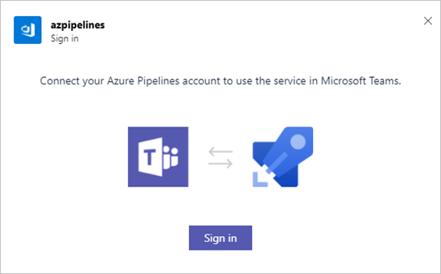
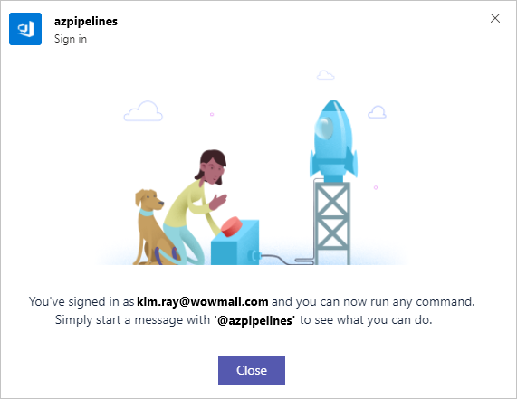
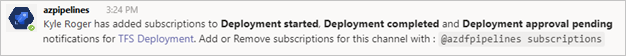
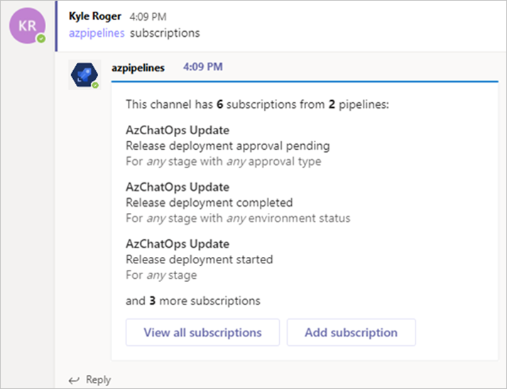
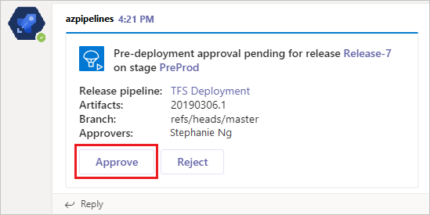
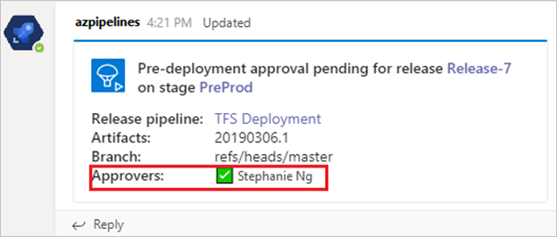

 
# Azure Pipelines with Microsoft Teams

If [Microsoft Teams](https://products.office.com/microsoft-teams/group-chat-software) is your choice for collaboration, you can use the Azure Pipelines app built for Microsoft Teams
 to easily monitor the events for your pipelines. Set up and manage subscriptions for completed builds, releases, pending approvals and more from the app and get notifications for these events in your Teams channels.


## Add Azure Pipelines app to your team

Visit [Microsoft AppSource](https://appsource.microsoft.com/marketplace/apps?src=wnblogmar2018&product=teams) and search for the Azure Pipelines App. Upon installing, a welcome message from the app displays as shown in the following example. Use the `@azpipelines` handle to start interacting with the app.


## Connect the Azure Pipelines app to your pipelines

Once the app is installed in your team, you can connect the app to the pipelines you want to monitor. The app asks you to sign in & authenticate to Azure Pipelines before running any commands.






To start monitoring a pipeline, use the following slash command inside a channel:

```
@azpipelines subscribe [pipeline url]
```

The pipeline URL can be to any page within your pipeline that has a `definitionId` or `buildId/releaseId` present in the URL. 

For example, for Build pipelines, use:

```
@azpipelines subscribe https://dev.azure.com/myorg/myproject/_build?definitionId=123
```

For Release pipelines, use:

```
@azpipelines subscribe https://dev.azure.com/myorg/myproject/_release?definitionId=123&view=mine&_a=releases
```

For Build pipelines, the channel is subscribed to the *Build completed* notification, and for Release pipelines, the channel is subscribed to the *Release deployment started*, *Release deployment 
completed*, and *Release deployment approval pending* notifications.



## Add or remove subscriptions

To manage the subscriptions for a channel, use the following command:

`@azpipelines subscriptions`

This command lists all of the current subscriptions for the channel and allows you to add/remove subscriptions.



## Approve release deployments from your channel
You can approve release deployments from within your channel without navigating to the Azure Pipelines portal by subscribing to the *Release deployment approval pending* notification (which 
happens by default when subscribing to any release pipeline).



Whenever a deployment is pending for approval, a notification card with options to approve or reject the deployment is posted in the channel. Users can then review the details of
 the deployment in the notification and take action. In the following example, the deployment was approved and the approval status is displayed on the card.



The app supports all of the approval scenarios present in the Azure Pipelines portal, like single approver, multiple approvers (any one user, any order, in sequence), and teams as approvers. You can approve deployments as an individual or on behalf of a team.

## Commands reference

Here are all the commands supported by the Azure Pipelines app:

| Slash command        | Functionality  |
| -------------------- |----------------|
| @azpipelines subscribe [pipeline url]      | Subscribe to a pipeline to receive notifications | 
| @azpipelines subscriptions      | Add or remove subscriptions for this channel | 
| @azpipelines feedback | Report a problem or suggest a feature |
| @azpipelines help     | Get help on the slash commands |
| @azpipelines signin  | Sign in to your Azure Pipelines account |
| @azpipelines signout  | Sign out from your Azure Pipelines account |


>[!NOTE]
> * The user must be an admin of the project containing the pipeline to set up the subscriptions
> * Notifications are currently not supported inside chat/direct messages
> * Deployment approvals which have applied the **Revalidate identity of approver before completing the approval** policy are not supported
> * A channel can have a maximum of 150 subscriptions from 50 pipelines across 5 orgs
